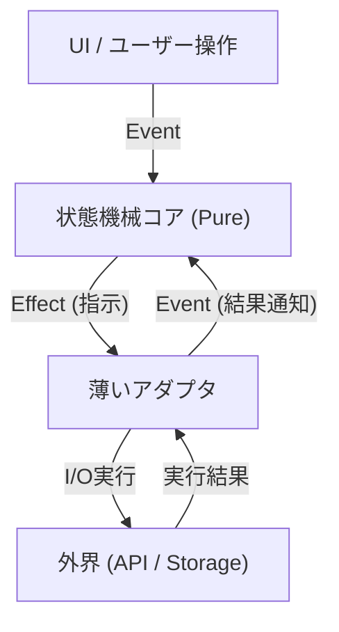

# 第15章：I/O境界を外へ（薄いアダプタ）🚪

〜 状態機械の“中身”をピュアにして、テストも改修もラクにするよ〜🧪💖

---

## この章でできるようになること🎯✨

* 状態機械の **中心（状態遷移）** を「計算だけ」にしてスッキリ保つ🧼
* `fetch` / `localStorage` / タイマー…みたいな **I/O（外界）** を「外側」に追い出す🏃‍♀️💨
* “薄いアダプタ”を作って、**外の都合に汚されない設計**にする🛡️✨
* その結果、**テストが爆速＆安心**になる🧪⚡

（この考え方は Ports & Adapters / Hexagonal Architecture と呼ばれる定番の分離だよ〜📦✨） ([Alistair Cockburn][1])

---

## 1) そもそも I/O って何がイヤなの？😵‍💫💥

I/O（外部とのやりとり）はだいたいこう👇

* 遅い🐢（通信・ファイル・DB…）
* 失敗する😇（ネットワーク落ちた、権限ない、容量ない…）
* 予測できない🎲（タイミング・順序・リトライ・キャンセル）
* テストしづらい🧪❌（外部に依存するから）

例えば `fetch` はブラウザの標準APIだし、Node.js でも使えるけど（Node 18で実験的→Node 21で stable へ）、「外界」なのは変わらないよ〜🌍📡 ([MDN Web Docs][2])

だから結論👇
✅ **状態機械の中（中心）に I/O を入れない**
✅ **I/O は外（アダプタ）に寄せる**
これがこの章のテーマだよ〜🚪✨

---

## 2) “薄いアダプタ”ってなに？🧩✨


イメージはこんな感じ👇

```text
[ UI / CLI / API ]  ──(Event)──▶  [ 状態機械コア ]  ──(Effect/Port)──▶  [ アダプタ ] ──▶ fetch / storage / timer
       ▲                      │                           │
       └──────(Event)◀────────┘                           └──▶ 外界の結果を Event にして戻す
```

* **状態機械コア**：状態遷移だけ（ピュア✨）
* **アダプタ**：I/Oする（薄く！）
* **やりとり**：

  * コア →「こういうI/Oしてね（命令）」
  * アダプタ →「結果が出たよ（イベント）」をコアに返す📮




この「コアは外に依存しない」考え方が Ports & Adapters の超重要ポイントだよ🫶 ([Alistair Cockburn][1])

---

## 3) 薄いアダプタの“3つの約束”📜✨

アダプタを薄く保つコツはこれだけ覚えればOK🙆‍♀️💕

1. **ビジネス判断を入れない**🙅‍♀️

   * 「成功なら次はこう」みたいな判断はコアへ
2. **変換だけする**🔁

   * APIのレスポンス → ドメインで使う形に整形、くらい
3. **失敗もイベント化して返す**🚨➡️📮

   * `NETWORK_ERROR` / `TIMEOUT` みたいに“結果”として返す

---

## 4) 例：フォーム送信（超ミニ版）📨✨

この章は「I/Oを外へ」が主役なので、機械は小さめでいくね☺️🌸

### 4-1. 型を用意する（State / Event / Context / Effect）🧠🧩

```ts
// ---- core/types.ts ----
export type State =
  | { kind: "editing" }
  | { kind: "submitting" }
  | { kind: "success" }
  | { kind: "error"; message: string };

export type Event =
  | { type: "SUBMIT"; name: string; email: string }
  | { type: "SUBMIT_OK" }
  | { type: "SUBMIT_NG"; message: string }
  | { type: "RESET" };

// 「I/Oしてね！」の命令（副作用の説明書）
export type Effect =
  | { type: "POST_FORM"; payload: { name: string; email: string } };
```

### 4-2. 状態機械コア：I/Oしない（ピュア）🍰✨

ポイント：**次状態 + Effectリスト** を返すだけ🌟

```ts
// ---- core/reducer.ts ----
import type { State, Event, Effect } from "./types";

export type ReduceResult = { state: State; effects: Effect[] };

export function reduce(state: State, event: Event): ReduceResult {
  switch (state.kind) {
    case "editing": {
      if (event.type === "SUBMIT") {
        return {
          state: { kind: "submitting" },
          effects: [{ type: "POST_FORM", payload: { name: event.name, email: event.email } }],
        };
      }
      return { state, effects: [] };
    }

    case "submitting": {
      if (event.type === "SUBMIT_OK") return { state: { kind: "success" }, effects: [] };
      if (event.type === "SUBMIT_NG") return { state: { kind: "error", message: event.message }, effects: [] };
      return { state, effects: [] };
    }

    case "success":
    case "error": {
      if (event.type === "RESET") return { state: { kind: "editing" }, effects: [] };
      return { state, effects: [] };
    }
  }
}
```

✅ ここには `fetch` が1ミリも出てこない！最高！🧼✨
→ テストがめっちゃ簡単になるよ🧪💕

---

## 5) 外側：薄いアダプタで I/O を実行する🧰📡

アダプタは Effect を受け取って実行して、結果を Event にして返すよ📮

```ts
// ---- adapters/runEffect.ts ----
import type { Effect, Event } from "../core/types";

export async function runEffect(effect: Effect): Promise<Event | null> {
  switch (effect.type) {
    case "POST_FORM": {
      try {
        // ブラウザなら fetch は標準APIだよ🌐✨ :contentReference[oaicite:3]{index=3}
        const res = await fetch("/api/form", {
          method: "POST",
          headers: { "Content-Type": "application/json" },
          body: JSON.stringify(effect.payload),
        });

        if (!res.ok) {
          // 変換だけ（判断は最小限）🔁
          return { type: "SUBMIT_NG", message: `送信に失敗しました（HTTP ${res.status}）` };
        }

        return { type: "SUBMIT_OK" };
      } catch {
        return { type: "SUBMIT_NG", message: "通信エラーです（ネットワークを確認してね）" };
      }
    }
  }
}
```

※ Node.js 側で `fetch` を使う場合も、最近は標準になってきてるよ（Node 18で experimental、Node 21で stable）🧩✨ ([Node.js][3])

---

## 6) “配線”する（アプリ層）🔌✨

状態機械の「中心」と「外側」をつなぐだけの層だよ〜☺️

```ts
// ---- app/machine.ts ----
import type { State, Event } from "../core/types";
import { reduce } from "../core/reducer";
import { runEffect } from "../adapters/runEffect";

export function createMachine(onState: (s: State) => void) {
  let current: State = { kind: "editing" };

  async function send(event: Event) {
    const { state, effects } = reduce(current, event);
    current = state;
    onState(current);

    // Effect を外で実行して、結果を Event として戻す📮✨
    for (const eff of effects) {
      const nextEvent = await runEffect(eff);
      if (nextEvent) await send(nextEvent);
    }
  }

  return { send, getState: () => current };
}
```

この形にしておくと…

* コアはずっとピュア🍰✨
* I/Oは外で自由に差し替え🧩
* テストは reduce を叩くだけ🧪⚡

---

## 7) フォルダ構成おすすめ🏠✨

```text
src/
  core/        # 状態機械の中心（pure）
    types.ts
    reducer.ts
  adapters/    # I/O（thin）
    runEffect.ts
  app/         # 配線（wiring）
    machine.ts
```

---

## 8) よくある事故💣→🧯

* ❌ アダプタに「次は success にするべき」みたいな判断が入る
  → ✅ 判断はコアへ戻す
* ❌ コアの中で `fetch` / `localStorage` を呼び出す
  → ✅ Effect にして外へ
* ❌ 失敗を握りつぶす（ログだけ出して終わり）
  → ✅ 失敗も Event にして戻す（`*_NG`）

---

## 9) AI活用プロンプト例🤖💖（コピペOK）

* 「この状態機械コアに I/O が混ざってないかチェックして、混ざってたら分離案を出して」🕵️‍♀️✨
* 「Effect設計（type一覧）を提案して。最小セット→拡張セットの順で」🎛️
* 「runEffect が“薄いアダプタ”になってるかレビューして。ビジネス判断が混ざってたら指摘して」🧼
* 「reduce のテストケース（状態×イベント）を表にして、抜けを埋めて」🧪📋

---

## 10) 成果物：I/O境界メモ（テンプレ）📝✨

この章のゴールはこれを作ることだよ〜💕

```text
### 状態機械コア（pure）
- 扱う State:
- 扱う Event:
- コアが返す Effect:

### I/O（外界）
- API: 何を呼ぶ？
- Storage: 何を保存？
- Timer: 何が必要？
- ログ/計測: 何を送る？

### アダプタ方針（薄く）
- 変換するだけのルール:
- エラーを Event 化するルール:
- コアに判断を残すもの:
```

---

## ちょい最新メモ🆕✨（今どきTS事情）

* TypeScript の安定版は 5.9.3 が “Latest” として公開されてるよ📌 ([GitHub][4])
* TypeScript 5.9 には `import defer` みたいな「副作用を遅らせる」方向の機能も入ってきてる（上級者向けだけど、思想はこの章と相性◎）⏳✨ ([TypeScript][5])

---

## まとめ🎀✨

* I/O は外界！遅い！失敗する！テストがつらい！😵‍💫
* 状態機械コアは **ピュアな計算**に寄せる🍰
* I/O は **薄いアダプタ**へ🚪✨
* コア→Effect、アダプタ→Event で往復すると超キレイ📮💕

---

次の第16章では、この「副作用の渡し方」を **3パターン（Effectリスト / コールバック / DI）** で比べて、「どれを選べば事故りにくいか」まで整理するよ〜🎛️💖

[1]: https://alistair.cockburn.us/hexagonal-architecture?utm_source=chatgpt.com "hexagonal-architecture - Alistair Cockburn"
[2]: https://developer.mozilla.org/en-US/docs/Web/API/Fetch_API?utm_source=chatgpt.com "Fetch API - MDN Web Docs"
[3]: https://nodejs.org/en/blog/announcements/v18-release-announce?utm_source=chatgpt.com "Node.js 18 is now available!"
[4]: https://github.com/microsoft/typescript/releases "Releases · microsoft/TypeScript · GitHub"
[5]: https://www.typescriptlang.org/docs/handbook/release-notes/typescript-5-9.html?utm_source=chatgpt.com "Documentation - TypeScript 5.9"
