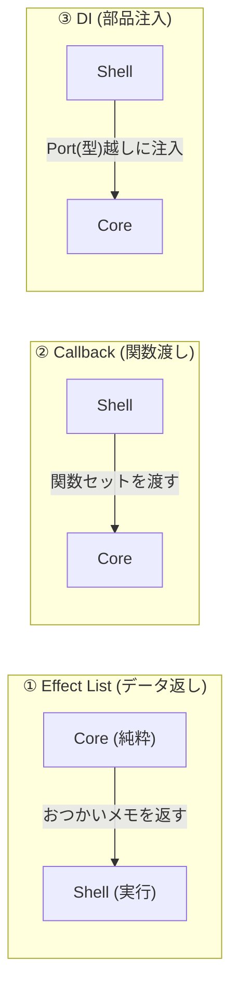

# 第16章：副作用の渡し方3パターン（選べるようにする）🎛️

この章は、「状態機械の中心（state + event → next）」をキレイに保ったまま、**API呼び出し・ログ・通知**みたいな“副作用”をどう渡すかを、3つの型で整理して、**自分で方式を選べる**ようになる回だよ〜😊🧩

ちなみに今どきのTypeScriptは **5.9.3 が “Latest” 扱い**だよ（安定版）💡 ([GitHub][1])
（近い将来の話として、Visual Studio 2026 では “TypeScript 7 native preview” の動きも出てきて、コンパイル体験が変わりそう…！みたいな話もあるよ🧠⚡ ([Microsoft Developer][2])）

---

## 0. 今日のゴール🎯✨

### できるようになること💪

* 「副作用の扱い方」を **3パターン**で説明できる📣
* 自分のプロジェクトに合わせて **どれを採用するか決められる**✅
* 方式ごとの “地雷（ハマりどころ）” を避けられる🧯

### 今日の題材（ミニ）📨

フォーム送信っぽい状態機械を想像してね👇

* 状態：`Idle` / `Editing` / `Submitting` / `Success` / `Error`
* 副作用：`API送信`、`ログ出力`、`成功トースト`、`失敗トースト` など

---

## 1. そもそも「副作用の渡し方」って何？🤔💥

状態機械の中心はできるだけこうしたい👇

* ✅ **中心**：決定だけする（次の状態は何？）
* ✅ **外側**：実行する（API叩く、保存する、通知出す）

この分け方は「Functional Core / Imperative Shell」みたいな考え方で、**テストしやすくて事故りにくい**のが強みだよ🧪🌿 ([javiercasas.com][3])

---

## 2. 副作用を渡す “3パターン” ざっくり地図🗺️✨


| パターン             | イメージ           | いちばんの特徴               |
| ---------------- | -------------- | --------------------- |
| ① Effectリスト方式 📋 | “おつかいメモ”を返す    | **中心が超きれい**＆テスト最強     |
| ② コールバック方式 ☎️    | “電話先（関数）”を渡す   | **作るのが簡単**で導入しやすい     |
| ③ DI方式 🔌        | “差し替え可能な部品”を注入 | **規模が大きいほど強い**＆拡張しやすい |




ここから1個ずつ、ちゃんと手触り出していくよ〜😊✨

---

## 3. ① Effectリスト方式（いちばん状態機械らしい）📋✨


### 仕組み（超やさしく）🧸

* 中心（reducer）は **副作用を実行しない**
* 代わりに「やってほしい副作用のメモ（Effect）」を返す
* 外側（runner）が Effect を見て実行する

これ、XStateの “built-in actions は命令じゃなくてオブジェクトを返す” って感覚に近いよ🧠✨ ([Stately][4])

### いいところ😊👍

* ✅ reducerが純粋に保てる（テストがラクすぎる）
* ✅ “何が起きるか” がデータで見える（レビューもラク）
* ✅ 副作用の種類が増えても整理しやすい

### しんどいところ🥺

* ⚠️ runner（Effect実行係）を作る必要がある
* ⚠️ 最初だけ「設計してる感」が強い（でも慣れると快感✨）

### 例：Effectを返す reducer（中心）🧁

```ts
type State =
  | { tag: "Idle" }
  | { tag: "Editing"; form: { email: string } }
  | { tag: "Submitting"; form: { email: string }; requestId: string }
  | { tag: "Success" }
  | { tag: "Error"; message: string };

type Event =
  | { type: "EDIT"; email: string }
  | { type: "SUBMIT" }
  | { type: "SUBMIT_OK" }
  | { type: "SUBMIT_NG"; message: string };

type Effect =
  | { type: "LOG"; message: string }
  | { type: "TOAST"; kind: "success" | "error"; message: string }
  | { type: "API_SUBMIT"; requestId: string; payload: { email: string } };

type Step = { next: State; effects: Effect[] };

export function step(state: State, event: Event): Step {
  switch (state.tag) {
    case "Idle":
      if (event.type === "EDIT") {
        return { next: { tag: "Editing", form: { email: event.email } }, effects: [] };
      }
      return { next: state, effects: [] };

    case "Editing":
      if (event.type === "EDIT") {
        return { next: { tag: "Editing", form: { email: event.email } }, effects: [] };
      }
      if (event.type === "SUBMIT") {
        const requestId = crypto.randomUUID();
        return {
          next: { tag: "Submitting", form: state.form, requestId },
          effects: [
            { type: "LOG", message: `submit start ${requestId}` },
            { type: "API_SUBMIT", requestId, payload: state.form },
          ],
        };
      }
      return { next: state, effects: [] };

    case "Submitting":
      if (event.type === "SUBMIT_OK") {
        return {
          next: { tag: "Success" },
          effects: [
            { type: "LOG", message: `submit ok ${state.requestId}` },
            { type: "TOAST", kind: "success", message: "送信できたよ〜！🎉" },
          ],
        };
      }
      if (event.type === "SUBMIT_NG") {
        return {
          next: { tag: "Error", message: event.message },
          effects: [
            { type: "LOG", message: `submit ng ${state.requestId}: ${event.message}` },
            { type: "TOAST", kind: "error", message: "送信に失敗…🥲" },
          ],
        };
      }
      return { next: state, effects: [] };

    case "Success":
    case "Error":
      // 今回は簡略化（戻る等は後の章で強化）
      return { next: state, effects: [] };
  }
}
```

### Effectを実行する runner（外側）🏃‍♀️💨

```ts
type Deps = {
  log: (msg: string) => void;
  toast: (kind: "success" | "error", msg: string) => void;
  apiSubmit: (payload: { email: string }) => Promise<void>;
  dispatch: (ev: Event) => void;
};

export async function runEffects(effects: Effect[], deps: Deps) {
  for (const eff of effects) {
    switch (eff.type) {
      case "LOG":
        deps.log(eff.message);
        break;
      case "TOAST":
        deps.toast(eff.kind, eff.message);
        break;
      case "API_SUBMIT":
        try {
          await deps.apiSubmit(eff.payload);
          deps.dispatch({ type: "SUBMIT_OK" });
        } catch (e) {
          deps.dispatch({ type: "SUBMIT_NG", message: String(e) });
        }
        break;
    }
  }
}
```

✅ これで「中心は決めるだけ」「外側がやる」が完成〜！✨

---

## 4. ② コールバック方式（とにかく入りやすい）☎️🌸


### 仕組み🧸

* 状態機械（or wrapper）に、`services` みたいな関数セットを渡す
* 必要になったらその関数を呼ぶ

> 注意：**reducerの中で直接呼ぶ**と “純粋じゃなくなる” ので、
> 初心者は「wrapper側で呼ぶ」形が安全だよ🧯✨

### いいところ😊👍

* ✅ 最短で動く（導入が軽い）
* ✅ 実装が分かりやすい（関数を呼ぶだけ）

### しんどいところ🥺

* ⚠️ 副作用が増えると「どこで何が呼ばれるか」追いにくくなりがち
* ⚠️ テストで “呼ばれた/呼ばれてない” の検証が増える

### 例：Machine wrapper に services を渡す📮

```ts
type Services = {
  apiSubmit: (payload: { email: string }) => Promise<void>;
  log: (msg: string) => void;
  toast: (msg: string) => void;
};

export function createMachine(services: Services) {
  let state: State = { tag: "Idle" };

  async function send(event: Event) {
    const { next, effects } = step(state, event); // 中心はそのまま使う
    state = next;

    // ここで “コールバックで実行” してもOK（runnerがservices呼ぶだけ）
    for (const eff of effects) {
      if (eff.type === "LOG") services.log(eff.message);
      if (eff.type === "TOAST") services.toast(eff.message);
      if (eff.type === "API_SUBMIT") {
        try {
          await services.apiSubmit(eff.payload);
          await send({ type: "SUBMIT_OK" });
        } catch (e) {
          await send({ type: "SUBMIT_NG", message: String(e) });
        }
      }
    }
  }

  return { getState: () => state, send };
}
```

ポイントはこれ👇

* reducerを汚さない ✅
* “実行する側” が `services` を呼ぶ ✅

この形だと、Effectリスト方式と相性もよくて、**小さく始めやすい**よ〜😊✨

---

## 5. ③ DI方式（大きくなっても崩れにくい）🔌🏗️


### 仕組み🧠

* 「API」「ログ」「通知」みたいな依存を、**インターフェース（型）で持つ**
* 実体は外から注入する（constructor引数やDIコンテナ）

TypeScript界隈だと、InversifyJS みたいな IoC コンテナも有名だよ📦 ([GitHub][5])
（Inversify v8 の計画も進んでるよ、って話も出てる👀 ([inversify.io][6])）

### いいところ😊👍

* ✅ 依存の差し替えがラク（テスト・本番・モック）
* ✅ アプリが大きくなっても構造が保てる
* ✅ “境界” が強制されやすい（事故りにくい）

### しんどいところ🥺

* ⚠️ 最初は用語が多い（DI / IoC / Container…😵‍💫）
* ⚠️ 小規模だとオーバーになりやすい

### 例：手動DI（まずはこれで十分！）🧸✨

```ts
type ApiPort = { submit: (payload: { email: string }) => Promise<void> };
type LoggerPort = { log: (msg: string) => void };
type NotifierPort = { toast: (msg: string) => void };

class FormMachine {
  private state: State = { tag: "Idle" };

  constructor(
    private readonly api: ApiPort,
    private readonly logger: LoggerPort,
    private readonly notifier: NotifierPort
  ) {}

  getState() { return this.state; }

  async send(event: Event) {
    const { next, effects } = step(this.state, event);
    this.state = next;

    for (const eff of effects) {
      if (eff.type === "LOG") this.logger.log(eff.message);
      if (eff.type === "TOAST") this.notifier.toast(eff.message);
      if (eff.type === "API_SUBMIT") {
        try {
          await this.api.submit(eff.payload);
          await this.send({ type: "SUBMIT_OK" });
        } catch (e) {
          await this.send({ type: "SUBMIT_NG", message: String(e) });
        }
      }
    }
  }
}
```

✨ DIコンテナは「必要になったら」で全然OK！
まずはこの **手動DI** がいちばん理解しやすいよ😊🌸

---

## 6. で、初心者がハマりにくいのはどれ？😳👉（結論）


私はこう推すよ〜✨（迷ったらこれでOK）

* 🥇 **小さく始める**：②コールバック方式（ただし reducer は汚さない！）
* 🥈 **設計を武器にしたい**：①Effectリスト方式（長期で強い💪）
* 🥉 **規模が大きい/チーム開発**：③DI方式（境界が守れる🏗️）

XStateみたいに「命令じゃなくて“解釈されるアクション”」の世界観も、Effectリスト方式と相性よいよ〜🧠✨ ([Stately][4])

---

## 7. 採用方式の決定（理由つき）✅📝（テンプレ）

これ、コピペして埋めるだけで「決めた感」出るよ🎉

* 採用方式：① / ② / ③
* 理由（3つ）

  1. （例）最初は実装速度を優先したいから
  2. （例）テストで副作用を分離したいから
  3. （例）将来の拡張で依存が増えそうだから
* ルール（最低3つ）

  * reducer内で副作用しない
  * 副作用は runner / services / ports のどれかに集約
  * “副作用の種類” は型（union）で管理する

---

## 8. よくある地雷💣→回避🧯


* 💥 reducerの中で `fetch()` しちゃう
  → ✅ 「Effectを返す」に統一しよ
* 💥 方式を混ぜてカオス（Effect + 直呼び + DIコンテナ…）
  → ✅ **1つ決めたら原則それだけ**
* 💥 “副作用の失敗” が状態に反映されない
  → ✅ 成功/失敗イベント（`SUBMIT_OK/NG`）を必ず戻す

---

## 9. AI（Copilot / Codex）に頼むと爆速になるプロンプト例🤖✨

* 「`Effect` を union 型で設計して、runner も含めて最小実装を作って」🧩
* 「この状態機械の副作用を **Effectリスト方式** にリファクタして」📋
* 「`API_SUBMIT` が失敗した時の遷移（Error state）を提案して」🚨
* 「副作用をモックしやすいように `Ports` を設計して」🔌

---

## まとめ🎀✨

* 副作用の渡し方は **3パターン**あるよ🎛️
  ①Effectリスト（きれい＆強い）📋
  ②コールバック（入りやすい）☎️
  ③DI（規模が大きいほど強い）🔌
* どれでもOKだけど、**1つ決めて統一**すると一気に安定するよ😊✅

---

次の章（第17章）は「Stateを型にする（ユニオン型）」で、ここから **型で守る世界**に入っていくよ〜🔒✨

[1]: https://github.com/microsoft/typescript/releases "Releases · microsoft/TypeScript · GitHub"
[2]: https://developer.microsoft.com/blog/typescript-7-native-preview-in-visual-studio-2026 "TypeScript 7 native preview in Visual Studio 2026 - Microsoft for Developers"
[3]: https://www.javiercasas.com/articles/functional-programming-patterns-functional-core-imperative-shell?utm_source=chatgpt.com "Functional Core - Imperative Shell - Javier Casas"
[4]: https://stately.ai/docs/actions?utm_source=chatgpt.com "Actions | Stately"
[5]: https://github.com/inversify/InversifyJS?utm_source=chatgpt.com "GitHub - inversify/InversifyJS: Powerful and lightweight ..."
[6]: https://inversify.io/blog/planning-inversify-8-0-0/?utm_source=chatgpt.com "Planning InversifyJS 8 - Feedback Needed!"
