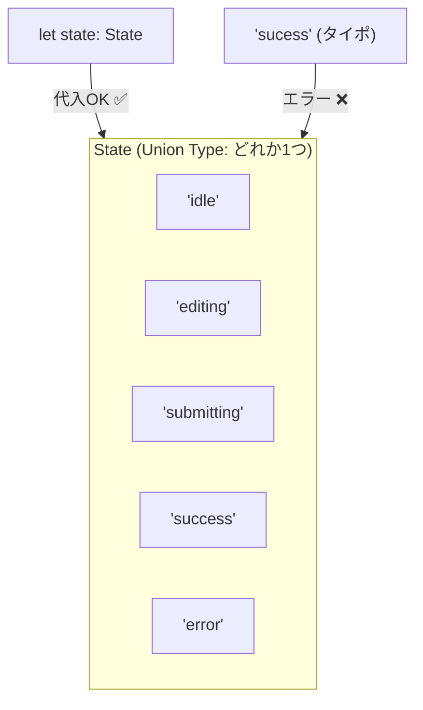

# 第17章：Stateを型にする（ユニオン型）🧩

この章は「**状態名の打ち間違い**」とか「**存在しない状態への遷移**」みたいな、地味だけど致命傷になりがちなバグを **コンパイルで止める** 回だよ〜！💪🧠
（状態機械は“状態が有限”だから、型と相性が最高なんだよね😊）

---

## 17.1 まず結論：Stateは「文字列リテラルのユニオン型」にする🎯


ユニオン型は「どれか1つ」を表す型で、`|`で並べるよ〜。([TypeScript][1])
状態名は「候補が決まってる文字列」なので、こうするのが超相性いい✨




例：フォーム送信の状態たち📨

* `idle`（待機）
* `editing`（入力中）
* `submitting`（送信中）
* `success`（成功）
* `error`（失敗）

---

## 17.2 いちばんシンプルな書き方（ベタ書き）🍰


```ts
export type State =
  | "idle"
  | "editing"
  | "submitting"
  | "success"
  | "error";
```

これだけで、たとえば👇みたいなミスが即エラーになる😍

```ts
let state: State = "idle";

state = "sucess"; // ❌ successのつもり…！スペルミスでコンパイルエラー✨
```

---

## 17.3 おすすめ：状態一覧から「型を自動生成」する（as const）🪄✨


ベタ書きでもOKなんだけど、状態が増えると「一覧」と「型」を二重管理しがちでつらい😵‍💫
そこで **“一覧から型を作る”** のが便利！

ポイントは `as const`（constアサーション）で、**配列の中身を“ただのstring”に広げず、リテラルとして保持**してくれるよ。([TypeScript][2])

```ts
export const STATES = [
  "idle",
  "editing",
  "submitting",
  "success",
  "error",
] as const;

export type State = typeof STATES[number];
```

これで👇が全部そろう！🎉

* ✅ 状態の「一覧」
* ✅ 状態の「型」
* ✅ 追加・削除が1か所で済む

---

## 17.4 “状態名の統一感”を作るコツ（命名ルール）🧁

迷いやすいので、軽いルールを決めると一気にラクになるよ〜😊✨

* **形はそろえる**：`idle / editing / submitting` みたいに “〜ing” 系で揃える or “名詞”で揃える
* **UIっぽい状態と、業務っぽい状態を混ぜない**（混ぜると爆増しやすい💣）
* **短く、意味がブレない単語**にする（`loading` って何のloading？みたいなの注意⚠️）

VS Codeだと、`State` を使ってる箇所は補完が効くから、命名が揃ってると気持ちよさ倍増🥰

---

## 17.5 「状態ごとの表示文言」みたいな対応表は `satisfies` で守る🛡️✨


状態ごとにラベルや色を持ちたくなるよね？🎨
でも普通に書くと「キーの書き忘れ」が起きがち😱

そこで `satisfies`！
これは「このオブジェクトはこの型を満たしてる？」をチェックしつつ、**推論された具体的な型情報は壊さない**オペレーターだよ。([TypeScript][3])

```ts
type State =
  | "idle"
  | "editing"
  | "submitting"
  | "success"
  | "error";

export const stateLabel = {
  idle: "待機中",
  editing: "入力中",
  submitting: "送信中",
  success: "完了！",
  error: "失敗…",
} satisfies Record<State, string>;
```

これの嬉しいところ👇😍

* ✅ `Record<State, string>` を満たさないとエラー（書き忘れに気づける）
* ✅ 余計なキー（`foo`とか）を生やしてもエラーになりやすい
* ✅ 型推論が“潰れにくい”（`as`で雑にキャストするより安全）

---

## 17.6 switchで“状態の漏れ”を絶対に許さない（assertNever）🚫✅


状態機械は **漏れがバグ** になりやすいから、`switch` も型で縛っちゃおう🔥
（次章以降、イベントが入るとさらに効いてくる！）

```ts
const assertNever = (x: never): never => {
  throw new Error(`Unexpected state: ${x}`);
};

function renderMessage(state: State): string {
  switch (state) {
    case "idle":
      return "待機中だよ🙂";
    case "editing":
      return "入力してね✍️";
    case "submitting":
      return "送信中…⏳";
    case "success":
      return "成功！🎉";
    case "error":
      return "失敗…😢";
    default:
      // ここに来たら「Stateのどれかがswitchで漏れてる」ってこと！
      return assertNever(state);
  }
}
```

`State` に新しい状態を追加した瞬間、`switch` が赤くなるので「直し忘れ」が激減するよ〜😇

---

## 17.7 よくある落とし穴まとめ（ここだけ注意⚠️）🍓


* **`as const` を付け忘れる**
  → `string[]` になって `typeof STATES[number]` がただの `string` になっちゃう😵‍💫 ([TypeScript][2])
* **`State = string` にしちゃう**
  → 何でも入ってしまい、状態機械の旨みが消える🥲
* **`enum` を使うか迷う**
  → 好みもあるけど、ユニオン型は基本“型だけ”なので軽い（まずはユニオンでOK🙆‍♀️）

---

## 17.8 AI（Copilot/Codex）に頼むと強いプロンプト例🤖💕

* 「この仕様の状態名を、短くて統一感ある英語で5〜8個提案して。`idle/editing` みたいに形も揃えて」
* 「この状態一覧（配列）から `State` 型を `as const` と `typeof X[number]` で作って」
* 「`Record<State, string>` を `satisfies` でチェックする形に直して」
* 「`switch(state)` を `assertNever` で網羅チェックできるようにして」

---

## ミニ演習🎓🌸（手を動かすやつ！）

## 演習1：状態を1つ増やしてみよう➕

`"confirming"`（確認中）を追加して、**エラーが出る場所**を全部直してね✨
（`stateLabel` と `renderMessage` が赤くなるはず！）

## 演習2：状態チェック関数を作る🕵️‍♀️

外から入ってきた文字列が State かどうか判定したいとき用👇

```ts
export const STATES = ["idle", "editing", "submitting", "success", "error"] as const;
export type State = typeof STATES[number];

const stateSet = new Set<string>(STATES);

export function isState(value: string): value is State {
  return stateSet.has(value);
}
```

---

## まとめ🧡

この章でやったのはこれだけ！🎉

* ✅ Stateを「ユニオン型」で閉じ込める（有限集合にする）([TypeScript][1])
* ✅ `as const` + `typeof X[number]` で “一覧から型を作る”([TypeScript][2])
* ✅ `satisfies` で対応表の抜け漏れを防ぐ([TypeScript][3])
* ✅ `assertNever` で switch の漏れを許さない🚫✅

次の第18章では、いよいよ **Event側も型にして（判別可能ユニオン）**、「イベントごとに必要なデータが違う」世界を安全にしていくよ〜🎫✨

[1]: https://www.typescriptlang.org/docs/handbook/unions-and-intersections.html?utm_source=chatgpt.com "Handbook - Unions and Intersection Types"
[2]: https://www.typescriptlang.org/docs/handbook/release-notes/typescript-3-4.html?utm_source=chatgpt.com "Documentation - TypeScript 3.4"
[3]: https://www.typescriptlang.org/docs/handbook/release-notes/typescript-4-9.html?utm_source=chatgpt.com "Documentation - TypeScript 4.9"
