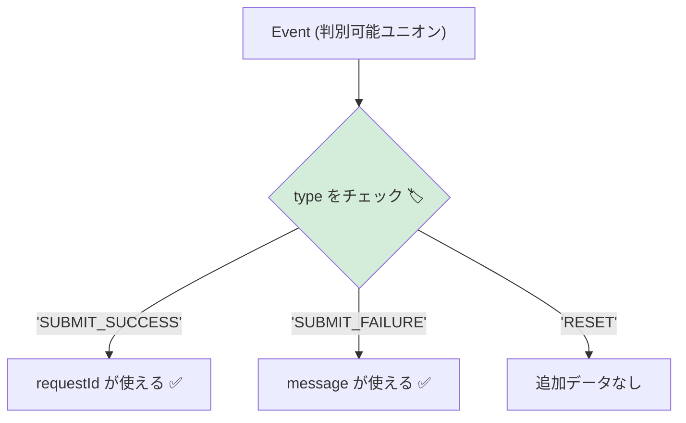

# 第18章：Eventを型にする（判別可能ユニオン）🎫

この章は「イベントが増えても破綻しない型の作り方」を身につける回だよ〜😊
状態（State）を型にできたら、次は **イベント（Event）も型で守る**と一気に強くなる！💪✨

---

## 0. 2026年1月時点の“いま”メモ🗓️🔍

* TypeScript は **5.9 系が安定ライン**で、公式でも 5.9 のリリース告知が出てるよ📌 ([Microsoft for Developers][1])
* 一方で **TypeScript 6.0（ブリッジ）→ 7.0（ネイティブ）**への大きい移行が進行中。ネイティブプレビュー（`@typescript/native-preview`）や進捗も公式が出してるよ🚀 ([Microsoft for Developers][2])

この章の内容（判別可能ユニオン）は、5.9系でも超ど真ん中に使えるから安心してOK👌✨ ([TypeScript][3])

---

## 1. 今日のゴール🎯💖

この章を終えたら、こんなことができるようになるよ！

* ✅ Event を **判別可能ユニオン**で定義できる（`type` を目印にする） ([TypeScript][3])
* ✅ `switch (event.type)` で **型が勝手に絞り込まれる**（narrowing） ([TypeScript][4])
* ✅ 新しいイベントを追加したときに **ハンドリング漏れをコンパイルで気づける**（`never`） ([TypeScript][4])

---

## 2. Eventってなに？（状態機械の“入力”）📮✨

状態機械はざっくりこうだったよね👇

* **State（状態）**：いま何をしてるか
* **Event（イベント）**：何が起きたか（ユーザー操作 / タイマー / API結果…）
* **Transition（遷移）**：状態がどう変わるか

Event を雑に `string` で扱うと、イベント名の打ち間違いで死にやすい…😇
だから **イベントの種類と、イベントごとの“持ち物（payload）”を型にする**よ🎁✨

---

## 3. 判別可能ユニオン（Discriminated Union）って？🔖🧸


コツはこれだけ！

* 全イベントに **共通の目印**を持たせる（よくあるのは `type`）
* `type` を **文字列リテラル**（`"SUBMIT"` みたいに固定）にする
* そうすると TypeScript が `switch` や `if` で **型を絞り込める** ([TypeScript][3])




---

## 4. まずは “イベント型” を作ろう🎫✨（基本形）

フォーム送信を題材に、よくあるイベントを作るね😊

```ts
// 例: フォームで扱うフィールド
type Field = "email" | "password";

// Event（判別可能ユニオン）
export type Event =
  | { type: "START_EDIT" }
  | { type: "CHANGE_FIELD"; field: Field; value: string }
  | { type: "SUBMIT" }
  | { type: "SUBMIT_SUCCESS"; requestId: string }
  | { type: "SUBMIT_FAILURE"; message: string; retryable: boolean }
  | { type: "RESET" };
```

ポイント💡

* `type: "CHANGE_FIELD"` みたいに **固定文字列**にするのが超大事！
* イベントごとに必要なデータだけ持たせる（`SUBMIT_SUCCESS` は `requestId` ほしいよね〜🔍）

---

## 5. `switch(event.type)` で “勝手に型が合う” 快感😆✨

イベントを処理する側（Reducer/Transition）でこうなる👇
`case` の中では **event がその型に絞られる**よ！ ([TypeScript][4])

```ts
import type { Event } from "./events";

function handleEvent(event: Event) {
  switch (event.type) {
    case "START_EDIT":
      // event は { type: "START_EDIT" }
      return "start editing!";

    case "CHANGE_FIELD":
      // event は { type: "CHANGE_FIELD"; field: Field; value: string }
      return `changed ${event.field} = ${event.value}`;

    case "SUBMIT_SUCCESS":
      // event は { type: "SUBMIT_SUCCESS"; requestId: string }
      return `ok! requestId=${event.requestId}`;

    case "SUBMIT_FAILURE":
      return event.retryable ? "retry?" : "give up...";

    case "SUBMIT":
    case "RESET":
      return "simple event";

    default:
      // 後で “漏れ検出” を強くするよ！
      return "unknown";
  }
}
```

---

## 6. ハンドリング漏れを “コンパイルで止める” 🚫✅（never のやつ）

イベントが増えたのに `switch` を直し忘れる…あるある😇
ここで **`never` を使うと、漏れた瞬間に型エラー**にできるよ！ ([TypeScript][4])

```ts
function assertNever(x: never): never {
  throw new Error("Unexpected event: " + JSON.stringify(x));
}

function handleEventStrict(event: Event) {
  switch (event.type) {
    case "START_EDIT":
      return "start editing!";
    case "CHANGE_FIELD":
      return `changed ${event.field}`;
    case "SUBMIT":
      return "submit";
    case "SUBMIT_SUCCESS":
      return event.requestId;
    case "SUBMIT_FAILURE":
      return event.message;
    case "RESET":
      return "reset";
    default:
      // Event に新しい type を足すと、ここが型エラーになる✨
      return assertNever(event);
  }
}
```

これで「直し忘れ」が **ビルド時に即バレ**するの、めちゃ強い😳💕

---

## 7. よくある沼ポイント🫠（ここ超大事）

### ❌ `type: string` にしちゃう

```ts
// ダメ例: 絞り込みが効かない😇
type BadEvent = { type: string; payload?: unknown };
```

これだと `switch (event.type)` しても「結局 string でしょ？」ってなって、型の恩恵が激減…💦

### ❌ payload を全部 `any` にまとめる

```ts
type BadEvent =
  | { type: "SUBMIT_SUCCESS"; data: any }
  | { type: "SUBMIT_FAILURE"; data: any };
```

“便利そう”に見えて、**実はバグが増える**やつ〜😇
イベントごとに必要な形をちゃんと持たせよ🎁✨

---

## 8. “イベント作成関数” を用意すると、さらに事故が減る🧯✨

毎回 `{ type: "...", ... }` を手打ちすると、地味にミスるのよ…🥺
だから **イベントを作る関数（creator）**を用意しよ！

```ts
import type { Event } from "./events";

export const E = {
  startEdit(): Event {
    return { type: "START_EDIT" };
  },
  changeField(field: "email" | "password", value: string): Event {
    return { type: "CHANGE_FIELD", field, value };
  },
  submit(): Event {
    return { type: "SUBMIT" };
  },
  submitSuccess(requestId: string): Event {
    return { type: "SUBMIT_SUCCESS", requestId };
  },
  submitFailure(message: string, retryable: boolean): Event {
    return { type: "SUBMIT_FAILURE", message, retryable };
  },
  reset(): Event {
    return { type: "RESET" };
  },
};
```

VS Code の補完がめちゃ気持ちいいやつ…😆💞

---

## 9. `satisfies` を使うと “形のチェック” が上手くできる🧩✨（おすすめ）

`events` の一覧とか「この形で揃っててほしい！」ってとき、`satisfies` が便利だよ🪄
（値の推論を潰さずに “満たしてるか” をチェックできる） ([TypeScript][5])

例：イベントの表示名辞書を、漏れなく揃える👇

```ts
import type { Event } from "./events";

type EventType = Event["type"];

export const eventLabel = {
  START_EDIT: "編集開始",
  CHANGE_FIELD: "入力変更",
  SUBMIT: "送信",
  SUBMIT_SUCCESS: "送信成功",
  SUBMIT_FAILURE: "送信失敗",
  RESET: "リセット",
} satisfies Record<EventType, string>;
```

Event を増やしたのに辞書を足し忘れたら、ここで気づける！👏✨

---

## 10. ミニ演習🎓🌸（手を動かすと一気に覚える！）

### 演習A：イベントを1つ追加しよう➕🎫

`CANCEL` を追加してみてね（payloadなし）

1. `Event` に `{ type: "CANCEL" }` を足す
2. `handleEventStrict` が型エラーになるのを確認
3. `case "CANCEL":` を足して直す

### 演習B：payload設計してみよう🎁

`VALIDATION_FAILED` を追加！

* `errors: Array<{ field: Field; message: string }>` を持たせてみよう✨

---

## 11. AI活用プロンプト集🤖💖（そのままコピペOK）

* 「フォーム送信の状態機械で、必要になりそうなイベントと payload 候補を列挙して。過不足も指摘して」
* 「この Event ユニオン、命名を統一したい。命名ルール案とリネーム案ちょうだい」
* 「イベントごとの payload が重すぎないかレビューして。Context に寄せるべきものも教えて」
* 「`switch(event.type)` の漏れを `never` で検出する形にリファクタして」
* 「`eventLabel` 辞書を `satisfies` で漏れ検出できる形にして」 ([TypeScript][5])

---

## 12. この章のまとめ🧁✨（チェックリスト）

* ✅ Event は `{ type: "..." }` を共通目印にした **判別可能ユニオン**で作る ([TypeScript][3])
* ✅ `switch(event.type)` で型が絞られて、payload が安全に扱える ([TypeScript][4])
* ✅ `assertNever` で **イベント追加時の漏れ**をコンパイルで検出できる ([TypeScript][4])
* ✅ `satisfies` を使うと「辞書や設定の漏れ検出」が気持ちよくできる ([TypeScript][5])

---

次の第19章では、State だけじゃ表せない“データ”を **Context** に入れて、状態機械がさらに現実のアプリっぽくなるよ〜🧠💖

[1]: https://devblogs.microsoft.com/typescript/announcing-typescript-5-9/?utm_source=chatgpt.com "Announcing TypeScript 5.9"
[2]: https://devblogs.microsoft.com/typescript/announcing-typescript-native-previews/?utm_source=chatgpt.com "Announcing TypeScript Native Previews"
[3]: https://www.typescriptlang.org/docs/handbook/unions-and-intersections.html?utm_source=chatgpt.com "Handbook - Unions and Intersection Types"
[4]: https://www.typescriptlang.org/docs/handbook/2/narrowing.html?utm_source=chatgpt.com "Documentation - Narrowing"
[5]: https://www.typescriptlang.org/docs/handbook/release-notes/typescript-4-9.html?utm_source=chatgpt.com "Documentation - TypeScript 4.9"
