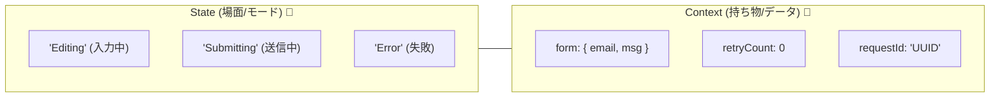

# 第19章：Context（拡張状態）を型にする🧠

この章は「**状態（State）だけじゃ表せない“データ”**を、バグりにくく安全に持つ」回だよ〜！😊💕

---

## 1) Contextってなに？（超ざっくり）🍓


* **State（状態）**：いま何してる？（モード）🚦
  例）`Editing` / `Submitting` / `Success` / `Error`

* **Context（拡張状態）**：その状態で必要な“データ”🧠
  例）フォーム入力値、エラー理由、`requestId`、リトライ回数…など

👉 イメージはこんな感じ👇
「State＝いまの“場面”」＋「Context＝持ち物リュック」🎒✨




---

## 2) Contextに入れるもの / 入れないもの（ここ超大事）🧯


### ✅ 入れると良いもの（だいたい正解）👍

* ユーザー入力（フォーム値）✍️
* サーバーから返ってきた結果（成功データ / エラー理由）📩
* 相関ID（`requestId`）🔍
* 回数・期限・タイムスタンプ（`retryCount`、`submittedAt`）⏱️
* “次に使う判断材料”（例：`lastErrorCode`）🧩

### ❌ 入れない方がいいもの（事故りやすい）💥

* **UIの見た目専用**の値（`isButtonDisabled` みたいな派生値）🙅‍♀️
  → それは **Stateや計算で出せる** ことが多いよ
* **関数**、DOM要素、巨大オブジェクト（コンポーネント参照とか）🧨
* “どこでも書き換えてOK”な雰囲気（無法地帯）🚫

---

## 3) Context設計の「3つのルール」📏✨

### ルール①：小さく！必要最小限！🧸

Contextが太ると「どこで変わった？」が追えなくなる😵‍💫

### ルール②：更新ポイントを決める（勝手に書き換え禁止）🚧

**Contextを更新していい場所**を、状態機械の中心（Reducer）に寄せると安定するよ💖

### ルール③：StateとContextの役割を混ぜない🧃

* “今どの段階？” → State
* “入力値・理由・IDは何？” → Context

---

## 4) 実装してみよう（フォーム送信のContext）📨✨

ここからは「フォーム送信」を例にするね😊
状態（ざっくり）：

* `Idle` → `Editing` → `Submitting` → `Success` / `Error`

### 4-1) Context型を作る🧠🧩


```ts
type FormField = "email" | "message";

type FormData = {
  email: string;
  message: string;
};

type ValidationErrors = Partial<Record<FormField, string>>;

export type Context = {
  form: FormData;
  errors: ValidationErrors;

  requestId?: string;      // 通信1回ごとの相関ID🔍
  retryCount: number;      // リトライ回数🔁
  lastErrorMessage?: string; // 直近エラー表示用🚨
};
```

💡ポイント💡

* `errors` は「全部の項目に必ずエラーがある」とは限らないから `Partial` が相性よいよ😊✨
* `requestId` は送信時だけあるから `?`（オプショナル）にするのが自然👍

---

### 4-2) 初期Contextを “型崩れしない” 形で作る🧊✨


TypeScriptだと初期値が原因で型がゆるくなったりするので、ここは丁寧にいこう💖
`satisfies` を使うと「形のチェック」だけしてくれて便利だよ（型が広がりにくい）✨

```ts
export const initialContext = {
  form: { email: "", message: "" },
  errors: {},
  retryCount: 0,
} satisfies Context;
```

---

### 4-3) “型安全に”フォーム更新できるイベントを作る🎫✨

「フィールド名」と「値」がセットで来るイベント、めちゃ使うよね😊
ここを型で守ると、入力系バグが減る〜！💕

```ts
export type Event =
  | { type: "START_EDIT" }
  | { type: "CHANGE_FIELD"; field: FormField; value: string }
  | { type: "SUBMIT" }
  | { type: "SUBMIT_SUCCESS"; requestId: string }
  | { type: "SUBMIT_FAILURE"; requestId: string; message: string }
  | { type: "RETRY" }
  | { type: "RESET" };
```

---

### 4-4) Context更新は “関数”でまとめる（事故防止）🛡️✨


Context更新が散らばると、未来の自分が泣く😭
なので「Contextを更新する小さな関数」を作っておくのが超おすすめ💖

```ts
function updateField(ctx: Context, field: FormField, value: string): Context {
  return {
    ...ctx,
    form: { ...ctx.form, [field]: value },
    // 入力したら、その項目のエラーは消す…みたいな運用もよくやるよ😊
    errors: { ...ctx.errors, [field]: undefined },
  };
}

function setSubmitting(ctx: Context, requestId: string): Context {
  return {
    ...ctx,
    requestId,
    lastErrorMessage: undefined,
  };
}

function setFailure(ctx: Context, requestId: string, message: string): Context {
  return {
    ...ctx,
    requestId,
    lastErrorMessage: message,
  };
}
```

---

### 4-5) 例：Reducerで Context を安全に更新する🍰✨

（Stateの型は前の章でやった前提で、ここは雰囲気だけ掴めればOKだよ😊）

```ts
export type State = "Idle" | "Editing" | "Submitting" | "Success" | "Error";

export type Model = {
  state: State;
  ctx: Context;
};

export function reduce(model: Model, event: Event): Model {
  const { state, ctx } = model;

  switch (event.type) {
    case "START_EDIT":
      return { state: "Editing", ctx };

    case "CHANGE_FIELD":
      return { state, ctx: updateField(ctx, event.field, event.value) };

    case "SUBMIT":
      // ここで本当はバリデーションして errors を埋める、などもできるよ🧪
      return { state: "Submitting", ctx: setSubmitting(ctx, crypto.randomUUID()) };

    case "SUBMIT_SUCCESS":
      return { state: "Success", ctx: { ...ctx, requestId: event.requestId } };

    case "SUBMIT_FAILURE":
      return { state: "Error", ctx: setFailure(ctx, event.requestId, event.message) };

    case "RETRY":
      return {
        state: "Submitting",
        ctx: { ...ctx, retryCount: ctx.retryCount + 1, lastErrorMessage: undefined },
      };

    case "RESET":
      return { state: "Idle", ctx: initialContext };

    default:
      return model;
  }
}
```

✨これで何が嬉しいの？✨

* **Contextの形がブレない**（勝手に変なデータが混ざりにくい）
* **更新箇所がReducer中心に集まる**（追いやすい！）🔍
* `CHANGE_FIELD` が型で守られる（`field` の打ち間違い減る）🧡

---

## 5) “Contextに入れない派生値”はどうする？🤔💡


たとえば「送信ボタン無効」は Context に入れたくなりがちだけど…
多くの場合は **計算で出せる** よ😊✨

```ts
function canSubmit(ctx: Context): boolean {
  return ctx.form.email.trim() !== "" && ctx.form.message.trim() !== "";
}
```

こうすると、

* Contextの肥大化を防げる🐣
* “派生値の更新忘れ”バグが消える💥➡️🌈

---

## 6) ミニ演習（手を動かすよ〜！）🎮💖

### 演習A：同意チェックを追加✅

* `ctx.form` に `agreedToTerms: boolean` を追加
* `CHANGE_FIELD` とは別で
  `TOGGLE_TERMS` イベントを作って更新してみてね😊

### 演習B：送信時刻を記録🕒

* `ctx.submittedAt?: number` を追加（`Date.now()` でOK）
* `SUBMIT` のタイミングで埋める！

---

## 7) AI活用プロンプト集（そのままコピペOK）🤖💕

* 「フォーム送信の状態機械で、Contextに入れるべきデータ候補を“必要度順”に10個出して。入れない方がいい候補も添えて」🧠✨
* 「`Context` の不変条件（守りたいルール）を5つ提案して。例：retryCountは0以上、など」📏🔒
* 「イベント設計を手伝って。`CHANGE_FIELD` の payload を型安全にする案を3つ、難易度つきで」🎫✨
* 「今のContextが太りすぎてないかレビューして。削れる派生値があれば指摘して」🧹👀

---

## 8) おまけ：XStateを使うなら（超軽く）🎁✨

XState v5 は “actor-first” な設計でリリースされてるよ〜！📌 ([Stately][1])
Contextを型で持つ考え方はそのまま活きる😊

---

## 9) いまの“最新”メモ（本日時点）🗓️✨

* TypeScript の最新安定版は **5.9.3**（2025-10-01 表示）だよ📌 ([GitHub][2])
* Node.js は **v24 が Active LTS**で、直近だと **24.13.0 (LTS)** が 2026-01-13 に出てるよ🔐 ([Node.js][3])
* TypeScript 5.9 のリリースノートも公開されてるよ📘 ([TypeScript][4])

（この章の内容は、これらの最新版でもそのまま通用する設計の話だよ😊🧡）

---

## 次章の予告📣

次は **「型安全① まずは“弱め”でOK（最低限ルール）」**🙂✨
「難しい型芸に行く前に、守るだけで事故が減るルール」を作っていくよ〜！🚗💨

[1]: https://stately.ai/blog/2023-12-01-xstate-v5?utm_source=chatgpt.com "XState v5 is here"
[2]: https://github.com/microsoft/typescript/releases "Releases · microsoft/TypeScript · GitHub"
[3]: https://nodejs.org/en/blog/release/v24.13.0?utm_source=chatgpt.com "Node.js 24.13.0 (LTS)"
[4]: https://www.typescriptlang.org/docs/handbook/release-notes/typescript-5-9.html?utm_source=chatgpt.com "Documentation - TypeScript 5.9"
