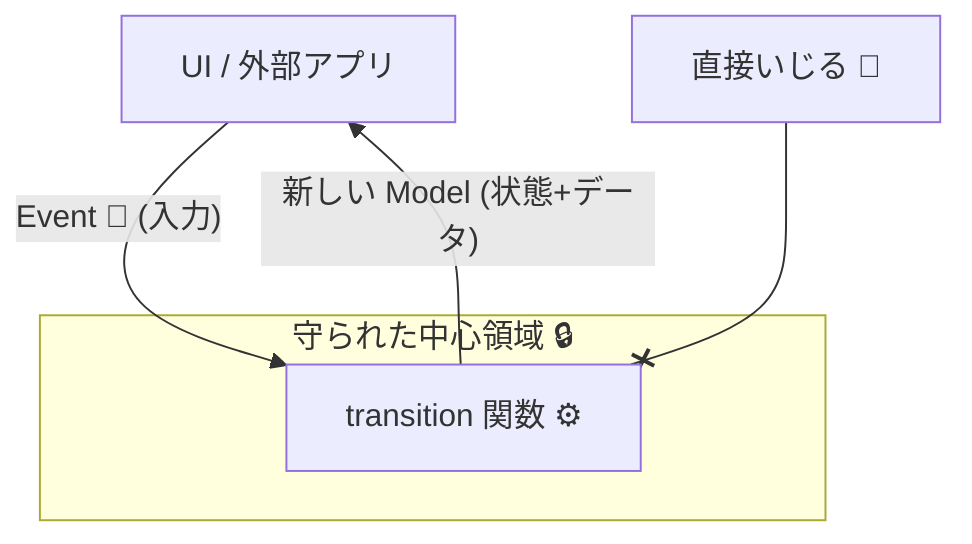

# 第20章：型安全① まずは“弱め”でOK（最低限ルール）🙂

まず「最新の土台」だけ共有すると、現行の安定版は TypeScript 5.9 系（5.9 の公式アナウンスあり）で、公式の 5.9 リリースノートも 2026-01 に更新されています🧡 ([Microsoft for Developers][1])
なのでこの章は「TypeScript 5.9 世代の前提」で進めるね〜☺️✨

---

## 1) なんで“弱め”からでいいの？🙂🌱

型を最初からガチガチにすると…👇

* ルールが多すぎて「やる気」が先に死ぬ😵‍💫
* 型のための型になって、肝心の設計が見えなくなる🙈
* “状態機械のうまみ”は **「状態変更点が1箇所」** だけでも爆上がりする💥✨

だからこの章は、**最低限のルール 3〜5個だけ**で「事故率」を一気に下げるよ〜🚗💨

---

## 2) 最低限ルール（これだけ守ればOK）📜✨

### ルール①：状態を変更できるのは「transition」だけ🧠➡️🧠


* “状態が変わる場所”が散らばると、バグの発生源が増えるよ😭
* **状態変更は1箇所**に閉じ込めよう🔒✨




### ルール②：状態とContextは「外から直接いじらない」🙅‍♀️🧼


* UI側で `context.xxx = ...` みたいに触るのを禁止🚫
* 更新は必ず `transition` 内で「新しいオブジェクトを返す」方式に寄せる🫶

### ルール③：イベントは “型” で作って “型” で送る🎫✨


* “文字列で送るイベント”は地味に事故る😇
* 送るイベントは **判別可能ユニオン**に統一！（第18章の復習だね😉）

### ルール④：禁止遷移は「統一ルール」で処理する🚫✅


* ケースごとに「無視」「例外」「ログだけ」って混ぜると、地獄が始まる🔥
* 初心者におすすめは👇

  * **基本：戻り値で “失敗” を返す**（例外は最後の手段）🙂

### ルール⑤：「型だけ」じゃなく、最低限のランタイム安全も置く🧯


* 型はコンパイル時、現実は実行時に壊れることもある🥲
* まずは **禁止遷移を握りつぶさず可視化**（ログ/理由つき失敗）でOK✨

---

## 3) 成果物：この章の“弱め型安全”テンプレ（コピペOK）🧩✨

ポイントはこれ👇

* `transition(model, event)` が唯一の状態変更ルート
* 戻り値で「成功/失敗」を表現（禁止遷移の統一）
* 副作用は `effects` に積んで外で実行（第14〜16章の流れに合うよ🫶）

```ts
// 例：フォーム送信ミニ状態機械（弱め型安全テンプレ）

type State = "idle" | "editing" | "submitting" | "success" | "error";

type Context = {
  email: string;
  message: string;
  requestId?: string;
  errorMessage?: string;
};

type Event =
  | { type: "START_EDIT" }
  | { type: "CHANGE_EMAIL"; value: string }
  | { type: "CHANGE_MESSAGE"; value: string }
  | { type: "SUBMIT" }
  | { type: "RESOLVE_SUCCESS"; requestId: string }
  | { type: "RESOLVE_ERROR"; message: string }
  | { type: "RESET" };

type Effect =
  | { type: "LOG"; text: string }
  | { type: "API_SUBMIT"; payload: { email: string; message: string; requestId: string } };

type Model = { state: State; ctx: Context };

type TransitionOk = { ok: true; model: Model; effects: Effect[] };
type TransitionNg = { ok: false; model: Model; reason: string; effects: Effect[] };
type TransitionResult = TransitionOk | TransitionNg;

const ok = (model: Model, effects: Effect[] = []): TransitionOk => ({ ok: true, model, effects });
const ng = (model: Model, reason: string, effects: Effect[] = []): TransitionNg => ({ ok: false, model, reason, effects });

const newRequestId = (): string => crypto.randomUUID();

export function transition(model: Model, event: Event): TransitionResult {
  const { state, ctx } = model;

  // ついでに最低限ログ（やりすぎない）
  const log = (to: State) => [{ type: "LOG", text: `${state} --(${event.type})-> ${to}` } as const];

  switch (state) {
    case "idle": {
      if (event.type === "START_EDIT") {
        return ok({ state: "editing", ctx }, log("editing"));
      }
      if (event.type === "RESET") {
        return ok(model, [{ type: "LOG", text: "idle reset (noop)" }]);
      }
      return ng(model, `idle では ${event.type} はできないよ`, [{ type: "LOG", text: "invalid transition" }]);
    }

    case "editing": {
      if (event.type === "CHANGE_EMAIL") {
        return ok({ state, ctx: { ...ctx, email: event.value } });
      }
      if (event.type === "CHANGE_MESSAGE") {
        return ok({ state, ctx: { ...ctx, message: event.value } });
      }
      if (event.type === "SUBMIT") {
        const requestId = newRequestId();
        const nextModel: Model = { state: "submitting", ctx: { ...ctx, requestId, errorMessage: undefined } };
        return ok(nextModel, [
          ...log("submitting"),
          { type: "API_SUBMIT", payload: { email: ctx.email, message: ctx.message, requestId } },
        ]);
      }
      if (event.type === "RESET") {
        return ok({ state: "idle", ctx: { email: "", message: "" } }, log("idle"));
      }
      return ng(model, `editing では ${event.type} はできないよ`);
    }

    case "submitting": {
      if (event.type === "RESOLVE_SUCCESS") {
        return ok({ state: "success", ctx: { ...ctx, requestId: event.requestId } }, log("success"));
      }
      if (event.type === "RESOLVE_ERROR") {
        return ok({ state: "error", ctx: { ...ctx, errorMessage: event.message } }, log("error"));
      }
      if (event.type === "RESET") {
        return ok({ state: "idle", ctx: { email: "", message: "" } }, log("idle"));
      }
      return ng(model, `submitting 中は ${event.type} はできないよ（キャンセル等は第25章で増やすよ）`);
    }

    case "success": {
      if (event.type === "RESET") {
        return ok({ state: "idle", ctx: { email: "", message: "" } }, log("idle"));
      }
      return ng(model, `success では ${event.type} はできないよ`);
    }

    case "error": {
      if (event.type === "START_EDIT") {
        return ok({ state: "editing", ctx: { ...ctx, errorMessage: undefined } }, log("editing"));
      }
      if (event.type === "RESET") {
        return ok({ state: "idle", ctx: { email: "", message: "" } }, log("idle"));
      }
      return ng(model, `error では ${event.type} はできないよ`);
    }
  }
}
```

### 「状態を外からいじれない」使い方（send だけ公開）📮✨

```ts
type EffectRunner = (effect: Effect) => Promise<void> | void;

export function createMachine(initial: Model, runEffect: EffectRunner) {
  let current = initial;

  const get = () => current;

  const send = async (event: Event) => {
    const r = transition(current, event);

    // ルール④：禁止遷移は統一対応（ここでは “失敗として返す”）
    if (!r.ok) {
      // 例外を投げずに、呼び出し側が扱える形にする🙂
      r.effects.forEach(runEffect);
      return r;
    }

    current = r.model;
    for (const e of r.effects) await runEffect(e);
    return r;
  };

  return { get, send };
}
```

これで **「状態が変わる場所＝transition」** が守れるよ〜🥳🔒

---

## 4) コンパイラ側の“最低ライン”も軽く入れよ🙂🧰


まずは “全部盛り” じゃなくてOK！でも **「strict」はONがおすすめ**✨
（tsconfig の各オプションは公式リファレンスにまとまってるよ📚） ([TypeScript][2])

```json
{
  "compilerOptions": {
    "strict": true
  }
}
```

`strict` の中でも特に効くのが「null/undefined をちゃんと扱わせる」やつで、これがバグ予防に強いんだよね🧡 ([TypeScript入門『サバイバルTypeScript』][3])

あと、TypeScript 5.9 では `tsc --init` が “よりミニマル＆更新された形” を吐くようにもなってるよ（設定のスタートが楽になるやつ✨） ([Microsoft for Developers][4])

---

## 5) Copilot / Codex に投げると強いプロンプト例🤖✨

* 「この State/Event/Context から transition の switch を全部生成して。禁止遷移は `ng()` で返して」
* 「transition 内で context をミューテートしてないかレビューして、危ない行を指摘して」
* 「イベント追加したから、影響する state の遷移を洗い出して」

💡コツ：AIに“生成”させたら、**ルール①〜④に合ってるか**だけ人間が最終確認すると爆速だよ〜🏎️💨

---

## 6) ミニ演習（15〜25分）⏱️🎀

1. `Event` に `{ type: "CANCEL" }` を追加してみて🧪

* `submitting` のときだけ `editing` に戻れる、みたいにしてみよ🙂

2. 禁止遷移の `reason` を、もっとユーザー向けにしてみて💬

* 例：「送信中だよ。少し待ってね」みたいに✨

3. `Effect` に `{ type: "TOAST"; text: string }` を足して、

* `error` に入った瞬間だけトースト出す、みたいにしてみよ🍞✨

---

## 7) この章のまとめ（超たいせつ）💖

* “弱め型安全”の勝ち筋は **「状態変更を1箇所に閉じる」** こと🧠🔒
* 禁止遷移は **統一ルール**で返す（まずは戻り値でOK）🚫✅
* `strict` だけでもバグ減るから、最初の一歩にちょうどいい🙂✨ ([TypeScript][2])

---

次の第21章では、これを「遷移表（Record）で読みやすくする」方向に進めて、仕様＝コードに寄せていくよ〜📋✨

[1]: https://devblogs.microsoft.com/typescript/announcing-typescript-5-9/?utm_source=chatgpt.com "Announcing TypeScript 5.9"
[2]: https://www.typescriptlang.org/tsconfig/?utm_source=chatgpt.com "TSConfig Reference - Docs on every TSConfig option"
[3]: https://typescriptbook.jp/reference/tsconfig/strictnullchecks?utm_source=chatgpt.com "strictNullChecks | TypeScript入門『 ..."
[4]: https://devblogs.microsoft.com/typescript/announcing-typescript-5-9-rc/?utm_source=chatgpt.com "Announcing TypeScript 5.9 RC"
