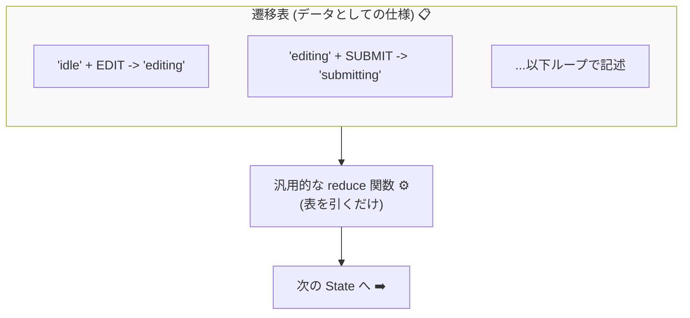

# 第21章：型安全② 遷移表（Record）で読みやすくする📋✨

この章は、「仕様＝表（データ）」に寄せて、**状態遷移をめっちゃ見通し良くする**回だよ〜😊🌸
コードが大きくなっても、**“どこで何が起きるか”が一瞬で追える**ようになるのがゴール！✨

---

## 1) この章でできるようになること🎯✨

* **状態 → イベント → 次状態** を「表（オブジェクト）」で表現できる📋
* イベント名の打ち間違いとかを **型で止められる**ようになる🛑✅
* 「遷移の仕様レビュー」がしやすい形にできる👀💖

そして大事な前置き：
この章は「読みやすくする」が中心！
**“漏れ検出をコンパイルで止める”の強化版は次章（第22章）でやるよ**🔥

---

## 2) まず “最新版” メモ🆕📝（超短く！）

* TypeScript は **5.9 系が最新安定版（5.9.3）として配布**されてるよ（npmのLatest表示）📦✨ ([Npm][1])
* `satisfies` 演算子は、**型チェックしつつ推論（リテラル）を保てる**便利機能！ 遷移表と相性最高💘 ([typescriptlang.org][2])
* さらに先の話として、TypeScript の “ネイティブ化” に向けた動きも進んでる（将来ビルドが速くなる系）🚀 ([Microsoft Developer][3])

---

## 3) 「遷移表をコードで持つ」と何が嬉しいの？😊💡

### ✅ 嬉しいこと


* **仕様が1か所に集まる**（迷子にならない）🧭
* 「この状態でこのイベント来たらどうなる？」が **検索なしで見える**🔍
* 差分（git）で **仕様変更が一目で分かる**👀✨
* テストに繋げやすい（表をループしてテスト作れる）🧪💕

### 😭 if/else の世界だと…

* 条件分岐が散って、**“仕様がどこにあるか”が消える**💥
* 追加仕様のたびに **壊れても気づきにくい**😱

---

## 4) 今日の題材：フォーム送信の状態（例）📨✨


ここでは例として、よくあるやつ！

* `idle`（何もしてない）
* `editing`（入力中）
* `submitting`（送信中）
* `success`（成功）
* `error`（失敗）

イベントも例で：

* `EDIT`（編集開始）
* `CHANGE`（入力変更）
* `SUBMIT`（送信）
* `RESOLVE`（成功）
* `REJECT`（失敗）
* `RETRY`（再試行）
* `RESET`（最初に戻す）

---

## 5) 遷移表の「型」を作る（Record が主役！）📋✨


### Record の気持ち😊


* `Record<K, V>` は「**キーがKで、値がVの辞書**」って意味だよ🗂️
* `Partial<T>` は「**全部 optional（あってもなくてもOK）**」って意味だよ🧸

つまり、こういう形を作りたい：

> 状態ごとに、イベント名をキーにして、遷移定義（次状態など）を置く




---

## 6) 実装：遷移表を “仕様＝表” にする🧑‍💻💖

ポイントはここ！

* `as const` で **文字列をリテラル扱い**にする✨
* `satisfies` で **型チェックしつつ、推論を潰さない**💘 ([typescriptlang.org][2])

```ts
// 1) 状態を型にする
type State =
  | "idle"
  | "editing"
  | "submitting"
  | "success"
  | "error";

// 2) イベントを型にする（判別可能ユニオン）
type Event =
  | { type: "EDIT" }
  | { type: "CHANGE"; field: "name" | "email"; value: string }
  | { type: "SUBMIT" }
  | { type: "RESOLVE" }
  | { type: "REJECT"; message: string }
  | { type: "RETRY" }
  | { type: "RESET" };

type EventType = Event["type"];

// 3) 遷移1個ぶんの定義
type Transition = {
  target: State;
  // ここでは読みやすさ優先で、まずは最低限だけ
  // （Action/Guard を入れたくなったら第13章の知識で拡張できるよ✨）
};

// 4) 遷移表の型：
// - 状態は全て用意したい（Record<State, ...>）
// - でも各状態で起きるイベントは全部は起きない（Partial で省略OKにする）
type TransitionTable = Record<State, Partial<Record<EventType, Transition>>>;

// 5) 遷移表（仕様＝表）
const transitions = {
  idle: {
    EDIT: { target: "editing" },
  },

  editing: {
    CHANGE: { target: "editing" },   // 入力変更しても editing のまま
    SUBMIT: { target: "submitting" },
    RESET: { target: "idle" },
  },

  submitting: {
    RESOLVE: { target: "success" },
    REJECT: { target: "error" },
  },

  success: {
    RESET: { target: "idle" },
  },

  error: {
    RETRY: { target: "submitting" },
    RESET: { target: "idle" },
  },
} as const satisfies TransitionTable;
```

### ✅ ここで起きてる“良いこと”✨

* もし `SUBMIt` みたいにイベント名を打ち間違えたら、**型が怒ってくれる**😤🛑
* `target: "sucess"` みたいな状態名ミスも、**型が止めてくれる**🚫✅
* しかも `satisfies` だから、`as const` のリテラル推論が保たれて気持ちいい💖 ([typescriptlang.org][2])

---

## 7) 遷移表を使って nextState を作る🚦➡️✨


「表がある」＝「遷移ロジックがシンプル」になるよ😊

```ts
type Machine = {
  state: State;
  // Context を入れたいときはここに足せる（第19章のやつ🧠✨）
};

function reduce(machine: Machine, event: Event): Machine {
  const from = machine.state;
  const hit = transitions[from][event.type]; // Transition | undefined

  // ルール：表に無いイベントは “無視して現状維持” にする（初心者に優しい）
  if (!hit) return machine;

  return { ...machine, state: hit.target };
}
```

### ✨「禁止遷移」をどうする？

ここでは超シンプルにしてるよ👇

* 表にないイベント → **無視（現状維持）**🙂
* 「禁止はエラーにしたい！」なら、次のどれかに変えられるよ✨

  * `throw` する🔥
  * ログ出して返す📝
  * `error` 状態に飛ばす🚨

（このへんの“方針”を固めるのが設計って感じで楽しいやつ🥰）

---

## 8) “読みやすい遷移表”にするコツ💅📋✨

### ✅ 1状態＝1ブロックに分ける

でっかいオブジェクトでも、状態ごとにまとまってると読みやすい😊

### ✅ コメントは “仕様コメント” にする

「なぜこうなるか」を短く書くと、未来の自分が助かる🛟✨

### ✅ イベント名は “動詞” に寄せる

`SUBMIT / RESOLVE / REJECT` みたいに、行動がわかると最高👍

---

## 9) AI活用プロンプト集🤖💖（そのままコピペOK）

* 遷移表たたき台を作ってもらう📋
  「状態は idle/editing/submitting/success/error。イベントは EDIT/CHANGE/SUBMIT/RESOLVE/REJECT/RETRY/RESET。自然な遷移表を提案して。禁止遷移も書いて」

* 命名の統一感チェック🔍
  「イベント名と状態名の命名に統一感があるかレビューして。改善案も」

* 仕様漏れ探し🕵️‍♀️
  「この遷移表でユーザーが詰む状態はある？詰むなら解決イベント案も」

---

## 10) ミニ演習🧪✨（ちょい楽しい）

### 演習A：わざとミスって型に怒られよう😈

* `RESOLVE` を `RESOLV` にしてみて、どんなエラーが出るか見てみよ😆

### 演習B：状態を1個増やす🧩

* `confirming`（送信前確認）を追加して
  `editing -> confirming -> submitting` にしてみよ✨
  遷移表のどこを直せばいいか、表なら一瞬で分かるはず😊

---

## 11) よくあるつまずき😭➡️😊


* **`as any` を使っちゃう**
  → それやると型安全が消える〜〜😵‍💫（困ったら型を一緒に整えよ✨）

* **イベントが payload を持つのを忘れる**
  → `CHANGE` みたいに、必要データはイベント型に乗せるのがキレイ🎫✨

* **表の設計が先に固すぎる**
  → まずはこの章みたいに “弱め” でOK🙂 次章で強くする🔥

---

## 12) まとめ🎀✨

この章でやったことはこれだよ〜😊

* 遷移を `Record` で「表」にして、仕様を見える化📋✨
* `as const satisfies ...` で **型チェックしつつ推論を保つ**（超相性いい）💘 ([typescriptlang.org][2])
* 表から `reduce()` を作れて、ロジックがスッキリ🚦➡️

次の第22章で、いよいよ
**「遷移漏れをコンパイルで止める」＝本気の型安全**に進むよ🔥🚫✅

---

必要なら、この章の遷移表に **Guard/Action/Context** を足して「より実務っぽい形」に育てた版もすぐ作れるよ〜🥰💖

[1]: https://www.npmjs.com/package/typescript?activeTab=versions&utm_source=chatgpt.com "typescript"
[2]: https://www.typescriptlang.org/docs/handbook/release-notes/typescript-4-9.html?utm_source=chatgpt.com "Documentation - TypeScript 4.9"
[3]: https://developer.microsoft.com/blog/typescript-7-native-preview-in-visual-studio-2026?utm_source=chatgpt.com "TypeScript 7 native preview in Visual Studio 2026"
