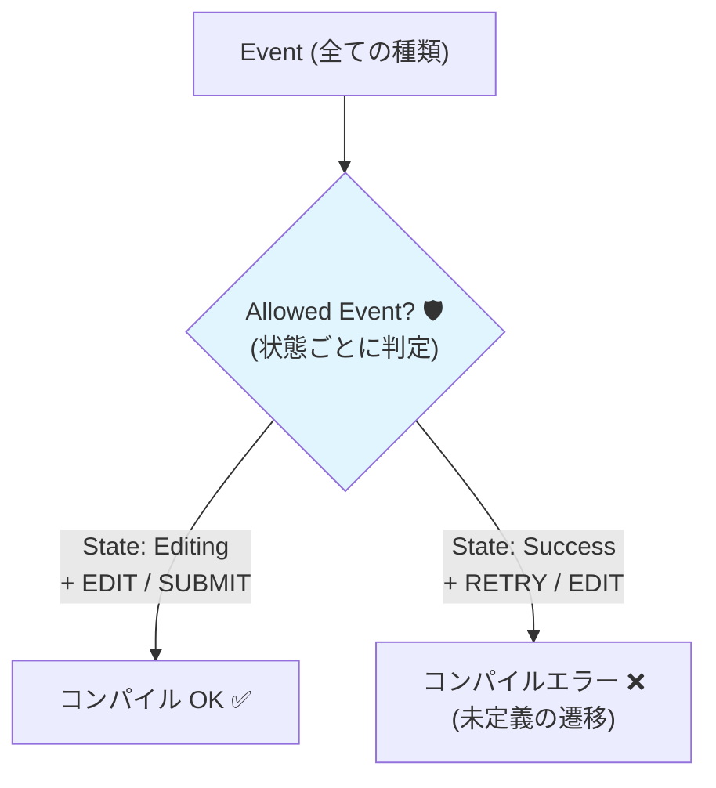

# 第22章：型安全③ 漏れ検出（禁止遷移をコンパイルで止める）🚫✅

この章のゴールはコレだよ〜！🎯
**「ありえない遷移（禁止遷移）」を、実行する前に“型”で止める**🛑✨
さらに、**「書き忘れ（定義漏れ）」もコンパイルで気づける**状態にしていくよ〜😊💕

---

## 1. まず“漏れ”って何が漏れるの？🕳️👀

状態機械で困る“漏れ”はだいたいこの2種類💡

### ✅(A) 遷移の「定義漏れ」📋

例：`Editing` で `SUBMIT` が来た時どうする？…を書き忘れる😇
→ 実行時に「え、どうするの？」が起きる💥

### ✅(B) 禁止遷移の「実行漏れ」🚫

例：`Success` なのに `RETRY` を送っちゃう😇
→ バグの温床（画面の整合性が崩れる）💥

この章では **(A)(B)を“型で”防ぐ**よ！🧠🔒

---

## 2. 本日時点のTypeScriptの前提（最新事情だけ、さらっと）🆕✨

* TypeScriptは **5.9 系が最新の安定版として配布**されてるよ（npmの latest も 5.9.x）📦✨ ([Npm][1])
* 今回めっちゃ使う `satisfies` は **TypeScript 4.9 で入った機能**で、**「形はチェックするのに推論は潰さない」**のが強み💪✨ ([typescriptlang.org][2])
* VS Codeは「ワークスペースのTypeScript」を使う設定にできる（`TypeScript: Select TypeScript Version`）🔧 ([Visual Studio Code][3])

---

## 3. “禁止遷移を止める”ための基本戦略🧩🔒

やり方は大きく2段階にするとラクだよ😊✨

### 🥚段階1：**遷移表そのものの漏れを止める**（書き忘れ防止）

→ 「この状態ではこのイベントが来たらこう！」を **Recordで強制**📋✅

### 🐣段階2：**send（イベント送信）を型で縛る**（禁止遷移防止）

→ 「この状態の時は、このイベントしか送れません」って型にする📮🚫✅

この順でいくよ〜！🚀

---

## 4. 実例：フォーム送信ミニ状態機械でやってみよ📨✨

### 4.1 State / Event を作る🧩

```ts
// 状態（4つだけ）
export type State = "Editing" | "Submitting" | "Success" | "Error";

// イベント（判別可能ユニオン）
export type Event =
  | { type: "EDIT"; field: string; value: string }
  | { type: "SUBMIT" }
  | { type: "RESOLVE" }
  | { type: "REJECT"; message: string }
  | { type: "RETRY" }
  | { type: "RESET" }
  | { type: "CANCEL" };

export type EventType = Event["type"];
```

---

## 5. 段階1：遷移表の“書き忘れ”をコンパイルで止める📋✅✨

### 5.1 「状態ごとに許可するイベント」を宣言する🛡️

ここが最重要ポイントだよ〜！💖
**「この状態では、どのイベントが“正当な入力”なの？」**を先に決めちゃう✨

```ts
export type AllowedEventTypeByState = {
  Editing: "EDIT" | "SUBMIT";
  Submitting: "RESOLVE" | "REJECT" | "CANCEL";
  Success: "RESET";
  Error: "RETRY" | "RESET";
};
```

### 5.2 遷移表の型（TransitionTable）を作る📋

```ts
export type TransitionTable = {
  [S in State]: Record<AllowedEventTypeByState[S], State>;
};
```

* `Record<Keys, Value>` は **Keys を全部書かないとエラー**になるよ✅
* つまり「SUBMIT書き忘れた！」が **コンパイルで即バレ**る🎉

### 5.3 遷移表を書く（ここで漏れ検出が効く！）🚫✅


```ts
export const transitions = {
  Editing: {
    EDIT: "Editing",
    SUBMIT: "Submitting",
  },
  Submitting: {
    RESOLVE: "Success",
    REJECT: "Error",
    CANCEL: "Editing",
  },
  Success: {
    RESET: "Editing",
  },
  Error: {
    RETRY: "Submitting",
    RESET: "Editing",
  },
} satisfies TransitionTable;
```

`satisfies` の良いところは
**「型チェックはする」けど「推論（Editing などのリテラル）は保つ」**こと✨ ([typescriptlang.org][2])

---

### 5.4 ここで“わざとミス”するとどうなる？😈✨

#### ❌例：`Editing` の `SUBMIT` を消す

→ `Property 'SUBMIT' is missing ...` みたいに怒られる💥

#### ❌例：`Success` に `RETRY` を足す

→ 「そんなキー知らない」系で怒られる💥（余計な遷移を混ぜない）🚫

---

## 6. 段階2：禁止遷移を「sendできない」型にする📮🚫✅

ここからが本題の“禁止遷移をコンパイルで止める”だよ〜！💖

### 6.1 「状態Sのときに送れるEvent型」を作る🧠

```ts
export type AllowedEvent<S extends State> =
  Extract<Event, { type: AllowedEventTypeByState[S] }>;
```

* `Extract<Union, 条件>` は「ユニオンから条件に合うやつだけ抜く」魔法🪄✨

### 6.2 send関数：状態とイベントの組み合わせを型で縛る🔒

```ts
export function send<S extends State>(state: S, event: AllowedEvent<S>): State {
  // event.type は「その state で許可された type」だけになる
  return transitions[state][event.type];
}
```

### 6.3 使ってみる✅

```ts
send("Editing", { type: "SUBMIT" });   // OK ✅
send("Submitting", { type: "CANCEL" }); // OK ✅
send("Success", { type: "RESET" });     // OK ✅

// ↓これはコンパイルで止まる！🚫✨
send("Success", { type: "RETRY" });
```

**「Success のとき RETRY は送れません」**が型で保証されるの、気持ちよすぎる〜〜🥹💖




---

## 7. でも注意！型安全が“ゆるくなる”瞬間があるよ⚠️😵‍💫

### 7.1 state が “ただの State” だと弱くなる

例えばこういうとき👇

```ts
let state: State = "Editing"; // ← 型が広がってる（widening）
send(state, { type: "RETRY" }); // ここ、通っちゃうことがある😇
```

**なぜか**というと、`state` が `"Editing"` じゃなくて **`State（全部入り）`** になってるから、
`AllowedEvent<State>` も **全部のEventが許可**されちゃうの😭

### 7.2 対策（超よく効くやつ）💊✨

#### ✅対策1：`const` で状態をなるべく狭く保つ

```ts
const state = "Editing" as const;
send(state, { type: "SUBMIT" }); // 強いまま💪✨
```

#### ✅対策2：分岐してから send する（現場で一番多い）

```ts
function onRetryClick(state: State) {
  switch (state) {
    case "Error":
      return send(state, { type: "RETRY" }); // OK ✅（ここでは state が "Error" に絞れる）
    default:
      return state;
  }
}
```

---

## 8. switch の“網羅性チェック”も一緒にやると最強🧠⚔️✨

状態やイベントが増えたとき、switch の case 書き忘れも怖いよね😱
そこで **never を使った網羅性チェック**が便利💡

```ts
function assertNever(x: never): never {
  throw new Error("Unexpected value: " + x);
}

export function stateLabel(state: State): string {
  switch (state) {
    case "Editing":
      return "入力中✍️";
    case "Submitting":
      return "送信中⏳";
    case "Success":
      return "成功🎉";
    case "Error":
      return "失敗🚨";
    default:
      return assertNever(state); // ← Stateに追加があったらここでコンパイルが壊れる✅
  }
}
```

さらに、ESLintの **`switch-exhaustiveness-check`** を使うと、
「case漏れ」をルールで検出できるよ🧹✨ ([typescript-eslint.io][4])

---

## 9. “強くしすぎる”と何が難しくなる？（注意点）⚖️🌀

AIにも聞いてたやつ、ここで整理するね🤖✨

### ✅強くすると嬉しいこと🎁

* 禁止遷移が **そもそも書けない／送れない**🚫✅
* 仕様変更で State/Event が増えたときに **修正漏れが即バレ**💥
* テストやレビューが爆速になる🧪💨

### ⚠️強くすると増えるコスト💸

* 型がちょっと難しく見える（最初だけ！）😵‍💫
* 「stateが広がると弱くなる」みたいな **TypeScriptあるある**に慣れが必要👀
* 状態をオブジェクト化（タグ付き）したくなる場面が出てくる（中〜上級に近づく）🏗️

> だからおすすめは、**この章の形（AllowedEventTypeByState + TransitionTable + send）を“基準形”**にしちゃうこと💖
> だいたいのUIはこれで戦えるよ💪✨

---

## 10. AI活用プロンプト集（そのままコピペOK）🤖💬✨

### 🧠設計を固める

* 「この状態一覧とイベント一覧から、状態ごとの許可イベント（AllowedEventTypeByState）を提案して。理由もつけて」
* 「遷移表で禁止遷移になっている組み合わせを列挙して、UI上の防止策も提案して」

### 🛠️実装を作る

* 「TransitionTable と satisfies を使って、遷移表の書き忘れがコンパイルで落ちる実装にして」
* 「send(state, event) が禁止遷移をコンパイルで止めるように、AllowedEvent<S> を組み立てて」

### 🧪レビューしてもらう

* 「この遷移表で、イベントの命名がブレてないかレビューして」
* 「この状態機械の禁止遷移方針（無視/エラー/ログ）を3案で。初心者が運用しやすい順に」

---

## 11. ミニ演習（手を動かすと一気に身につくよ）🧪💖

### 🎯演習1：わざと漏らして、コンパイルに怒られよう😈

1. `Submitting` から `REJECT` を消す
2. エラーが出たのを確認
3. 追加して直す

### 🎯演習2：禁止遷移を“送って”みよう📮

`send("Success", { type: "RETRY" })` を書いて、止まるのを確認🚫✨

### 🎯演習3：状態を1個増やして、修正漏れ検出を体験🎮

* `State` に `"Timeout"` を追加
* どこが壊れるか見て、直す（これが一番の価値💎）

---

## まとめ🎀✨

この章でできるようになったことはコレ！✅

* **状態ごとに「許可イベント」を宣言**できる🛡️
* **遷移表の書き忘れをコンパイルで検出**できる📋✅
* **禁止遷移を send できない**ように型で止められる📮🚫✅
* switch の網羅性も **never + ESLint** で守れる🧠✨ ([typescript-eslint.io][4])

次の章（実装パターン：Reducer）に行くと、これがそのまま“強い実装”に直結するよ〜！🍰💪✨

[1]: https://www.npmjs.com/package/typescript?utm_source=chatgpt.com "TypeScript"
[2]: https://www.typescriptlang.org/docs/handbook/release-notes/typescript-4-9.html?utm_source=chatgpt.com "Documentation - TypeScript 4.9"
[3]: https://code.visualstudio.com/docs/typescript/typescript-compiling?utm_source=chatgpt.com "Compiling TypeScript"
[4]: https://typescript-eslint.io/rules/switch-exhaustiveness-check/?utm_source=chatgpt.com "switch-exhaustiveness-check"
