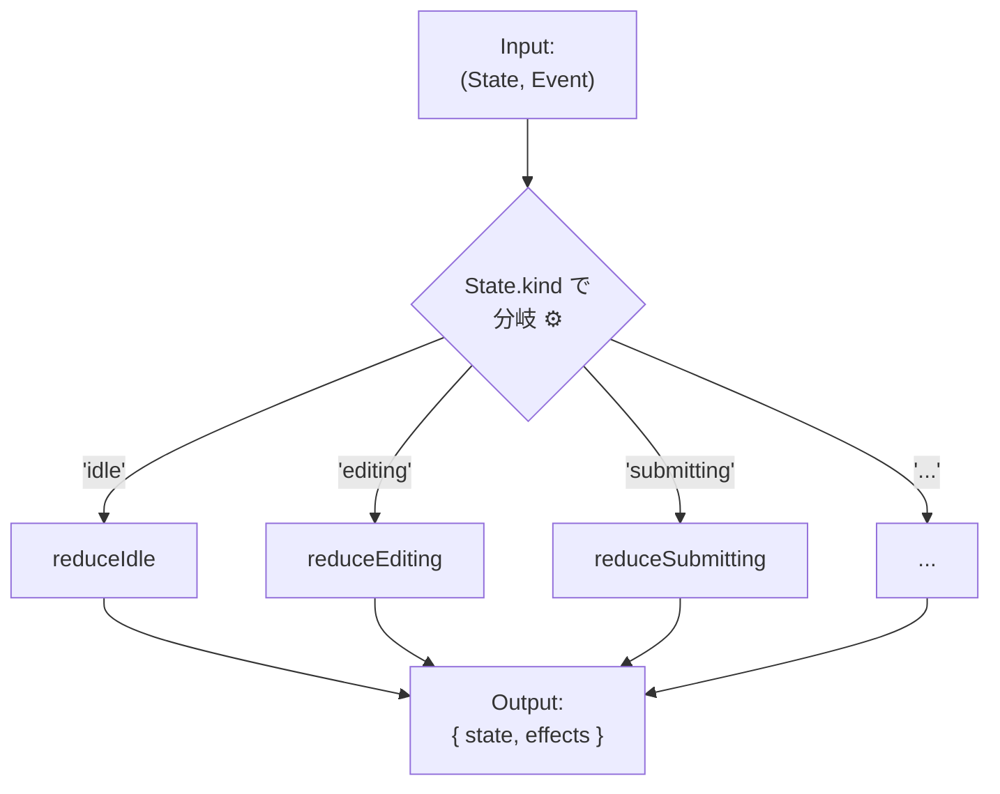

# 第23章：実装① Reducerで作る（王道）🍰

（state + event → next を「安定して」「テストしやすく」書けるようになる章だよ〜🧸💖）

---

## 0) この章でできるようになること🎯✨

* 状態機械の“心臓”になる **Reducer（純粋関数）** を書けるようになる🫀🧠
* **禁止遷移**（その状態では起きないイベント）を安全に扱える🚫✅
* **ガード**（条件が満たされないと遷移できない）をReducer内で整頓できる🛡️
* 副作用（API呼び出し等）を **Reducerの外に追い出す設計** ができる🌿🚪
* **表駆動テスト**で、遷移の網羅チェックができる🧪📋

---

## 1) Reducerってなに？🍩


Reducerは、ざっくり言うとこう👇

* **入力**：いまの状態 `state` と、起きた出来事 `event(action)`
* **出力**：次の状態 `nextState`（＋必要なら「やるべき副作用の指示」）

「(state, action) => newState」っていう定義は、Reduxの公式チュートリアルでもこの形で説明されてるよ🧁✨ ([redux.js.org][1])
Reactの `useReducer` も、Reducerが「次の状態を計算して返す」って説明になってるよ〜🧸💡 ([React][2])

---

## 2) 今回の題材：フォーム送信（ミニ版）📨✨

この章では、総合演習（第30章）に繋がる“基本形”として、フォーム送信をミニで作るよ😊🌸

### 状態（State）🧩

* `idle`：まだ入力してない
* `editing`：入力中
* `submitting`：送信中
* `success`：成功
* `error`：失敗

### イベント（Event）🎫

* `START_EDIT`：入力を開始
* `CHANGE`：入力が変わった
* `SUBMIT`：送信ボタン
* `RESOLVE_OK`：送信成功が返ってきた
* `RESOLVE_NG`：送信失敗が返ってきた
* `RESET`：最初に戻す

---

## 3) Reducer設計の“型テンプレ”📐✨

ここが王道の気持ちよさポイント💖
TypeScriptでは **判別可能ユニオン**（`kind` / `type`）で作ると超安定するよ🧸

### 3-1) State / Event / Effect を型で固める🔒


> Effect = 「Reducerの外でやってね」の指示書📜✨
> （Reducer内でAPI呼ばない！ってやつ。Reduxの用語でも“Reducerは副作用を入れない”って強く言われがち🥺） ([redux.js.org][3])

```ts
// 1) 状態（State）
export type State =
  | { kind: "idle" }
  | { kind: "editing"; value: string; error?: string }
  | { kind: "submitting"; value: string; requestId: string }
  | { kind: "success" }
  | { kind: "error"; value: string; message: string };

// 2) イベント（Event）
export type Event =
  | { type: "START_EDIT" }
  | { type: "CHANGE"; value: string }
  | { type: "SUBMIT" }
  | { type: "RESOLVE_OK"; requestId: string }
  | { type: "RESOLVE_NG"; requestId: string; message: string }
  | { type: "RESET" };

// 3) 副作用の指示（Effect）
export type Effect =
  | { type: "SUBMIT_FORM"; requestId: string; value: string }
  | { type: "LOG"; message: string }
  | { type: "TOAST"; message: string };

// 4) Reducerの返り値
export type ReduceResult = {
  state: State;
  effects: Effect[];
};
```

💡`requestId` を `submitting` に入れてるのは、あとで非同期（第25章）に繋げるための“保険”だよ🧯✨
（成功/失敗が戻ってきた時に「どの送信の結果？」って照合できる👍）

---

## 4) Reducer本体：まずは“状態ごとに分ける”のがラク😊✨


大きい `switch` 1個に全部詰めると、初心者ほど迷子になるの…🥺
だから王道は👇

* `reduce(state, event)` は **状態で振り分け**
* 各状態は `reduceIdle / reduceEditing ...` に分割




```ts
export function reduce(state: State, event: Event): ReduceResult {
  switch (state.kind) {
    case "idle":
      return reduceIdle(state, event);
    case "editing":
      return reduceEditing(state, event);
    case "submitting":
      return reduceSubmitting(state, event);
    case "success":
      return reduceSuccess(state, event);
    case "error":
      return reduceError(state, event);
    default:
      return assertNever(state);
  }
}

// 網羅性チェック用（増やしたstate.kindの取りこぼしをコンパイルで気づける）
function assertNever(x: never): never {
  throw new Error("Unexpected object: " + JSON.stringify(x));
}
```

---

## 5) 各状態のReducerを書こう✍️✨（禁止遷移もここで扱う）

### 5-1) 禁止遷移ポリシーを決める🚫➡️🧭


初心者におすすめはこれ👇（迷いにくい）

* **基本は「状態を変えない」＋LOG**
* ただし「明らかなバグ操作」なら **TOAST** も出す

```ts
function illegal(state: State, event: Event, reason: string): ReduceResult {
  return {
    state,
    effects: [
      { type: "LOG", message: `Illegal transition: ${reason} (${state.kind} x ${event.type})` },
    ],
  };
}
```

---

### 5-2) idle のとき🛋️

```ts
function reduceIdle(state: Extract<State, { kind: "idle" }>, event: Event): ReduceResult {
  switch (event.type) {
    case "START_EDIT":
      return { state: { kind: "editing", value: "" }, effects: [] };

    case "RESET":
      return { state, effects: [] }; // 変化なしOK

    case "CHANGE":
    case "SUBMIT":
    case "RESOLVE_OK":
    case "RESOLVE_NG":
      return illegal(state, event, "idleではまだ送信や結果受信は起きないよ");

    default:
      return assertNever(event);
  }
}
```

---

### 5-3) editing のとき✏️

#### ✅ ガード例：「空欄は送信しない」🛡️

```ts
function reduceEditing(state: Extract<State, { kind: "editing" }>, event: Event): ReduceResult {
  switch (event.type) {
    case "CHANGE":
      return { state: { ...state, value: event.value, error: undefined }, effects: [] };

    case "SUBMIT": {
      const value = state.value.trim();
      if (value.length === 0) {
        return {
          state: { ...state, error: "空欄は送信できないよ〜🥺" },
          effects: [{ type: "TOAST", message: "入力してから送信してね🙏" }],
        };
      }

      const requestId = cryptoRandomId();
      return {
        state: { kind: "submitting", value, requestId },
        effects: [
          { type: "SUBMIT_FORM", requestId, value },
          { type: "LOG", message: `submit started: ${requestId}` },
        ],
      };
    }

    case "RESET":
      return { state: { kind: "idle" }, effects: [] };

    case "START_EDIT":
      return { state, effects: [] }; // もうeditingなら無視でもOK

    case "RESOLVE_OK":
    case "RESOLVE_NG":
      return illegal(state, event, "editing中に結果が返るのは順序が変だよ");

    default:
      return assertNever(event);
  }
}
```

---

### 5-4) submitting のとき⏳

ここが「requestId照合」の超基本✨

```ts
function reduceSubmitting(
  state: Extract<State, { kind: "submitting" }>,
  event: Event,
): ReduceResult {
  switch (event.type) {
    case "RESOLVE_OK":
      if (event.requestId !== state.requestId) {
        return illegal(state, event, "古い/別リクエストの成功が混ざったかも");
      }
      return { state: { kind: "success" }, effects: [{ type: "LOG", message: "submit ok" }] };

    case "RESOLVE_NG":
      if (event.requestId !== state.requestId) {
        return illegal(state, event, "古い/別リクエストの失敗が混ざったかも");
      }
      return {
        state: { kind: "error", value: state.value, message: event.message },
        effects: [{ type: "LOG", message: `submit ng: ${event.message}` }],
      };

    case "SUBMIT":
    case "CHANGE":
    case "START_EDIT":
      return illegal(state, event, "送信中は入力変更や再送信はまだ早いよ（次章で扱うよ）");

    case "RESET":
      return { state: { kind: "idle" }, effects: [] };

    default:
      return assertNever(event);
  }
}
```

---

### 5-5) success / error のとき🎉🚨

```ts
function reduceSuccess(state: Extract<State, { kind: "success" }>, event: Event): ReduceResult {
  switch (event.type) {
    case "RESET":
      return { state: { kind: "idle" }, effects: [] };
    case "START_EDIT":
      return { state: { kind: "editing", value: "" }, effects: [] };
    default:
      return illegal(state, event, "success後はRESETか再編集が自然だよ");
  }
}

function reduceError(state: Extract<State, { kind: "error" }>, event: Event): ReduceResult {
  switch (event.type) {
    case "START_EDIT":
      return { state: { kind: "editing", value: state.value }, effects: [] };
    case "RESET":
      return { state: { kind: "idle" }, effects: [] };
    default:
      return illegal(state, event, "error後は再編集かリセットが自然だよ");
  }
}
```

---

## 6) Reducerの外：Effectを実行する“薄い殻”🥚✨


Reducerは「指示書（Effect）」まで作って終わり！
実行は外側でやるよ〜🚪🌿

```ts
export type Deps = {
  submitForm: (value: string) => Promise<void>;
  log: (msg: string) => void;
  toast: (msg: string) => void;
};

export async function runEffects(effects: Effect[], deps: Deps) {
  for (const e of effects) {
    switch (e.type) {
      case "SUBMIT_FORM":
        deps.log(`calling api: ${e.requestId}`);
        await deps.submitForm(e.value);
        break;
      case "LOG":
        deps.log(e.message);
        break;
      case "TOAST":
        deps.toast(e.message);
        break;
      default:
        assertNever(e);
    }
  }
}
```

💡「Reducerは副作用なし」っていう設計感は、Redux側でも“ReducerにAPI入れるな”ってハッキリ注意されてるよ🧯 ([redux.js.org][3])

---

## 7) テスト：表駆動で遷移を一気に固める🧪📋✨


Vitestは `test.for([...])` みたいに“データ駆動”が書けるよ〜😊（公式API例もある！） ([vitest.dev][4])

```ts
import { describe, expect, test } from "vitest";
import { reduce, State, Event } from "./machine";

type Case = {
  name: string;
  state: State;
  event: Event;
  nextKind: State["kind"];
};

describe("state machine reducer", () => {
  test.for<Case>([
    {
      name: "idle + START_EDIT => editing",
      state: { kind: "idle" },
      event: { type: "START_EDIT" },
      nextKind: "editing",
    },
    {
      name: "editing(empty) + SUBMIT => editing (guard)",
      state: { kind: "editing", value: "   " },
      event: { type: "SUBMIT" },
      nextKind: "editing",
    },
  ])("$name", ({ state, event, nextKind }) => {
    const r = reduce(state, event);
    expect(r.state.kind).toBe(nextKind);
  });
});
```

📌 表駆動テストの考え方自体の入門としては、Vitestでのテーブル駆動記事も参考になるよ〜🧁 ([Olivia Coumans][5])

---

## 8) ありがち事故あるある⚠️（先に潰そ🧯✨）

### ❌ Reducerの中で `fetch()` しちゃう

→ テストが急に難しくなるし、状態の再現性が壊れる🥺
（Redux系の説明でも“副作用を入れない”が強調されてるよ） ([redux.js.org][3])

### ❌ 禁止遷移を“なんとなく握りつぶす”

→ バグってても気づけない😱
✅ `illegal()` でログ残すのがおすすめ🪵✨

### ❌ 非同期結果が“別の送信”に刺さる

→ `requestId` で照合しよう（もう入れた！えらい！🥳）

---

## 9) AI活用：この章で使うと強いプロンプト集🤖✨

### 9-1) Switch骨格を一気に作る🧱

* 「この `State` と `Event` で、状態ごとに分割したReducer骨格を作って。禁止遷移は `illegal()` に寄せて」

### 9-2) ガード候補を増やす🛡️

* 「editing→submitting のガード条件を、初心者アプリでありがちなものから3つ提案して」

### 9-3) テストケース洗い出し🧪

* 「この状態機械の“全状態×全イベント”で、重要なテストケースを表にして」

### 9-4) 責務混入チェック🧼

* 「このReducerに副作用が混ざってないか、混ざりそうな匂いを指摘して」

---

## 10) 章末ミッション🎓✨（やってみよ〜💖）

### ミッションA：状態を1つ増やす➕

`editing` に「未保存フラグ `dirty: boolean`」を追加して、`CHANGE` で true、`SUBMIT` 成功で false にしてみて😊

### ミッションB：禁止遷移の扱いを3段階にする🎚️

`illegal()` を

* 無視（ログだけ）
* UIにトースト
* 例外で落とす（開発中だけ）
  の3種類にして、切り替えられるようにしてみて🧯✨

### ミッションC：テストを10ケースまで増やす🧪

「idleでSUBMITしたらどうなる？」みたいな“変な操作”も含めて、表駆動で増やしていこう📋💪

---

## ちょい最新メモ（本日時点🗓️）📌✨

* TypeScript は GitHub上のリリース表示だと **5.9.3 が Latest** になってるよ📦✨ ([GitHub][6])
* Node.js は 2026年1月時点で v24 が Active LTS、最近もセキュリティリリースが出てるよ🧯 ([Node.js][7])
* Vitest も継続的に更新されてて、公式ガイドが整ってる感じだよ〜🧪✨ ([vitest.dev][8])

---

次の第24章では、このReducerを **「send(event)できるMachine API」** に包んで、使う側をめちゃ楽にしていくよ〜📮✨

[1]: https://redux.js.org/tutorials/fundamentals/part-3-state-actions-reducers?utm_source=chatgpt.com "Redux Fundamentals, Part 3: State, Actions, and Reducers"
[2]: https://react.dev/reference/react/useReducer?utm_source=chatgpt.com "useReducer"
[3]: https://redux.js.org/understanding/thinking-in-redux/glossary?utm_source=chatgpt.com "Glossary"
[4]: https://vitest.dev/api/?utm_source=chatgpt.com "Test API Reference"
[5]: https://oliviac.dev/blog/introduction-to-table-driven-tests-in-vitest/?utm_source=chatgpt.com "An introduction to table driven tests in Vitest"
[6]: https://github.com/microsoft/typescript/releases "Releases · microsoft/TypeScript · GitHub"
[7]: https://nodejs.org/en/about/previous-releases?utm_source=chatgpt.com "Node.js Releases"
[8]: https://vitest.dev/guide/?utm_source=chatgpt.com "Getting Started | Guide"
