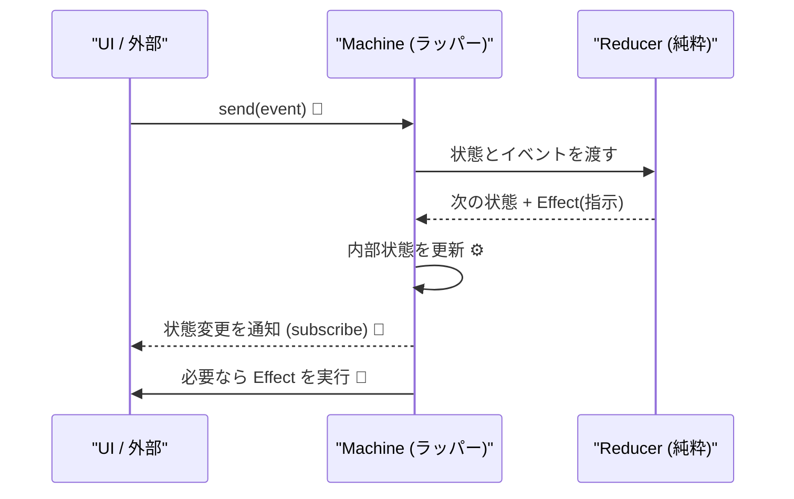

# 第24章：実装② Machine API（send方式）にする📮

この章は「Reducerは書けるようになったけど、使う側がまだ面倒…」を解決する回だよ〜！☺️
**send(event) だけで状態が進む**、使いやすい“機械っぽいAPI”を作ろう🧠⚙️

---

## 1) まずゴール確認🎯「使う側」を超ラクにする


Reducer直呼びだと、使う側がこうなりがち👇😵‍💫

* 現在stateをどこかに保持しないといけない
* 遷移したらUI更新しないといけない
* 副作用（APIとか）を呼び忘れる／二重に呼ぶ
* ログ取りたいけど散らかる

そこで **Machine API** にして👇に統一するよ✨

* `machine.send(event)`：イベントを投げるだけ📮
* `machine.getState()`：いまの状態を見る👀
* `machine.subscribe(listener)`：状態変化を購読できる📡
* （できれば）Effectもついでに回せる🎛️




---

## 2) 今回の設計ルール（超だいじ）🛡️✨

ここだけ守ればかなり安全になるよ😊

* ✅ **Reducerは純粋**：I/O禁止（fetch / localStorage / setTimeout しない）🙅‍♀️
* ✅ **副作用はEffectとして“指示書”を返す**（例：`{type:'submitForm', ...}`）📄
* ✅ **Machineは薄いラッパー**：状態保持・通知・Effect実行の“交通整理係”🚦
* ✅ **sendは唯一の入口**：状態を書き換える手段を1つにする🔒

---

## 3) まずは型を用意しよ🧩（小さめフォーム例📨）


題材：フォーム送信（editing → submitting → success / error）😊

```ts
// types.ts
export type Context = {
  name: string;
  email: string;
};

export type State =
  | { tag: "editing"; ctx: Context }
  | { tag: "submitting"; ctx: Context; requestId: string }
  | { tag: "success"; ctx: Context }
  | { tag: "error"; ctx: Context; message: string };

export type Event =
  | { type: "EDIT"; field: "name" | "email"; value: string }
  | { type: "SUBMIT" }
  | { type: "SUBMIT_SUCCESS" }
  | { type: "SUBMIT_FAILURE"; message: string }
  | { type: "RESET" };

// 副作用の“指示書”
export type Effect =
  | { type: "toast"; message: string }
  | { type: "submitForm"; requestId: string; payload: Context };
```

---

## 4) Reducer（状態遷移の中心）を書く🍰


send方式でも、中心は変わらず **(state, event) → {state, effects}** だよ✨

```ts
// reducer.ts
import { Context, Effect, Event, State } from "./types";

const isValidEmail = (email: string) => email.includes("@");

export type ReduceResult = { state: State; effects: Effect[] };

export function reducer(state: State, event: Event): ReduceResult {
  switch (state.tag) {
    case "editing": {
      if (event.type === "EDIT") {
        return {
          state: {
            tag: "editing",
            ctx: { ...state.ctx, [event.field]: event.value } as Context,
          },
          effects: [],
        };
      }

      if (event.type === "SUBMIT") {
        const { name, email } = state.ctx;
        if (!name.trim()) {
          return { state, effects: [{ type: "toast", message: "名前が空だよ〜😭" }] };
        }
        if (!isValidEmail(email)) {
          return { state, effects: [{ type: "toast", message: "メールがそれっぽくないよ〜📧💦" }] };
        }

        const requestId = crypto.randomUUID();
        return {
          state: { tag: "submitting", ctx: state.ctx, requestId },
          effects: [{ type: "submitForm", requestId, payload: state.ctx }],
        };
      }

      return { state, effects: [] };
    }

    case "submitting": {
      if (event.type === "SUBMIT_SUCCESS") {
        return { state: { tag: "success", ctx: state.ctx }, effects: [] };
      }
      if (event.type === "SUBMIT_FAILURE") {
        return { state: { tag: "error", ctx: state.ctx, message: event.message }, effects: [] };
      }
      return { state, effects: [] };
    }

    case "success": {
      if (event.type === "RESET") {
        return { state: { tag: "editing", ctx: state.ctx }, effects: [] };
      }
      return { state, effects: [] };
    }

    case "error": {
      if (event.type === "RESET") {
        return { state: { tag: "editing", ctx: state.ctx }, effects: [] };
      }
      return { state, effects: [] };
    }
  }
}
```

---

## 5) ここが本題！Machine API（send方式）を作る📮⚙️

ポイントは3つ💡

1. 状態を内部に持つ
2. sendでReducerを回して状態更新→購読者へ通知
3. effectsを返す（or 自動実行する）

## 5-A) まずは「effectsを返すだけ」版（超わかりやすい）😊


```ts
// machine.ts
export type Reducer<S, E, Eff> = (state: S, event: E) => { state: S; effects: Eff[] };

export function createMachine<S, E, Eff>(opts: {
  initial: S;
  reducer: Reducer<S, E, Eff>;
}) {
  let current = opts.initial;
  const listeners = new Set<(s: S) => void>();

  const getState = () => current;

  const subscribe = (fn: (s: S) => void) => {
    listeners.add(fn);
    fn(current); // 最初に1回流すとUIが楽だよ✨
    return () => listeners.delete(fn);
  };

  const send = (event: E) => {
    const result = opts.reducer(current, event);
    current = result.state;
    for (const l of listeners) l(current);
    return result; // effectsは呼び出し側が回す
  };

  return { getState, subscribe, send };
}
```

## 使う側イメージ（effectsを手動で回す）🎛️

```ts
// usage-basic.ts
import { createMachine } from "./machine";
import { reducer } from "./reducer";
import { Effect, Event, State } from "./types";

const initial: State = { tag: "editing", ctx: { name: "", email: "" } };

const machine = createMachine<State, Event, Effect>({ initial, reducer });

machine.subscribe((s) => console.log("STATE:", s.tag, s));

function runEffect(effect: Effect) {
  if (effect.type === "toast") {
    console.log("TOAST:", effect.message);
  }
  if (effect.type === "submitForm") {
    console.log("SUBMIT:", effect.requestId, effect.payload);
    // ここではまだ送信しない（次で自動化するよ✨）
  }
}

const r1 = machine.send({ type: "EDIT", field: "name", value: "こみやんま" });
r1.effects.forEach(runEffect);

const r2 = machine.send({ type: "EDIT", field: "email", value: "test@example.com" });
r2.effects.forEach(runEffect);

const r3 = machine.send({ type: "SUBMIT" });
r3.effects.forEach(runEffect);
```

---

## 6) さらに便利！「EffectもMachineが自動で回す」版🚀✨


“使う側がeffects回し忘れる問題”を根絶できるよ🧯

```ts
// machine-with-effects.ts
export type Reducer<S, E, Eff> = (state: S, event: E) => { state: S; effects: Eff[] };
export type RunEffect<Eff, E> = (effect: Eff, send: (event: E) => void) => void | Promise<void>;

export function createMachine<S, E, Eff>(opts: {
  initial: S;
  reducer: Reducer<S, E, Eff>;
  runEffect?: RunEffect<Eff, E>;
}) {
  let current = opts.initial;
  const listeners = new Set<(s: S) => void>();

  const getState = () => current;

  const subscribe = (fn: (s: S) => void) => {
    listeners.add(fn);
    fn(current);
    return () => listeners.delete(fn);
  };

  const notify = () => {
    for (const l of listeners) l(current);
  };

  const send = (event: E) => {
    const result = opts.reducer(current, event);
    current = result.state;
    notify();

    // ✅ ここでEffectを自動実行
    if (opts.runEffect) {
      for (const eff of result.effects) {
        void opts.runEffect(eff, send);
      }
    }

    return result;
  };

  return { getState, subscribe, send };
}
```

---

## 7) Effect実装例：fetchで送信して、結果をsendで戻す📨➡️📮


キャンセルやタイムアウトは次章で本格的にやるけど、ここでは雰囲気だけ先取り☺️
`AbortController` はWeb標準で、fetch等の中断に使えるよ🧯📡 ([MDN Web Docs][1])

```ts
// runEffect.ts
import { Effect, Event } from "./types";

export const runEffect = async (effect: Effect, send: (e: Event) => void) => {
  if (effect.type === "toast") {
    // UIならtoastライブラリに置き換えてOK✨
    console.log("TOAST:", effect.message);
    return;
  }

  if (effect.type === "submitForm") {
    const controller = new AbortController();

    try {
      const res = await fetch("/api/submit", {
        method: "POST",
        headers: { "Content-Type": "application/json" },
        body: JSON.stringify(effect.payload),
        signal: controller.signal,
      });

      if (!res.ok) {
        send({ type: "SUBMIT_FAILURE", message: `送信失敗…(${res.status})` });
        return;
      }

      send({ type: "SUBMIT_SUCCESS" });
    } catch (e: any) {
      if (e?.name === "AbortError") {
        send({ type: "SUBMIT_FAILURE", message: "キャンセルされたよ🧯" });
        return;
      }
      send({ type: "SUBMIT_FAILURE", message: "通信エラーだよ〜😭" });
    }
  }
};
```

## Machineに接続するとこうなる（使う側が激薄になる😍）

```ts
// usage-auto.ts
import { createMachine } from "./machine-with-effects";
import { reducer } from "./reducer";
import { runEffect } from "./runEffect";
import { Effect, Event, State } from "./types";

const initial: State = { tag: "editing", ctx: { name: "", email: "" } };

const machine = createMachine<State, Event, Effect>({
  initial,
  reducer,
  runEffect,
});

machine.subscribe((s) => console.log("STATE:", s.tag));

machine.send({ type: "EDIT", field: "name", value: "こみやんま" });
machine.send({ type: "EDIT", field: "email", value: "test@example.com" });
machine.send({ type: "SUBMIT" }); // ✅ effectsを回し忘れない✨
```

---

## 8) 「send方式」にしたときの気持ちいいポイント💖

* UIは **イベント投げるだけ** → バグりにくい😍
* 仕様追加も **event増やす→reducerに足す** の一本道🛣️
* ログ・分析・テストがやりやすい（入口がsendしかない）🔍
* XStateみたいなライブラリも基本がこのノリだよ（send中心）📮 ([GitHub][2])

---

## 9) ハマりどころ（先に潰そ🧯😆）

* ❌ Effectの中で直接state触っちゃう
  → ✅ **結果は必ずイベントで返してsend**（成功/失敗をイベント化）
* ❌ sendの中でまたsendしまくって無限ループ
  → ✅ Effectは“非同期で返す”のが安全（`void runEffect(...)`）
* ❌ 「同じSUBMITを連打」問題
  → ✅ 次章で、キャンセル・二重送信防止・requestId管理をやるよ⏳🧯

---

## 10) ミニ課題（手を動かすと一気に身につく✨）🎓

## 課題A：onTransitionフックを足す🔍

* `send`の中で、`prevState` と `nextState` をログしたい
* 例：`opts.onTransition?.(prev, event, next)` みたいにする

## 課題B：Effectに「遷移ログ」を追加📝

* 遷移するたび `{type:'log', message:'editing -> submitting'}` をeffectsに積む
* runEffectでconsole出す（本番はログ基盤に送る想定✨）

## 課題C：successになったら自動でRESET（3秒後）⏲️

* Effectに `{type:'delay', ms:3000, event:{type:'RESET'}}` みたいなのを作ってみてね😊

---

## 11) AIに頼ると爆速になるプロンプト例🤖✨

* 「createMachineに onTransition と subscribe を追加して。初心者にも読みやすいコードで」
* 「Effectの型を増やしたい。toast / submitForm / delay を判別可能ユニオンで提案して」
* 「このsend方式の使いづらい点を指摘して、改善案を3つ出して」
* 「Reducerが純粋になってるかレビューして。I/O混入してたら指摘して」

---

## 12) まとめ✅（この章の持ち帰り）

* Reducer（純粋）＋ Machine（薄いラッパー）で、**send(event) だけの世界**が作れる📮✨
* 副作用はEffectとして外へ出して、**結果はイベントで戻す**のがキレイ🧼
* 使う側が薄くなるほど、バグも減ってテストもラクになるよ〜☺️💖

---

## 最新情報メモ🗞️✨（本日時点の“いま”）

* TypeScriptは **npm上の最新が 5.9.3（2025-09-30公開）** と案内されているよ📦 ([Npm][3])
* Microsoft公式の進捗では **TypeScript 6.0は“橋渡し”で、既存JS実装の最終リリースになる**予定だよ🧠 ([Microsoft for Developers][4])
* Node.jsは **v24がActive LTS、v22がMaintenance LTS** など、複数LTSラインが運用されてるよ（最新セキュリティリリースも継続）🛡️ ([Node.js][5])

---

次の第25章では、このsend方式に **Loading / Timeout / Cancel** をガッツリ足して「現実のアプリっぽい非同期」を完成させるよ⏳🧯💪

[1]: https://developer.mozilla.org/en-US/docs/Web/API/AbortController?utm_source=chatgpt.com "AbortController - Web APIs - MDN Web Docs"
[2]: https://github.com/statelyai/xstate?utm_source=chatgpt.com "statelyai/xstate: Actor-based state management & ..."
[3]: https://www.npmjs.com/package/typescript?utm_source=chatgpt.com "TypeScript"
[4]: https://devblogs.microsoft.com/typescript/progress-on-typescript-7-december-2025/?utm_source=chatgpt.com "Progress on TypeScript 7 - December 2025"
[5]: https://nodejs.org/en/about/previous-releases?utm_source=chatgpt.com "Node.js Releases"
