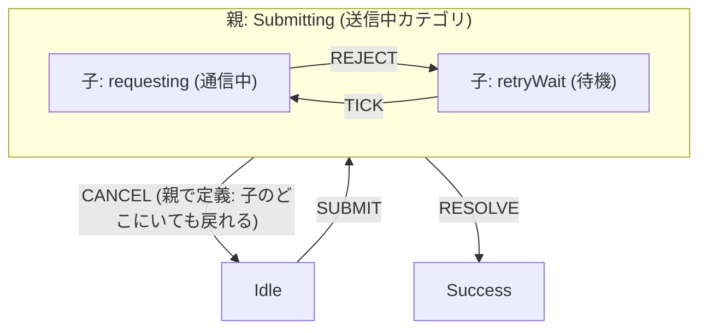

# 第26章：階層状態（親/子）で整理する🏢

（状態が増えてきた人の “片づけ術” だよ〜🧹💕

---

## 0. この章でできるようになること🎯

* 状態が増えても「見通し」を失わない整理ができる👀✨
* 「親状態（親）→ 子状態（子）」で、共通ルールをまとめられる📦
* **設計（遷移表/図）→ 実装（TypeScript）** までつなげられる🧑‍💻💖

---

## 1. なんで “親/子” が必要なの？😵‍💫➡️😌


第25章の「非同期（Loading/Timeout/Cancel）」を入れると、だいたいこうなるよね👇

* loading
* timeout
* retrying
* canceling
* …and more…（増える増える😇）

ここで **階層（親/子）** を使うと、状態を “建物と部屋” みたいに整理できる🏢🚪
親状態の中に子状態を入れて、「共通のイベント処理」を親に寄せるのがコツ✨

XStateなどの statecharts 系では、**子状態は親状態がアクティブなときだけ有効**で、親状態は **compound state（複合状態）** とも呼ばれるよ〜📚✨ ([Stately][1])
この “階層化” は statecharts の中核アイデアのひとつで、複雑さ（状態爆発）を抑えるために導入された考え方だよ🧠🔥 ([Modern Embedded Software | Quantum Leaps][2])

---

## 2. まずは超ざっくりイメージ🧸✨

## ✅ 平面（フラット）だと…

「送信中」まわりの状態が横に増える📈😇

## ✅ 階層（親/子）にすると…

「送信中（親）」の中に「通信中/待機/キャンセル中（子）」を入れて、まとまりができる🏢✨

---

## 3. 親/子にすると何が嬉しいの？🎁✨（メリット3つ）


## ① “共通イベント” を親にまとめられる📦




たとえば「CANCEL」「RESET」「LOG」みたいなやつ。
子が増えても、親に書けばOKになりやすい🙆‍♀️✨

## ② “同じ画面/同じ気持ち” の状態をグルーピングできる🪄

ユーザーから見たら全部「送信中」なら、親を Submitting にしてまとめるのが自然👍

## ③ 仕様レビューが楽になる🧾✨

遷移表や図で「送信中の中だけの話」として見られるので、抜け漏れに気づきやすい🔍

---

## 4. 親/子の設計手順（迷わない型）🧭✨

ここからは “やり方テンプレ” を渡すね🫶

## Step A：増えすぎゾーンを見つける👀

だいたい「非同期」「リトライ」「エラー」付近が肥大化する🍖

## Step B：親状態に “看板” をつける🏷️


親は「ユーザー視点の大カテゴリ」がおすすめ💡
例：Submitting / Authenticating / Purchasing

## Step C：子状態は “親の中の段階” にする🧩

例：Submitting の中に…

* requesting（通信中）
* retryWait（少し待つ）
* canceling（キャンセル処理中）

## Step D：共通イベントを親へ引っ越し🚚

* CANCEL は Submitting 全体で共通
* RESET も共通
* “戻る” も共通
  みたいなやつは親に置くとスッキリ✨

## Step E：入口（initial）と出口（完了）を決める🚪✨

「親に入ったら、最初どの子から始まる？」を決めるの大事！
（迷ったら requesting が多い🥰）

---

## 5. 例：フォーム送信を “親: Submitting” で整理する📨✨


## 5-1. 設計（まず言葉で）📝

* 親：Submitting（送信中）

  * 子：requesting（API実行中）
  * 子：retryWait（バックオフ待ち）
  * 子：canceling（キャンセル中）
* Submitting（親）では CANCEL を常に受け付ける
* 成功したら Success、失敗したら Error へ

こういう “親が共通ルール、子が段階” の形がいちばん使いやすいよ〜😊

---

## 6. TypeScript実装（XState v5例）🧑‍💻✨

XState v5 は actors を中心にしたメジャーバージョンとしてリリースされてるよ📌 ([Stately][3])
（ここでは階層の書き方に集中するね！）

```ts
import { setup, createActor } from "xstate";

type Ctx = {
  error?: string;
  retryCount: number;
};

type Ev =
  | { type: "SUBMIT" }
  | { type: "RESOLVE" }
  | { type: "REJECT"; message: string }
  | { type: "TIMEOUT" }
  | { type: "CANCEL" }
  | { type: "RETRY_TICK" }
  | { type: "RESET" };

const machine = setup({
  types: {} as {
    context: Ctx;
    events: Ev;
  },
}).createMachine({
  id: "form",
  initial: "editing",
  context: { retryCount: 0 },

  states: {
    editing: {
      on: {
        SUBMIT: "submitting",
      },
    },

    // ★ 親状態（compound state）
    submitting: {
      initial: "requesting",

      // ★ 親に共通イベントを書ける（子が増えてもここは1箇所）
      on: {
        CANCEL: "editing",
        RESET: "editing",
      },

      states: {
        requesting: {
          on: {
            RESOLVE: "#form.success",
            REJECT: {
              target: "retryWait",
              actions: ({ context, event }) => {
                context.error = event.message;
                context.retryCount += 1;
              },
            },
            TIMEOUT: "retryWait",
          },
        },

        retryWait: {
          on: {
            RETRY_TICK: "requesting",
          },
        },

        canceling: {
          // 例：キャンセル処理が必要なら子に置ける
          on: {
            RESOLVE: "#form.editing",
          },
        },
      },
    },

    success: {
      on: {
        RESET: "editing",
      },
    },

    error: {
      on: {
        RESET: "editing",
      },
    },
  },
});

const actor = createActor(machine).start();

// 例：送信開始
actor.send({ type: "SUBMIT" });
```

## ここでのポイント3つ💡✨

1. `submitting` が親で、`states: { requesting, retryWait... }` が子だよ🏢🚪
2. 親の `on: { CANCEL, RESET }` は “子全部に効く共通ルール” になりやすい📦
3. `#form.success` みたいに **id参照** すると、階層が深くても目的地がブレにくい🎯

あと、XState v5 は TypeScript 5.0 以上が必要って明記されてるよ📌 ([Stately][4])

---

## 7. ありがち落とし穴あるある😇🧯

## 落とし穴①：親が “ただのフォルダ” になってる📁


親に「共通イベント」「共通ガード」「共通アクション」がないなら、階層のうまみ薄め🥲
→ “親は共通ルール置き場” にする意識が大事✨

## 落とし穴②：深掘りしすぎて迷子🕳️😵


階層が 3〜4段を超えると、読むのがしんどくなりがち。
→ まずは **2段（親→子）** で十分強い💪💖

## 落とし穴③：UI都合と業務都合が混ざる🎛️🍛

「Submitting（業務）」の中に「Toast表示中（UI）」を入れるとカオスになりやすい😇
→ UIは別マシン or 別actor に逃がすのが綺麗（第27章の並行にもつながる！）

---

## 8. ミニ課題（手を動かすやつ）🧪✨

## 課題A：状態の “親候補” を見つけよう🔍

次の状態リストを、親/子で整理してみてね👇

* requesting / timeout / retryWait / canceling / success / error / editing

✅ 目標：

* 親：submitting

  * 子：requesting / retryWait / canceling
    みたいな形にできたら勝ち🏆💖

---

## 9. AI活用（超使えるプロンプト集）🤖✨


そのままコピペでOKだよ〜🫶

## ① 親/子の切り分け案を出してもらう

「この状態一覧を、ユーザー視点の親状態（2〜4個）と子状態に整理して。理由も短く。」

## ② 親に置く共通イベント候補を洗い出す

「この状態機械で、複数状態に重複して現れそうなイベント処理（例: cancel/reset）を列挙して、親に寄せる案にして。」

## ③ “階層化したせいで漏れた遷移” をチェック

「階層化後の遷移で、到達不能な状態・戻れない状態がないかレビューして。抜けがあれば遷移案を追加して。」

---

## 10. まとめ🎀✨

* 状態が増えてきたら、まず **“親（大カテゴリ）”** を立てる🏢
* 子は “親の中の段階” にする🚪
* 親は “共通イベント置き場” にすると強い📦
* 階層化は statecharts の王道テクで、複雑さを抑えるための中心アイデアだよ🧠✨ ([Modern Embedded Software | Quantum Leaps][2])
* 標準化された記法（SCXML）でも、階層（substates）みたいな高度な表現を扱える流れがあるよ📚 ([w3.org][5])

---

次の第27章（並行状態🧵🧵）は、
「同時に進むものを無理に1本化しない」って話で、階層とセットで最強になるよ〜💪💖

[1]: https://stately.ai/docs/parent-states?utm_source=chatgpt.com "Parent states"
[2]: https://www.state-machine.com/doc/Harel87.pdf?utm_source=chatgpt.com "Statecharts: A Visual Formalism for Complex Systems"
[3]: https://stately.ai/blog/2023-12-01-xstate-v5?utm_source=chatgpt.com "XState v5 is here"
[4]: https://stately.ai/docs/states?utm_source=chatgpt.com "State Machines"
[5]: https://www.w3.org/TR/scxml/?utm_source=chatgpt.com "State Chart XML (SCXML): State Machine Notation for ..."
