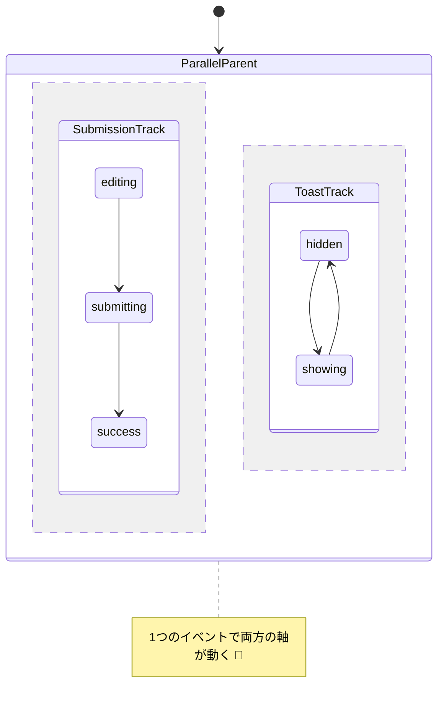

# 第27章：並行状態（Parallel）で同時進行を扱う🧵🧵
（フォーム送信 × トースト表示を“並行”で作ってみるよ〜！💖）

---

# 1) 並行状態（Parallel）ってなに？🤔🧵


**並行状態**は、1つの親状態の中に「複数の領域（リージョン）」があって、**全部が同時にアクティブ**になる状態のことだよ✨
しかも、親が並行状態のときは **イベントが各リージョンに同時に届く**（＝各リージョンがそれぞれ反応できる）というのが大きな特徴！📣✨ ([Stately][1])

イメージはこんな感じ👇

* 「送信の状態」🛰️（idle / submitting / success / error）
* 「トースト表示の状態」🍞（hidden / showing）
  この2つが、**同時に走る**のが並行状態🧵🧵




そして、並行状態の “いまの状態” は、だいたい **オブジェクト（辞書）で表現**されるよ（例：`{ track: 'paused', volume: 'normal' }` みたいに）✨ ([Stately][1])

---

## 2) 何がうれしいの？🎁✨（if地獄を回避😵‍💫）


並行にしたいのに、1本の状態に押し込むと…👇

* 「送信中 & トースト表示中」
* 「送信成功 & トースト非表示」
  みたいに **組み合わせが増えすぎる**のがあるある😭💦

並行状態は、**“別々に考えられるものは別々に持つ”** から、仕様がスッキリするよ〜✨ ([Stately][1])

---

## 3) 超重要：これ、ガチのマルチスレッドじゃないよ⚠️🧠


並行状態は **「論理的に同時」**ってだけで、だいたいの実装は **順番に評価**されるよ🧘‍♀️
だから、スレッドの競合とかロック地獄を持ち込まずに「同時っぽさ」をモデリングできるのが強み✨ ([The Complete Guide to State Machines][2])

---

## 4) 使いどころ✨ / 使わないほうがいいところ🙅‍♀️

## 使いどころ🧵🧵

* **関連はあるけど独立**して進むもの
  例：フォームの「送信」と、UIの「トースト表示」 ([Stately][1])
* 「状態が増えすぎ問題」を止めたいとき🛑

## 使わないほうがいいとき🙅‍♀️

* 2つがガッチリ依存してて、ほぼ常に同時に変わる（＝分けてもメリット薄）
* “完全に別物”で連携いらない → 並行より「別マシン」でもOK（XStateなら `invoke` を使う判断もあり） ([Stately][1])

---

## 5) 設計のコツ：リージョン分割の3ステップ🪄✨

## Step 1：軸を見つける🔍


「これ、同じ状態の話？別の軸？」って考えるよ🧠

* 送信：成功/失敗/送信中
* トースト：出てる/消えてる
  → うん、別軸！並行にできそう🧵🧵✨

## Step 2：リージョンごとに “小さな状態機械” を作る🧩

それぞれが独立して読めるくらいが理想👍

## Step 3：連携は “イベント共有” でやる📣

リージョンAからリージョンBへ「直接ジャンプ」させるのは避けがち（依存が強くなるから）
→ 代わりに「同じイベントを両方が受けて、それぞれ動く」がキレイ✨ ([Stately][1])

---

## 6) ハンズオン題材：フォーム送信 × トースト表示📨🍞✨

## リージョンA：submission（送信）

* editing → submitting → success / error

## リージョンB：toast（トースト）

* hidden ↔ showing

## イベント案📣

* SUBMIT（送信押した）
* RESOLVE（成功した）
* REJECT（失敗した）
* TOAST_TIMEOUT（トースト消す）

ポイント：**RESOLVE / REJECT を両リージョンで処理**するよ✨


* submission：成功/失敗へ遷移
* toast：表示へ遷移🍞✨
  （イベントは並行状態の全リージョンが受け取れるイメージ！） ([Stately][1])

---

## 7) 実装A：学習用ミニ「並行マシン」TypeScript（ライブラリなし）🧪✨

考え方だけ掴む用だよ〜！（まずはここが超おすすめ💖）

```ts
type Effect =
  | { type: "log"; message: string }
  | { type: "timeout"; ms: number; event: AppEvent };

type SubmissionState = "editing" | "submitting" | "success" | "error";
type ToastState = "hidden" | "showing";

type AppState = {
  submission: SubmissionState;
  toast: ToastState;
  // ついでに表示メッセージも持たせる（Contextっぽい役）
  toastMessage: string | null;
  errorMessage: string | null;
};

type AppEvent =
  | { type: "SUBMIT" }
  | { type: "RESOLVE" }
  | { type: "REJECT"; message: string }
  | { type: "TOAST_TIMEOUT" };

type RegionResult<S> = { state: S; patch?: Partial<AppState>; effects?: Effect[] };

function submissionRegion(state: AppState, event: AppEvent): RegionResult<SubmissionState> | null {
  switch (state.submission) {
    case "editing":
      if (event.type === "SUBMIT") {
        return {
          state: "submitting",
          effects: [{ type: "log", message: "送信開始！" }],
        };
      }
      return null;

    case "submitting":
      if (event.type === "RESOLVE") return { state: "success" };
      if (event.type === "REJECT") return { state: "error", patch: { errorMessage: event.message } };
      return null;

    default:
      return null;
  }
}

function toastRegion(state: AppState, event: AppEvent): RegionResult<ToastState> | null {
  // 成功/失敗イベントを受けたらトースト出す（リージョン連携はイベントで！）
  if (event.type === "RESOLVE") {
    return {
      state: "showing",
      patch: { toastMessage: "送信できたよ〜！🎉", errorMessage: null },
      effects: [{ type: "timeout", ms: 2000, event: { type: "TOAST_TIMEOUT" } }],
    };
  }

  if (event.type === "REJECT") {
    return {
      state: "showing",
      patch: { toastMessage: `失敗…😢 ${event.message}` },
      effects: [{ type: "timeout", ms: 2500, event: { type: "TOAST_TIMEOUT" } }],
    };
  }

  if (state.toast === "showing" && event.type === "TOAST_TIMEOUT") {
    return { state: "hidden", patch: { toastMessage: null } };
  }

  return null;
}

// “並行”のキモ：同じイベントを両リージョンに流す
function step(state: AppState, event: AppEvent): { next: AppState; effects: Effect[] } {
  const effects: Effect[] = [];

  const sub = submissionRegion(state, event);
  const t = toastRegion(state, event);

  const next: AppState = {
    ...state,
    ...(sub?.patch ?? {}),
    ...(t?.patch ?? {}),
    submission: sub?.state ?? state.submission,
    toast: t?.state ?? state.toast,
  };

  if (sub?.effects) effects.push(...sub.effects);
  if (t?.effects) effects.push(...t.effects);

  return { next, effects };
}

// 初期状態
let s: AppState = {
  submission: "editing",
  toast: "hidden",
  toastMessage: null,
  errorMessage: null,
};

// 例：送信→失敗→（トースト出る）
({ next: s } = step(s, { type: "SUBMIT" }));
({ next: s } = step(s, { type: "REJECT", message: "ネットワークが不安定" }));
console.log(s);
```

ここでの学び🧠✨

* “状態は2本立て”でもOK（`submission` と `toast` を同時に持つ）
* “連携はイベントで”（REJECT を両方が処理）📣

---

## 8) 実装B：XStateの並行状態（Parallel）で書く🧵🧵✨

まず最新動向だけ一言：XStateは **v5 ドキュメントが現行**で、v4はメンテ対象外扱いだよ〜（公式側で明言）🧠 ([Stately][3])
（TypeScriptは公式DLページ上は “現在 5.9” が最新として案内されてるよ） ([typescriptlang.org][4])

## XState v5：parallel の形（超基本）

```ts
import { createMachine, createActor, assign } from "xstate";

type Ctx = {
  toastMessage: string | null;
};

type Ev =
  | { type: "SUBMIT" }
  | { type: "RESOLVE" }
  | { type: "REJECT"; message: string }
  | { type: "TOAST_TIMEOUT" };

const machine = createMachine({
  id: "form",
  type: "parallel",
  context: { toastMessage: null } as Ctx,

  states: {
    submission: {
      initial: "editing",
      states: {
        editing: {
          on: { SUBMIT: "submitting" },
        },
        submitting: {
          on: {
            RESOLVE: "success",
            REJECT: "error",
          },
        },
        success: {},
        error: {},
      },
    },

    toast: {
      initial: "hidden",
      states: {
        hidden: {
          on: {
            RESOLVE: {
              target: "showing",
              actions: assign({
                toastMessage: () => "送信できたよ〜！🎉",
              }),
            },
            REJECT: {
              target: "showing",
              actions: assign({
                toastMessage: ({ event }) => `失敗…😢 ${event.message}`,
              }),
            },
          },
        },
        showing: {
          on: {
            TOAST_TIMEOUT: {
              target: "hidden",
              actions: assign({ toastMessage: () => null }),
            },
          },
        },
      },
    },
  },
});

const actor = createActor(machine);
actor.start();

actor.send({ type: "SUBMIT" });
actor.send({ type: "REJECT", message: "ネットワークが不安定" });

console.log(actor.getSnapshot().value);   // { submission: 'error', toast: 'showing' } みたいになる
console.log(actor.getSnapshot().context); // toastMessage など
```

この書き方のポイント✨

* `type: 'parallel'` を付けるとリージョンが並行になるよ 🧵🧵 ([Stately][1])
* イベントは各リージョンに届くので、**RESOLVE / REJECT を両方で処理**できる 📣✨ ([Stately][1])
* 状態値はオブジェクトになる（`{ submission: ..., toast: ... }`） ([Stately][1])

---

## 9) 「全部終わったら次へ」もできるよ✅（onDone）🏁

並行状態の各リージョンが **final** になったら、親の `onDone` が動くよ〜✨ ([Stately][1])
（例：初期化で “DB準備” と “設定ロード” を同時進行して、両方終わったら Ready へ！みたいなやつ🧵🧵）

---

## 10) よくある落とし穴😵‍💫💥（ここ超大事）

1. **リージョン間を直接遷移させたくなる問題**
   
   → 依存が強くなって壊れやすい🥲
   → “同じイベントを両方で処理”に寄せるのがおすすめ✨ ([Stately][1])

2. **並行＝マルチスレッドだと思い込む**
   → だいたいは順番に評価される「論理並行」だよ🧘‍♀️ ([The Complete Guide to State Machines][2])

3. **イベントが多すぎてカオス**
   → イベント名を「誰のためのイベント？」で整理しよう（ユーザー操作/システム結果/タイマー）📣

---

## 11) ミニ課題🎓✨（手を動かすと一気に理解できるよ！）

課題A：リージョンをもう1本増やす🧵

* `network: online | offline` を追加
* offline のとき SUBMIT したら、submission は submitting に行かず error にする（ガードっぽく）🛡️

課題B：トーストに “種類” を付ける🍞

* success / error で絵文字を変える（🎉 / 🚨）✨

---

## 12) AI活用プロンプト集🤖✨（そのままコピペOK）

* 「この仕様、並行に分けるなら “軸” は何？リージョン案を3つ出して🥺🧵」
* 「RESOLVE/REJECT を受けたとき、各リージョンがやるべきことを表にして📋✨」
* 「リージョン間の依存が強すぎないかレビューして。依存を減らすイベント設計も提案して🙏」 ([Stately][1])
* 「TypeScriptで、リージョンごとの reducer を使った並行マシンの最小実装を作って（テストしやすく）🧪」

---

## まとめ✅✨（チェックリスト付き）

* 並行状態＝**複数リージョンが同時にアクティブ** 🧵🧵 ([Stately][1])
* イベントは各リージョンに届くので、**同じイベントで連携**できる📣✨ ([Stately][1])
* “同時”は **論理的**（たいてい順番評価）🧘‍♀️ ([The Complete Guide to State Machines][2])
* コツは「別軸は別リージョン」「連携はイベント」「直接遷移は避けがち」✨ ([Stately][1])

---

次の章（第28章）は「エラーを状態にする」🚨で、さらに実務っぽく強くなるよ〜！💪💖

[1]: https://stately.ai/docs/parallel-states "Parallel states"
[2]: https://statecharts.online/chapters/05-orthogonal-states.html "Orthogonal States in Statecharts – Modeling Parallel Behavior and Concurrency"
[3]: https://stately.ai/docs/xstate-v4/states/parallel-states?utm_source=chatgpt.com "Parallel states"
[4]: https://www.typescriptlang.org/download/?utm_source=chatgpt.com "How to set up TypeScript"
