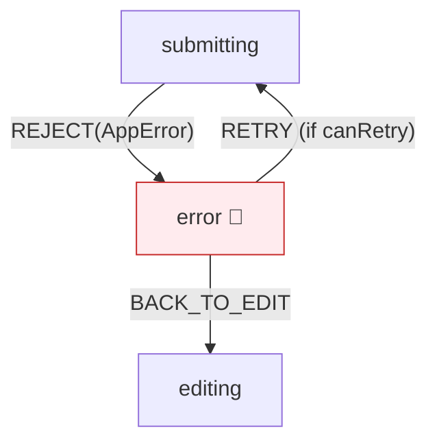

# 第28章：エラーを状態にする（Error state）🚨

この章は「失敗しても次の一手が迷子にならない」状態機械を作る回だよ〜！💪😊
エラーを **「例外」や「フラグ」じゃなくて「状態」** として扱えるようになると、UIも実装もテストも一気にラクになるよ🌈✨

---

## 1) まず結論：エラーは「状態」にすると強い💥

### ❌ よくあるつらい形


* `try/catch` があちこちに散らばる😵‍💫
* `errorMessage` と `isLoading` と `isSuccess` と…フラグ増殖🌱
* 「いまユーザーは何ができる？」がコードから読めない📉

### ✅ 状態にすると何がうれしい？

* **エラー中にできる操作が明確**（戻る？再試行？編集？）🧭
* **表示（UI）が安定**（この状態ならこの表示）🪄
* **テストが簡単**（イベント→次状態が決まる）🧪
* **ログ設計もしやすい**（どの状態で何が起きたか追える）🔍

---

## 2) エラー状態設計の「3点セット」🎁✨


エラー状態を作るときは、最低この3つをセットで考えると迷子にならないよ😊

1. **失敗理由（原因カテゴリ）**：何が起きた？🧩
2. **ユーザー表示**：何て見せる？（見せないものは？）🗣️
3. **次にできる操作**：どう復旧する？（戻る/再試行/問い合わせ等）🧯

---

## 3) 「ユーザーに見せる」vs「ログだけ」仕分けルール👀📝


ここ、めっちゃ大事！💡
“全部ユーザーに見せる” は逆に不親切＆危ないこともあるよ⚠️

### ✅ ユーザー表示してOKな例

* 入力ミス（バリデーション）✍️
* 権限不足・ログイン切れ（対応が明確）🔐
* 回線不調（再試行が自然）📶

### 🕵️ ログだけに寄せたい例

* 例外スタックや内部エラーの詳細（開発者向け）🧑‍💻
* 想定外のレスポンス形式（パース失敗など）🧩
* サーバー内部の事情（DBとか）🗄️

ユーザー向けは基本 **短く・次の行動がわかる** 文面が勝ち🏆😊

---

## 4) エラー分類（まずはこの4種類でOK）🧺✨


初心者が破綻しにくい、超実用の分類だよ〜🌸

1. **入力エラー（Validation）**：ユーザーが直せる✍️
2. **通信・一時エラー（Network/Temporary）**：待てば直るかも📶⏳
3. **権限・契約エラー（Auth/Forbidden/Conflict）**：行動が決まる🔐
4. **想定外（Unexpected）**：調査が必要（でもUIは壊さない）🧯

---

## 5) 型で「エラーの形」を揃える（ここが気持ちいい✨）🧩🪄

### 5-1. エラー種別とエラー本体の型🧠

```typescript
type ErrorKind =
  | "validation"
  | "network"
  | "timeout"
  | "unauthorized"
  | "forbidden"
  | "conflict"
  | "rateLimit"
  | "server"
  | "unexpected";

type AppError = {
  kind: ErrorKind;

  // ユーザー向け（安全で短い）
  userMessage: string;

  // 開発者向け（ログ用）
  debug?: {
    message?: string;
    stack?: string;
    status?: number;
    endpoint?: string;
    requestId?: string;
  };

  // 復旧方針
  canRetry: boolean;

  // UIの都合（あれば便利）
  fieldErrors?: Record<string, string>; // validation用
};
```

**ポイント**

* `userMessage` と `debug` を分離しておくと、表示が事故らない😊
* `canRetry` があると「次にできる操作」がUIで自動化できるよ🔁✨

---

## 6) 状態機械に「Error state」を入れる設計🧭🚦

### 6-1. 例：フォーム送信（テーマに沿ったやつ📨）


状態はこんな感じでOK！

* `editing` ✍️
* `submitting` ⏳
* `success` 🎉
* `error` 🚨 ← これをちゃんと作る！

```text
editing --SUBMIT--> submitting
submitting --RESOLVE--> success
submitting --REJECT--> error
error --EDIT--> editing
error --RETRY--> submitting
```



### 6-2. Error state が持つべき情報🧳

最低これでOK！

* `error: AppError`（何が起きた？）🚨
* `lastAction?: "submit" | ...`（どこで失敗？）🧭
* `attempt: number`（何回目？）🔁

---

## 7) 実装例：Reducer方式（状態機械の中心をキレイに保つ🍰）✨

### 7-1. State と Event を作る

```typescript
type State =
  | { tag: "editing"; form: { email: string; message: string } }
  | { tag: "submitting"; form: { email: string; message: string }; attempt: number }
  | { tag: "success" }
  | { tag: "error"; form: { email: string; message: string }; error: AppError; attempt: number };

type Event =
  | { type: "EDIT"; patch: Partial<{ email: string; message: string }> }
  | { type: "SUBMIT" }
  | { type: "RESOLVE" }
  | { type: "REJECT"; error: AppError }
  | { type: "RETRY" }
  | { type: "BACK_TO_EDIT" };
```

### 7-2. Reducer（純粋に：state + event → next）🧪

```typescript
function reducer(state: State, event: Event): State {
  switch (state.tag) {
    case "editing": {
      if (event.type === "EDIT") {
        return { ...state, form: { ...state.form, ...event.patch } };
      }
      if (event.type === "SUBMIT") {
        return { tag: "submitting", form: state.form, attempt: 1 };
      }
      return state;
    }

    case "submitting": {
      if (event.type === "RESOLVE") return { tag: "success" };
      if (event.type === "REJECT") {
        return { tag: "error", form: state.form, error: event.error, attempt: state.attempt };
      }
      return state;
    }

    case "error": {
      if (event.type === "BACK_TO_EDIT") return { tag: "editing", form: state.form };
      if (event.type === "RETRY" && state.error.canRetry) {
        return { tag: "submitting", form: state.form, attempt: state.attempt + 1 };
      }
      if (event.type === "EDIT") {
        // エラー中でも編集したいなら editing に戻してOK（設計で決めてね😊）
        return { tag: "editing", form: { ...state.form, ...event.patch } };
      }
      return state;
    }

    case "success":
      return state;
  }
}
```

**ここが大事〜！**

* `error` のときに `RETRY` できるかどうかは **state.error.canRetry** で判断✨
* 「エラー中に編集できる？」は設計判断。どっちでもOK！👍

---

## 8) 通信エラーの扱い：fetch の落とし穴に注意⚠️🌊


`fetch()` は **HTTP 404/500 みたいなエラーでも Promise が reject されない** ことがあるよ！
（ネットワークレベルで失敗したときに主に reject）なので、`response.ok` を確認して自分でエラー化するのが基本🧠✨ ([MDNウェブドキュメント][1])

### 8-1. “エラーをAppErrorに変換する”関数を作る🧰

```typescript
async function postForm(form: { email: string; message: string }): Promise<void> {
  const res = await fetch("/api/contact", {
    method: "POST",
    headers: { "content-type": "application/json" },
    body: JSON.stringify(form),
  });

  if (!res.ok) {
    const status = res.status;

    // 例：ステータス別に分類（必要な分だけでOK😊）
    if (status === 401) throw toAppError("unauthorized", "ログインが必要みたい…🥲", { status });
    if (status === 403) throw toAppError("forbidden", "権限が足りないみたい…🥲", { status });
    if (status === 409) throw toAppError("conflict", "操作が競合したよ…もう一回やってみて！🔁", { status });
    if (status === 429) throw toAppError("rateLimit", "アクセスが集中してるみたい…少し待ってね⏳", { status });

    if (status >= 500) throw toAppError("server", "サーバー側で失敗したみたい…🥲", { status });

    throw toAppError("unexpected", "送信できなかったよ…内容を確認してね🙏", { status });
  }
}

function toAppError(kind: ErrorKind, userMessage: string, debug?: AppError["debug"]): AppError {
  return {
    kind,
    userMessage,
    debug,
    canRetry: kind === "network" || kind === "timeout" || kind === "rateLimit" || kind === "server",
  };
}
```

**ポイント**

* “HTTPエラーを自分で throw” が超基本！🧠✨ ([MDNウェブドキュメント][1])
* `canRetry` をここで決めると、UIが勝手に賢くなるよ🔁😊

---

## 9) （参考）XState v5 の “onError” でエラー状態に遷移する🧵✨

もしライブラリ型で作るなら、Promise を invoke して **reject → onError** に乗せるのが定番だよ〜！ ([stately.ai][2])

* Promise が `resolve()` → `onDone`
* Promise が `reject()` / throw → `onError` ([stately.ai][2])

（この章は「考え方」が主役だから、使う/使わないは好みでOKだよ😊）

---

## 10) UI設計：Error state の表示ルールを決めよう🖼️✨

Error state になったら、UIは「迷わせない」のが正解💮

### 10-1. ありがちな表示パターン🎨


* `validation`：入力欄の近くに赤文字（fieldErrors）✍️🔴
* `network/timeout`：画面上にバナー＋「再試行」ボタン📶🔁
* `unauthorized`：ログイン導線へ🔐➡️
* `unexpected`：短い謝罪＋問い合わせ導線（詳細はログへ）🙏

### 10-2. “ボタンをどうする？”のおすすめ

* エラー中：

  * `戻る`（編集へ）✅
  * `再試行`（canRetry のときだけ）✅
  * `送信`（二重送信になりそうなら隠す/無効化）🚫

---

## 11) テスト観点：エラーを状態にすると爆速になる🧪⚡

最低この4つをテストすればかなり強いよ😊

1. `editing + SUBMIT → submitting`
2. `submitting + REJECT(error) → error`（error内容が入る）
3. `error(canRetry=true) + RETRY → submitting`
4. `error + BACK_TO_EDIT → editing`

「エラー文言」より **状態遷移と canRetry** を中心に見ると、壊れにくいよ🧠✨

---

## 12) よくある事故（先に潰そ〜！）😱🧯

* **エラーを文字列だけで持つ** → 種別が分からずUIが迷子
  ✅ `AppError` にして `kind / canRetry` を持つ
* **全部 catch で握りつぶす** → 失敗したのに成功っぽく見える
  ✅ 失敗したらちゃんと `REJECT`（errorイベント）へ
* **HTTPエラーを “成功” 扱いしてしまう**
  ✅ `fetch` は `response.ok` を必ずチェック！ ([MDNウェブドキュメント][1])

---

## 13) AIに手伝ってもらうプロンプト集🤖✨

コピペで使えるやつ置いとくね〜😊🌸

* 「このAPIの失敗を `validation/network/auth/server/unexpected` に分類して、`AppError` 型で設計して」
* 「ユーザーに見せる文言と、ログに残す debug 情報を分離して提案して」
* 「`canRetry` を true にすべきケース/false にすべきケースを具体例つきで」
* 「状態遷移（error を含む）の表駆動テストケースを作って」🧪

---

## 14) まとめ（この章で完成してると強い条件✅）🎉

* `error` が「状態」として存在してる🚨
* `AppError` で **分類(kind) / 表示(userMessage) / 復旧(canRetry)** が揃ってる🎁
* `error` から **戻る/再試行** の導線が設計済み🧭🔁
* `fetch` の `response.ok` をチェックして HTTP エラーを正しく扱えてる🌊✅ ([MDNウェブドキュメント][1])

---

次の第29章は、この `canRetry` を本格的に育てていって
**バックオフ**とか **二重送信防止**とか「現場強い」リトライ設計に入るよ〜！🔁🔥

[1]: https://developer.mozilla.org/en-US/docs/Web/API/Window/fetch?utm_source=chatgpt.com "Window: fetch() method - Web APIs | MDN"
[2]: https://stately.ai/docs/invoke?utm_source=chatgpt.com "Invoke"
