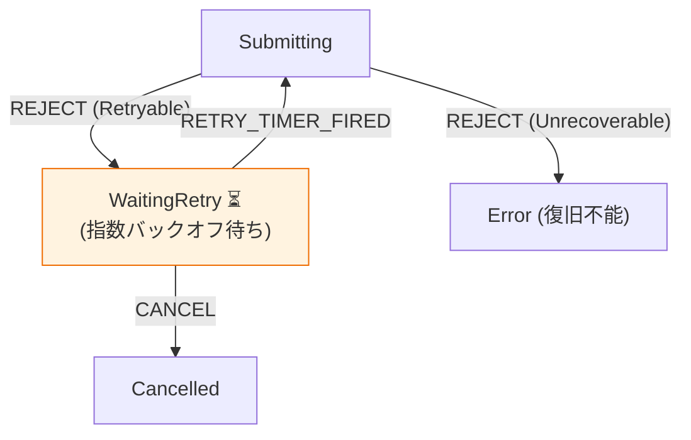

# 第29章：リトライと復旧（Retryable/Not）🔁✨

（通信失敗に強い“しぶといアプリ”を作る回だよ〜！💪🌈）

---

## 29-1. 今日のゴール🎯✨

「失敗したら、とりあえずリトライしとこ！」…ってやると、**逆に地獄**になることがあるの🥹💥
だからこの章では、

* ✅ **リトライしていい失敗 / ダメな失敗**を見分ける
* ✅ **待ち時間（バックオフ）**をちゃんと入れる
* ✅ **二重送信（重複POST）**を防ぐ
* ✅ **キャンセル**もできる
* ✅ 状態機械で「設計として」事故を減らす

ここまでを、ちゃんと組み立てるよ〜🔧💖

---

## 29-2. まず大前提：「全部リトライ」は危険😱


リトライは優しさに見えるけど、**失敗の原因が“過負荷”のとき**、みんなが一斉に再送してさらに混む…っていう最悪パターンがあるの😭🔥
だから基本は、

* ⛳ **リトライするポイントは1か所に絞る**（あちこちで勝手に再試行しない）
* 🕰️ **タイムアウト + バックオフ + ジッター（ゆらぎ）**で、再送タイミングをばらけさせる

が鉄則だよ〜！✨（AWSもこの考え方を強く推してるよ） ([Amazon Web Services, Inc.][1])

---

## 29-3. Retryable / Not Retryable の仕分け表📋✨


ここ、状態機械にするなら **「ガード条件」** の中心になるよ🛡️

### ✅ リトライしていい（可能性が高い）💡

**一時的**な問題っぽいとき！

* 🌐 ネットワーク不調（fetch が例外で落ちる系）
* 🧱 503 Service Unavailable（サーバーが過負荷・メンテ中） ([MDNウェブドキュメント][2])
* 🚦 429 Too Many Requests（レート制限）＋ Retry-After が来ることがある ([MDNウェブドキュメント][3])
* ⏳ タイムアウト（こちらの待ち時間切れ）

### ❌ リトライしちゃダメ（ほぼ治らない）🙅‍♀️

**仕様や入力の問題**っぽいとき！

* 📝 400 Bad Request（入力不正）
* 🔐 401 Unauthorized / 403 Forbidden（認証・権限）
* 🧩 バリデーションエラー（未入力など）

※「404」はケースによるけど、普通のフォーム送信なら “入力やIDが間違ってる” 側が多いので、基本は Not Retry 寄りでOK🙆‍♀️

---

## 29-4. Retry-After を“最優先”で尊重しよう⏱️🙏


429/503 のとき、サーバーが「◯秒待ってね」って教えてくれることがあるよ〜！
それが Retry-After ヘッダー🧾✨ ([MDNウェブドキュメント][4])

ポイントはこれ👇

* 🥇 Retry-After があるなら **それに従う**
* 🥈 ないなら **自分のバックオフ規則**に従う
* 🧊 待ちすぎ防止のため **最大待ち時間（cap）**を決める

---

## 29-5. バックオフ + ジッター（ゆらぎ）🌪️✨


### なぜ「ゆらぎ」が必要？

同じタイミングで落ちたクライアントが、同じ秒数待って、同じ瞬間に再送すると…
また同じ瞬間に混むの😇💥
だから **ちょっとランダムに散らす**のが超大事！ ([Amazon Web Services, Inc.][1])

### おすすめ：capped exponential backoff + full jitter

ざっくり式（イメージ）👇

* base = 500ms とか
* cap = 20s とか
* attempt 回目（0,1,2…）で

  * temp = min(cap, base * 2^attempt)
  * delay = random(0, temp)  ← これが full jitter 🎲

（AWSの “Exponential Backoff And Jitter” で紹介されてるやつだよ） ([Amazon Web Services, Inc.][5])

---

## 29-6. 二重送信（重複POST）を絶対に起こさない設計🔒💥


リトライでいちばん怖いのがこれ😱
「成功したのにレスポンスが届かず、同じPOSTをもう一回投げて二重登録」みたいな事故…。

### 防御は“二段構え”が強い💪✨

#### ① クライアント側の防御🖱️

* ✅ Submitting中は SUBMIT を無視（ガード）
* ✅ 送信ボタンを disabled
* ✅ requestId を Context に入れて、**古いレスポンスは捨てる**（後述）

#### ② サーバー側の防御（超重要）🏰

POST/PATCH を安全にリトライするために、Idempotency-Key ヘッダーを使う考え方が標準化・普及してきてるよ✨
同じキーのリクエストは **“一回だけ処理”**して、あとは同じ結果を返す…みたいにできるの🧠💡 ([MDNウェブドキュメント][6])

---

## 29-7. 状態機械に落とす：Retry設計の“型”🧩✨

### 状態（例）🚦


* Idle（待機）
* Editing（入力中）
* Submitting（送信中）
* WaitingRetry（次の再試行待ち）
* Success
* Error（復旧不能 or リトライ打ち切り）
* Cancelled（キャンセルで中断）

### イベント（例）📣

* SUBMIT
* RESOLVE（成功レスポンス）
* REJECT（失敗：HTTPや例外）
* RETRY_TIMER_FIRED（待ち時間が終わった）
* CANCEL
* EDIT
* RESET




### Context（例）🧠

* attempt（今何回目？）
* maxAttempts
* requestId（今回の送信の識別子）
* idempotencyKey（同じ送信のリトライで同一にする）
* lastError
* nextDelayMs

### ガード（例）🛡️

* isRetryableFailure（429/503/ネットワーク等？）
* hasAttemptsLeft（attempt < maxAttempts）
* hasRetryAfter（ヘッダーある？）

---

## 29-8. 実装ミニ例（Reducer + Effect 方式）🧑‍💻✨

「状態遷移は純粋」「I/Oは Effect にして外で実行」の形だよ💖
（この形はテストも超しやすい🧪）

```ts
type State =
  | { kind: "Editing" }
  | { kind: "Submitting"; requestId: string; attempt: number; idempotencyKey: string }
  | { kind: "WaitingRetry"; requestId: string; attempt: number; idempotencyKey: string; delayMs: number }
  | { kind: "Success" }
  | { kind: "Error"; message: string }
  | { kind: "Cancelled" };

type Event =
  | { type: "SUBMIT" }
  | { type: "RESOLVE" }
  | { type: "REJECT"; error: Failure }
  | { type: "RETRY_TIMER_FIRED" }
  | { type: "CANCEL" }
  | { type: "EDIT" };

type Failure =
  | { kind: "Http"; status: number; retryAfterMs?: number }
  | { kind: "Network" }
  | { kind: "Timeout" }
  | { kind: "Abort" }
  | { kind: "Validation"; message: string }
  | { kind: "Auth" };

type Effect =
  | { type: "START_REQUEST"; requestId: string; idempotencyKey: string }
  | { type: "SCHEDULE_TIMER"; requestId: string; delayMs: number }
  | { type: "ABORT_REQUEST"; requestId: string }
  | { type: "LOG"; message: string };

const MAX_ATTEMPTS = 5;
const BASE_MS = 500;
const CAP_MS = 20_000;

function isRetryable(f: Failure): boolean {
  if (f.kind === "Network" || f.kind === "Timeout") return true;
  if (f.kind === "Http") return f.status === 429 || f.status === 503 || (f.status >= 500 && f.status <= 599);
  return false;
}

function computeDelayMs(attempt: number): number {
  const temp = Math.min(CAP_MS, BASE_MS * 2 ** attempt);
  return Math.floor(Math.random() * (temp + 1)); // full jitter
}

function reducer(state: State, event: Event): { state: State; effects: Effect[] } {
  switch (state.kind) {
    case "Editing": {
      if (event.type === "SUBMIT") {
        const requestId = crypto.randomUUID();
        const idempotencyKey = crypto.randomUUID(); // 「この送信」に紐づくキー（リトライでは同じ）
        return {
          state: { kind: "Submitting", requestId, attempt: 0, idempotencyKey },
          effects: [
            { type: "LOG", message: "submit start" },
            { type: "START_REQUEST", requestId, idempotencyKey },
          ],
        };
      }
      return { state, effects: [] };
    }

    case "Submitting": {
      if (event.type === "CANCEL") {
        return {
          state: { kind: "Cancelled" },
          effects: [{ type: "ABORT_REQUEST", requestId: state.requestId }],
        };
      }

      if (event.type === "RESOLVE") {
        return { state: { kind: "Success" }, effects: [{ type: "LOG", message: "submit success" }] };
      }

      if (event.type === "REJECT") {
        const f = event.error;

        // Not Retryable は即エラー
        if (!isRetryable(f)) {
          return { state: { kind: "Error", message: "リトライできない失敗だよ🥲" }, effects: [] };
        }

        // 回数上限
        if (state.attempt + 1 >= MAX_ATTEMPTS) {
          return { state: { kind: "Error", message: "リトライ上限に到達…🧯" }, effects: [] };
        }

        // Retry-After があれば最優先
        const delayMs = f.kind === "Http" && f.retryAfterMs != null
          ? Math.min(CAP_MS, f.retryAfterMs)
          : computeDelayMs(state.attempt);

        return {
          state: { kind: "WaitingRetry", requestId: state.requestId, attempt: state.attempt + 1, idempotencyKey: state.idempotencyKey, delayMs },
          effects: [
            { type: "LOG", message: `retry scheduled: ${delayMs}ms` },
            { type: "SCHEDULE_TIMER", requestId: state.requestId, delayMs },
          ],
        };
      }

      return { state, effects: [] };
    }

    case "WaitingRetry": {
      if (event.type === "CANCEL") {
        return {
          state: { kind: "Cancelled" },
          effects: [{ type: "ABORT_REQUEST", requestId: state.requestId }],
        };
      }

      if (event.type === "RETRY_TIMER_FIRED") {
        return {
          state: { kind: "Submitting", requestId: state.requestId, attempt: state.attempt, idempotencyKey: state.idempotencyKey },
          effects: [{ type: "START_REQUEST", requestId: state.requestId, idempotencyKey: state.idempotencyKey }],
        };
      }

      return { state, effects: [] };
    }

    default:
      // Success / Error / Cancelled など
      if (event.type === "EDIT") return { state: { kind: "Editing" }, effects: [] };
      return { state, effects: [] };
  }
}
```

### この例の“設計の芯”💎

* Submitting 中に SUBMIT を受けない（編集状態からしか SUBMIT できない）→ 二重送信を設計で潰す🔨
* idempotencyKey は「同じ送信のリトライで同一」→ 重複POST事故を防ぎやすい🛡️ ([MDNウェブドキュメント][6])
* 429/503 は Retry-After を尊重 → サーバーに優しい🥹💖 ([MDNウェブドキュメント][4])
* バックオフ + ジッター → リトライ嵐を抑える🌪️✨ ([Amazon Web Services, Inc.][1])

---

## 29-9. “古いレスポンス”で状態が巻き戻る事故を防ぐ🌀


非同期って、順番が入れ替わることあるの😵‍💫
だから Effect 実行側で、

* リクエスト開始時に requestId を持つ
* RESOLVE / REJECT にも requestId を付ける
* いまの状態の requestId と違ったら **捨てる**

これを入れると超堅牢になるよ💪✨
（この章の主題「復旧」って、こういう“現実の事故”を潰すことなんだよね…！🧯）

---

## 29-10. キャンセル（Abort）も状態に含める✋🧊

送信中に「やっぱやめたい！」って普通にあるよね🥺
AbortController は、fetch を止める定番の仕組みだよ🧨（広く使える仕様として定着してる） ([MDNウェブドキュメント][7])

状態機械的には：

* CANCEL イベントが来たら

  * Submitting / WaitingRetry → Cancelled に遷移
  * ABORT_REQUEST の Effect を出す

って感じで、**道筋が一個に決まる**のが強い✨

---

## 29-11. テスト観点（ここ超実務！）🧪✨

### 表駆動でテストしやすいポイント🎁

* isRetryable の判定（429/503/Network/Timeout は true、Validation/Auth は false）
* Retry-After があると delayMs がそれ優先
* attempt 上限で Error になる
* CANCEL で Cancelled + ABORT_REQUEST が出る

### ジッターのテストどうする？🎲

* computeDelayMs を差し替え可能にする（乱数注入）
* もしくは PRNG を固定 seed にする
  こうするとテストが安定するよ〜😊

---

## 29-12. AIに頼ると爆速になる質問テンプレ🤖✨

コピペで使えるやつ置いとくね💕

* 「この失敗は Retryable？理由もつけて分類して。HTTPステータス別に表で」
* 「Retry-After がある時/ない時の待ち時間の決め方を、状態機械のガードとアクションに分けて提案して」
* 「二重送信防止を、(1)状態遷移、(2)UI制御、(3)Idempotency-Key の3層で設計案出して」
* 「古いレスポンスが後から返ってきても壊れないように requestId 方式で設計して」

---

## 29-13. 章末チェックリスト✅✨

できたら勝ち〜！🎉

* ✅ Retryable / Not をルール化した
* ✅ Retry-After を尊重する
* ✅ バックオフ + ジッター + cap を入れた ([Amazon Web Services, Inc.][1])
* ✅ 二重送信を「設計で」防いだ（SUBMITの入口を絞った）
* ✅ Idempotency-Key を“同じ送信のリトライで同一”にする方針にした ([MDNウェブドキュメント][6])
* ✅ CANCEL の経路がある
* ✅ 古いレスポンス破壊を requestId で防げる

---

## おまけ：いまのTypeScript周りの最新メモ🧷✨

TypeScript は本日時点で 5.9 が最新として案内されてるよ（公式） ([TypeScript][8])
この章の内容（リトライ・復旧設計）は、バージョンが変わっても “設計の骨格” としてずっと使えるやつだよ〜🔁💖

---

次はこの第29章の設計を、**第30章の総合演習（フォーム送信）**にそのまま組み込んで「実戦で動く」まで持っていこうね〜！📨🎓✨

[1]: https://aws.amazon.com/builders-library/timeouts-retries-and-backoff-with-jitter/?utm_source=chatgpt.com "Timeouts, retries and backoff with jitter"
[2]: https://developer.mozilla.org/ja/docs/Web/HTTP/Reference/Status/503?utm_source=chatgpt.com "503 Service Unavailable - HTTP - MDN Web Docs"
[3]: https://developer.mozilla.org/ja/docs/Web/HTTP/Reference/Status/429?utm_source=chatgpt.com "429 Too Many Requests - HTTP - MDN Web Docs"
[4]: https://developer.mozilla.org/ja/docs/Web/HTTP/Reference/Headers/Retry-After?utm_source=chatgpt.com "Retry-After - HTTP - MDN Web Docs"
[5]: https://aws.amazon.com/blogs/architecture/exponential-backoff-and-jitter/?utm_source=chatgpt.com "Exponential Backoff And Jitter | AWS Architecture Blog"
[6]: https://developer.mozilla.org/en-US/docs/Web/HTTP/Reference/Headers/Idempotency-Key?utm_source=chatgpt.com "Idempotency-Key header - HTTP - MDN Web Docs"
[7]: https://developer.mozilla.org/en-US/docs/Web/API/AbortController?utm_source=chatgpt.com "AbortController - Web APIs - MDN Web Docs"
[8]: https://www.typescriptlang.org/download/?utm_source=chatgpt.com "How to set up TypeScript"
