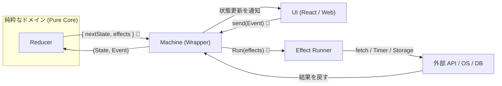

# 第30章：総合演習（AIで設計→実装→テスト→ログ）🎉🤖

この章は「1本ちゃんと作って、明日から使える武器にする」回だよ〜！💪✨
題材は **フォーム送信**（入力→送信中→成功/失敗→リトライ/キャンセル）📨

---

## 0. この章のゴール🎯✨


最終的に、こうなるのがゴールだよ😊

* ✅ **状態が明確**（いま何中？が一目で分かる）👀
* ✅ **非同期が安全**（二重送信・遅れて返ってきたレスポンスで壊れない）🧯
* ✅ **テストが表駆動**（仕様＝遷移表からテストが作れる）🧪
* ✅ **遷移ログが追える**（requestIdで「この送信の流れ」を追跡）🔎

---

## 1. 最新ツール情報（この章の前提の“いま”）🆕✨

この章のサンプルは、今の定番セットで書くよ〜！

* TypeScript：**5.9.3**（npmのlatest） ([npm][1])
* Node.js：**24.x が Active LTS**（例：24.13.0 が LTS のセキュリティリリース） ([Node.js][2])
* Vite：npmのlatestは **7.3.1** ([npm][3])
* Vitest：npmのlatestは **4.0.17** ([npm][4])
* Prettier：npmのlatestは **3.8.0** ([npm][5])

（ESLintは v10 のRCが出てる時期だよ〜って豆知識👀） ([eslint.org][6])

---

## 2. 仕様（今回はこれを満たす！）📋✨

### 2.1 状態（State）🧩


* `idle`：まだ何もしてない
* `editing`：入力中
* `submitting`：送信中（非同期）
* `success`：成功
* `waitingRetry`：自動リトライ待ち（バックオフ中）⏳
* `error`：失敗（手動リトライできるかも）🚨

### 2.2 イベント（Event）🎫

* 入力系：`START_EDIT` / `CHANGE_FIELD`
* 送信系：`SUBMIT` / `CANCEL`
* 結果系：`SUBMIT_OK` / `SUBMIT_FAILED`（※ requestId を必ず持つ！）
* リトライ系：`RETRY`（タイマー or ユーザー）
* その他：`RESET`

### 2.3 超重要ルール（実務で効くやつ）🧯✨

* **レスポンスが遅れて帰ってきても壊れない**
  → `requestId` が **一致しない結果イベントは無視**（ログだけ残す）🔒

---

## 3. 設計パート（AIで爆速にする）🤖⚡

ここはAIに頼ってOK！ただし「最後に人間がチェック」ね😉✨

### 3.1 AIに投げるプロンプト例（設計）🧠

* 「フォーム送信を状態機械で設計したい。State/Event/Contextの候補を出して、禁止遷移も指摘して」
* 「遷移表（状態×イベント）を作って。抜け漏れがあれば追加イベント案も」
* 「非同期の戻りイベントに requestId を付けた設計にして。遅延レスポンス対策も含めて」

### 3.2 人間チェックのコツ👀✅

* “送信中にSUBMIT押したら？”（二重送信）
* “送信中にCANCELしたら？”
* “CANCEL後にSUBMIT_OKが返ってきたら？”（遅延イベント）
  この3つを通れば、かなり強い💪✨

---

## 4. 実装（Reducer＋Effectリスト方式）🧑‍💻✨


> ここからは「中心は純粋（Reducer）」「外側が副作用（Effect runner）」の形だよ🌿




### 4.1 ファイル構成（例）📁

* `src/domain/types.ts`（型）
* `src/domain/reducer.ts`（純粋な遷移）
* `src/runner/effectsRunner.ts`（副作用）
* `src/index.ts`（ちょい動かす用）
* `src/domain/reducer.test.ts`（表駆動テスト）

---

## 5. コード：型定義（types.ts）🧩✨

```ts
// src/domain/types.ts
export type State =
  | { type: "idle" }
  | { type: "editing" }
  | { type: "submitting"; requestId: string }
  | { type: "success"; requestId: string }
  | { type: "waitingRetry"; requestId: string; afterMs: number }
  | { type: "error"; requestId: string; message: string; retryable: boolean };

export type Field = "name" | "email" | "message";

export type Context = {
  fields: Record<Field, string>;
  validationErrors: Partial<Record<Field, string>>;
  attempt: number; // 0,1,2...
  maxAttempts: number; // 例: 3
};

export type Event =
  | { type: "START_EDIT" }
  | { type: "CHANGE_FIELD"; field: Field; value: string }
  | { type: "SUBMIT" }
  | { type: "CANCEL" }
  | { type: "SUBMIT_OK"; requestId: string }
  | { type: "SUBMIT_FAILED"; requestId: string; message: string; retryable: boolean }
  | { type: "RETRY"; requestId: string; reason: "timer" | "user" }
  | { type: "RESET" };

export type Effect =
  | { type: "LOG"; level: "info" | "warn" | "error"; message: string; data?: unknown }
  | { type: "SUBMIT_FORM"; requestId: string; payload: Record<Field, string> }
  | { type: "ABORT_REQUEST"; requestId: string }
  | { type: "SCHEDULE_RETRY"; requestId: string; afterMs: number };

export type Snapshot = {
  state: State;
  context: Context;
};

export type ReduceDeps = {
  newRequestId: () => string; // テストでは固定値を返せるようにする
};

export type ReduceResult = Snapshot & { effects: Effect[] };

export const createInitialSnapshot = (): Snapshot => ({
  state: { type: "idle" },
  context: {
    fields: { name: "", email: "", message: "" },
    validationErrors: {},
    attempt: 0,
    maxAttempts: 3,
  },
});
```

---

## 6. コード：Reducer（reducer.ts）🧠✨（ここが“心臓”）


ポイントはこれだよ👇

* Reducerは **副作用しない**（fetchしない、setTimeoutしない）🙅‍♀️
* 代わりに **Effectを返す**（やることリスト）🧾✨
* requestIdの一致チェックで **遅延レスポンス事故を防ぐ**🧯

```ts
// src/domain/reducer.ts
import type { Context, Effect, Event, ReduceDeps, ReduceResult, Snapshot, State } from "./types";

const assertNever = (x: never): never => {
  throw new Error(`Unexpected: ${JSON.stringify(x)}`);
};

const validate = (ctx: Context): Partial<Record<keyof Context["fields"], string>> => {
  const e: Partial<Record<keyof Context["fields"], string>> = {};
  if (!ctx.fields.name.trim()) e.name = "名前は必須だよ📝";
  if (!ctx.fields.email.trim()) e.email = "メールは必須だよ📧";
  if (!ctx.fields.email.includes("@")) e.email = "メールの形式が変かも…🤔";
  if (!ctx.fields.message.trim()) e.message = "メッセージは必須だよ💬";
  return e;
};

const backoffMs = (attempt: number): number => {
  // attempt: 1,2,3... を想定（リトライ回数）
  const base = 800; // 0.8s
  const ms = base * Math.pow(2, attempt - 1); // 0.8s, 1.6s, 3.2s...
  return Math.min(ms, 8000);
};

const addTransitionLog = (effects: Effect[], from: State, event: Event, to: State): Effect[] => {
  return effects.concat({
    type: "LOG",
    level: "info",
    message: "transition",
    data: { from, event, to },
  });
};

const ignoreIfStale = (snapshot: Snapshot, requestId: string): boolean => {
  const st = snapshot.state;
  if (st.type === "submitting" || st.type === "success" || st.type === "waitingRetry" || st.type === "error") {
    return st.requestId !== requestId;
  }
  return true; // そもそもリクエスト待ち状態じゃないなら、結果イベントは古い可能性が高い
};

export const reduce = (snapshot: Snapshot, event: Event, deps: ReduceDeps): ReduceResult => {
  const from = snapshot.state;

  const step = (state: State, context: Context, effects: Effect[] = []): ReduceResult => ({
    state,
    context,
    effects: addTransitionLog(effects, from, event, state),
  });

  switch (snapshot.state.type) {
    case "idle": {
      switch (event.type) {
        case "START_EDIT":
          return step({ type: "editing" }, { ...snapshot.context });
        case "CHANGE_FIELD":
          return step(
            { type: "editing" },
            {
              ...snapshot.context,
              fields: { ...snapshot.context.fields, [event.field]: event.value },
              validationErrors: { ...snapshot.context.validationErrors, [event.field]: undefined },
            }
          );
        case "RESET":
          return step({ type: "idle" }, { ...snapshot.context, attempt: 0, validationErrors: {} });
        case "SUBMIT":
          // idleでsubmitは、編集に誘導しちゃう（初心者に優しい仕様😊）
          return step({ type: "editing" }, { ...snapshot.context });
        case "CANCEL":
        case "SUBMIT_OK":
        case "SUBMIT_FAILED":
        case "RETRY":
          return step({ type: "idle" }, snapshot.context, [
            { type: "LOG", level: "warn", message: "ignored event in idle", data: event },
          ]);
        default:
          return assertNever(event);
      }
    }

    case "editing": {
      switch (event.type) {
        case "CHANGE_FIELD":
          return step(
            { type: "editing" },
            {
              ...snapshot.context,
              fields: { ...snapshot.context.fields, [event.field]: event.value },
              validationErrors: { ...snapshot.context.validationErrors, [event.field]: undefined },
            }
          );

        case "SUBMIT": {
          const errors = validate(snapshot.context);
          const hasErrors = Object.values(errors).some(Boolean);
          if (hasErrors) {
            return step({ type: "editing" }, { ...snapshot.context, validationErrors: errors }, [
              { type: "LOG", level: "warn", message: "validation failed", data: errors },
            ]);
          }
          const requestId = deps.newRequestId();
          const payload = { ...snapshot.context.fields };
          return step({ type: "submitting", requestId }, { ...snapshot.context, attempt: 0, validationErrors: {} }, [
            { type: "SUBMIT_FORM", requestId, payload },
          ]);
        }

        case "RESET":
          return step({ type: "idle" }, { ...snapshot.context, attempt: 0, validationErrors: {} });

        case "START_EDIT":
          return step({ type: "editing" }, snapshot.context);

        case "CANCEL":
        case "SUBMIT_OK":
        case "SUBMIT_FAILED":
        case "RETRY":
          return step({ type: "editing" }, snapshot.context, [
            { type: "LOG", level: "warn", message: "ignored event in editing", data: event },
          ]);

        default:
          return assertNever(event);
      }
    }

    case "submitting": {
      switch (event.type) {
        case "CANCEL": {
          return step({ type: "editing" }, { ...snapshot.context }, [
            { type: "ABORT_REQUEST", requestId: snapshot.state.requestId },
          ]);
        }

        case "SUBMIT_OK": {
          if (ignoreIfStale(snapshot, event.requestId)) {
            return step(snapshot.state, snapshot.context, [
              { type: "LOG", level: "warn", message: "stale SUBMIT_OK ignored", data: event },
            ]);
          }
          return step({ type: "success", requestId: event.requestId }, { ...snapshot.context });
        }

        case "SUBMIT_FAILED": {
          if (ignoreIfStale(snapshot, event.requestId)) {
            return step(snapshot.state, snapshot.context, [
              { type: "LOG", level: "warn", message: "stale SUBMIT_FAILED ignored", data: event },
            ]);
          }

          const attempt = snapshot.context.attempt + 1;
          const canAutoRetry = event.retryable && attempt < snapshot.context.maxAttempts;
          if (canAutoRetry) {
            const afterMs = backoffMs(attempt);
            return step(
              { type: "waitingRetry", requestId: event.requestId, afterMs },
              { ...snapshot.context, attempt },
              [{ type: "SCHEDULE_RETRY", requestId: event.requestId, afterMs }]
            );
          }

          return step(
            { type: "error", requestId: event.requestId, message: event.message, retryable: event.retryable },
            { ...snapshot.context, attempt }
          );
        }

        case "SUBMIT":
          // 二重送信は無視（または「送信中です」ログだけ）
          return step(snapshot.state, snapshot.context, [
            { type: "LOG", level: "warn", message: "double submit ignored", data: event },
          ]);

        case "RESET":
          return step({ type: "idle" }, { ...snapshot.context, attempt: 0, validationErrors: {} });

        case "START_EDIT":
        case "CHANGE_FIELD":
        case "RETRY":
          return step(snapshot.state, snapshot.context, [
            { type: "LOG", level: "warn", message: "ignored event in submitting", data: event },
          ]);

        default:
          return assertNever(event);
      }
    }

    case "waitingRetry": {
      switch (event.type) {
        case "RETRY": {
          if (event.requestId !== snapshot.state.requestId) {
            return step(snapshot.state, snapshot.context, [
              { type: "LOG", level: "warn", message: "stale RETRY ignored", data: event },
            ]);
          }
          const newId = deps.newRequestId();
          const payload = { ...snapshot.context.fields };
          return step({ type: "submitting", requestId: newId }, snapshot.context, [
            { type: "SUBMIT_FORM", requestId: newId, payload },
          ]);
        }

        case "CANCEL":
          return step({ type: "editing" }, snapshot.context, [
            { type: "ABORT_REQUEST", requestId: snapshot.state.requestId },
          ]);

        case "RESET":
          return step({ type: "idle" }, { ...snapshot.context, attempt: 0, validationErrors: {} });

        case "SUBMIT_OK":
        case "SUBMIT_FAILED":
        case "SUBMIT":
        case "START_EDIT":
        case "CHANGE_FIELD":
          return step(snapshot.state, snapshot.context, [
            { type: "LOG", level: "warn", message: "ignored event in waitingRetry", data: event },
          ]);

        default:
          return assertNever(event);
      }
    }

    case "success": {
      switch (event.type) {
        case "RESET":
          return step({ type: "idle" }, { ...snapshot.context, attempt: 0, validationErrors: {} });
        case "START_EDIT":
        case "CHANGE_FIELD":
          return step(
            { type: "editing" },
            {
              ...snapshot.context,
              fields: event.type === "CHANGE_FIELD"
                ? { ...snapshot.context.fields, [event.field]: event.value }
                : snapshot.context.fields,
            }
          );
        case "SUBMIT":
        case "CANCEL":
        case "SUBMIT_OK":
        case "SUBMIT_FAILED":
        case "RETRY":
          return step(snapshot.state, snapshot.context, [
            { type: "LOG", level: "warn", message: "ignored event in success", data: event },
          ]);
        default:
          return assertNever(event);
      }
    }

    case "error": {
      switch (event.type) {
        case "RETRY": {
          if (event.requestId !== snapshot.state.requestId) {
            return step(snapshot.state, snapshot.context, [
              { type: "LOG", level: "warn", message: "stale RETRY ignored", data: event },
            ]);
          }
          const newId = deps.newRequestId();
          const payload = { ...snapshot.context.fields };
          return step({ type: "submitting", requestId: newId }, snapshot.context, [
            { type: "SUBMIT_FORM", requestId: newId, payload },
          ]);
        }
        case "RESET":
          return step({ type: "idle" }, { ...snapshot.context, attempt: 0, validationErrors: {} });
        case "START_EDIT":
        case "CHANGE_FIELD":
          return step(
            { type: "editing" },
            event.type === "CHANGE_FIELD"
              ? {
                  ...snapshot.context,
                  fields: { ...snapshot.context.fields, [event.field]: event.value },
                  validationErrors: { ...snapshot.context.validationErrors, [event.field]: undefined },
                }
              : snapshot.context
          );
        case "CANCEL":
        case "SUBMIT":
        case "SUBMIT_OK":
        case "SUBMIT_FAILED":
          return step(snapshot.state, snapshot.context, [
            { type: "LOG", level: "warn", message: "ignored event in error", data: event },
          ]);
        default:
          return assertNever(event);
      }
    }

    default:
      return assertNever(snapshot.state);
  }
};
```

---

## 7. 副作用ランナー（effectsRunner.ts）🌿⚙️


ここで `SUBMIT_FORM` とか `SCHEDULE_RETRY` を実行するよ〜！✨
requestIdごとに AbortController を持つと、キャンセルが綺麗にできる🧯

```ts
// src/runner/effectsRunner.ts
import type { Effect, Event } from "../domain/types";

export type EffectAdapters = {
  log: (level: "info" | "warn" | "error", message: string, data?: unknown) => void;
  submitForm: (payload: Record<string, string>, signal: AbortSignal) => Promise<void>;
  schedule: (ms: number, fn: () => void) => void;
};

export const createEffectsRunner = (adapters: EffectAdapters) => {
  const controllers = new Map<string, AbortController>();

  const run = (effects: Effect[], send: (event: Event) => void) => {
    for (const ef of effects) {
      switch (ef.type) {
        case "LOG":
          adapters.log(ef.level, ef.message, ef.data);
          break;

        case "SUBMIT_FORM": {
          const c = new AbortController();
          controllers.set(ef.requestId, c);

          adapters.submitForm(ef.payload, c.signal)
            .then(() => send({ type: "SUBMIT_OK", requestId: ef.requestId }))
            .catch((err: unknown) => {
              const msg = err instanceof Error ? err.message : String(err);
              const aborted = c.signal.aborted;
              send({
                type: "SUBMIT_FAILED",
                requestId: ef.requestId,
                message: aborted ? "キャンセルされたよ🧹" : `送信失敗: ${msg}`,
                retryable: !aborted, // キャンセルは基本リトライ不要
              });
            })
            .finally(() => controllers.delete(ef.requestId));

          break;
        }

        case "ABORT_REQUEST": {
          const c = controllers.get(ef.requestId);
          if (c) c.abort();
          break;
        }

        case "SCHEDULE_RETRY": {
          adapters.schedule(ef.afterMs, () => {
            send({ type: "RETRY", requestId: ef.requestId, reason: "timer" });
          });
          break;
        }

        default: {
          const _exhaustive: never = ef;
          throw new Error(`Unknown effect: ${JSON.stringify(_exhaustive)}`);
        }
      }
    }
  };

  return { run };
};
```

---

## 8. Machineラッパー（使う側をラクにする）📮✨

「sendするだけ」で動く形にすると、UI側が超ラクだよ😊

```ts
// src/index.ts（デモ用：最小）
import { createInitialSnapshot } from "./domain/types";
import { reduce } from "./domain/reducer";
import { createEffectsRunner } from "./runner/effectsRunner";

const runner = createEffectsRunner({
  log: (level, message, data) => {
    const line = JSON.stringify({ t: new Date().toISOString(), level, message, data });
    console.log(line);
  },
  submitForm: async (_payload, signal) => {
    // 疑似API：1.2秒待って、たまに失敗するよ😈
    await new Promise<void>((r, rej) => {
      const id = setTimeout(() => {
        Math.random() < 0.7 ? r() : rej(new Error("ネットワークっぽい失敗💥"));
      }, 1200);
      signal.addEventListener("abort", () => {
        clearTimeout(id);
        rej(new Error("aborted"));
      });
    });
  },
  schedule: (ms, fn) => setTimeout(fn, ms),
});

let snapshot = createInitialSnapshot();

const send = (event: any) => {
  const next = reduce(snapshot, event, { newRequestId: () => crypto.randomUUID() });
  snapshot = { state: next.state, context: next.context };
  runner.run(next.effects, send);
};

send({ type: "START_EDIT" });
send({ type: "CHANGE_FIELD", field: "name", value: "Komiyanma" });
send({ type: "CHANGE_FIELD", field: "email", value: "test@example.com" });
send({ type: "CHANGE_FIELD", field: "message", value: "こんにちは！" });
send({ type: "SUBMIT" });

// 送信中にキャンセルしたいならコレ👇
// setTimeout(() => send({ type: "CANCEL" }), 300);
```

---

## 9. テスト：遷移表から“表駆動テスト”を作る🧪📋✨


### 9.1 AIに投げるプロンプト例（テスト）🤖

* 「このReducerの主要パスを表駆動テストにして。ケース名、初期状態、イベント、期待stateを列挙して」
* 「stale event（requestId不一致）をテストで必ずカバーして」

### 9.2 テスト例（Vitest）✅

```ts
// src/domain/reducer.test.ts
import { describe, expect, it } from "vitest";
import { createInitialSnapshot } from "./types";
import { reduce } from "./reducer";

const fixedId = (ids: string[]) => {
  let i = 0;
  return () => ids[i++] ?? "NO_MORE_IDS";
};

describe("reducer", () => {
  it("invalid submit stays editing and sets validationErrors", () => {
    let s = createInitialSnapshot();
    s = { ...s, state: { type: "editing" } };

    const r = reduce(s, { type: "SUBMIT" }, { newRequestId: fixedId(["r1"]) });

    expect(r.state.type).toBe("editing");
    expect(Object.keys(r.context.validationErrors).length).toBeGreaterThan(0);
    expect(r.effects.some(e => e.type === "SUBMIT_FORM")).toBe(false);
  });

  it("valid submit -> submitting with SUBMIT_FORM effect", () => {
    let s = createInitialSnapshot();
    s = { ...s, state: { type: "editing" }, context: { ...s.context, fields: { name: "a", email: "a@b", message: "m" } } };

    const r = reduce(s, { type: "SUBMIT" }, { newRequestId: fixedId(["r1"]) });

    expect(r.state.type).toBe("submitting");
    if (r.state.type === "submitting") expect(r.state.requestId).toBe("r1");
    expect(r.effects.some(e => e.type === "SUBMIT_FORM")).toBe(true);
  });

  it("stale SUBMIT_OK is ignored (requestId mismatch)", () => {
    let s = createInitialSnapshot();
    s = { ...s, state: { type: "submitting", requestId: "r1" }, context: { ...s.context, fields: { name: "a", email: "a@b", message: "m" } } };

    const r = reduce(s, { type: "SUBMIT_OK", requestId: "OLD" }, { newRequestId: fixedId(["r2"]) });

    expect(r.state.type).toBe("submitting");
    expect(r.effects.some(e => e.type === "LOG")).toBe(true);
  });

  it("retryable failure -> waitingRetry and schedules retry", () => {
    let s = createInitialSnapshot();
    s = { ...s, state: { type: "submitting", requestId: "r1" } };

    const r = reduce(
      s,
      { type: "SUBMIT_FAILED", requestId: "r1", message: "fail", retryable: true },
      { newRequestId: fixedId(["r2"]) }
    );

    expect(r.state.type).toBe("waitingRetry");
    expect(r.effects.some(e => e.type === "SCHEDULE_RETRY")).toBe(true);
  });
});
```

---

## 10. ログ設計：requestIdで追跡できる遷移ログ🔎🪵✨


この章のログは、**“あとで調査できる”** のがポイントだよ😊
おすすめは「1行JSON」📦（検索もしやすい！）

ログ例（イメージ）👇

* `transition` の data に `from/event/to` が入る
* submitting系は `requestId` が見える

そして、困ったらこうやって探せる✨

* “この requestId の流れだけ見たい！” → フィルタ🔍
* “stale ignored が出てる？” → 二重送信/キャンセルの疑い🧯

---

## 11. 仕上げチェックリスト✅🎉

* [ ] `requestId` 不一致の結果イベントが **無視**される
* [ ] submitting中の `SUBMIT` が **二重送信にならない**
* [ ] `CANCEL` で abort される（or 少なくとも stale で無害化）
* [ ] `waitingRetry` が **バックオフ**して `RETRY(timer)` を出す
* [ ] 遷移ログが毎回残る（from/event/to が揃ってる）
* [ ] テストに **staleケース**が入ってる

---

## 12. 発展課題（やれたら最強💪✨）🌈

* 🌟 `error` に「ユーザー向け文言」と「開発者向け詳細」を分けて持つ
* 🌟 リトライに **ジッター**（少しランダム）を入れて輻輳を避ける📉
* 🌟 UIと接続して、ボタン活性/非活性を state から完全決定する🎛️
* 🌟 遷移表を **データ化**して、Reducerが表から生成される形に近づける📋✨

---

もし次の一手として「この総合演習を、**実際のUI（Viteの画面）**に繋いで完成させる」版も作れるよ〜！🎨✨（ボタンや表示が state だけで切り替わるやつ🥰）

[1]: https://www.npmjs.com/package/typescript?utm_source=chatgpt.com "TypeScript"
[2]: https://nodejs.org/en/about/previous-releases?utm_source=chatgpt.com "Node.js Releases"
[3]: https://www.npmjs.com/package/vite?utm_source=chatgpt.com "vite"
[4]: https://www.npmjs.com/package/vitest?utm_source=chatgpt.com "vitest"
[5]: https://www.npmjs.com/package/prettier?utm_source=chatgpt.com "Prettier"
[6]: https://eslint.org/blog/2026/01/eslint-v10.0.0-rc.0-released/?utm_source=chatgpt.com "ESLint v10.0.0-rc.0 released"
