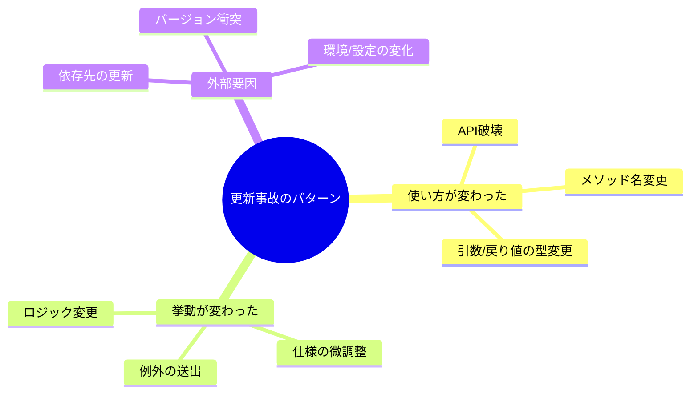
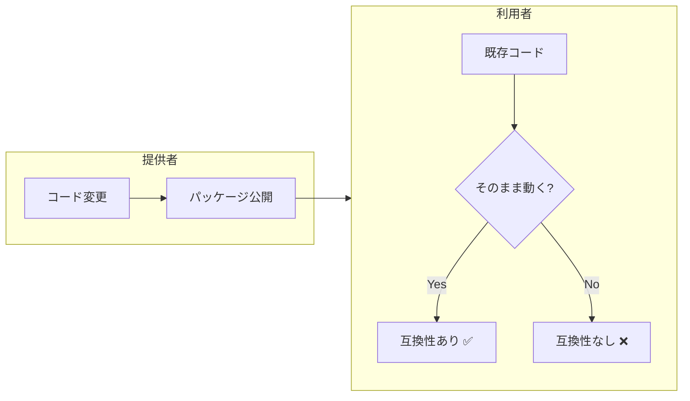

# 第01章：バージョンは“約束”って何？🤝🔢

## まず結論：バージョン番号は「中身の変化の強さ」を伝える“看板”📛✨


ソフトのバージョンは、ただの数字じゃなくて **「ここまでは前と同じように使えるよ」「ここからは変わるよ」** っていう“約束”を、利用者に伝えるためのサインです🤝
SemVer（セマンティックバージョニング）は、まさにその「約束を数字で表す」ためのルールだよ〜🧠✨ ([Semantic Versioning][1])

---

## 1. 「動くのに、更新したら壊れた😇」はなぜ起きるの？


よくある“更新事故”は、だいたいこのどれか💥

### ① 使い方が変わった（= 以前のコードが通らない）🧯

* メソッド名が変わった
* 引数の型が変わった
* 戻り値が変わった
  → 利用者側のコードがコンパイルできない…😇

### ② 動くけど結果が違う（= 挙動が変わった）😵

* 以前は空文字を返してたのに、例外を投げるようになった
* 並び順が変わった
* 丸め処理が変わった
  → バグじゃなくても「利用者から見たら壊れた」になる💦

### ③ “依存先”が変わって巻き込まれた（= 連鎖事故）🕸️💣

* 自分は何も変えてないのに、依存パッケージ更新で挙動が変わった
* 依存ツリーのどこかでバージョン衝突が起きた
  → 「更新ってこわ…😇」になりがち

## 1.3 更新事故のパターン😱💥


学習のために、更新事故によくあるパターンを3つに分類してみましょう。🛡️✨



---

## 2. 「互換性」って何？✅（この教材の最重要ワード）


この教材で言う互換性は、超ざっくりこう👇

> **以前の使い方（利用者コード）が、そのまま動くこと** 👀✅

ここでポイントは「作者の気持ち」じゃなくて **“利用者コード視点”** ってこと🌷



NuGetの世界でも、バージョン番号（とくにパッケージのバージョン）は利用者が最初に見る情報なので、SemVerで意味を伝えるのが推奨されています📦✨ ([マイクロソフト ラーン][2])

---

## 3. “約束”がどこにあるか：C#だと何が約束になりやすい？📣


今はざっくりでOK！この章では感覚だけつかもう😊

* 公開しているクラス／メソッド（利用者が呼ぶところ）
* 公開している型（引数・戻り値に出てくる型）
* 例外の種類やタイミング（これも実は契約になりがち）
* ドキュメントやサンプルコードに書いた使い方（これも約束っぽい）📄

「公開した瞬間、あなたは未来の利用者と握手している」🤝✨
その握手を、バージョンでちゃんと説明するのがSemVerだよ〜🧱

---

## 4. ミニ演習：更新事故ストーリーを1つ作ろう📖😇

あなたの経験でも、想像でもOK🙆‍♀️
下のテンプレを埋めてみてね📝

| 項目              | 内容                  |
| --------------- | ------------------- |
| 何を更新した？         | 例：あるNuGetパッケージを更新した |
| 期待してたこと         | 例：バグが直るだけだと思った      |
| 起きたこと           | 例：ビルドが通らない / 実行時エラー |
| 利用者が困った点        | 例：どこを直せばいいか分からない    |
| “約束”が壊れた場所は？    | 例：メソッドの引数が変わった      |
| もし事前に知れたら何が助かる？ | 例：移行手順、影響範囲、代替手段    |

このメモが、あとで **「じゃあPATCH？MINOR？MAJOR？」** を判断するときの材料になるよ🔥

---

## 5. AIの使いどころ：事故を“パターン分類”して強くなる🤖🗂️


AIは「あるあるを大量に出す」のが得意✨
この章では AIを“事故収集係”にしちゃおう😺

### おすすめプロンプト例（コピペ用）🧠

```text
C#のプロジェクトで起きがちな「更新事故」を20個出して。
それぞれについて「原因（API変更/挙動変更/依存衝突/設定変更など）」も分類して。
```

### さらに一歩（学びが深くなるやつ）🚀

```text
次の事故ストーリーを読んで、「利用者視点で壊れた約束」を1行で言って。
そして「事前にリリースノートに書くべき情報」を箇条書きで出して。
（ここにあなたの事故ストーリーを貼る）
```

📌コツ：AIの答えは“それっぽい”ので、**「利用者コードが困るか？」** だけは自分の頭で最終チェックね👀✅

---

## 6. 章末チェック（超かんたん）✅✨

1. バージョン番号は何のためにある？🤝
2. 「互換性」って、この教材では何視点？👀
3. “動くけど壊れた”って、どんな状態？😵
4. 更新事故を減らすには、利用者に何を伝えると助かる？📣
5. AIに任せると強い作業はどれ？（例：あるある収集／分類）🤖

---

## この章の成果物🎁

* ✅ 更新事故ストーリー（テンプレ埋め）1つ
* ✅ 事故パターンの分類メモ（AIで増やしてもOK）🗂️

---

## 次章予告👀✨

次はついに **SemVerの3つの数字（MAJOR / MINOR / PATCH）** に突入！
「じゃあこの事故はどれ上げるの？」を、気持ちじゃなくてルールで判断できるようになるよ🔢🔥 ([Semantic Versioning][1])

[1]: https://semver.org/?utm_source=chatgpt.com "Semantic Versioning 2.0.0 | Semantic Versioning"
[2]: https://learn.microsoft.com/en-us/dotnet/standard/library-guidance/versioning?utm_source=chatgpt.com "Versioning and .NET libraries"
