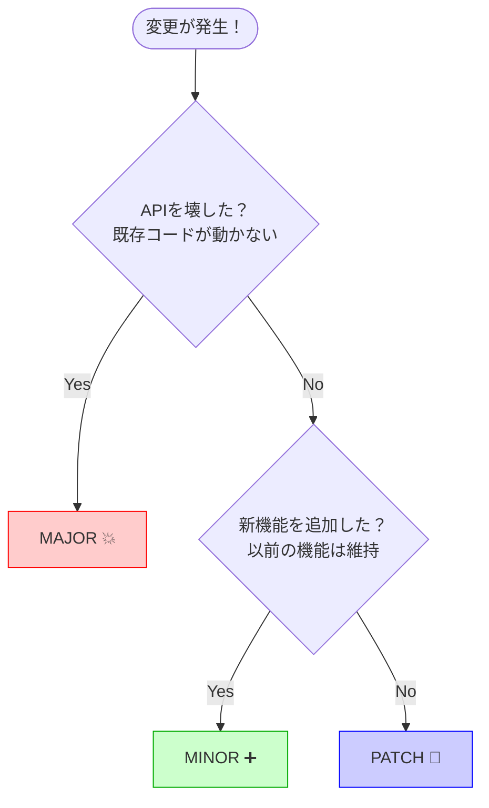
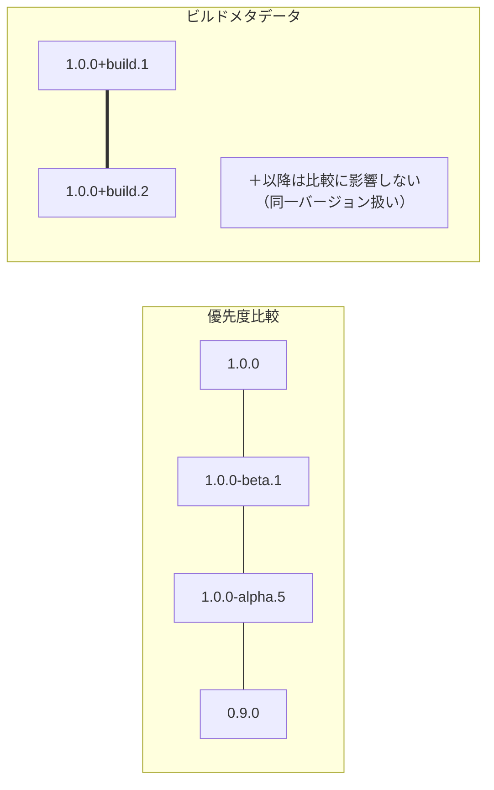

# 第02章：SemVer超入門（MAJOR.MINOR.PATCH）🧱✨

## この章でできるようになること 🎯

* `MAJOR.MINOR.PATCH` を見て、意味を即答できるようになる💬✨
* 変更内容から「どれを上げる？」をサクッと判定できるようになる✅
* `0.x` とプレリリース（`-alpha` など）の“空気感”もつかむ🧡

---

## まず暗記する1行 🧠✨

**壊す＝MAJOR💥　増やす＝MINOR➕　直す＝PATCH🐛**
これがSemVerのコアだよ〜！そしてSemVerは「公開API（みんなに約束してる部分）」の変化を、数字に意味として乗せるルールだよ📣✨ ([Semantic Versioning][1])

---

## 1) MAJOR / MINOR / PATCH って何？🔢


SemVerは基本 `X.Y.Z`（X=MAJOR, Y=MINOR, Z=PATCH）で、**同じバージョンの中身は後から書き換えない**（変えるなら新しい番号で出す）って考え方だよ📦✨ ([Semantic Versioning][1])

### MAJOR（X）＝破壊変更💥

利用者のコードが、**今までの書き方のままじゃ動かない**変更。
SemVerでは「公開APIに後方互換のない変更」を入れたらMAJORを上げるよ🚨 ([Semantic Versioning][1])

例👇

* publicメソッドを削除した🗑️
* 引数・戻り値の型を変えた🔁
* 同じ呼び出しでも意味が別物になるレベルで仕様を変えた😵

### MINOR（Y）＝後方互換な機能追加➕

古い利用者コードはそのまま動くまま、新機能が増えるパターン🌱
SemVerでは「後方互換な機能追加」をしたらMINORを上げるよ✨ ([Semantic Versioning][1])

例👇

* 新しい public メソッドやクラスを追加した➕
* 既存の使い方は変えずに、できることだけ増やした🧩

### PATCH（Z）＝後方互換なバグ修正🐛

公開APIは変えずに、内部の不具合を直すパターンだよ🛠️
SemVerでは「後方互換なバグ修正」をPATCHとして扱うよ✅ ([Semantic Versioning][1])

例👇

* 例外が出るバグを直した💥→🙂
* 計算結果が間違ってたのを修正した🔧
* パフォーマンス改善（呼び出し方は同じ）🚀

---

## 2) “後方互換”って誰視点？👀

答え：**利用者のコード視点**だよ✋✨
「自分のライブラリが動くか」じゃなくて、**使う側が困らないか**で判定する感じ😊
SemVer自体も「まず公開APIを宣言しようね」って前提を置いてるよ📣 ([Semantic Versioning][1])

---

## 3) 迷ったら、この3問で決める✅

変更したら、とりあえずこれ👇

1. **公開APIに触った？**（publicに見えてる部分）
2. 古い使い方が **動かなくなる？**

   * YES → **MAJOR** 💥
3. 動かなくならないなら、**新機能が増えた？**

   * YES → **MINOR** ➕
   * NO（バグ修正・内部改善）→ **PATCH** 🐛



（公開APIの線引きは次章でガッツリやるから、ここはこの感覚でOK🙆‍♀️）

---

### 4) 0.x の扱い（超大事）0.y.z 🧪⚠️


`0.y.z` は「初期開発フェーズ」扱いで、**いつ何が変わってもOK**ってルールになってるよ😇
だから0系は「まだ安定してないよ〜」のサインとして便利🧡 ([Semantic Versioning][1])

---

## 5) おまけ：プレリリースとビルドメタデータ🧡🏷️

### プレリリース（`-alpha` / `-beta` / `-rc.1`）

`1.2.3-alpha.1` みたいに `-` 以降が付くと「不安定かも」って意味になるよ✨
しかもプレリリースは、同じ番号の正式版（サフィックスなし）より **優先度が低い**よ（例：`1.0.0-alpha < 1.0.0`）🧡 ([Semantic Versioning][1])
NuGetもSemVerに沿った並び順で扱って、ドット区切りのプレリリースもSemVer 2.0.0としてサポートしてるよ📦✨ ([マイクロソフト ラーン][2])

### ビルドメタデータ（`+sha.XXXX`）

`1.2.3+20260121` みたいな `+` 以降は「ビルド情報」🏷️
SemVerでは**優先度比較に使わない**（同じ扱い）って決まりだよ🛠️ ([Semantic Versioning][1])



---

## 6) C#ミニ例：同じライブラリを3回リリースしてみる📦🎮

「雰囲気」でOK！SemVer判断の練習だよ😊

### v1.0.0（最初の公開）🚀

```csharp
namespace MyMath;

public static class Calc
{
    public static int Add(int a, int b) => a + b;
}
```

### v1.0.1（PATCH：バグ修正）🐛

```csharp
public static int Add(int a, int b)
{
    checked { return a + b; } // 呼び方は同じ、内部だけ改善（例）
}
```

### v1.1.0（MINOR：機能追加）➕

```csharp
public static int Multiply(int a, int b) => a * b;
```

### v2.0.0（MAJOR：破壊変更）💥

```csharp
public static long Add(long a, long b) => a + b; // シグネチャ変更（壊れやすい）
```

---

## 7) 10問クイズ（これ、何上げ？）✅🎯

前提：今のバージョンは **1.4.2**！

1. 内部リファクタだけ（挙動も同じ）🧹
2. 例外が出てたバグを修正（同じ呼び出しで正常に）🐛
3. 新しい public メソッド追加➕
4. 既存 public メソッド削除🗑️
5. 引数の型を変更🔁
6. 戻り値の型を変更🔁
7. 同じ呼び出しでも意味が変わる仕様変更😵
8. まだ試験版として出したい🧡
9. 中身は同じで“ビルド番号だけ”付けたい🏷️
10. 0系で毎週ガンガン仕様が変わる開発中🌱

### 解答📝✨

1. **PATCH → 1.4.3**
2. **PATCH → 1.4.3**（後方互換なバグ修正） ([Semantic Versioning][1])
3. **MINOR → 1.5.0**（後方互換な機能追加） ([Semantic Versioning][1])
4. **MAJOR → 2.0.0**（破壊変更） ([Semantic Versioning][1])
5. **MAJOR → 2.0.0**
6. **MAJOR → 2.0.0**
7. **MAJOR → 2.0.0**
8. **1.4.3-beta.1** みたいにプレリリースを付ける🧡 ([Semantic Versioning][1])
9. **1.4.3+build.20260121** みたいに `+` を付ける🏷️ ([Semantic Versioning][1])
10. 0系は“不安定OK”の扱い⚠️ ([Semantic Versioning][1])

---

## 8) AIで爆速チェックするプロンプト集🤖💡

### 変更→SemVer判定

```text
次の変更内容を、SemVer（MAJOR/MINOR/PATCH）のどれに当たるか判定して。
利用者コード視点で、理由も1〜2行で。
変更内容：
- ...
```

### ひっかけクイズ生成😂

```text
C#前提で、SemVer判定クイズを10問作って。
半分はひっかけにして、正解と理由も付けて。
```

### チートシート1枚化📄

```text
SemVer（MAJOR/MINOR/PATCH）を初心者向けに1枚チートシートにまとめて。
覚える1行、判断の3ステップ、例をそれぞれ3つずつ入れて。
```

---

## 9) この章の成果物：判断ルール1枚📄✨

* 壊す＝MAJOR💥 / 増やす＝MINOR➕ / 直す＝PATCH🐛 ([Semantic Versioning][1])
* `0.y.z` は“不安定OK”⚠️ ([Semantic Versioning][1])
* `-alpha` はプレリリース（正式版より低い）🧡 ([Semantic Versioning][1])
* `+build` は目印（優先度は同じ）🏷️ ([Semantic Versioning][1])

---

🌷次章では「公開API（Public API）の線引き」をやって、SemVer判定の精度を一気に上げるよ〜✂️📣

[1]: https://semver.org/ "Semantic Versioning 2.0.0 | Semantic Versioning"
[2]: https://learn.microsoft.com/en-us/nuget/concepts/package-versioning "NuGet Package Version Reference | Microsoft Learn"
