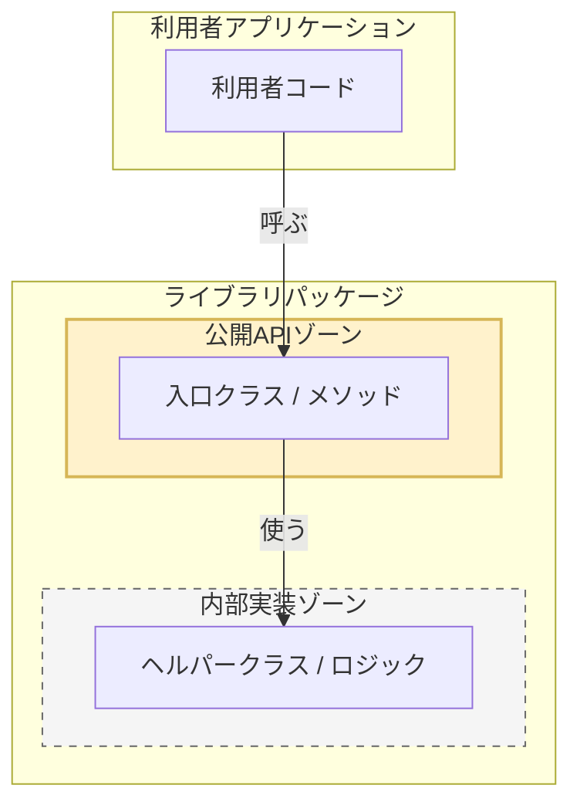
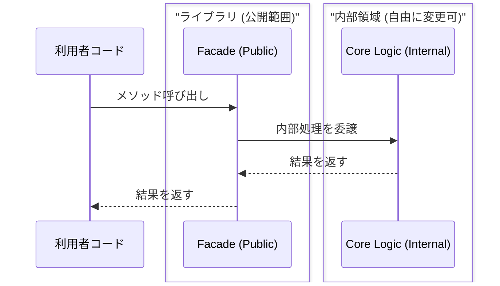

# 第03章：「公開API（Public API）」を線引きしよう📣✂️

この章は、SemVerの「番号の付け方」より先に、**そもそも何を“約束（互換性）”として守るの？**を決める回です😊
ここが決まると、**MAJORが無駄に増えなくなる**し、MINOR/PATCHも自信を持って出せるようになります✨

（ちなみに今どきのC#は **.NET 10 + C# 14** が最新ラインで進んでます📦✨ ([マイクロソフトサポート][1])）

---

## 3.1 まず結論：Public API ＝「利用者と約束する入口」🤝🚪


Public API（公開API）は、ひとことで言うと：

* **利用者が使っていい入口** ✅
* **今後も（方針に沿って）守ると約束する範囲** 📜
* **バージョン番号（SemVer）が影響する範囲** 🔢

つまり…
**公開APIの外側（内部実装）**は、将来いくらでも直せる自由ゾーン🛠️✨
**公開APIの内側**は、勝手に変えると「互換性が壊れた！」になりやすいゾーン💥



---

## 3.2 「public だから公開API」…とは限らない😇⚠️

C#では `public` は「アクセスできる」って意味だけど、**それが即 “利用者に使っていいよ” とは限りません**。

たとえば👇

* アプリ内の `public class Controller`
  → アプリの都合で `public` なだけで、外部ライブラリ利用者の契約ではないことが多い🏠
* フレームワーク都合で `public` が必要な型
  → “外に見える”けど “使っていい入口” ではない場合がある🌀

逆に、ライブラリ（NuGet等）として配るなら👇

* **基本：public/protected に触れたら “契約”** と思った方が安全📦✅
  → だからこそ **公開APIを小さく**するのが強い💪✨

---

## 3.3 公開APIを線引きする「3つの質問」🎯❓

迷ったら、次の3問で決めるのが超おすすめです😊

### Q1. 利用者は誰？👀

* 外部の他人（不特定）？
* 自分の別プロジェクト？
* チーム内だけ？（社内共通）？

👉 利用者が広いほど、公開APIは小さくしたい💡

### Q2. 利用者は何をしたい？🧩

「ユースケース」を言葉にすると線が引きやすいです✨
例：

* 「文字列を正規化して比較したい」
* 「注文の合計金額を計算したい」
* 「ファイルを安全に保存したい」

👉 “したいこと”に直結しないメンバーは公開しない方向でOK🙆‍♀️

### Q3. それは将来も維持できそう？🕰️

* 仕様が固まってる？
* 今後よく変わりそう？
* 実験中？

👉 **変わりそうなら公開しない**（もしくは “試験公開” 扱いに）🌱

---

## 3.4 公開APIを小さくするほど、SemVerが楽になる🌷✨

### なぜ小さいと嬉しいの？😊

公開APIが大きいと…

* ちょっと直しただけで「互換性が壊れた」判定になりやすい💥
* MAJORが増える → 利用者が更新を怖がる😱
* “壊したくないから直せない” が増えて、保守がしんどい🥲

公開APIが小さいと…

* 内部はガンガン改善できる🛠️✨
* 互換性判断がラクになる✅
* MAJORが減って、利用者が安心して更新できる🌼

---

## 3.5 C#で線引きする「実践テク」まとめ🧰✨


### ① `internal` を主役にする🎭

まず基本はこれ！

* 外に出すのは **最小限の `public`**
* 迷ったら `internal`（将来の自由を買う💰✨）

加えて、テストから `internal` を触りたいときは `InternalsVisibleTo` を使うのが王道です🧪

#### 例：テストだけ internal を見せる

```csharp
// AssemblyInfo.cs などに置く（プロジェクト設定で自動生成を切る方法もあるよ）
using System.Runtime.CompilerServices;

[assembly: InternalsVisibleTo("MyLib.Tests")]
```

---

### ② 「Facade（正面玄関）」パターンを作る🚪✨

利用者が使う入口を **少数のクラス**に寄せると超安定します😊

* 利用者は玄関だけ使う
* 中の部屋（内部実装）は改装し放題🏗️✨

#### 例：入口だけ public、内部は internal

```csharp
namespace MyLib;

public sealed class TextNormalizer
{
    public string Normalize(string input)
        => NormalizationCore.Normalize(input);
}

internal static class NormalizationCore
{
    internal static string Normalize(string input)
    {
        // 実装は自由に変えてOK
        return input.Trim().ToLowerInvariant();
    }
}
```



---

### ③ 署名（シグネチャ）に「内部の都合」を漏らさない🚰❌

公開APIの引数・戻り値・例外・ジェネリクス制約…
ここに内部型や気分の仕様を入れると、将来めちゃ苦しくなります😇

ありがちな事故👇

* 「DTOっぽい型」を public にしたけど、あとで項目増減したくて地獄🌀
* 戻り値を `List<T>` に固定して、あとで最適化しにくい🥲

💡コツ：

* 返すのは `IReadOnlyList<T>` など “約束が少ない型” に寄せる
* 可能なら「値」より「意味」で型を作る（後の章で強くなるやつ✨）

---

### ④ “publicメンバー追加” も「公開APIが増えた」扱い📈

SemVerでは、互換な追加ならMINORでOKになりやすいけど、
そもそも公開APIを増やすと **将来守るものが増える** んです📌

* 今は便利
* でも未来の自分がずっと守る羽目になる😂

👉 追加する前に「本当に入口に出していい？」を一回だけ考えるのが大事💭

---

## 3.6 「公開API一覧」を作る手順📝✨

ここから演習に直結する“型”を作ります🎯

### Step 1：公開API候補を拾う🔍

ライブラリ想定なら、まずはシンプルに👇

* `public` 型（class/struct/record/interface/enum）
* その `public/protected` メンバー（メソッド/プロパティ/イベント）
* 公開コンストラクタ
* 拡張メソッド（`public static` な拡張の入口）

### Step 2：候補を「入口」「内部っぽい」に分類🗂️

分類の目安👇

* ✅ 入口：ユースケースに直結、今後も維持できる
* ⚠️ 保留：便利だけど将来変わりそう
* ❌ 内部：実装詳細、最適化・変更が入りそう

### Step 3：入口だけを残して、他は internal に寄せる✂️

迷ったら **internal** が正解になりやすいです😊

---

## 3.7 演習：サンプルで「公開API一覧」を作ろう🧪📝

### お題：文字列を整形する小さなライブラリ📦✨

#### まずは “入口” を1つにする（Facade）

```csharp
namespace MiniText;

public sealed class MiniFormatter
{
    public string Normalize(string input)
        => NormalizeCore.Normalize(input);
}

internal static class NormalizeCore
{
    internal static string Normalize(string input)
        => input.Trim().ToLowerInvariant();
}
```

### ✅ あなたのタスク（提出物）📝

1. 公開API一覧（今この段階だとこれだけ！）

* `MiniText.MiniFormatter`
* `string Normalize(string input)`

2. 公開方針メモ（3行でOK）

* 利用者は誰？
* 何をしたい？
* どこまで約束する？

💡ポイント：
「NormalizeCore を public にしない理由」を書けたら満点です💯✨

---

## 3.8 AIの使いどころ（この章は“相談相手”にすると強い🤖💬）

### 使えるプロンプト例🎁

* 「このライブラリのユースケースを3つに整理して」
* 「public にすると将来困りそうな点を指摘して」
* 「Facadeを1つに絞る設計案を3つ出して。メリデメも」
* 「このAPI一覧に“契約として不足してる情報”（null/例外/スレッド）を列挙して」

AIが出した案は、**全部採用しなくてOK**🙆‍♀️
むしろ「削る」「小さくする」が勝ちです✂️✨

---

## 3.9 ちょいクイズ（感覚を固める）✅🎓

次の変更、公開API的にはどれ？（答えも下にあるよ👇）

1. `internal class Helper` を改名した
2. `public class MiniFormatter` に `public string Normalize(string input)` を追加した
3. `public string Normalize(string input)` の戻り値を `string?` に変えた

**答え**👇

1. 公開API外（基本セーフ）✅
2. 公開APIが増えた（互換な追加扱いになりやすいけど“守るもの増えた”）➕
3. 公開APIの契約変更（null許容は利用者に影響しやすい）⚠️

---

## 3.10 発展：公開APIの“うっかり変更”を検知したい人へ🔔🧯

「線引きできたけど、うっかり壊すのが怖い…」ってときは、仕組みで守れます😊

* **API互換性チェック**：`Microsoft.DotNet.ApiCompat.Tool`（グローバルツール）で差分検知できる🧰 ([Microsoft Learn][2])
* **公開APIの記録ファイル**：`PublicAPI.Shipped.txt` / `PublicAPI.Unshipped.txt` で “追加/削除” をレビューしやすくする流れがある📄✨ ([Andrew Lock | .NET Escapades][3])

このあたりは、あとで「運用」に入ったときにめちゃ効きます💪（今は存在を知っておけばOK🙆‍♀️）

---

## まとめ：この章で手に入れるもの🎁✨

* 公開API＝「守る約束の範囲」って感覚🤝
* `public` と “公開API” は別物になり得るって理解😇
* 公開APIを小さくするほど、SemVer運用が楽になる🌷
* 「公開API一覧＋公開方針メモ」を作れる📝✅

次の章（互換性の種類）に行く前に、**“どこを守るか”が決まった状態**になっていれば完璧です🥰✨

[1]: https://support.microsoft.com/en-us/topic/-net-10-0-update-january-13-2026-64f1e2a4-3eb6-499e-b067-e55852885ad5?utm_source=chatgpt.com ".NET 10.0 Update - January 13, 2026"
[2]: https://learn.microsoft.com/ja-jp/dotnet/fundamentals/apicompat/global-tool?utm_source=chatgpt.com "Microsoft.DotNet.ApiCompat.Tool グローバル ツール - .NET"
[3]: https://andrewlock.net/preventing-breaking-changes-in-public-apis-with-publicapigenerator/?utm_source=chatgpt.com "Preventing breaking changes in public APIs with ..."
