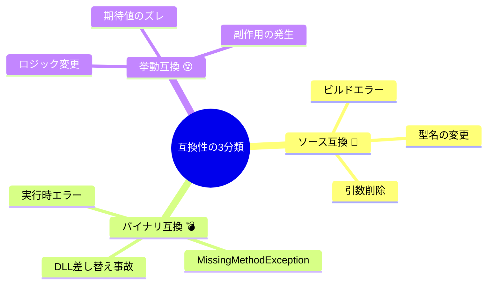
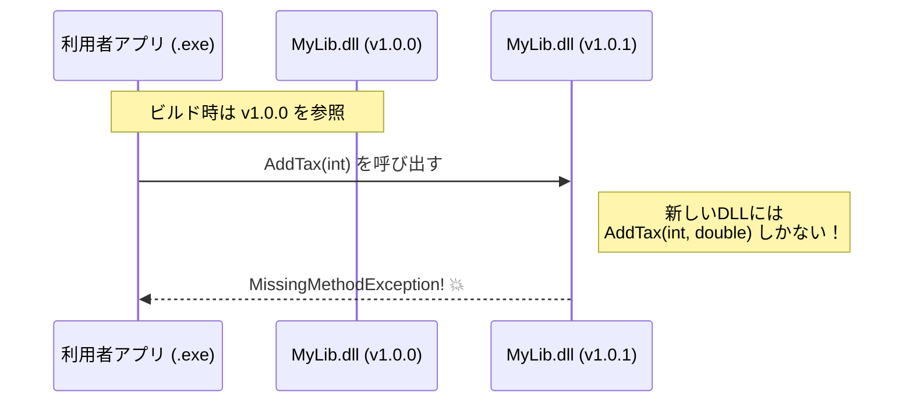

# 第04章：互換性の種類（ソース互換・バイナリ互換・挙動互換）🧩

## 4.0 この章でできるようになること🎯✨

この章が終わると…

* 「壊れた😇」を **3種類** に言い分けできる🗣️✨
* それが **SemVerでどれを上げる話か（MAJOR/MINOR/PATCH）** の判断がしやすくなる🔢🧠
* 変更の説明（リリースノート/Changelog）に **必要な言葉** が手に入る📰✍️

---

## 4.1 まず結論：互換性は3つに分けるとラク🥰🧠


### ✅ ソース互換（Source compatibility）🧯

**利用者のコードがコンパイルできなくなる**タイプ。
例：メソッド名変更、引数の型変更、削除など。

> 合言葉：**「ビルドで落ちる😇」**

---

### ✅ バイナリ互換（Binary compatibility）💣

利用者コードは **“再コンパイルしなければ”** そのまま動くはずなのに、
**実行時に壊れる**タイプ。

.NETの世界だと、古い版でビルドされたアプリが新しいDLLを読み込んだら、呼び出せなくなって例外が出る…みたいなやつです💥
（例：シグネチャ変更で `MissingMethodException` など）([Microsoft Learn][1])

> 合言葉：**「起動したら爆発💥」**

---

### ✅ 挙動互換（Behavioral compatibility）😵

コンパイルもできるし、実行もできる。
でも **結果や意味が変わって困る**タイプ。

.NETの互換性の分類でも、破壊的変更は「source / binary / behavioral」で扱われます🧩([Microsoft Learn][2])

> 合言葉：**「動くけど、なんか違う😵」**



---

## 4.2 3種類を“利用者目線”で整理👀💡

ここ超大事ポイント🎀
SemVerが守りたいのは **「公開APIの後方互換」**（利用者が困らないこと）です🤝([Semantic Versioning][3])

なので判断の順番はこれがラク👇

1. **利用者コードはビルドできる？**（ソース互換）🧯
2. **ビルド済みの利用者アプリは動く？**（バイナリ互換）💣
3. **動いた結果は同じ？期待どおり？**（挙動互換）😵

---

## 4.3 ミニ実験：3種類の“壊れ方”をC#で体感しよ🧪✨

### 今回の構成（超ミニ）📦

* `MyLib`（クラスライブラリ）
* `App`（コンソールアプリ、MyLibを参照）

Visual Studioで「ソリューション」作って、プロジェクト2つ追加するだけでOK🙆‍♀️✨
（VS Codeでもできるけど、まずはVSのほうが迷子になりにくいよ🧭）

---

## 4.4 ソース互換アウト例：コンパイルで落ちる🧯😇


### v1.0.0（MyLib）

```csharp
namespace MyLib;

public static class Price
{
    public static int AddTax(int price) => (int)(price * 1.10);
}
```

### 利用者（App）

```csharp
using MyLib;

Console.WriteLine(Price.AddTax(1000));
```

### v1.1.0（破壊しちゃう変更の例💥）

たとえばメソッド名を変更👇

```csharp
public static int AddTaxIncluded(int price) => (int)(price * 1.10);
```

➡️ App側が `Price.AddTax(...)` を呼んでるので **ビルドエラー** になります😇
これが **ソース互換アウト**🧯

**判断メモ📝**

* 利用者コードが直さないとビルドできない
  → だいたい **MAJOR候補**（公開APIを変えたなら）🔢💥
  SemVer的にも「互換性のないAPI変更はMAJOR」だよね、って話になります([Semantic Versioning][3])

---

## 4.5 バイナリ互換アウト例：実行時に壊れる💣🔥


ここ、初心者さんが一番「え、なんで？😳」ってなりやすいとこ！

### ざっくり状況👀

* Appは **古いMyLib.dll** を前提にビルドされている
* なのに、実行時にロードされたのが **新しいMyLib.dll**
* 新しいDLLから “そのメソッド” が消えてた/形が変わってた
  → 実行時に呼べずに例外💥

.NETの公式ガイドでも、公開APIの変更で **古い版でビルドされたアセンブリが呼べなくなる**のがバイナリ破壊で、例として「引数追加で `MissingMethodException`」が挙げられてます💣([Microsoft Learn][1])

### よくある地雷：引数を増やす⚠️

```csharp
// v1.0.0
public static int AddTax(int price) => (int)(price * 1.10);

// v1.0.1 でつい…（※例としてのNG変更）
public static int AddTax(int price, double rate) => (int)(price * rate);
```

Appは古いシグネチャ `AddTax(int)` を呼ぶ前提でビルドされてるので、
実行時に新DLLしかないと「そのメソッド無いよ！」で💥になる可能性が出ます。

**判断メモ📝**

* でも「ビルドせず差し替え運用」みたいな場面だと **実行時爆発💣** が表に出る



---

## 4.6 挙動互換アウト例：動くけど結果が変わる😵🌀


これが一番やっかい😇（CIが通っても混ざる…）

### v1.0.0（例：丸め方が雑）

```csharp
public static int AddTax(int price) => (int)(price * 1.10); // 切り捨て
```

### v1.0.1（バグ修正のつもり）

```csharp
public static int AddTax(int price) => (int)Math.Round(price * 1.10); // 四捨五入
```

コンパイルもOK、実行もOK。
でも「100円のときの期待値」が利用者の想定と違うと **挙動互換アウト** になる😵

.NETの互換性分類でも “behavioral change” は別枠で扱われます([Microsoft Learn][2])

**判断メモ📝**

* バグ修正（PATCH）でも、利用者がその挙動に依存してたら事故ることがある😇
* だから「影響がある挙動変更」は説明を厚くしたり、場合によってはMINOR/MAJOR扱いを検討する流れになります📣

---

## 4.7 SemVerの判断にどう繋がる？🔢🧠（超シンプル版）


SemVerの基本ルールはこれ👇（公開APIが前提）([Semantic Versioning][3])

* **MAJOR**：互換性のないAPI変更💥
* **MINOR**：後方互換な機能追加➕
* **PATCH**：後方互換なバグ修正🐛

この章の分類に当てると、ざっくりこう考えると迷いにくいよ✨

* **ソース互換アウト**：だいたいMAJOR寄り（公開APIなら）💥
* **バイナリ互換アウト**：だいたいMAJOR寄り（公開APIなら）💥
* **挙動互換アウト**：難しい！

  * 影響軽微：PATCHで説明📝
  * 影響でかい：MINOR/MAJOR＋目立つ告知🚨

※「最終的には“利用者が困るか”」が王様👑

---

## 4.8 演習：壊れ方カード分類🃏✨（10問）

それぞれ「ソース🧯 / バイナリ💣 / 挙動😵」を当ててね！

1. publicメソッドを削除した
2. publicメソッド名を変更した
3. 例外の種類が変わった（今まで投げなかった例外を投げる）
4. 丸め方を切り捨て→四捨五入に変えた
5. メソッドの引数を1つ増やした
6. 戻り値の型を `int` → `long` にした
7. nullを返してたのを空文字にした
8. ログの出力順だけ変えた
9. パフォーマンス改善で内部実装だけ変更した（結果は同じ）
10. 同じ入力でも結果が変わるようになった（仕様変更）

### こたえ（サクッと）✅

1. ソース🧯 + バイナリ💣
2. ソース🧯 + バイナリ💣
3. 挙動😵（ケースによっては互換性重大）
4. 挙動😵
5. ソース🧯 + バイナリ💣（例：MissingMethodExceptionの原因にも）([Microsoft Learn][1])
6. ソース🧯（＋影響範囲でバイナリも）
7. 挙動😵
8. だいたい挙動😵（ログ依存してたら事故）
9. 互換性OK寄り（ただし副作用が出たら😵）
10. 挙動😵（多くは破壊的）

---

## 4.9 AIの使いどころ🤖💡（この章の最強コンボ）


### ✅ コンボA：利用者コードをAIに作らせる👩‍💻➡️🤖

「このAPIを使う利用者コードを3パターン作って」って頼むと、
“壊れ方”の想像が一気に具体化するよ✨

**プロンプト例👇**

```text
次のC# APIを使う側（利用者）のコード例を3つ作って。
それぞれ「変更に弱い使い方」も混ぜて。
API:
- public static int AddTax(int price)
```

---

### ✅ コンボB：変更案を出してもらって分類ゲーム🧩

「この変更は source / binary / behavioral のどれ？」って聞くと、判断練習になる🧠✨
.NETでもその3分類がよく使われます([Microsoft Learn][2])

**プロンプト例👇**

```text
次の変更は「ソース互換」「バイナリ互換」「挙動互換」のどれが壊れる？
理由も短く。
変更: AddTax(int price) を AddTax(int price, double rate) にした
```

---

## 4.10 この章の成果物（持ち帰り）📝🎁

### ✅ あなた専用「互換性3分類メモ」テンプレ✨

* ソース互換アウト🧯：例）＿＿＿＿
* バイナリ互換アウト💣：例）＿＿＿＿
* 挙動互換アウト😵：例）＿＿＿＿
* 今日の自分ルール（1行）👑：＿＿＿＿

---

もしよければ次は、第4章の内容を使って「公開APIの変更チェック手順（超ミニ版✅）」も作れるよ〜！📌✨

[1]: https://learn.microsoft.com/en-us/dotnet/standard/library-guidance/breaking-changes?utm_source=chatgpt.com "Breaking changes and .NET libraries"
[2]: https://learn.microsoft.com/en-us/dotnet/core/compatibility/10?utm_source=chatgpt.com "Breaking changes in .NET 10"
[3]: https://semver.org/?utm_source=chatgpt.com "Semantic Versioning 2.0.0 | Semantic Versioning"
