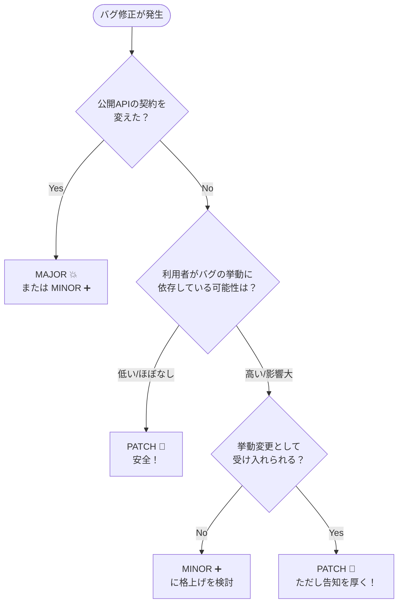

# 第05章：PATCHの作法（バグ修正だけど注意点あるよ）🐛⚠️

## 5.0 この章のゴール🎯✨

この章を終えたら、こんな状態になれます👇

* 「これはPATCHで出してOK？それともMINOR/MAJOR？」を自分で判定できる✅
* PATCHでやりがちな“事故パターン”を避けられる🛡️
* 利用者が安心できる「リリースノートの書き方」がわかる📰✨
* **成果物**：あなた専用の「PATCH判断チェックリスト」✅📄

---

## 5.1 PATCHって結局なに？🔢🐛

SemVerのルールでは、**PATCH（x.y.Z）**はこういう位置づけです👇

* **後方互換なバグ修正だけ**を入れたときに、PATCHを上げる
* “バグ修正”は **誤った挙動を正す内部変更**（public APIの契約を壊さない）([Semantic Versioning][1])

ここで超大事なのが一言👇

> 「バグ修正だからPATCHでしょ😊」
> **…が、たまに地雷💣**（利用者が“バグに依存”してることがある）

---

## 5.2 PATCHで「やっていい」典型パターン✅🐛

「PATCHで出しても利用者が困りにくい」代表例です👇

### A) 例外・クラッシュ系の修正💥➡️🙂

* null参照で落ちてたのを直す
* 特定条件で無限ループしてたのを止める
* スレッド競合でたまに死ぬのを直す

### B) 計算・変換の“明らかな誤り”修正🧮🔧

* ドキュメントや仕様に照らして「これは間違い」と言える結果を直す
* ただし、**結果が変わる＝利用者への影響説明は必須**📝

### C) パフォーマンス改善（機能追加なし）🚀

SemVer系の仕様・解説では、**機能を増やさずに性能特性を改善する**のは“バグ修正”扱いに含める考え方があります([Semantic Versioning][2])
（ただし、性能改善が原因でタイミングや順序が変わると、利用者が困る場合もあるよ⚠️）

---

## 5.3 PATCHでやりがちな地雷💣（これだけは覚えて！）


PATCHは「壊さない修正」なんだけど、**“壊れ方”はAPIだけじゃない**んだよね😇

### 地雷①：例外の種類・タイミングが変わる⚡

* 以前：`ArgumentException`
* 変更後：`InvalidOperationException`
  → 利用者が `catch` してたら挙動が変わる😱

### 地雷②：戻り値の“意味”が変わる🌀

* 以前：空文字 `""` を返していた
* 変更後：`null` を返す（またはその逆）
  → 利用者側が落ちる・分岐が変わる💥

### 地雷③：シリアライズ結果（JSONなど）の形が変わる📦

* プロパティ名の大小文字、出力順、既定値の扱いが変わる
  → “動くけど壊れる”が起きやすい😵

### 地雷④：C#の「互換性」は1種類じゃない🧩

C#/.NETでは「ソース互換」「バイナリ互換」みたいに壊れ方が分かれるよ、という話が公式ドキュメントにもあります([Microsoft Learn][3])
PATCHのつもりでも、**再コンパイル必須**になったら利用者は困るかも…⚠️

---

## 5.4 PATCH判定フロー（これで迷いが激減）🧭✨


迷ったら、順番にこれをチェックしてね👇

### ステップ1：Public APIは変わってない？📣

* public型/メソッド/引数/戻り値/例外の契約
* ドキュメントで約束してる挙動
  ここが変わるなら、PATCHは黄色信号🚥

### ステップ2：利用者コードの“よくある書き方”が壊れない？👀

* 典型的な使い方を3つ想像（or AIに生成させる🤖）
* それがそのまま動くなら安心度UP🙂

### ステップ3：変わるのは「間違いが正しくなる」だけ？✅

* “誤り”と説明できるならPATCH寄り
* でも **利用者が依存してた可能性**があるなら、告知を厚く📰

### ステップ4：影響が大きいなら「MINOR/MAJOR + 説明」も検討📣

SemVerは“バージョン番号だけ”じゃなく、**伝え方（互換ポリシー・リリースノート）**がセットで効いてくるよ([Semantic Versioning][1])



---

## 5.5 C#実例で練習（PATCHでOK？）🧪💡

### ケース1：クラッシュ修正（PATCHでOK寄り）✅

**変更**：特定条件で落ちてたのを直した（戻り値や例外契約はそのまま）

* ✅ PATCH候補
* 📝 リリースノートに「どの条件で落ちてたか」「回避されるようになった」を書く

### ケース2：例外の型を変更（PATCHだと危ないかも）⚠️

**変更**：`ArgumentException` → `InvalidOperationException`

* 利用者が `catch (ArgumentException)` してたら挙動が変わる😱
* 🤔 影響が出そうなら **MINOR** にするか、少なくとも説明を強くする

### ケース3：戻り値の仕様を厳密化（“バグ依存”が起きやすい）💣

**変更**：今まで通ってた入力をエラーにした（厳格化）

* セキュリティ/不正入力対策として正しいことも多いけど、利用者にとっては破壊的になり得る
* 影響が広いなら **MINOR/MAJOR** を検討 + 代替手段を用意したい

---

## 5.6 PATCHでも「説明」は超大事📰✨（テンプレ）

PATCHは「安心して上げられる」ことが価値なので、**短くてもいいから影響を書こう**😊

### PATCHリリースノート（最小テンプレ）📝

* ✅ Fixed：何が直った？（一言）
* 🎯 Impact：誰が助かる？どんな状況で起きてた？
* ⚠️ Compatibility：挙動が変わる可能性がある点（あれば正直に）
* 🔁 Workaround：もし困ったらどうする？（回避策があるなら）

---

## 5.7 実装面：C#の“バージョン”は複数あるよ🔢🧩

.NETライブラリは、**NuGetのバージョン**だけじゃなく、アセンブリ側にも複数のバージョン情報があります。公式ガイダンスでも、この違いが整理されています([Microsoft Learn][4])

* NuGet package version（利用者がよく見る）
* AssemblyVersion / FileVersion / InformationalVersion（ビルド成果物側）

この章の結論としてはシンプルで👇
**「PATCHリリース＝まずは“NuGetのバージョン”で伝わる形にする」**が基本だよ🙂([Microsoft Learn][4])

### 例：プロジェクトファイルでPATCHを上げる（例）

```xml
<Project Sdk="Microsoft.NET.Sdk">
  <PropertyGroup>
    <TargetFramework>net9.0</TargetFramework>

    <!-- 配布用のバージョン（SemVer） -->
    <PackageVersion>1.4.3</PackageVersion>

    <!-- あるいは Version を使う運用でもOK -->
    <!-- <Version>1.4.3</Version> -->
  </PropertyGroup>
</Project>
```

※ NuGetのバージョン表現やプレリリース表記のルールは、公式リファレンスがあるよ([Microsoft Learn][5])

---

## 5.8 演習（3問）✍️🎓

### 演習1：PATCH判定クイズ✅

次の変更、PATCHでOK？それともMINOR/MAJOR？理由も1行で👇

1. nullで落ちるのを修正
2. 例外型を変更
3. JSONのプロパティ名の大小文字が変わる

### 演習2：リリースノートを書いてみよう📰

演習1の「PATCHで出す」と決めたものについて、テンプレで3〜5行書く✍️✨

### 演習3：AIレビュー（“利用者目線チェック”）🤖👀

AIに「利用者が困るパターン」を洗い出してもらって、あなたが最終判断！

**プロンプト例**（コピペOK）👇

```text
次の変更を SemVer の PATCH として出して安全かレビューして。
利用者コードが壊れる可能性（例外・戻り値・挙動・再コンパイル必要性）を具体例つきで指摘して。
最後に、PATCH/MINOR/MAJOR の推奨と、その理由を短くまとめて。
（対象：C# の NuGet ライブラリ）
変更内容：
- （ここに変更を書く）
```

---

## 5.9 章末まとめ（チートシート）📄✨

* PATCH＝**後方互換なバグ修正**（SemVerの基本）([Semantic Versioning][1])
* でも「バグ修正＝安全」とは限らない（利用者がバグに依存してることがある）💣
* 迷ったら **Public API → 典型利用例 → 影響 → 説明**の順で判定🧭
* .NETは“バージョンが複数ある”ので、まずは **NuGetのバージョン**で伝わる形にするのが基本🙂([Microsoft Learn][4])

---

必要なら、あなたの想定してる「サンプルライブラリ題材」（例：日付ユーティリティ、文字列整形、簡易キャッシュなど）に合わせて、**PATCH地雷が出やすい変更例**をこちらで作って、演習問題を“実戦寄り”に組み直すよ🐣💪

[1]: https://semver.org/?utm_source=chatgpt.com "Semantic Versioning 2.0.0 | Semantic Versioning"
[2]: https://semantic-versioning.org/?utm_source=chatgpt.com "Semantic Versioning: Semantic Versioning"
[3]: https://learn.microsoft.com/en-us/dotnet/csharp/versioning?utm_source=chatgpt.com "Versioning - C# | Microsoft Learn"
[4]: https://learn.microsoft.com/en-us/dotnet/standard/library-guidance/versioning?utm_source=chatgpt.com "Versioning and .NET libraries"
[5]: https://learn.microsoft.com/en-us/nuget/concepts/package-versioning?utm_source=chatgpt.com "NuGet Package Version Reference"
