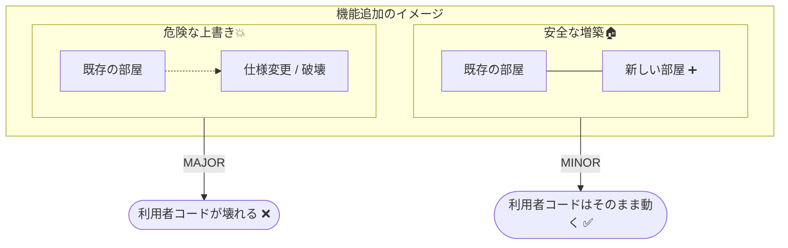
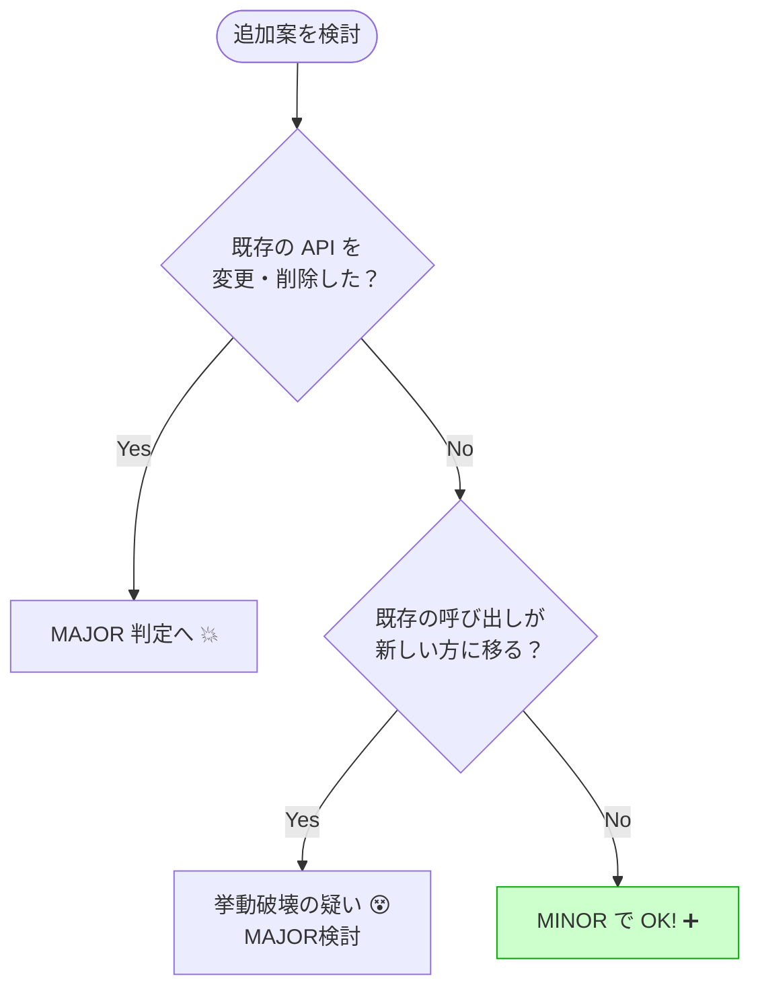

# 第06章：MINORの作法（安心して増やす方法）➕😊

この章のゴールはこれ👉 **「機能追加したい！でも利用者を壊したくない！」を両立する “増やし方” を身につける**ことです🛡️✨
SemVerのルールでは、**後方互換な機能追加**は **MINOR** を上げます（例：`1.2.3 → 1.3.0`）➕🔢
さらに **何かをDeprecated（非推奨）にした時もMINOR** です📣（そして MINOR を上げたら PATCH は 0 に戻す）🔁 ([Semantic Versioning][1])

---

## 6.1 まず超重要：MINORって「増築」🏠➕


MINORはイメージで言うと「家を壊さずに部屋を増やす」🏠➡️🏠➕
つまり…

* 既存の入口（既存API）はそのまま✅
* 入口を変えずに、新しい入口や部屋（新API）を追加する✅
* 既存の部屋の使い勝手（挙動）を勝手に変えない✅

SemVerは、**公開APIに “後方互換な機能追加” が入ったらMINOR** と明確に言っています📘✨ ([Semantic Versioning][1])



---

## 6.2 “壊れてない”って何？ 3つだけ意識しよ🧠🧩


C#/.NETの世界だと「壊れた😇」はだいたいこの3系統に分かれます👇

1. **ソース互換が壊れた**：再コンパイルしたらエラー💥
2. **バイナリ互換が壊れた**：再コンパイルしてなくても実行時に死ぬ💣（例：`MissingMethodException`）
3. **挙動互換が壊れた**：動くけど結果が変わって事故😵

特に注意：**MINORは “利用者が更新しても安心” が売り**なので、②③が混ざると一気に地雷です💥 ([Microsoft Learn][2])

---

## 6.3 MINORで「だいたい安全」な追加パターン集✅✨


ここからが本編🎉
「これならMINORで出しやすいよ〜」の代表パターンを、C#向けにまとめます📌

### パターンA：新しい “型” を足す（クラス/record/enumなど）🧱➕


* 新しい`public class`や`record`を追加する
* 既存の型は触らない（触るほど事故りやすい😇）

例：オプションを “後付け拡張しやすい形” にしておくと最強💪

```csharp
public sealed record FormatOptions
{
    public bool Trim { get; init; } = true;
    public bool NormalizeWhitespace { get; init; } = false;
}
```

💡この形だと、次のMINORでプロパティを増やしやすい（＝将来の自分が助かる）🧡

---

### パターンB：新しい “メソッド名” を足す（オーバーロードより安全）🧰✨


オーバーロード追加って実は罠があるので（後述💣）、**まずは別名メソッド**が安全です😊

```csharp
public static class TextUtil
{
    public static string Normalize(string input) => input.Trim();

    // MINORで追加（別名メソッド）
    public static string NormalizeForSearch(string input)
        => Normalize(input).ToLowerInvariant();
}
```

---

### パターンC：新しい “オーバーロード” を足す（ただし安全条件あり）⚠️➕

SemVer的には「追加」だからMINORっぽいんだけど、.NETでは **新オーバーロードが “昔の呼び出し” を奪う**ことがありえます😵
Microsoftのガイドでも、**新しいオーバーロードで以前は一意だった呼び出しが曖昧になる**など、ソース破壊になり得ると言ってます💥 ([Microsoft Learn][2])
さらに、**既存オーバーロードを実質的に潰して挙動が変わる追加はNG** とも明記されています🚫 ([Microsoft Learn][3])

✅「比較的安全な追加」になりやすい形のコツ👇

* “より一般的” な引数のオーバーロードを後から足さない（`object`系を後出ししない）
* 既存の呼び出しが **新しい方に移らない** ことを確認する
* 曖昧呼び出しが増えないことを確認する

---

### パターンD：クラスに “新しいメソッド/プロパティ” を足す（OKになりやすい）➕

一般に、クラスのpublicメンバーを増やすのは「追加」なのでMINORでやりやすいです🙂
ただし、**virtual化は別の話**（互換性ルールでNG寄り扱い）なので、まずは非virtualで増やすのが無難です⚠️ ([Microsoft Learn][3])

---

## 6.4 MINORに見えて “地雷” な追加パターン💣😇

### 地雷1：既存メソッドに “引数を足す” ➕（これはMINORじゃない！）


これは **バイナリ互換が壊れます**。古い利用者バイナリが実行時に死ぬやつ💣 ([Microsoft Learn][2])

---

### 地雷2：インターフェイスにメンバー追加🧨


「実装してる側」が全部壊れる可能性が高いです😵
ガイドでも **“インターフェイスに何か足すと既存実装が壊れる”** と強めに注意されています⚠️ ([Microsoft Learn][2])

---

### 地雷3：オーバーロード追加で “呼ばれる先が変わる” 🌀


これがいちばん初心者が踏みがち😂
例：もともと `uint` しか無かったのに `int` を足すと、昔は `int` を渡しても `uint` 側に吸われてたのが、再コンパイル後に `int` 側へ移る…みたいなやつです💥
**挙動が変わるなら破壊的** と明記されています🚫 ([Microsoft Learn][3])

---

## 6.5 MINOR判定チェックリスト✅📝（これだけでいい！）

新機能を入れたら、次の順でチェックしてね👇

1. **既存の利用者コードは、そのままコンパイルできる？** 🧯
2. **既存の利用者バイナリは、そのまま実行できる？** 💣回避
3. **同じ入力に対する挙動は変わってない？** 😇回避
4. 追加したものは “既存を邪魔しない”？（特にオーバーロード）⚠️ ([Microsoft Learn][2])
5. バージョンは `x.(y+1).0` になってる？（MINOR上げたらPATCHは0）🔁 ([Semantic Versioning][1])



---

## 6.6 ミニ演習🧪：これMINORでOK？それとも危険？💣

### 問1：既存メソッドに引数を足した

```csharp
// before
public string Format(string s);

// after
public string Format(string s, bool trim = true);
```

→ **答え：危険（MINORじゃない）** 💥
理由：シグネチャ変更＝バイナリ互換アウトになりやすい💣 ([Microsoft Learn][2])

---

### 問2：別名メソッドを追加した

```csharp
public string Format(string s);
public string FormatForLog(string s);
```

→ **答え：MINORでOKになりやすい** ✅✨
理由：既存呼び出しを奪わない増築🏠➕

---

### 問3：オーバーロードを追加した

```csharp
public void Save(uint id);
public void Save(int id); // 追加
```

→ **答え：要注意（挙動が変わるなら破壊）** 💣
理由：古い呼び出しが新しい方へ移って挙動差が出るとNG🚫 ([Microsoft Learn][3])

---

## 6.7 AIの使いどころ🤖💡（MINOR編）


AIは「案を増やす」より、**事故らない確認役**にすると超強いです🛡️✨

### ① “互換性チェック係” にする✅

おすすめプロンプト👇

```text
次の変更案が、既存利用者にとって
ソース互換 / バイナリ互換 / 挙動互換 を壊さないかレビューして。
特にオーバーロード解決の変化や、例外・戻り値の変化を疑って。
危険なら代替案（別名メソッド、Optionsパターン等）も出して。
```

### ② “安全な追加案” を複数出させて比較する🧠

```text
このライブラリに新機能Xを追加したい。
SemVer的にMINORで出せる「後方互換な設計案」を3案。
それぞれのメリデメと事故ポイントも書いて。
```

### ③ “利用者っぽいテスト” を作らせる🧪

```text
公開APIを使う利用者コードのテストを作って。
旧バージョンの呼び出しが、新バージョンでも同じ挙動か確認したい。
オーバーロードや例外もチェックして。
```

---

## 6.8 この章の成果物📌✨（ここまで作れたら勝ち！）

* ✅ **MINORの安全パターン集**（A〜Dを自分用に1枚メモ）
* ✅ **MINOR判定チェックリスト**（6.5をコピペでOK）
* ✅ 次章（MAJOR）に向けて「危険パターン💣」の自分用メモ

---

おまけ：2026時点の最新C#として **C# 14** が案内されていて、.NET 10 でサポートされる旨がMicrosoft Learnに明記されています📌 ([Microsoft Learn][4])
（この章は言語機能より“互換性の守り方”が主役だけど、最新環境だと資料や検証が揃ってて学びやすいよ〜😊✨）

次は「演習：安全な追加・危険な追加を判定🧪」を、もう少し問題数増やして “小テスト形式” にしてもいいよ📚💕

[1]: https://semver.org/?utm_source=chatgpt.com "Semantic Versioning 2.0.0 | Semantic Versioning"
[2]: https://learn.microsoft.com/en-us/dotnet/standard/library-guidance/breaking-changes "Breaking changes and .NET libraries - .NET | Microsoft Learn"
[3]: https://learn.microsoft.com/en-us/dotnet/core/compatibility/library-change-rules ".NET API changes that affect compatibility - .NET | Microsoft Learn"
[4]: https://learn.microsoft.com/en-us/dotnet/csharp/whats-new/csharp-14 "What's new in C# 14 | Microsoft Learn"
