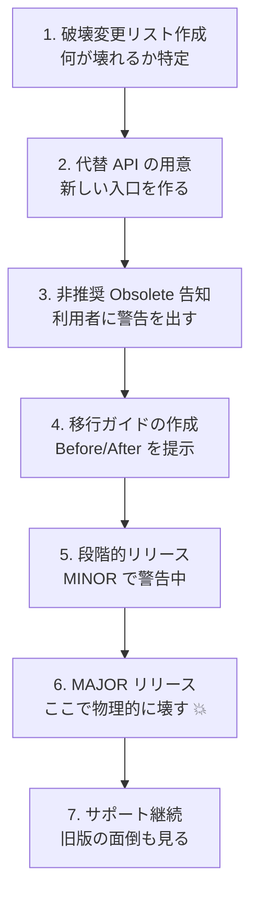
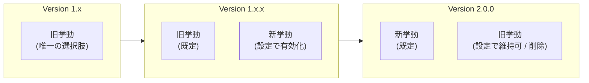

# 第07章：MAJORの作法（壊すなら“優しく壊す”💥🌷）

## 7.0 この章のゴール🎯✨

この章が終わる頃には…👇

* 「どれが破壊変更（＝MAJOR）か」を迷わず判定できる✅
* MAJORを出す前に、**移行しやすい道**（代替API・告知・移行ガイド）を用意できる📣
* “壊した理由”を**利用者目線**で説明できる🫶

---

## 7.1 まず結論：MAJOR＝Public APIに後方互換がない変更💥

SemVerでは、**Public APIに後方互換がない変更が入ったら MAJOR を上げる**のがルールだよ📌（そして上げたら MINOR/PATCH は 0 に戻す）🔢✨ ([Semantic Versioning][1])

ここで大事なのは、「実装が大きい/小さい」じゃなくて、**利用者のコードが困るか**👀💦
たとえ1行の変更でも、利用者がコンパイルできない・挙動が変わるなら MAJOR だよ💥

---

## 7.2 破壊変更あるある（C#で起きがち）💣

「MAJOR案件」になりやすい代表例👇

### A) 物理的に壊す系（分かりやすい💥）


* public 型・メソッド・プロパティの削除 🗑️
* 名前変更（リネーム）✍️
* シグネチャ変更（引数の型/数、戻り値型）🔁

### B) 見た目は残ってるのに壊す系（事故りやすい😇）


* 例外の種類/タイミングが変わる（try/catch が崩壊）💣
* null 許容が変わる（受け取り/戻り値）🫠
* 既定値や意味が変わる（動くけど結果が違う）😵

> Microsoftのライブラリ向けガイダンスでも「破壊変更を避けつつ進化させるのが重要」「破壊変更の扱いは慎重に」が軸になってるよ📘 ([Microsoft Learn][2])

---

## 7.3 “優しく壊す”ための基本フロー 7ステップ🪜🌷


MAJORは「出す」より「出し方」が本体だよ😺✨



### Step 1：破壊変更リストを作る📝


* 何が壊れる？（コンパイル？実行時？挙動？）
* 影響範囲は？（利用者コードのどのパターンが死ぬ？）

👉 ここ、AIに「利用者コード例」を大量生成させると最強🤖💡

### Step 2：代替APIを先に用意する🛟

* 新しいメソッド/型を先に追加（MINORで出せると理想）➕
* “何に置き換えればいいか”が一発で分かる設計にする👀

### Step 3：非推奨（Deprecated）で段階移行🧡⚠️


C#なら **`[Obsolete]`** を使って「次はこっち使ってね」を明示できるよ📣
`Obsolete` は **警告にもエラーにもできる**（段階を作れるのが強い）✨ ([Microsoft Learn][3])

### Step 4：移行ガイドを書く📄✨


* 変更点 → 影響 → 置き換え → コピペ例
  この順で、利用者が迷子にならない導線を作る🧭

### Step 5：互換性テスト（利用者コード風）を追加🧪

* “利用者が書きそうなコード”をテストとして固定
* MAJOR前に「どこが壊れるか」を確定させる🔍

### Step 6：告知＆リリースノートを強めに📢🚨

* Breaking Changes を最上段に！
* 重要度（高/中/低）と対応難易度（簡単/普通/大変）も添えると親切💕

### Step 7：MAJORを出す（そしてサポート方針をセットに）🎁

* 「旧MAJORはいつまで面倒見る？」を一言で示す🕰️
* .NET自体も、**メジャー版には意図的で文書化された破壊変更が含まれる**前提で運用されてるよ（“だからこそドキュメントが大事”の例）📘 ([Microsoft Learn][4])

---

## 7.4 C#での王道パターン：Obsoleteで“優しく壊す”🧡→💥

### 例：v1 で `Parse(string)` があって、v2 で置き換えたいケース

#### v1.1.0（MINOR）：新API追加（移行先を作る）➕

```csharp
public static class UserId
{
    public static Guid Parse(string text) => Guid.Parse(text);

    // 新しい推奨API（Try版に寄せる）
    public static bool TryParse(string? text, out Guid value)
        => Guid.TryParse(text, out value);
}
```

#### v1.2.0（MINOR）：旧APIを Obsolete（警告）🧡⚠️


```csharp
public static class UserId
{
    [Obsolete("UserId.TryParse(text, out var id) を使ってね🙏", false)]
    public static Guid Parse(string text) => Guid.Parse(text);

    public static bool TryParse(string? text, out Guid value)
        => Guid.TryParse(text, out value);
}
```

`Obsolete` は **メッセージ付き**にすると超親切だよ💬✨ ([Microsoft Learn][3])

#### v2.0.0（MAJOR）：旧API削除💥

* ここで `Parse` を消す（または互換を断つ変更をする）🗑️
* その代わり、移行ガイドに「置き換え表」を載せる📄

---

## 7.5 “挙動変更”のMAJORは、設定で逃がせることがある🛟⚙️


挙動変更って「バグ修正でも利用者が依存してた」みたいに揉めやすいよね😇
このとき、Microsoftのガイダンスでは **設定（スイッチ）で新挙動を opt-in/opt-out 可能にする**戦略が紹介されてるよ🔧 ([Microsoft Learn][5])

たとえば👇

* 既定は旧挙動のまま（互換維持）
* 追加の設定をONにすると新挙動に切り替え（段階移行）
* MAJORで既定を新挙動にする（ここで“本当に切る”）💥

これ、利用者にとってめちゃ救いになる🫶✨



---

## 7.6 移行ガイドの“勝ちテンプレ”📄✨（そのまま使える）

移行ガイドは、長文より「迷わない順番」が命🧭💕

### ✅ 構成（おすすめ）

1. **このバージョンで何が変わる？（3行で）**
2. **影響を受ける人は誰？（該当条件）**
3. **変更点リスト（Breaking Changes）**
4. **置き換え表（旧→新）** ←最重要🔥
5. **コピペ例（Before/After）**
6. **よくある詰まりポイントFAQ**
7. **サポート期間・相談窓口（あれば）**

### ✅ 置き換え表（例）

* `UserId.Parse(text)` → `UserId.TryParse(text, out var id)`
* （例外依存してた人向け）try/catch の書き換え例…など

---

## 7.7 リリースノートでの書き方📰🚨


NuGetの世界でも、バージョンは **Major＝Breaking changes** の意味を持つよ📦 ([Microsoft Learn][6])
だから MAJOR のリリースノートは、最低でも👇を入れるのが優しさ💕

* Breaking Changes（最上段）🚨
* 影響（どんな利用者が困るか）👀
* 移行手順（どれに置き換えるか）🛟
* 例（Before/After）🧾

---

## 7.8 章末ミニ演習🎓✨（30〜60分）

### お題：あなたはライブラリ作者！v2.0.0 を出します💥

次のどれか1つを選んで、**移行ガイド（A4 1枚）**を書いてみよう📄✍️

1. public メソッド削除（置き換え先を追加してから削除）🗑️
2. 引数型を `int` → `decimal` に変更（旧は残して Obsolete）🔁
3. 挙動変更（設定スイッチで段階移行）⚙️

### 成果物✅

* 破壊変更リスト📝
* 置き換え表（旧→新）📌
* Before/After コード例 1つずつ🧾✨

---

## 7.9 AIの使いどころ（この章で強いプロンプト）🤖💡

そのまま投げてOKなやつ置いとくね👇

* 「このAPI変更（貼る）で、利用者コードが壊れるパターンを10個出して。コンパイルエラー/実行時/挙動の3分類もして」
* 「旧→新の置き換え表を作って。移行の難易度も“簡単/普通/大変”で付けて」
* 「移行ガイドをA4 1枚に収まるように、見出し構成と文章まで下書きして」
* 「Breaking Changes を最上段にしたリリースノートを書いて。利用者が読む前提で！」

---

## 7.10 まとめ💐

* MAJORは「大改修」じゃなくて、**利用者が後方互換で困るか**で決まる💥 ([Semantic Versioning][1])
* “優しく壊す”には、**代替API→Obsolete→移行ガイド→MAJOR**の階段が最強🪜🌷 ([Microsoft Learn][3])
* 挙動変更は、設定で段階移行できると平和になりやすい🛟⚙️ ([Microsoft Learn][5])

---

次のメッセージで、こみやんまさんの想定に合わせて「第7章のサンプル題材（小さなC#ライブラリ）」を1つ固定して、**v1→v2の“完成版 移行ガイド”**まで一緒に作る形にもできるよ📦✨

[1]: https://semver.org/?utm_source=chatgpt.com "Semantic Versioning 2.0.0 | Semantic Versioning"
[2]: https://learn.microsoft.com/en-us/dotnet/standard/library-guidance/versioning?utm_source=chatgpt.com "Versioning and .NET libraries"
[3]: https://learn.microsoft.com/en-us/dotnet/api/system.obsoleteattribute.message?view=net-10.0&utm_source=chatgpt.com "ObsoleteAttribute.Message Property (System)"
[4]: https://learn.microsoft.com/en-us/dotnet/core/versions/?utm_source=chatgpt.com "How the .NET Runtime and SDK are versioned"
[5]: https://learn.microsoft.com/en-us/dotnet/standard/library-guidance/breaking-changes?utm_source=chatgpt.com "Breaking changes and .NET libraries"
[6]: https://learn.microsoft.com/en-us/nuget/concepts/package-versioning?utm_source=chatgpt.com "NuGet Package Version Reference"
