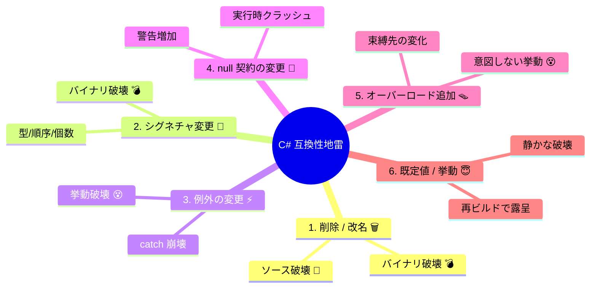

# 第08章：C#の互換性地雷（超頻出6本だけ）💣6️⃣

この章は「SemVer（MAJOR / MINOR / PATCH）を“正しく運用”するために、C#で特に事故りやすいポイントだけを最短で押さえる回」です😊✨
**覚える地雷は6本だけ**！ここだけで、更新事故がかなり減ります🛡️

---

## 8.0 この章のゴール🎯✨

読み終わったら、次ができるようになります👇

* 「その変更、利用者のコード壊れる？」を**瞬時に想像**できる👀⚡
* 壊れるなら「**どう優しく壊すか**（段階移行）」を選べる🌷
* SemVerで「**どの番号を上げるか**」を判断できる🔢✅

---

## 8.1 まず超大事：C#の“互換”は3種類あるよ🧩

* **ソース互換**：利用者が再コンパイルしたら通る？（通らない＝コンパイルエラー）🧯
* **バイナリ互換**：利用者が再コンパイルしなくても動く？（動かない＝実行時例外）💥
* **挙動互換**：動くけど結果が変わって困らない？（困る＝静かに事故）😇

この章は、**この3つが壊れやすい変更**をピンポイントでやります💣✨

---

# 地雷① publicメンバー削除（/名前変更）🗑️💥

## 何が起きる？😱

* 利用者が再コンパイル → **コンパイルエラー**（ソース互換アウト）🧯
* 利用者が再コンパイルせずに差し替え → **MissingMethodException など**（バイナリ互換アウト）💣
  「公開メンバーを消す/改名する」は、超ド直球で壊れます。公式ルールでも **“DISALLOWED（ダメ）”**扱いです。 ([Microsoft Learn][1])

## 典型例（イメージ）🧠

* v1.2.0：`public void DoThing()` がある
* v1.3.0：`DoThing()` を削除（または `DoStuff()` に改名）
  → 利用者コードが `DoThing()` を呼んでたら即死💥

## SemVer判断🔢

* **基本：MAJOR**（破壊変更）💥
* 例外はほぼないです（消した時点で壊れるので…）🥺

## “優しく壊す”正解ルート🌷

1. **残したまま非推奨**にする（Obsolete）⚠️
2. 代替APIへ誘導（メッセージに移行手順）🧭
3. 十分な移行期間のあと **MAJORで削除** 🪜

> Obsolete は「将来消す予定のAPI」に付けるのが推奨です。 ([Microsoft Learn][2])
> メッセージをちゃんと書くルールもあります（CA1041）。 ([Microsoft Learn][3])

### ミニ演習✍️

「消したいメソッド」を1つ選んで、**Obsoleteメッセージ**を書いてみよう🧡
（例：代替メソッド名・期限・移行の1行サンプル）

### AIの使いどころ🤖💡

* 「このAPIをObsoleteにするなら、利用者が迷わないメッセージ案を3つ」
* 「移行コード例を、最短版/丁寧版で出して」

---

# 地雷② 引数・戻り値の変更（型/順序/個数）🔧💥

## 何が起きる？😱

* 署名（シグネチャ）が変わると、ソースもバイナリも壊れやすいです💣
  公式ルールでも「型変更」「パラメータ追加/削除/順序変更」は **DISALLOWED**です。 ([Microsoft Learn][1])

## 典型パターン🧨

* `int` → `long` にした（“広くしたつもり”でも別物）
* パラメータを1つ追加した（呼び出し側が全部修正必要）
* 戻り値を `object` → `string` にした（型が変われば別契約）

## SemVer判断🔢

* **基本：MAJOR** 💥
  （利用者の呼び出しが変わる＝破壊変更）

## “増やしたい”時の安全なやり方🌱

* **新しいメソッド名で追加**して、旧APIは非推奨へ🪜
* もしくは **オーバーロード追加**（ただし地雷⑤あり！）⚠️
* 「戻り値を増やしたい」なら、**新しい型を作って新API**が安全🧱✨

### ミニ演習✍️

「引数を増やしたい変更」を1つ想像して、
**MAJORを出さずに済む設計案**を2つ作ってみよう😊

### AIの使いどころ🤖

* 「互換性を壊さずに引数を増やす設計案を3つ。メリデメ付きで」
* 「利用者コードの修正量が最小になる移行プランを作って」

---

# 地雷③ 例外の種類/タイミング変更⚡🧯

## 何が起きる？😱

例外は“ドキュメントに書いてなくても”、利用者が **catch してる**ことが多いです🥺
公式ルールでも、例外はかなり細かく「OK/NG」が決められてます。 ([Microsoft Learn][1])
さらに「挙動変更は一番よくある破壊変更」って明言されてます。 ([Microsoft Learn][4])

## 危ない変更例💣

* 今まで `false` を返してたのに、急に例外を投げるようにした
* `ArgumentException` を投げてたのを、別系統の例外に変えた
* 例外の発生条件が増えた（入力が同じでも落ちる）

## SemVer判断🔢（目安）

* 既存コードパスで新しい例外が飛ぶ → **基本 MAJOR** 💥
* ただし「より派生した例外にする」など **OK扱い**もある（catch が生きる） ([Microsoft Learn][1])
* “バグ修正”でも、利用者がその挙動に依存してたら破壊になり得る😇 ([Microsoft Learn][4])

## “優しく変える”コツ🌷

* 例外を増やすより、**Tryパターン**（`TryParse` みたいなやつ）に新APIで逃がす🛟
* 挙動が変わるなら、**設定で切り替え**（互換モード）も強い✨ ([Microsoft Learn][2])
* 変えるなら、**リリースノートで「いつ/何が/どう変わる」**を目立たせる📰🚨

### ミニ演習✍️

「例外を投げたい理由」を1つ書いて、

* **Try系の代替API**
* **互換モードで段階導入**
  どっちが良いか判断してみよう😊

### AIの使いどころ🤖

* 「この変更、利用者のcatchを壊す？ 代表的な利用者コード例を出して」
* 「互換モード案（設定名/デフォルト/移行手順）を提案して」

---

# 地雷④ null許容の変更（受け入れ/返す）🚫➡️✅ / ✅➡️🚫

## 何が起きる？😱

nullまわりは **“コンパイルは通るのに事故る”** が多いです😇
さらに、Nullable Reference Types（NRT）の注釈変更は、実際に **source breaking**（警告が増える等）として扱われることがあります。 ([Microsoft Learn][5])

## 2種類あるよ🧠

### A) パラメータ：nullを「受け入れなくした」🚫

* 今まで `null` 入れて動いてた利用者が、実行時に例外…💥
* 互換ルール的にも「受け入れ範囲を狭める」は危険。 ([Microsoft Learn][1])

### B) 戻り値：nullを「返すようにした」😇

* 利用者が `!` で握りつぶしてたら、実行時に `NullReferenceException` 😵
* “契約”としては大変更になりやすいです💣

## SemVer判断🔢（目安）

* **null契約が変わる＝基本 MAJOR 寄り** 💥
* ただし「NRT注釈の修正だけで、実害は警告中心」の場合は判断が揺れる（ポリシーで決めるのが大事）🧭
  ※注釈修正でも「APIがより制約的になって警告が増える」ことがある ([Microsoft Learn][5])

## “優しく変える”コツ🌷

* 新しいAPIを作る：

  * `GetX()` はそのまま
  * `TryGetX(out ...)` や `GetXOrDefault(...)` を追加🛟
* 返り値がnullになり得るなら、**型で表現**する（Result型/Option風など）も強い🧱✨
* どうしても変えるなら、**警告→移行期間→MAJOR**の王道へ🪜

### ミニ演習✍️

次のどっちが安全か選んで理由も一言👇

* (1) `string GetName()` を `string? GetName()` にする
* (2) `bool TryGetName(out string name)` を追加する

### AIの使いどころ🤖

* 「null契約を壊さない代替API案を3つ、利用者コード例つきで」
* 「NRT有効な利用者で出る警告パターンを想定して」

---

# 地雷⑤ オーバーロード追加の罠（呼ばれる先が変わる）🪤☎️

## 何が起きる？😱

「メソッドは消してないし、追加しただけだよ？」
…でも **再コンパイルした瞬間に別のオーバーロードが選ばれて挙動が変わる** ことがあります😇

公式ルールでも、
**“既存のオーバーロードを事実上ふさぐ（preclude）”追加**で、しかも挙動が変わるなら **DISALLOWED**です。 ([Microsoft Learn][1])

## さらに2026っぽい注意⚡（最新系）

C# 13 / 14 + .NET 9 / 10 では、**span 系の新ルールでオーバーロード解決が変わる**ケースが実際に起きています。 ([Microsoft Learn][6])
つまり、「追加しただけ」で将来の言語更新でも揺れやすい…！😵

## SemVer判断🔢（目安）

* “呼ばれる先が変わり得る” → **挙動互換が壊れる可能性**
* 影響が出るなら **MAJOR寄り**（少なくとも“判断が必要”）⚠️

## 回避テク🌷（めちゃ効く）

* **曖昧になりそうな型の組み合わせを避ける**

  * `int` と `uint`、`object` と `string`、`params`、`Span` などは特に注意💥
* “追加”はしても、**既存の呼び出しが新しい方に流れない設計**にする
* 迷ったら：

  * メソッド名を分ける🧠
  * あるいは利用者側で明示キャストが必要になる設計は避ける🙅‍♀️

### ミニ演習✍️

「追加したら呼ばれる先が変わりそうな例」をAIに作らせて、
自分の言葉で「なぜ変わる？」を説明してみよう🙂

### AIの使いどころ🤖

* 「このAPIにオーバーロードを追加したら、既存呼び出しがどれに束縛される？ケース別に」
* 「危険な追加例を5個作って。どう直せば安全かもセットで」

---

# 地雷⑥ 既定値・微妙な挙動変更（静かに事故る）😇🌀

## 何が起きる？😱

* optional parameter の既定値を変えた
* public const / enum の値を変えた
* “バグ修正”で結果が変わった（利用者が旧挙動に依存してた）

このへん、**テストが薄いと本番で発覚**しがちです💥

### 6-A) 既定値（default）変更は公式にNG寄り🚫

公式ルールで **「既定値変更はDISALLOWED」**で、
「再コンパイル後に挙動が変わって破壊になり得る」と説明されています。 ([Microsoft Learn][1])

### 6-B) const / enum の値変更もNG💥

公開定数やenum値の変更も **DISALLOWED**です。 ([Microsoft Learn][1])

### 6-C) “挙動変更”は一番多い破壊変更😇

公式ガイドでも「挙動変更は最も一般的で、例外・入出力形式など何でも破壊になり得る」と言っています。 ([Microsoft Learn][4])

## SemVer判断🔢（目安）

* 既定値やenum値の変更 → **MAJOR** 💥
* バグ修正でも影響が大きいなら、**MINOR/MAJOR + ちゃんと説明**が安全🛡️
* 互換モード（設定で切り替え）も有力✨ ([Microsoft Learn][2])

## “優しく変える”コツ🌷

* optional parameter は、**既定値を変えるより新オーバーロード**へ🪜（公式にも「移動」パターンが説明あり） ([Microsoft Learn][1])
* enum は「値を変える」より、**新メンバー追加＋旧は非推奨**が基本
* 挙動変更は、できれば **デフォルトOFFで導入して設定でON**（互換モード）✨ ([Microsoft Learn][2])

### ミニ演習✍️

「PATCHで入れたくなる修正」を1つ考えて、

* “利用者が依存してる可能性”
* “リリースノートに書くべき一文”
  を作ってみよう📝✨

### AIの使いどころ🤖

* 「この修正、挙動変更として利用者が困るパターンを10個想像して」
* 「リリースノートの“影響”欄だけ、短い版/丁寧版で書いて」

---

## 8.2 地雷6本チートシート📄✨（ここだけ暗記でOK）

1. **public削除/改名** → ほぼ **MAJOR** 💥 ([Microsoft Learn][1])
2. **引数/戻り値の変更** → 基本 **MAJOR** 💥 ([Microsoft Learn][1])
3. **例外の変更** → 条件次第で **MAJOR**（ルール細かい！）⚠️ ([Microsoft Learn][1])
4. **null契約の変更** → 基本 **MAJOR寄り**、注釈修正でも注意⚠️ ([Microsoft Learn][5])
5. **オーバーロード追加** → 呼ばれる先が変わるなら危険🪤 ([Microsoft Learn][1])
6. **既定値/enum/微挙動** → 静かに事故。既定値変更はNG寄り🚫 ([Microsoft Learn][1])

---

## 8.3 章末ミニクイズ🧠✅（SemVerどれ？）

Q1：`public const int TimeoutMs = 1000;` を `1500` に変えた
Q2：`GetUser(string id)` に引数 `bool includeDeleted` を追加した
Q3：古い `public Foo()` を削除した
Q4：`Do(int x)` に `Do(uint x)` を追加した（挙動は別）
Q5：optional parameter の既定値を変えた
Q6：例外を `ArgumentException` → その派生例外に変えた

**答え（目安）🎓**

* Q1：MAJOR 💥 ([Microsoft Learn][1])
* Q2：MAJOR 💥 ([Microsoft Learn][1])
* Q3：MAJOR 💥 ([Microsoft Learn][1])
* Q4：危険（挙動が変わるならNG寄り）→ MAJOR寄り⚠️ ([Microsoft Learn][1])
* Q5：MAJOR 💥 ([Microsoft Learn][1])
* Q6：条件次第でOK寄り（catchが生きる）✅ ([Microsoft Learn][1])

---

必要なら、次のメッセージで「この章の演習用に、超小さいサンプルライブラリ＋利用者プロジェクト構成（コード付き）」も作ります😊📦✨

[1]: https://learn.microsoft.com/en-us/dotnet/core/compatibility/library-change-rules ".NET API changes that affect compatibility - .NET | Microsoft Learn"
[2]: https://learn.microsoft.com/en-us/dotnet/standard/library-guidance/breaking-changes "Breaking changes and .NET libraries - .NET | Microsoft Learn"
[3]: https://learn.microsoft.com/en-us/dotnet/fundamentals/code-analysis/quality-rules/ca1041?utm_source=chatgpt.com "CA1041: Provide ObsoleteAttribute message (code analysis)"
[4]: https://learn.microsoft.com/en-us/dotnet/standard/library-guidance/breaking-changes?utm_source=chatgpt.com "Breaking changes and .NET libraries"
[5]: https://learn.microsoft.com/en-us/dotnet/core/compatibility/aspnet-core/6.0/nullable-reference-type-annotations-changed "Breaking change: Nullable reference type annotations changed - .NET | Microsoft Learn"
[6]: https://learn.microsoft.com/en-us/dotnet/core/compatibility/core-libraries/9.0/params-overloads "Breaking change: C# overload resolution prefers `params` span-type overloads - .NET | Microsoft Learn"
