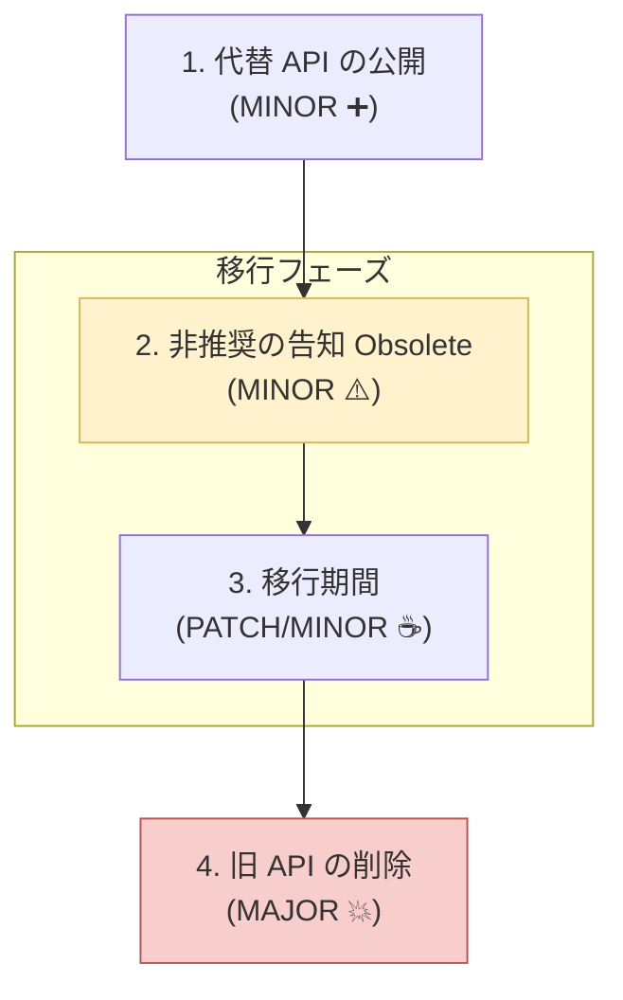

# 第09章：非推奨（Deprecated）の正しい進め方🧡⚠️

**この章のゴール**：いきなり壊さずに、段階的に「新しい使い方」へ誘導できるようになるよ🪜✨

---

## 9.1 なんで「非推奨」って必要なの？🤔🧡

APIって、使う人にとっては“約束”そのもの📣
でも、設計を良くしたくて「古いのやめたい」こと、普通にあるよね…😇

そこで **非推奨（Deprecated）** を挟むと、こうなる👇

* ✅ 今すぐ壊さずに「将来変わるよ」を伝えられる
* ✅ 利用者が“好きなタイミング”で移行できる
* ✅ いきなりMAJORで爆発💥を減らせる

そしてSemVer的にも、**非推奨はドキュメント更新＋MINORリリースで出す**のが王道だよ📘✨ ([Semantic Versioning][1])



---

## 9.2 王道の3段階ルート🪜✨（いちばん事故らない）


「非推奨」は、だいたいこの順番で進めるのが勝ち筋🌷

### ステップ①：代替APIを用意する（まず逃げ道）🏃‍♀️💨

* 「こっち使ってね」が無い非推奨は、ただの嫌がらせになりがち🥺
* 先に **新API** を出して、使える状態にする✨

### ステップ②：非推奨にする（警告でお知らせ）⚠️📣

* 次のリリース（たいていMINOR）で

  * 古いAPIを **[Obsolete]** でマーク
  * ドキュメントとリリースノートに「いつ消える予定か」も書く🕰️

### ステップ③：削除する（MAJORでやる）💥

* **公開APIを消す＝後方互換を壊す**なので、SemVer的にはMAJORが基本💥 ([Semantic Versioning][1])
* 「非推奨にしたからMINORで削除してOK」にはならない点に注意⚠️（利用者のコードは普通に壊れる）

---

## 9.3 C#での「非推奨」の実装：Obsolete属性🧡⚠️

C#はこれでいける👇

### ✅ Obsolete属性の基本

* `[Obsolete]` を付けると、利用側でコンパイル警告が出るよ⚠️

  * `CS0612` / `CS0618` が代表 🧾 ([Microsoft Learn][2])
* メッセージ付きにすると「何を使え」が伝えられる💬
* `error: true` にすると **警告じゃなくてエラー**にできる🔥 ([Microsoft Learn][3])

#### 例：まずは「警告」で優しく誘導🧡

```csharp
public class PaymentClient
{
    [Obsolete("Use ChargeAsync(amount, currency). This will be removed in v2.0.0.", false)]
    public void Charge(int amount)
    {
        // 互換のために新APIへ委譲する（よくあるやり方）
        ChargeAsync(amount, "JPY").GetAwaiter().GetResult();
    }

    public async Task ChargeAsync(int amount, string currency)
    {
        // 新実装
        await Task.Delay(1);
    }
}
```

---

## 9.4 “警告メッセージ”は設計そのもの📝✨

非推奨メッセージは、だいたいこの4点を入れると強いよ💪

1. ✅ **何が非推奨か**
2. ✅ **代替は何か**（ここが最重要！）
3. ✅ **いつ消える予定か**（バージョン or 時期）🕰️
4. ✅（可能なら）**移行ガイドへの導線**🔗

### 3種類テンプレ（章の演習の答えにもなるやつ）🧡

**①短い（最低限）**

* `Use Xyz(). Will be removed in v2.0.0.`

**②丁寧（安心）**

* `Use Xyz() instead. This API is deprecated since v1.4.0 and will be removed in v2.0.0. See migration guide: <link>.`

**③ガチ警告（危機感MAX）**

* `DO NOT USE. Use Xyz(). Removal scheduled for v2.0.0. Upgrade now to avoid build breaks.`

---

## 9.5 “いつ消える？”を決めるコツ🕰️📌

ここが互換ポリシーの心臓部🫀✨

おすすめの決め方（迷ったらこれ）👇

* **非推奨を出したMINORから「1つ以上のMINOR期間」は残す**（利用者に猶予）
* **削除はMAJORで**（SemVerの筋）💥 ([Semantic Versioning][1])
* さらに丁寧にするなら、削除直前のリリースで「警告→エラー」に段階アップもアリ🔥（ただし急にビルド落ちるので慎重に）

---

## 9.6 “警告を無視される問題”への対策🧯


「警告って、慣れるとみんな無視する」問題あるよね😇
ここは **利用者側の設定** と **提供側の工夫** の両面で攻める💪

### ✅ 利用者側：警告をエラー扱いにする（本気のチーム向け）🔥

C#はプロジェクト設定で「警告をエラー」にできるよ🛠️ ([Microsoft Learn][4])

```xml
<PropertyGroup>
  <TreatWarningsAsErrors>true</TreatWarningsAsErrors>
</PropertyGroup>
```

「一部だけエラー」もできる👇（例：Obsolete系だけ厳しくしたい等） ([Microsoft Learn][4])

```xml
<PropertyGroup>
  <WarningsAsErrors>CS0612;CS0618</WarningsAsErrors>
</PropertyGroup>
```

### ✅ 提供側：診断IDやリンクを付けて“ちゃんと読ませる”📣🔗

.NET 5以降では、Obsoleteに **DiagnosticId** や **UrlFormat** を使って、
「どの非推奨なのか」を識別したり、説明ページへ誘導できる設計が進んでるよ✨ ([Microsoft Learn][5])
（※ライブラリ側でドキュメントに飛ばせるの、めちゃ便利🧡）

---

## 9.7 “やっちゃダメ”非推奨あるある😵‍💫💣

### ❌ 代替が無いのにObsoleteだけ付ける

→ 利用者「どうしろと…？」で詰む🥺

### ❌ PATCHで非推奨や削除を混ぜる

→ 期待と違って事故る（PATCHは基本「安心更新」枠）🐛⚠️

### ❌ Obsoleteを付けたのに、リリースノートに書かない

→ 気づかれない。移行が進まない。MAJORで地獄👹

---

## 9.8 ミニ演習（この章の手を動かすやつ🧪✨）

### 演習A：非推奨メッセージを3種類作る📝

題材：`Charge(int amount)` を `ChargeAsync(int amount, string currency)` に置き換えたい

* 短い版
* 丁寧版
* ガチ警告版

👉 **チェック**：代替・期限・導線が入ってる？✅

### 演習B：利用者プロジェクトで警告を“エラー”にしてみる🔥

* `TreatWarningsAsErrors` をON
* 古いAPI呼び出しでビルドが落ちるのを体験😇
* 新APIに直して、ちゃんと通るのを確認✅

---

## 9.9 AIの使いどころ（この章は相性良すぎ🤖🧡）

* 🤖 非推奨メッセージ案を10個出させて「読みやすい1つ」に絞る
* 🤖 プロジェクト内の旧API利用箇所を洗い出す（置換案も）
* 🤖 “移行ガイド”の見出し構成だけ作らせる（本文はあなたが整えると強い✨）

**プロンプト例**（コピペOK）👇

```text
次のAPIを非推奨にします。利用者が迷わないObsoleteメッセージを
(短い/丁寧/強め)の3種類で提案して。必ず「代替API」「削除予定バージョン」
「移行の一言」を入れて。

旧: Charge(int amount)
新: ChargeAsync(int amount, string currency)
削除予定: v2.0.0
```

---

## 9.10 この章の成果物📌✨

* ✅ 非推奨メッセージテンプレ（短い／丁寧／強め）
* ✅ 「非推奨→移行期間→削除（MAJOR）」の運用ルール案🪜
* ✅ 利用者向け：警告をエラー化する設定スニペット🔥

---

次の章（第10章）では、この非推奨もちゃんと利用者に届くように **Changelog／リリースノートの書き方📰✨** に進むよ〜！

[1]: https://semver.org/?utm_source=chatgpt.com "Semantic Versioning 2.0.0 | Semantic Versioning"
[2]: https://learn.microsoft.com/en-us/dotnet/csharp/misc/cs0612?utm_source=chatgpt.com "Compiler Warning (level 1) CS0612 - C#"
[3]: https://learn.microsoft.com/en-us/dotnet/api/system.obsoleteattribute.-ctor?view=net-10.0&utm_source=chatgpt.com "ObsoleteAttribute Constructor (System)"
[4]: https://learn.microsoft.com/en-us/dotnet/csharp/language-reference/compiler-options/errors-warnings?utm_source=chatgpt.com "C# Compiler Options to report errors and warnings"
[5]: https://learn.microsoft.com/en-us/dotnet/fundamentals/syslib-diagnostics/obsoletions-overview?utm_source=chatgpt.com "Obsolete features in .NET 5+"
