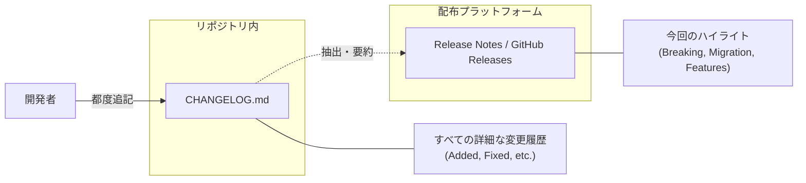

# 第10章：Changelog／リリースノート（説明できる人が強い📰✨）

この章は「更新したい人（利用者）が困らない説明」を書けるようになる回だよ😊🫶
コードが良くても、説明がないと **“怖くて更新できない”** ってなりがち…😇💦
だから **SemVer（MAJOR/MINOR/PATCH）** とセットで、伝え方を型にしちゃおう〜📘✨

---

## 1. まず結論：Changelog とリリースノートは役割が違うよ📌


### Changelog（変更履歴）🗂️

* リポジトリに置く「バージョンごとの、ちゃんと整理された変更一覧」
* “人間のための” 変更メモ（コミットログ貼り付けじゃない🙅‍♀️）
* Keep a Changelog の考え方が超定番だよ✨ ([keepachangelog.com][1])

### リリースノート（Release Notes）📣

* 「今回のリリースで利用者が読むべきこと」を短くまとめたもの
* GitHub Releases の本文などに載せることが多いよ🧡
* GitHub には **自動生成のリリースノート** もある（PR一覧・貢献者・フルChangelogへのリンクなど） ([GitHub Docs][2])

👉 イメージ：
**Changelog＝辞書**、**リリースノート＝ニュース** みたいな感じ📰✨



---

## 2. “利用者が助かる” 文章に必須の4点セット🧰✨

リリースノート／Changelog、どっちでも大事なのはこれ👇

1. **何が変わった？**（変更点）
2. **誰が影響受ける？**（影響範囲）
3. **壊れる？壊れない？**（互換性：SemVerの意味付け）
4. **どう直す？**（移行手順／回避策）

SemVer 自体も「公開APIを宣言して、X.Y.Zで意味を伝える」って考え方だよ📌 ([Semantic Versioning][3])

---

## 3. Changelogの“型”は Keep a Changelog が最強にラク🧱✨


Keep a Changelog のおすすめポイント👇

* 先頭に **Unreleased**（未リリース）を置いて、日々そこへ追記
* リリースするときに Unreleased を新しいバージョンへ “お引っ越し”
  これで管理が超ラクになるよ😊🪄 ([keepachangelog.com][4])

### よく使う見出し（カテゴリ）📌

* Added / Changed / Deprecated / Removed / Fixed / Security
  この6つに寄せると読み手が迷わない✨ ([keepachangelog.com][5])

---

## 4. “SemVer別” 書き分けルール（ここ超大事😺✨）

### PATCH（例：1.2.3 → 1.2.4）🐛

* 書くべき：**何が直った？**、回避策、影響ある人は誰？
* 書かない方がいい：大改造の話、仕様変更っぽい話（混ぜると怖い😇）

**テンプレ（PATCH）**

* Fixed：◯◯の条件で例外が出るのを修正
* Impact：◯◯を使ってる人だけ
* Workaround（任意）：一時回避（あれば）

---

### MINOR（例：1.2.3 → 1.3.0）➕

* 書くべき：**新機能の使い方（最小例）**、追加点
* 注意：追加でも「呼ばれるメソッドが変わる」系は事故るので、影響を一言入れる🙂

---

### MAJOR（例：1.2.3 → 2.0.0）🚨💥

* 書くべき：**破壊変更を最上部**、移行手順、置き換え先
* コツ：見出しに **BREAKING** を付けると親切✨（目に入る👀）

---

## 5. 実戦！C#ライブラリの Changelog 例（コピペで使える📄✨）

ここでは架空ライブラリ **KomiyaMath** ってことにするね😺

```md
# Changelog
この変更履歴は Keep a Changelog の形式に基づき、Semantic Versioning に従います。

## [Unreleased]
### Added
- （ここに次のリリース予定を書いていく）

## [1.1.0] - 2026-01-20
### Added
- `TryParseInvariant(string, out decimal)` を追加（後方互換）✨
### Fixed
- `Parse()` が全角スペースを含む入力で失敗することがある問題を修正🐛

## [1.0.1] - 2026-01-10
### Fixed
- `RoundTo()` が負の値で誤差が大きくなるケースを修正🐛

## [2.0.0] - 2026-01-23
### Changed
- **BREAKING**: `Parse(string)` を `Parse(string, CultureInfo)` に変更（カルチャ明示）🚨
### Removed
- **BREAKING**: 以前から `[Obsolete]` にしていた `LegacyParse()` を削除💥
### Fixed
- 大きい桁数の丸めで一部例外になる問題を修正🐛
```

ポイント👆

* **Unreleased が先頭**（毎日ここに書く） ([keepachangelog.com][4])
* **破壊変更は強調＆上の方**（見落とし防止）🚨
* “どう困るか” が伝わる単語を入れる（カルチャ、例外、削除…）🙂

---

## 6. 同じ内容を「リリースノート」に変換するコツ📰✨

Changelog は網羅寄り、リリースノートは **利用者が今読むべきこと**に絞る✂️

### 例：v2.0.0 のリリースノート（短くて強い💪）

```md
## v2.0.0 リリースノート 🚀

### 🚨 Breaking Changes
- `Parse(string)` を `Parse(string, CultureInfo)` に変更しました。
  - 影響：`Parse("123.45")` のようにカルチャ未指定で呼んでいるコード
  - 移行：`Parse(text, CultureInfo.InvariantCulture)` のように指定してください

- `[Obsolete]` にしていた `LegacyParse()` を削除しました

### 🐛 Fixes
- 大きい桁数の丸めで一部例外になる問題を修正
```

👉 **“影響” と “移行” が1行でもある**だけで、利用者の安心度が爆上がりするよ😊🫶

---

## 7. GitHub の「自動生成リリースノート」も賢く使おう🤖🧡

GitHub Releases では **自動生成**ができるよ！
PR一覧・貢献者・フルChangelogへのリンクが出るので、土台に最高✨ ([GitHub Docs][2])

さらに `.github/release.yml` を置くと、ラベルでカテゴリ分けもできる👇 ([GitHub Docs][2])

### release.yml（例：Features / Bug Fixes に分ける）

```yml
changelog:
  categories:
    - title: Features ✨
      labels:
        - enhancement
        - feature
    - title: Bug Fixes 🐛
      labels:
        - bug
        - fix
    - title: Other 🔧
      labels:
        - "*"
```

コツ💡

* 自動生成は「PRの羅列」になりやすい → **上に手書きで “Breaking/Impact/Migration” を足す**と最強💪
* “読む人が困る変更” だけは必ず人間が面倒を見る😺

---

## 8. AI（Copilot/Codex等）で爆速に書く方法🤖🪄

AIは「下書き作成」には神！でも **最終チェックは人間の仕事**ね🙂✨

### 使えるプロンプト例（そのまま投げてOK）

* 「このPR説明と差分要約から、Keep a Changelog形式で Added/Fixed/Changed に分類して」
* 「この変更は利用者に破壊的？影響範囲と移行手順を3行で」
* 「PATCHとして出すのは危険？危険なら理由と、MINOR/MAJOR案を」
* 「リリースノートを“利用者が更新判断できる文章”に直して。必ず Impact と Migration を入れて」

### AIに出させた後のチェック✅（超重要）

* “利用者視点”になってる？（内部事情ばっかりになってない？😇）
* 破壊変更が埋もれてない？（🚨が目立つ？）
* 具体的な移行手順がある？（置き換えのコードがある？）

---

## 9. ミニ演習：技術メモ → リリースノートに変換🪄📝

### お題（技術メモ）😺

* Parseをカルチャ明示に変更
* LegacyParse削除
* 丸めの例外修正
* 内部リファクタ

### あなたのリリースノート（目標）🎯

* 🚨Breaking Changes（2つ）
* 🐛Fixes（1つ）
* “内部リファクタ” は基本書かなくてOK（利用者に関係ないなら）🙆‍♀️

---

## 10. 章の成果物（テンプレセット）📄✨

最後に、これをあなたのプロジェクトに置けばOK！

### ① CHANGELOG.md 雛形

```md
# Changelog
この変更履歴は Keep a Changelog の形式に基づき、Semantic Versioning に従います。

## [Unreleased]
### Added
### Changed
### Deprecated
### Removed
### Fixed
### Security

## [x.y.z] - YYYY-MM-DD
### Added
### Changed
### Deprecated
### Removed
### Fixed
### Security
```

### ② リリースノート雛形（GitHub Releases用）

```md
## vX.Y.Z リリースノート 🚀

### 🚨 Breaking Changes（あれば最上部）
- 影響：
- 移行：

### ✨ Added / 🔧 Changed
- 

### 🐛 Fixes
- 

### 🧡 Notes（任意）
- 互換性：PATCH / MINOR / MAJOR（今回どれ？）
```

---

## ちょい最新情報メモ（C#まわり）🧩✨

本日時点では **C# 14 が最新リリース**として案内されていて、.NET 10 対応＆ Visual Studio 2026 に含まれる、という説明になってるよ📌 ([Microsoft Learn][6])
（だから、サンプルも “今どきのC#” で考えてOKだよ😊）

---

次の章（第11章：NuGetとバージョン📦🚀）に行く前に、もしよければ：
あなたの想定してるライブラリ（例：ユーティリティ／HTTPクライアント／DBアクセスなど）を1つ決めた体で、**“v1.0.1 / v1.1.0 / v2.0.0 のChangelogとリリースノート” を一緒に作る**ところまでやっちゃおうか？😺✨

[1]: https://keepachangelog.com/ja/1.1.0/?utm_source=chatgpt.com "変更履歴を記録する - Keep a Changelog"
[2]: https://docs.github.com/en/repositories/releasing-projects-on-github/automatically-generated-release-notes?utm_source=chatgpt.com "Automatically generated release notes"
[3]: https://semver.org/?utm_source=chatgpt.com "Semantic Versioning 2.0.0 | Semantic Versioning"
[4]: https://keepachangelog.com/en/1.1.0/?utm_source=chatgpt.com "Keep a Changelog"
[5]: https://keepachangelog.com/ja/1.0.0/?utm_source=chatgpt.com "変更履歴を記録する"
[6]: https://learn.microsoft.com/en-us/dotnet/csharp/whats-new/csharp-14?utm_source=chatgpt.com "What's new in C# 14"
