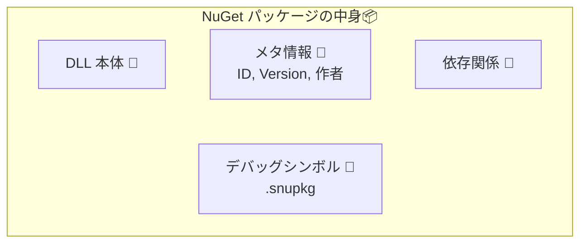
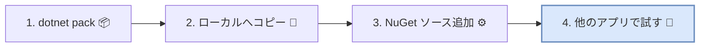

# 第11章：NuGetとバージョン（配る側の基本）📦🚀

この章は「ライブラリを“配る側”になった瞬間に必要になる、最低限の型」をぜんぶまとめます😊✨
（＝**NuGetにすると、あなたのコードは“商品”になる**って感覚！）

---

## 11.1 NuGetって何？いきなり結論📣✨




NuGetは、.NET（C#）の世界での「部品の配達サービス」みたいなものです📦🚚
あなたが配りたいライブラリを **`.nupkg`** という1つの箱に詰めて、配れるようにします🎁

* `.nupkg` は実体は **zip** です（名前が違うだけ）📦➡️🗜️
* その箱の中には

  * 使われるDLL（ターゲット別に入れられる）🔧
  * 依存関係（このライブラリは何に依存してる？）🧩
  * 説明文・著者・ライセンス・READMEなどのメタ情報📄
  * （任意）デバッグ用シンボル `.snupkg` 🐞🔍
    が入ります😊

そして大事ポイント：
**「NuGetに上げたバージョン番号＝利用者への約束」** です🤝🔢
だからSemVerがここで効いてくるんだよ〜！✨

---

## 11.2 まずは“バージョンの種類”を整理しよ（ここ超重要）🧠🔢

.NETのライブラリには、バージョンが複数あります😵‍💫
でも最優先で覚えるのはこの4つです👇（Microsoftのガイダンスでもここが重要扱い）([Microsoft Learn][1])

1. **NuGet package version**（利用者が一番見るやつ）📦👀
2. **AssemblyVersion**（実行時バインディング寄り。互換性で地雷にもなる💣）
3. **FileVersion**（ファイルのプロパティに出るやつ）📁
4. **InformationalVersion**（表示用。gitハッシュとか入れがち）🧾

この章のゴールはまずコレ👇
✅ **「NuGet package version をSemVerでちゃんと運用できる」**
（他は“事故らない設定”を覚える感じ😊）

---

## 11.3 NuGetのバージョンはSemVer 2.0.0が前提だよ✨

NuGetのバージョンの考え方は **SemVer 2.0.0** がベースです📘
（公式ドキュメントでもSemVer 2.0.0準拠として説明されてるよ）([Microsoft Learn][2])

### ✅ よく使う形（配布で頻出）🧩

* 安定版：`1.2.3`
* プレリリース：`1.2.3-alpha.1` / `1.2.3-rc.2`（ハイフン `-` の後ろ）([Microsoft Learn][2])
* ビルドメタデータ：`1.2.3+git.abc123`（`+` の後ろ。優先順位には影響しない）([Semantic Versioning][3])

👀 **利用者目線で覚える一言**：

* `-alpha` / `-rc` が付いたら「まだ試作品っぽい」🧪
* `+git...` は「どのビルドかのメモ」📝

---

## 11.4 “どこにバージョン番号を書くの？”問題🔧😇

今どきのSDKスタイル（普通の`.csproj`）では、**プロジェクトファイルに書く**のが基本です📄✨
（`.nuspec` を別に作らず、csprojにメタ情報を載せられるよ）([Microsoft Learn][4])

### 11.4.1 まずは最小の「配布用メタ情報」テンプレ📦🧾

```xml
<Project Sdk="Microsoft.NET.Sdk">

  <PropertyGroup>
    <TargetFramework>net10.0</TargetFramework>

    <!-- パッケージの身分証 -->
    <PackageId>Banana.Tools</PackageId>
    <Authors>YourName</Authors>
    <Company>YourCompany</Company>
    <Description>便利なバナナ系ユーティリティ🍌✨</Description>

    <!-- SemVer（この章の主役） -->
    <Version>1.0.0</Version>

    <!-- あると強い -->
    <RepositoryUrl>https://example.com/your/repo</RepositoryUrl>
    <PackageTags>utility;banana</PackageTags>

    <!-- READMEをNuGetページに表示させる（後で詳説） -->
    <PackageReadmeFile>README.md</PackageReadmeFile>

    <!-- ライセンス（どっちか） -->
    <PackageLicenseExpression>MIT</PackageLicenseExpression>
    <!-- もしくは <PackageLicenseFile>LICENSE</PackageLicenseFile> -->
  </PropertyGroup>

  <ItemGroup>
    <None Include="README.md" Pack="true" PackagePath="\" />
    <!-- LICENSEを同梱するなら↓ -->
    <!-- <None Include="LICENSE" Pack="true" PackagePath="\" /> -->
  </ItemGroup>

</Project>
```

ポイントだけ超短くまとめると👇

* **`<Version>`**：NuGetのバージョン（SemVerで上げ下げする主役）([Microsoft Learn][1])
* **`PackageReadmeFile`**：NuGetページでREADMEを見せられる（超大事）([Microsoft Learn][5])
* **ライセンス**：`PackageLicenseExpression` または `PackageLicenseFile` が推奨（`PackageLicenseUrl` は非推奨扱い）([Microsoft Learn][6])

---

## 11.5 Visual Studioで“パッケージを作る”流れ（配布の儀式）🛠️✨

やることはシンプルで、流れはこの3ステップです📦➡️✅

### Step 1：Class Library を作る📚

* 新規プロジェクト → **Class Library** を作成😊
* 公開API（public）を最小に絞って設計（第3章の話がここで効く）✂️✨

### Step 2：csprojにメタ情報を書く📄

* `PackageId / Description / Version / RepositoryUrl / README / License` あたりを入れる✍️

### Step 3：packする📦

CLIでもOK！（中身の理解が進むのでおすすめ😊）

```bash
dotnet pack -c Release
```

`dotnet pack` はビルドして `.nupkg` を作ってくれます📦([Microsoft Learn][7])

---

## 11.6 “ローカルで試してから配る”のが正義😺🛡️




いきなり公開（nuget.org等）に投げないで、まずローカルで試すのが安全です✅

### 11.6.1 ローカルフォルダを「自分専用NuGet置き場」にする📁📦

1. 例えば `C:\nuget-local` を作る
2. `dotnet pack` した `.nupkg` をそこへコピー
3. Visual Studioの「NuGetパッケージソース」にそのフォルダを追加✨

これで、別のサンプルアプリから **本当に利用者としてインストール**して動作確認できます👀✅
（“作者の手元では動く”事故を減らせる！😇）

---

## 11.7 READMEは“最重要UI”だよ📄💗

NuGetページで最初に読まれるのはREADMEです📌
公式にも「最初に見られる要素で第一印象に直結」としてREADME同梱を強く推してます([Microsoft Learn][5])

### 11.7.1 READMEの最小テンプレ（コピペOK）📝✨

````md
# Banana.Tools 🍌✨

便利なユーティリティ集です。

## できること
- 文字列の整形
- 日付の扱い
- ちょい便利関数いろいろ

## インストール
- NuGetで `Banana.Tools` を追加

## 使い方
```csharp
// 例
```

## 互換性ポリシー
- SemVerに従います（MAJORで破壊変更）
- 非推奨→移行期間→削除の順で進めます
````

※ READMEをパッケージに入れる方法は、`PackageReadmeFile` で指定して、実ファイルを `Pack="true"` で同梱するのが基本です📦([Microsoft Learn][5])

---

## 11.8 シンボル（.snupkg）も作ると“神デバッグ”になる🐞✨

利用者が「ライブラリ内部まで追ってデバッグ」できると、満足度が爆上がりします🔥
そのために **`.snupkg`（シンボルパッケージ）** を用意できます🧩([Microsoft Learn][8])

### 11.8.1 作り方（超かんたん）📦➕🐞

```bash
dotnet pack -c Release --include-symbols --include-source
```

`dotnet pack` のオプションとして公式に案内されています([Microsoft Learn][7])
（できたら `.nupkg` と `.snupkg` が並びます😊）

---

## 11.9 “.NET 10時代”の配布の肌感（最新の空気）🌍✨

今の最新ラインとしては、.NET 10 がLTSとして出ていて、ツールもそれに合わせて更新されています📌([Microsoft for Developers][9])
配布側としては「最新TFMに寄せる」だけじゃなくて、**利用者の環境幅**も考えるのがコツです🤝

### 11.9.1 ターゲットフレームワーク（TFM）の考え方（超ざっくり）🎯

* 最新機能を使いたい：`net10.0` 🌟
* 利用者が幅広い：`net8.0` など、もう少し広い土台も検討😊
* もっと広く：**マルチターゲット**（複数のTFMを同梱）📦📦

例：

```xml
<TargetFrameworks>net10.0;net8.0</TargetFrameworks>
```

（※ここはチームの互換ポリシーとセットで決めると強いよ📘✨）

---

## 11.10 章末ミニ演習（“v1.0.0を出した体”を作る）🧪🎓

### お題：`Banana.Tools` を「配布できる最低セット」にする🍌📦

やることはこれだけ😊

1. Class Library を作る📚
2. 公開APIを3つだけ作る（例：`Normalize`, `TryParseX`, `ToSafeString`）🧩
3. csprojにメタ情報を入れる📄
4. `README.md` を書く📝
5. `dotnet pack -c Release` で `.nupkg` を作る📦([Microsoft Learn][7])
6. ローカルNuGetソースで、別プロジェクトから入れて動かす✅

### ゴール🎯✨

* 「配布物は契約」って感覚がつかめる🤝
* “README/License/Version”の重要性が体に入る📄🔢

---

## 11.11 AIの使いどころ（この章は相性よすぎ🤖💡）

### READMEを整えるプロンプト例📝

```text
このNuGetパッケージのREADMEを書いて。
対象：C#初級〜中級。最初にコピペできる最短の使用例を入れて。
セクションは「概要/インストール/使い方/互換性ポリシー/FAQ」。
```

### リリース前チェックをAIにやらせる✅

```text
以下のcsprojメタ情報を見て、NuGet配布として足りない要素と改善案を箇条書きで。
特に README, License, RepositoryUrl, Tags, Description の観点でレビューして。
（csproj貼る）
```

---

## 11.12 まとめ（この章で持ち帰る3点）🎁✨

1. **NuGetのVersionが“約束の番号”**（SemVer運用の本丸）🔢🤝 ([Microsoft Learn][1])
2. **csprojにメタ情報を揃える**（README・License・説明が命）📄💗 ([Microsoft Learn][5])
3. **ローカルで試してから配る**（配布事故を激減）🛡️😺

---

次の章（第12章）は「使う側のバージョン管理」なので、ここで作った `.nupkg` を“利用者として更新する”練習にそのまま使えますよ〜📦➡️😇✨

[1]: https://learn.microsoft.com/en-us/dotnet/standard/library-guidance/versioning?utm_source=chatgpt.com "Versioning and .NET libraries"
[2]: https://learn.microsoft.com/en-us/nuget/concepts/package-versioning?utm_source=chatgpt.com "NuGet Package Version Reference"
[3]: https://semver.org/?utm_source=chatgpt.com "Semantic Versioning 2.0.0 | Semantic Versioning"
[4]: https://learn.microsoft.com/en-us/nuget/reference/msbuild-targets?utm_source=chatgpt.com "NuGet pack and restore as MSBuild targets"
[5]: https://learn.microsoft.com/en-us/nuget/nuget-org/package-readme-on-nuget-org?utm_source=chatgpt.com "Package readme on NuGet.org"
[6]: https://learn.microsoft.com/ja-jp/nuget/reference/msbuild-targets?utm_source=chatgpt.com "MSBuild ターゲットとしての NuGet pack と restore"
[7]: https://learn.microsoft.com/ja-jp/dotnet/core/tools/dotnet-pack?utm_source=chatgpt.com "dotnet pack コマンド - .NET CLI"
[8]: https://learn.microsoft.com/en-us/nuget/create-packages/symbol-packages-snupkg?utm_source=chatgpt.com "Creating symbol packages (.snupkg)"
[9]: https://devblogs.microsoft.com/dotnet/announcing-dotnet-10/?utm_source=chatgpt.com "Announcing .NET 10"
