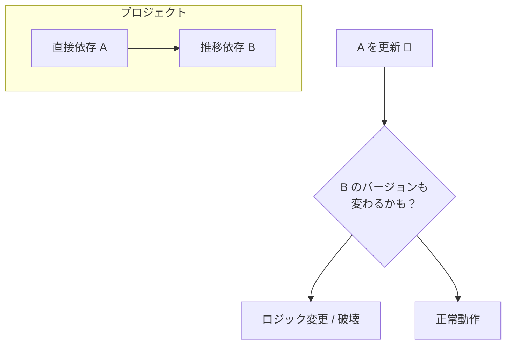
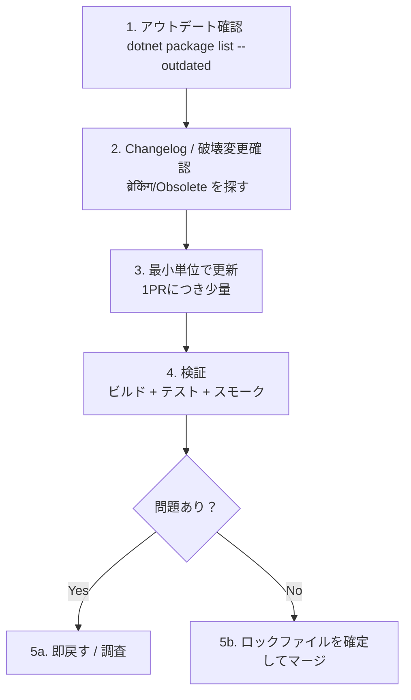

# 第12章：使う側のバージョン管理（依存更新で死なない）😇🔧

## 12.0 この章のゴール🎯✨

この章を終えると、こんなことができるようになります👇

* 「更新していい？」を**自分で判断**できる🧠✅
* 依存更新を**小さく安全に**進められる🐾💨
* 「CIだけ壊れる」「自分のPCだけ動く」みたいな事故を**減らせる**🛡️
* 破壊変更の匂いを**Changelogから嗅ぎ分け**られる👃📜

---

## 12.1 まず、依存更新が怖い理由😱🧩

SemVerは“約束”だけど、使う側の現実はこう👇

* **依存は自分のコードじゃない**（＝急に挙動が変わっても驚けない）😇
* 直接入れたパッケージだけじゃなく、**依存の依存（推移依存）**も一緒に動く🕸️
* NuGetの依存解決にはルールがあって、状況次第で**選ばれるバージョンが変わる**ことがある⚖️
  （例：lowest applicable version / direct-dependency-wins など）([Microsoft Learn][1])

だから結論はこれ👇
**「SemVerを信じる」＋「自衛の仕組みを持つ」**が最強です🛡️💕



---

## 12.2 バージョン指定、ざっくり3タイプ🔢✨（使う側の基本）

### A) ガチ固定（ピン止め）📌

「このバージョンだけ使う！」
事故りにくいけど、放置すると古くなる🙃

### B) 範囲指定（レンジ）📏

「この範囲ならOK」
SemVer運用が上手い相手だと楽になる✨（でも相手次第😇）
NuGetのバージョン指定は**範囲**も扱えます([Microsoft Learn][2])

### C) フローティング（自動で上がる系）🎈

「4.* みたいに勝手に追従」
便利だけど、ある日突然変わって燃えやすい🔥
NuGetの依存解決でも “floating versions” は重要要素として扱われます([Microsoft Learn][1])

> 初学者のおすすめ方針🍀
> **アプリ**：基本は「固定 or ごく狭い範囲」
> **ライブラリ**：範囲指定の設計が必要になる（この教材の後半寄り）📘

---

## 12.3 “更新で死なない”ための基本戦略4つ🛡️✨


### 戦略①：更新は「小さく・こまめに」🐾

* 月1でドカン更新 → 地獄😇🔥
* 週1（または隔週）で少量更新 → 事故が小さい✨

### 戦略②：更新前に見るものは3つだけ👀📌

1. **Changelog / Release notes**📰
2. **Breaking changes**（破壊変更）💥
3. **Deprecated / Obsolete**（非推奨）🧡

（第10章・第9章でやったやつがここで効くよ〜！）

### 戦略③：更新は「1回のPRで扱う範囲」を絞る✂️

* 例：まず `xunit` 系だけ、次に `logging` 系だけ、みたいに分割🧩
* 依存が絡むほど、**原因特定が難しくなる**よ🌀

### 戦略④：再現性をロックで固める🔒

「どの環境でも同じ依存が入る」状態を作るのが超大事✨
NuGetには `packages.lock.json` の仕組みがあります([Microsoft Learn][3])

---

## 12.4 実務で使う「更新フロー」テンプレ✅🚀

### STEP 0：更新の候補を一覧にする📋

CLIならこれが早い👇

* 古いパッケージ確認：`dotnet package list --outdated`([Microsoft Learn][4])
* 非推奨の確認：`dotnet package list --deprecated`([Microsoft Learn][5])

（Visual Studioでも “Updates” で同じことができるよ😊）

---

### STEP 1：更新する範囲を決める🎯

* ✅ 今回は「PATCHだけ」
* ✅ 今日は「この2個だけ」
* ✅ “でかいの”は別枠（時間確保してから）⏳

---

### STEP 2：更新前チェック（最小セット）👀✅

この順に見るだけでだいぶ安全✨

* 変更点に **breaking / obsolete / deprecated** の文字ない？🔍
* 設定値や既定値（default）が変わってない？⚙️
* 例外の種類やタイミング変わってない？💣

---

### STEP 3：更新して、すぐ動作確認🧪

* ビルド✅
* テスト✅
* “起動して1回触る”スモーク✅（UI/APIなら最低1ルート）

---

### STEP 4：ダメだったら「戻せる」ようにする↩️🛟

* 壊れたら即戻して、別ブランチで原因調査ができる🔍



---

## 12.5 ロックファイルで「CIだけ壊れる」を減らす🔒😇


### ロックファイルって何？🧾

`packages.lock.json` に
**直接依存＋推移依存を含めた“実際に解決されたバージョン”**が記録されます📌([Microsoft Learn][6])

### 使いどころのおすすめ💡

* 開発中：ロックファイルは更新されてもOK（変化を見える化）👀
* CI：**locked mode**で「ロックと違ったら失敗」→ 事故を早期発見🧯([Microsoft Learn][6])

### 設定例（プロジェクトファイル）🧷

```xml
<PropertyGroup>
  <RestorePackagesWithLockFile>true</RestorePackagesWithLockFile>
</PropertyGroup>
```

ロックを厳しくする（CI向け）なら👇

```xml
<PropertyGroup>
  <RestorePackagesWithLockFile>true</RestorePackagesWithLockFile>
  <RestoreLockedMode>true</RestoreLockedMode>
</PropertyGroup>
```

こういうMSBuildプロパティが公式に案内されています([Microsoft Learn][6])

### CLIでlocked mode（CIでよく使う）🧊

```bash
dotnet restore --locked-mode
```

`--locked-mode` は「ロックファイル更新を許可しない」動作として説明されています([Microsoft Learn][7])

⚠️注意：`--force-evaluate` と locked mode は同時に使うと衝突しがちです（エラー原因としても案内あり）([Microsoft Learn][8])

---

## 12.6 大きめの解決策：中央管理（Central Package Management）📦🏢

プロジェクトが増えると、こうなりがち👇
「AはNewtonsoft 13.0.1、Bは13.0.3…え、どれが正解？😇」

そこで **Central Package Management（CPM）**✨

* 依存のバージョンを `Directory.Packages.props` に集約して管理できます([Microsoft Learn][9])
* 作成コマンドも用意されています：`dotnet new packagesprops`([Microsoft Learn][9])

### 最小イメージ（雰囲気）🧁

```xml
<Project>
  <PropertyGroup>
    <ManagePackageVersionsCentrally>true</ManagePackageVersionsCentrally>
  </PropertyGroup>

  <ItemGroup>
    <PackageVersion Include="Serilog" Version="4.0.0" />
  </ItemGroup>
</Project>
```

※ こういう構成で「全体のバージョン」を揃えやすくなるよ〜😊([Microsoft Learn][9])

---

## 12.7 トラブルが起きた時の“あるある”対処🧯😇

### あるある①：更新したらテストが落ちた🧨

やることはこれ👇

* ① まず**その更新だけ戻す**（原因を固定）↩️
* ② Changelogで breaking/behavior change を探す🔍
* ③ どうしても必要なら一旦 **バージョンを固定して保留**📌
* ④ 直せそうなら、修正は“小さく”入れる🐾

### あるある②：自分のPCだけ動く／CIだけ壊れる🤯

* ロックファイル導入＆CIを `--locked-mode` にすると一気に減ることが多いよ🔒([Microsoft Learn][6])

### あるある③：依存が増えて、更新が怖くて放置しちゃう🙈

* 依存更新を「月末の儀式」にしないで、**小分けルーチン**にするのがコツ✨

---

## 12.8 AIの使いどころ（更新事故を減らす使い方）🤖💡

AIは「更新の不安」を減らすのにめちゃ向いてるよ〜！

### ① リリースノート要約📰✨

* 「破壊変更だけ箇条書きにして」
* 「移行に必要な作業だけ抜き出して」

### ② 影響範囲の推定🔍

* 「この更新で落ちそうなテスト観点を列挙して」
* 「例外が変わりそうな箇所ある？」

### ③ 修正案の叩き台✍️

* 「このエラーの原因候補を3つ」
* 「最小修正案を2つ」

> コツ😺
> **“直し方”より先に “何が変わった？” をAIに聞く**と当たり率が上がるよ✨

---

## 12.9 演習（20〜30分）⏱️🧪

### 演習A：更新チェックリストを完成させよう✅

あなた用にコピペして育てる用👇🌱

* 更新対象：＿＿＿＿（パッケージ名）
* 目的：＿＿＿＿（セキュリティ？バグ？新機能？）
* 確認：Changelog / breaking / deprecated 見た？👀
* 更新単位：今回はこれだけ？（Yes/No）✂️
* ビルド：OK？✅
* テスト：OK？✅
* スモーク：OK？✅
* だめなら戻せる？（PR分割/コミット）↩️

### 演習B：ロックファイルON→CI想定のlocked modeまで🔒

1. ロックファイルを有効化（プロパティ追加）
2. restoreで `packages.lock.json` 生成
3. `--locked-mode` を試して、挙動を体験

（“守られてる感”が分かるはず🥹✨）([Microsoft Learn][6])

---

## 12.10 章末まとめ（これだけ覚えればOK）🧠✨

* 依存更新は「小さく・こまめに」🐾
* 更新前に見るのは **Changelog / Breaking / Deprecated** の3点セット👀
* **ロックファイル＋locked mode**で「環境差事故」を減らす🔒([Microsoft Learn][6])
* 大きい解決策として **Central Package Management** もある📦([Microsoft Learn][9])
* AIは「変更点の要約」「影響観点の列挙」に使うと強い🤖✨

---

## 12.11 次章へのつなぎ🕸️➡️

次の第13章は、ここでチラ見せしたやつ👇
**推移依存（transitive）と衝突**🕸️💥
「自分が入れてないのに壊れる😇」の正体を、ちゃんと解剖していきます🔍✨

[1]: https://learn.microsoft.com/en-us/nuget/concepts/dependency-resolution?utm_source=chatgpt.com "NuGet Package Dependency Resolution"
[2]: https://learn.microsoft.com/en-us/nuget/concepts/package-versioning?utm_source=chatgpt.com "NuGet Package Version Reference"
[3]: https://learn.microsoft.com/en-us/nuget/consume-packages/package-references-in-project-files?utm_source=chatgpt.com "PackageReference in project files - NuGet"
[4]: https://learn.microsoft.com/en-us/dotnet/core/tools/dotnet-package-list?utm_source=chatgpt.com "dotnet package list command - .NET CLI"
[5]: https://learn.microsoft.com/ja-jp/dotnet/core/tools/dotnet-package-list?utm_source=chatgpt.com "dotnet package list コマンド - .NET CLI"
[6]: https://learn.microsoft.com/ja-jp/dotnet/core/install/upgrade?utm_source=chatgpt.com "新しい .NET バージョンにアップグレードする"
[7]: https://learn.microsoft.com/ja-jp/dotnet/core/tools/dotnet-restore?utm_source=chatgpt.com "dotnet restore コマンド - .NET CLI"
[8]: https://learn.microsoft.com/ja-jp/nuget/reference/errors-and-warnings/nu1005?utm_source=chatgpt.com "NuGet エラー NU1005"
[9]: https://learn.microsoft.com/en-us/nuget/consume-packages/central-package-management?utm_source=chatgpt.com "Central Package Management (CPM)"
