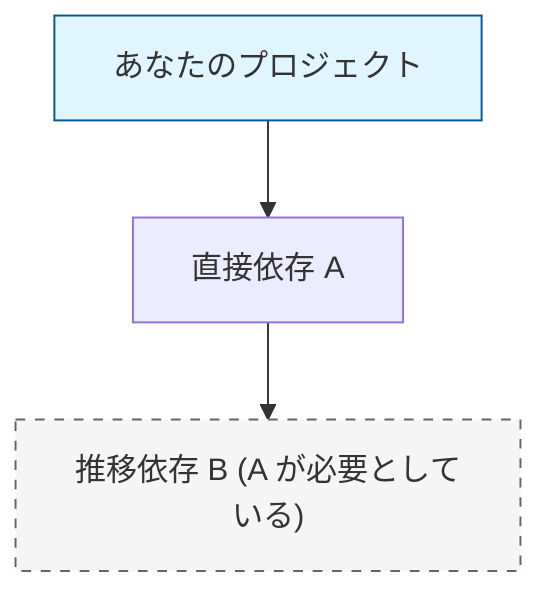
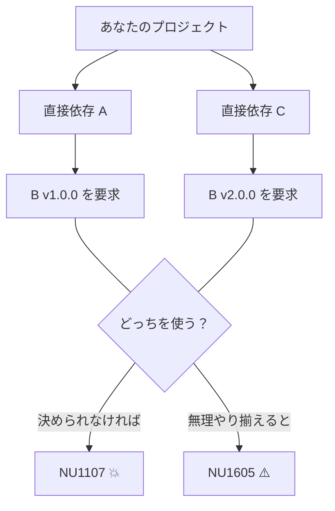

# 第13章：推移依存（transitive）と衝突の怖さ🕸️💥

## この章でできるようになること🎯✨

* 「推移依存（依存の依存）」を言葉で説明できる🙂
* “自分が直接入れてないのに壊れる😇”の仕組みがわかる🧠
* NuGetの衝突（NU1107/NU1605 など）を見て、落ち着いて直せる🛠️
* 事故りにくい運用（揃える・固定する・見える化する）ができる✅

---

# 13.1 推移依存ってなに？🧩🧩


たとえばあなたのアプリが `A` というパッケージを入れたとします📦
でも `A` は内部で `B` に依存してた…つまり👇

* あなたのプロジェクト：**A** を参照（直接依存）
* A の中身：**B** を参照（推移依存）

この **B が推移依存（transitive dependency）** だよ〜って話です🕸️✨
`dotnet package list --include-transitive` を使うと、推移依存まで一覧で見れます👀（後でやるよ！） ([Microsoft Learn][1])



---

# 13.2 いちばん怖い形：ダイヤモンド依存💎😵


推移依存が怖くなる代表例がこれ👇

* あなたのアプリが **A** と **C** を入れる
* A も C も、内部で **B** に依存してる
* でも A は B の v1 系を要求、C は B の v2 系を要求…みたいなズレ⚡

結果どうなるかというと…

* restore 時点で **衝突エラー**（例：NU1107）💥
* あるいは “うまく解決したように見えて” **ダウングレード警告**（NU1605）⚠️
* さらに最悪、実行時に **MissingMethodException とかで爆発**💣😇



---

# 13.3 NuGetはどうやって「どのバージョンを使うか」決めるの？🔧🧠

ここ、超重要ポイントです📌✨

## ルールの代表：「Direct dependency wins（直接依存が勝つ）」🏆


NuGet は依存関係を解決するとき、**直接参照したパッケージの意図を優先**する動きをします（その結果、ダウングレードが発生して警告が出ることがあるよ、って明言されています） ([Microsoft Learn][2])

つまり、こういうことが起きがち👇

* 推移依存としては新しい版が必要
* でもあなた（または別の直接参照）が古い版を指定
* その結果「直接依存が勝って」古い版が選ばれてしまう
* → **NU1605（Detected package downgrade）** みたいな警告⚠️ ([Microsoft Learn][3])

## そして衝突しきると「NU1107」💥


NU1107 は、要するに
**“B を v3.5 で固定してって言う人と、v4.0 で固定してって言う人がいて、どっちも譲らないから決められない😭”** って状態です。
解決策として「衝突してるパッケージを直接参照して解決してね」と案内されます ([Microsoft Learn][4])

---

# 13.4 まずは「見える化」しよう👀🕵️‍♀️

## コマンドで依存ツリーを出す🌳✨

推移依存まで含めて見たいなら👇

```sh
dotnet package list --include-transitive
```

このオプションで「トップレベル（直接）」と「推移」が両方出ます ([Microsoft Learn][1])

## “セキュリティ的にヤバい依存” も見れるよ🚨🛡️

最近の .NET SDK では、脆弱性監査も CLI からできるようになってます👇
（`--vulnerable` は .NET SDK 9.0.300 以降で使える、という説明があります） ([Microsoft Learn][5])

```sh
dotnet package list --include-transitive --vulnerable
```

推移依存はデフォルトで含まれないので、**`--include-transitive` を付けるの大事**って話もあります ([Microsoft Learn][6])

---

# 13.5 よく出る “衝突サイン” を覚えよう🚥⚠️

## ① NU1107：Version conflict detected💥

* 症状：restore が止まる／ビルドできない😭
* 対処の基本：**問題のパッケージを直接参照して、解決したい版を明示** ([Microsoft Learn][4])

## ② NU1605：Detected package downgrade⚠️


* 症状：ビルドは通るけど警告が出る😇
* 背景：Direct dependency wins の結果、**必要だった版より低い版が選ばれた** ([Microsoft Learn][3])
* 対処：基本は “全体で揃える” 方針へ（後述）✅

---

# 13.6 解決の考え方：3つの作戦📐✨

## 作戦A：揃える（統一する）🎼

**「このソリューションでは B は vX.Y.Z で行く！」** を決めて、全部そこに寄せるやつ🙂
一番わかりやすくて強い💪

* 直接参照でバージョンを固定（NU1107 の王道） ([Microsoft Learn][4])
* 依存してる上位パッケージ（A/C）を更新して、自然に揃う形にする🔄

## 作戦B：固定する（ロックする）🔒

“環境によって勝手に変わる” を減らしたいなら **ロックファイル**が便利✨
`dotnet restore` には lock ファイルや `--locked-mode` があります ([Microsoft Learn][7])

```sh
dotnet restore --locked-mode
```

CI でこれを使うと「依存が勝手にズレて壊れる」事故が減ります🧯✨ ([Microsoft Learn][7])

## 作戦C：中央集権（真ん中で管理する）🏛️

プロジェクトが増えるほど効くのが **Central Package Management (CPM)** 💖
`Directory.Packages.props` に “使うバージョンの正解” をまとめます📌

* ルートに `Directory.Packages.props` を作る
* `ManagePackageVersionsCentrally` を `true` にする
* `<PackageVersion />` で各パッケージの版を一括管理✨ ([Microsoft Learn][8])

`dotnet new packagesprops` で雛形を作れるよ、って案内もあります ([Microsoft Learn][8])

---

# 13.7 直し方レシピ（困ったらこの順で！）🍳🛠️

## ステップ1：依存を「見える化」する👀


```sh
dotnet package list --include-transitive
```

まず “どこから来てる依存か” を把握！ ([Microsoft Learn][1])

## ステップ2：エラー/警告の種類で分岐🚦

* **NU1107**：衝突で決められない → **直接参照で決め打ち** ([Microsoft Learn][4])
* **NU1605**：ダウングレード → “揃える” or “上位を更新” を検討 ([Microsoft Learn][3])

## ステップ3：方針を選ぶ（揃える/固定する/中央管理）🧠


小規模なら「直接参照で揃える」でもOK👌
複数プロジェクトなら **CPM** がすごく効くよ〜 ([Microsoft Learn][8])

---

# 13.8 Visual Studioでラクする小技🪄🧑‍💻

衝突って “見つけたはいいけど直し方が悩む” になりがち😇
Visual Studio 向けに依存衝突の解決提案をしてくれる **NuGetSolver** みたいな拡張も紹介されています ([Microsoft for Developers][9])
（困ったときの補助輪として覚えておくと安心です😊🛟）

---

# 13.9 ミニ演習（手を動かすよ〜！）🧪✨

## 演習1：推移依存を出して、危なそうな場所に丸をつける🕵️‍♀️⭕

1. 自分のプロジェクトで👇を実行

```sh
dotnet package list --include-transitive
```

2. 次をチェックしてメモ📝

* 推移依存が “やたら多い” パッケージはどれ？🕸️
* 同じ名前のパッケージで、要求レンジが分かれてそうなものある？⚡

👉 成果物：**依存ツリー可視化メモ**📝✨ ([Microsoft Learn][1])

## 演習2：衝突の“物語”を作る📖💥（想像力強化）

AIに「ダイヤモンド依存で壊れる話」を作らせて、どこで詰むか当てるゲームです😂

* AIに頼む👇

  * 「A と C を入れたら B のバージョン衝突が起きた、みたいなシナリオ作って」
  * 「NU1107/NU1605 のどっちが出そう？」
  * 「直すなら “直接参照で揃える/上位を更新/CPM” どれがよさそう？」

👉 成果物：**衝突シナリオ3本**📚✨

## 演習3：脆弱性チェックも一回やってみる🚨🔍


```sh
dotnet package list --include-transitive --vulnerable
```

推移依存まで含めて監査できるのがポイントです🛡️ ([Microsoft Learn][5])

👉 成果物：**“気になる依存” リスト**🧾✨

---

# 13.10 AIの使いどころ（この章専用プロンプト集🤖💡）


## ① 依存ツリー読み解き補助🧠

* 「この `dotnet package list --include-transitive` の結果を貼るから、衝突の芽がありそうな箇所を教えて」
* 「同じパッケージが複数経路から来てる場合、どういう事故が起きやすい？」

## ② NU1107/NU1605 の作戦会議⚔️

* 「この NU1107 のログを貼るので、最小変更で直す案を3つ出して。メリデメ付きで！」
* 「NU1605 が出たけど、放置していいケース/ダメなケースを判断して」

## ③ CPM導入の雛形づくり🏛️

* 「このソリューション構成に合わせて `Directory.Packages.props` の叩き台を作って」
  （CPM の基本は MS Learn にまとまってます） ([Microsoft Learn][8])

---

# まとめ🧡✨

* 推移依存は **“自分が直接入れてないのに影響してくる”** から怖い😇
* 衝突は **NU1107（決められない）** と **NU1605（ダウングレード）** を目印にすると整理しやすい🚥 ([Microsoft Learn][4])
* 対策は **揃える・固定する・中央管理（CPM）** が三種の神器🧰✨ ([Microsoft Learn][8])
* まずは `dotnet package list --include-transitive` で **見える化** が最強👀🌳 ([Microsoft Learn][1])

---

# 次の章（第14章）は、この“依存の事故”を **テストで早めに検知する🧪🛡️** 方向に進むよ〜😊✨

[1]: https://learn.microsoft.com/ja-jp/dotnet/core/tools/dotnet-package-list?utm_source=chatgpt.com "dotnet package list コマンド - .NET CLI"
[2]: https://learn.microsoft.com/en-us/nuget/concepts/dependency-resolution?utm_source=chatgpt.com "NuGet Package Dependency Resolution"
[3]: https://learn.microsoft.com/en-us/nuget/reference/errors-and-warnings/nu1605?utm_source=chatgpt.com "NuGet Warning NU1605"
[4]: https://learn.microsoft.com/en-us/nuget/reference/errors-and-warnings/nu1107?utm_source=chatgpt.com "NuGet Error NU1107"
[5]: https://learn.microsoft.com/en-us/dotnet/core/tools/dotnet-package-list?utm_source=chatgpt.com "dotnet package list command - .NET CLI"
[6]: https://learn.microsoft.com/en-us/nuget/concepts/auditing-packages?utm_source=chatgpt.com "Auditing package dependencies for security vulnerabilities"
[7]: https://learn.microsoft.com/ja-jp/dotnet/core/tools/dotnet-restore?utm_source=chatgpt.com "dotnet restore コマンド - .NET CLI"
[8]: https://learn.microsoft.com/en-us/nuget/consume-packages/central-package-management?utm_source=chatgpt.com "Central Package Management (CPM)"
[9]: https://devblogs.microsoft.com/dotnet/introducing-nugetsolver-a-powerful-tool-for-resolving-nuget-dependency-conflicts-in-visual-studio/?utm_source=chatgpt.com "Introducing NuGetSolver: A Powerful Tool for Resolving ..."
