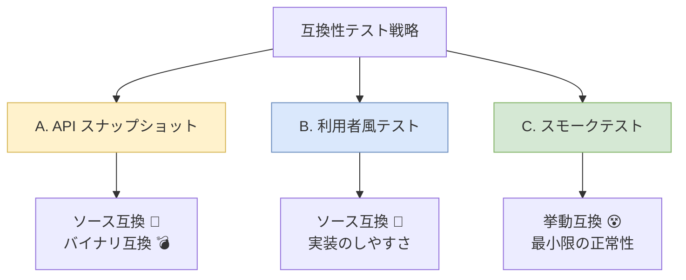
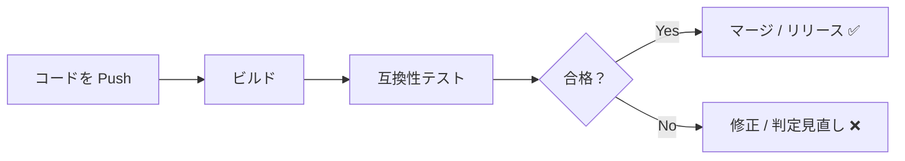

# 第14章：互換性を守るテスト戦略（最低ラインでOK）🧪🛡️

—「更新したら壊れた😇」を“仕組み”で減らす章だよ〜！

---

## 14.0 この章のゴール🎯

この章が終わると、あなたはこうなれます👇✨

* 「互換性の事故」を **テストで早めに発見**できるようになる🔍
* 公開APIが変わったときに **意図した変更かどうか**をチームで判断しやすくなる🧠
* **最小限のテストセット**で、SemVer運用がグッと安定する📦🚦

---

## 14.1 互換性って、テストでどこまで守れるの？🤔

互換性の“壊れ方”はだいたい3種類（第4章の復習だね）🧩

1. **ソース互換**：利用者コードがコンパイルできない💥
2. **バイナリ互換**：実行時に落ちる💣
3. **挙動互換**：動くけど結果が変わる😵

この章では、特に **①と③を強くする**のが目的だよ🛡️✨
（②は状況によるけど、ツール＋実行テストで拾えること多いよ〜）



---

## 14.2 最低ラインの「互換性テスト」3点セット✅✅✅

“やりすぎない”が超大事！まずはこの3つだけでOK🙂🌷

### ✅セットA：公開APIの形を固定する（APIスナップショット）📌

「公開APIが変わったらテストが落ちる」仕組みを作る！
→ **意図せぬ破壊変更の混入**を止めやすい🧯
（PublicApiGeneratorみたいな“公開API文字列化”の考え方がまさにこれだよ） ([GitHub][1])

### ✅セットB：利用者コード風テスト（Consumerテスト）👩‍💻

“実際の使い方”で、**コンパイルできるか**・**呼び出しが成立するか**を守る💪
→ オーバーロード追加の罠とかも拾いやすい💣

### ✅セットC：スモークテスト（最重要シナリオだけ）🔥

「利用者が一番踏む道」だけを **薄く**テストする👣
→ 挙動互換（結果が変わる問題）を最低限ガードできる🛡️

---

## 14.3 セットA：公開APIスナップショットテスト📌✨


### 何が嬉しいの？🥰

* publicメンバーの追加/削除/シグネチャ変更が起きたらすぐ分かる👀
* 「いつの間にか壊してた😇」が減る
* “変更が意図的か”をレビューで話せるようになる🧠

### ざっくり導入イメージ🧪

* テストで「公開API一覧（文字列）」を生成
* それを “前回の正” と比較
* 差分があったら落ちる（＝要確認）🚨

PublicApiGeneratorはまさにこの用途を想定してるよ ([GitHub][1])

#### サンプル（xUnit想定）🧪

```csharp
using System.Reflection;
using Xunit;
using PublicApiGenerator;

public class PublicApiTests
{
    [Fact]
    public void PublicApi_has_not_changed_unintentionally()
    {
        // ライブラリ側のアセンブリを指定（例）
        var assembly = typeof(MyLibrary.SomePublicType).Assembly;

        // 公開APIを文字列化
        var api = assembly.GeneratePublicApi();

        // ここでは超簡易に“固定文字列”比較の形を見せるよ
        // 実運用では Verify / Approval テストでファイル管理するのが定番✨
        Assert.Contains("public class SomePublicType", api);
    }
}
```

> 実運用のコツ：
>
> * 変更がOKなら「承認（approve）」して更新する
> * 変更がNGなら差分を見て戻す
>   この流れができると **SemVerの判断が超ラク**になるよ🙂✨

---

## 14.4 セットA強化：Microsoftの互換性チェックツール（ApiCompat）🔍🧰

「公開APIの差分を、ちゃんと“互換性”として判定」したいときに便利！
Microsoftの `Microsoft.DotNet.ApiCompat.Tool` は、アセンブリやパッケージの互換性チェックを行えるよ ([Microsoft Learn][2])

### 何が嬉しいの？🥳

* “ただの差分”じゃなくて「互換性が壊れたか」を見やすい
* パッケージ（NuGet）としての比較もできる ([Microsoft Learn][2])

### 超ミニ導入（ローカルツール）🛠️

```bash
dotnet new tool-manifest
dotnet tool install --local Microsoft.DotNet.ApiCompat.Tool --version 10.0.102
```

> ちなみに .NET 10 のSDKは 10.0.102（2026-01のリリース情報）みたいに配布ページで確認できるよ ([Microsoft][3])
> （最新のSDK前提で教材を組むと、チームの環境も揃えやすい✨）

---

## 14.5 セットB：利用者コード風テスト（Consumerテスト）👩‍💻💞


ここがめっちゃ大事！！
**“テストコード＝利用者の書くコード”** に寄せるのがコツだよ👀✨

### やり方（おすすめ2択）✅

#### ① サンプル利用者プロジェクトを同じソリューションに置く📁

* `MyLibrary`（配る側）
* `MyLibrary.ConsumerSamples`（使う側の例）
* CIで `build` が通ることを保証する🏗️

**メリット**：超かんたん、初心者でも回せる😊
**拾える事故**：シグネチャ変更、型変更、名前変更、オーバーロード地雷など💣

#### ② “代表的な呼び出し”だけテストに書く🧪

* 重要APIだけ「こう使う」をテスト化
* 仕様が変わったらテストが落ちる → 気づける🙂

---

## 14.6 セットC：公開APIのスモークテスト🔥（薄いのに効く！）

“広く浅く”が正義👑✨
特に **利用者の最短ルート**だけ押さえよう！

### スモークテストの作り方テンプレ🧯

* **Arrange**：最小の入力を用意
* **Act**：公開APIを1回呼ぶ
* **Assert**：最低限の結果を確認（例：nullじゃない、例外が出ない、代表値が一致）

#### 例：例外と戻り値の最低保証🧪

```csharp
using Xunit;

public class SmokeTests
{
    [Fact]
    public void Parse_should_accept_basic_input()
    {
        var result = MyLibrary.Parser.Parse("A=1");

        Assert.NotNull(result);
        Assert.Equal(1, result["A"]);
    }

    [Fact]
    public void Parse_should_throw_on_invalid_input()
    {
        Assert.Throws<FormatException>(() => MyLibrary.Parser.Parse("???"));
    }
}
```

ここで守ってるのは👇

* 「普通の入力で動く」😊
* 「ダメな入力のときの**例外契約**」⚠️（地味に互換性ポイント！）

---

## 14.7 “壊れやすい場所”に重点テストを置く🔍💣

全部テストしない！でもここは狙って守る🎯

### 優先度 高🔥

* 引数の **null可否**（受け入れる/返す）
* 例外の **種類・タイミング**
* 既定値（デフォルト値）や挙動の微妙変更
* オーバーロード追加で解決先が変わる系😇

このへんは第8章の“地雷”と直結してるから、**重点的にテスト**するとコスパ最強だよ💪💕

---

## 14.8 CIで「互換性ゲート」を作ろう🚦🤖

やることはシンプル！

* `dotnet test` が通らない限りマージ不可🙅‍♀️
* 可能なら

  * 公開APIスナップショットテスト
  * Consumerビルド
  * スモークテスト
    も一緒に回す✨

（ここまでできると「SemVerの番号ミス」が激減するよ📉）



---

## 14.9 AIの使いどころ🤖💡（この章、相性よすぎ）

AIは“テストの編集者”にすると強いよ〜！🧑‍🏫✨

### 使えるプロンプト例📝

* 「この公開APIの利用者が書きそうなコード例を5個作って。初心者〜中級で」
* 「互換性を壊しやすい変更点をレビュー観点で箇条書きにして」
* 「このバグ修正、PATCHで出すなら“守るべき挙動”をテストに落として」
* 「例外契約（どの例外を投げるか）をドキュメント＋テストにする案を出して」

---

## 14.10 ミニ演習：公開APIのスモークテストを作ろう🧪🎀

### お題🎒

あなたのサンプルライブラリ（第11章で作った想定）で、公開APIを3つ選んで👇

1. **スモークテスト**を各1本ずつ作る🔥
2. そのうち1つをわざと壊す（例：引数名変更じゃなく、シグネチャ変更とか）💥
3. テストが落ちたら「どの互換性が壊れた？」を言語化🗣️✨

### 提出物（成果物）📦

* ✅ `SmokeTests.cs`（3本）
* ✅ 「壊れた理由メモ」(ソース/バイナリ/挙動どれ？)📝
* ✅ “次から防ぐならどのテストを足す？”アイデア1つ💡

---

## 14.11 この章のまとめ🎀✨

互換性を守るテストは、最初から完璧じゃなくていいよ😊
まずはこの順で“薄く”入れるのが勝ち🏆

1. 公開APIスナップショット📌
2. 利用者コード風（Consumer）👩‍💻
3. 最重要スモーク🔥

これで「更新したら壊れた😇」が **かなり減る**はず！🛡️✨

---

次の第15章は、いよいよ **互換ポリシーを文章にする**ところだよ📘🖊️
テストで守れるようになったら、次は“ルール化”してチーム運用に落とす番だね〜！😊💕

[1]: https://github.com/PublicApiGenerator/PublicApiGenerator?utm_source=chatgpt.com "PublicApiGenerator"
[2]: https://learn.microsoft.com/ja-jp/dotnet/fundamentals/apicompat/global-tool?utm_source=chatgpt.com "Microsoft.DotNet.ApiCompat.Tool グローバル ツール - .NET"
[3]: https://dotnet.microsoft.com/en-us/download?utm_source=chatgpt.com "Download .NET (Linux, macOS, and Windows) | .NET"
