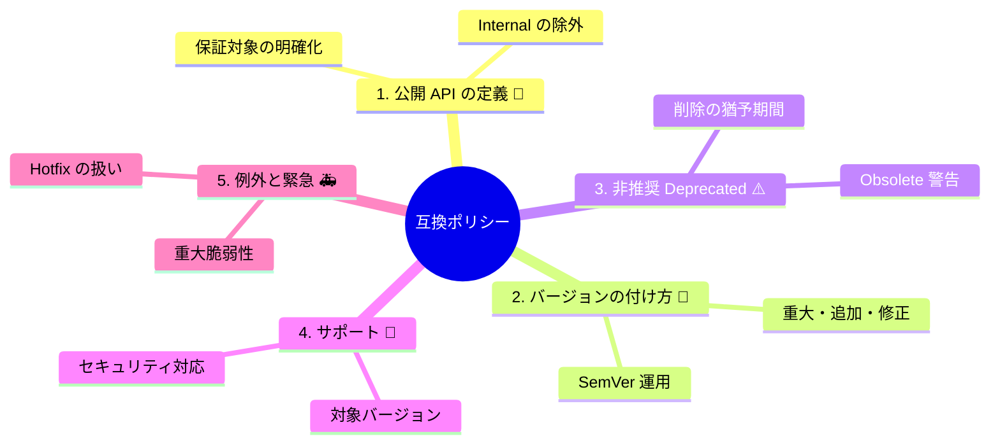

# 第15章：互換ポリシーを書こう（SemVerを運用に落とす）📘🖊️

SemVerって「番号の付け方」なんだけど、**実際にみんなが困らないのは“運用ルール（互換ポリシー）”があるとき**なんだよね😊
SemVer自体も「まず公開API（Public API）を定義してね」って前提を置いてるくらい、**“約束の文章化”が超大事**です📣✨ ([Semantic Versioning][1])

---

## 15.1 互換ポリシーって何？🤔💡


互換ポリシーは、ひとことで言うと👇

* **「何を公開APIとみなすか」**
* **「何が起きたら MAJOR/MINOR/PATCH を上げるか」**
* **「非推奨（Deprecated）をどう進めるか」**
* **「どのバージョンをサポートするか」**
* **「例外（緊急・セキュリティ等）をどう扱うか」**

…を **A4 1枚くらいで** ちゃんと書いたもの📄✨
番号だけ決めても「例外ケース」で揉めるので、文章にしておくと強いです🛡️



---

## 15.2 まず結論：A4 1枚テンプレ（これを埋めれば完成）🧩✅

この章のゴールはこれ！👇（コピペして `COMPATIBILITY_POLICY.md` にすると便利だよ📝）

---

## ✅ 互換ポリシー（A4 1枚テンプレ）📄✨

### 1) このライブラリ（/コンポーネント）の目的 🎯

* 何を提供する？（例：日付計算のユーティリティ、APIクライアント など）
* 想定利用者（例：アプリ開発者、社内プロジェクト、外部ユーザー）

### 2) 公開API（Public API）の定義 📣

「公開API」と見なすもの：

* ✅ `public` の **型 / メンバー**のうち、**ドキュメントに掲載しているもの**
* ✅ `Namespace` は `YourCompany.Product.*` のみ（などルールがあれば書く）
* ✅ `Obsolete` 付きは「移行対象の公開API」（消える予定）

「公開APIではない（互換保証しない）」もの：

* ❌ `*.Internal.*` 名前空間
* ❌ `internal`（テスト用 `InternalsVisibleTo` を使っていても契約ではない）
* ❌ `Experimental`/`Preview` と明記したもの（あるなら）
* ❌ 反射（reflection）で触れる前提の使い方

### 3) バージョンの付け方（SemVer）🔢

* バージョンは `MAJOR.MINOR.PATCH`
* 変更は **公開API視点**で判断する（利用者コードが困るか？） ([Semantic Versioning][1])

### 4) MAJOR / MINOR / PATCH の判断基準 🚦

**PATCH（x.y.Z）**：後方互換なバグ修正
**MINOR（x.Y.z）**：後方互換な機能追加
**MAJOR（X.y.z）**：破壊的変更（後方互換なし） ([Semantic Versioning][1])

（※この下に “うちの具体例” を箇条書きで追加すると最強）

### 5) 非推奨（Deprecated）の進め方 ⚠️🧡

* 非推奨は `[Obsolete("移行先…", error:false)]` を基本とする
* いつ削除するか：

  * 例）「非推奨を入れた次の **MAJOR** で削除」
  * 例）「非推奨から **6か月 or 2 MINOR** 以降に MAJOR で削除」
* 非推奨メッセージには **移行先** と **期限（消える目安）** を書く

### 6) サポート方針（どれを面倒見る？）🎯

* 基本：最新 MAJOR の最新 MINOR をサポート
* 例）「最新 MAJOR と、その1つ前の MAJOR も並行サポート（期間○か月）」
* 依存する .NET のサポート（LTS/STS）も参考にする ([Microsoft Learn][2])

### 7) 例外ルール 🚑🔐

* セキュリティ修正は PATCH で出す（可能な限り互換維持）
* どうしても互換が守れない場合：

  * “理由” と “回避策/移行手順” をリリースノートに必ず書く
* 取り消し（Revert）やHotfixの扱いもここに書く

### 8) 公開場所 📌

* このポリシー：`COMPATIBILITY_POLICY.md`
* 変更履歴：`CHANGELOG.md`
* 移行ガイド：`docs/migration/`（など）

---

## 15.3 「公開API」の決め方が9割✂️📣

SemVerは「公開APIが何か」を先に定義する前提だよ〜って仕様にも書いてあります📘 ([Semantic Versioning][1])
なので、ここが曖昧だと **毎回揉める**😇

### 公開APIの“ありがち安全ライン”✅

初心者向けの現実解としてはこれが安定✨

* **README / docs に載せた `public` だけが契約**
* docs に載せてない `public` は「公開だけど互換保証しない」扱いにしてもOK（ただし明記は必要）

### C#で“契約っぽさ”を表現する小技🪄

* `Internal` 名前空間を切る（例：`YourLib.Internal`）
* “使ってほしくない”APIは `Obsolete` で誘導（次で詳しく！）
* NuGetで配るなら **パッケージバージョン**を中心に考える（.NETの推奨の流れ） ([Microsoft Learn][3])

---

## 15.4 バージョン番号：.NETは「どこに書くか」もルール化しよ🔧✨

.NETライブラリには「バージョンっぽいもの」が複数あるので、**ポリシーに “どれを何に使うか”** も書いとくと事故が減ります🧯
（Microsoftもライブラリのバージョニング指針を出してるよ） ([Microsoft Learn][3])

### csprojの定番例（まずこれでOK）🧰

```xml
<PropertyGroup>
  <!-- NuGetのパッケージ版（利用者が一番見る） -->
  <Version>1.2.3</Version>

  <!-- 必要なら明示（運用ポリシーで決める） -->
  <AssemblyVersion>1.0.0.0</AssemblyVersion>
  <FileVersion>1.2.3.0</FileVersion>
  <InformationalVersion>1.2.3+commit.abc123</InformationalVersion>
</PropertyGroup>
```

* NuGetは **SemVer 2.0.0** を前提に扱えるし、比較時に build metadata（`+...`）を除外して正規化する挙動もあるので、ここも知ってると安心💡 ([Microsoft Learn][4])

---

## 15.5 MAJOR/MINOR/PATCH を“文章で判定できる”ようにする🚦📝

SemVerの定義（MAJOR＝破壊変更、MINOR＝後方互換な機能追加、PATCH＝後方互換なバグ修正）は仕様のど真ん中📘 ([Semantic Versioning][1])
でも現場はグレーが多いので、ポリシーに **“うちの判定基準”** を足すのがコツだよ😊

### すぐ使える追記例（そのまま貼れる）📌

* PATCH にする：

  * 明らかなバグ修正で、既存の一般的な使い方が壊れない
* MINOR にする：

  * 新しいAPI追加（既存APIは触らない）
  * 既存APIに「オプション追加」ただし既定挙動を変えない
* MAJOR にする：

  * 公開APIの削除、シグネチャ変更、意味変更
  * 例外の種類・タイミング変更など、利用者がハンドリングできなくなる変更

---

## 15.6 非推奨（Deprecated）：Obsoleteの使い方を“規約化”しよ🧡⚠️

C#なら `[Obsolete]` が基本武器！
メッセージと、必要なら `error:true`（コンパイルエラー化）も選べます🧰 ([Microsoft Learn][5])

### まずは王道：警告で誘導（error:false）🌷

```csharp
public class PriceCalculator
{
    [Obsolete("Use CalculateV2(...) instead. Planned removal in v2.0.0.", error: false)]
    public decimal Calculate(decimal price) => CalculateV2(price, taxRate: 0.1m);

    public decimal CalculateV2(decimal price, decimal taxRate) => price * (1 + taxRate);
}
```

### ポリシーに書くべきポイント（ここが揉めやすい）🕰️

* 非推奨を入れるのは **MINOR**（互換を保ったまま移行路を作る）
* 削除は **MAJOR**
* “いつ消えるか”の基準を固定する

  * 例）「非推奨から 2 MINOR 以上」
  * 例）「非推奨から 6か月以上」

---

## 15.7 サポート方針：どのMAJORを面倒見る？🧸🎯

ここはプロっぽさが出るところ✨
迷ったら “少なく、はっきり” が正義です😺✂️

### 小さめライブラリの無難テンプレ✅

* サポート対象：**最新 MAJOR の最新 MINOR**
* 例外：セキュリティ修正は必要に応じて旧MAJORにもPATCH提供

また、.NET自体は LTS / STS みたいなサポートトラックがあり、期間や考え方が明文化されてるので、**自分のポリシーの参考**にもなるよ📚 ([Microsoft Learn][2])

---

## 15.8 例外ルール：緊急・セキュリティ・撤回🚑🔐

おすすめの書き方（短くて強い）👇

* セキュリティ修正は **PATCH** を基本（互換維持を最優先）
* 互換が壊れる修正が必要になったら：

  * 影響範囲、回避策、移行手順を **必ず** リリースノートに書く📰
* 重大事故があれば “撤回/再リリース” のルールも用意（例：同日hotfixの扱い）

---

## 15.9 運用を“仕組み化”する一言（任意だけど強い）🤖🧪

互換ポリシーに、これを1行入れるだけで安心感UP⬆️

> 「リリース前に API互換チェックを行う」

たとえば `Microsoft.DotNet.ApiCompat.Tool` みたいに、**ベースラインとの差分で互換性をチェック**できるツールもあるよ🧰 ([Microsoft Learn][6])

---

## 15.10 AIの使いどころ（この章はAIと相性最高）🤖💞

### AIに頼むと良いこと📝

* テンプレの初稿を作る（→あなたが削って整える）
* “利用者が読む文章”に直す（堅い文章をやさしく）
* 非推奨メッセージ案を複数出す（短い/丁寧/強め）

### 使えるプロンプト例（コピペOK）✨

* 「このライブラリの公開APIの範囲を、初心者にも誤解なく書ける文章にして」
* 「非推奨メッセージを3案：短い/丁寧/強め（移行先と削除予定版も入れて）」
* 「この変更一覧を SemVer（MAJOR/MINOR/PATCH）で分類して、理由も一言で」

---

## 15.11 ミニ演習：あなたの互換ポリシーを完成させる（A4 1枚）🎓📄

### Step 1：公開APIを3行で書く📣

* 「ドキュメントに載せた `public` のみ」など、まずはシンプルに✅

### Step 2：判定基準を“3つずつ”書く🚦

* PATCH/MINOR/MAJOR にそれぞれ例を3つずつ

### Step 3：非推奨の期限を1つ決める🕰️

* 例）「次のMAJORで削除」←迷ったらこれでOK！

### Step 4：サポート対象を決める🎯

* 例）「最新MAJORのみ」or「最新＋1つ前」

### Step 5：例外ルールを2行で書く🚑

* セキュリティ、緊急時の扱いだけでOK

---

## 15.12 この章の成果物 🎁✨

* ✅ `COMPATIBILITY_POLICY.md`（A4 1枚版）
* ✅ 非推奨メッセージのテンプレ（2〜3種類）
* ✅ リリース時の判定メモ（MAJOR/MINOR/PATCHの例つき）

---

次は（第16章の卒業制作に向けて）この互換ポリシーを使って、**実際に “3回リリース” の判断を回してみる**と一気に定着するよ〜！🚀💖

[1]: https://semver.org/ "Semantic Versioning 2.0.0 | Semantic Versioning"
[2]: https://learn.microsoft.com/en-us/dotnet/core/releases-and-support ".NET releases, patches, and support - .NET | Microsoft Learn"
[3]: https://learn.microsoft.com/ja-jp/dotnet/standard/library-guidance/versioning "バージョン管理と .NET ライブラリ - .NET | Microsoft Learn"
[4]: https://learn.microsoft.com/en-us/nuget/concepts/package-versioning "NuGet Package Version Reference | Microsoft Learn"
[5]: https://learn.microsoft.com/en-us/dotnet/standard/library-guidance/versioning "Versioning and .NET libraries - .NET | Microsoft Learn"
[6]: https://learn.microsoft.com/en-us/dotnet/fundamentals/apicompat/global-tool "Microsoft.DotNet.ApiCompat.Tool global tool - .NET | Microsoft Learn"
