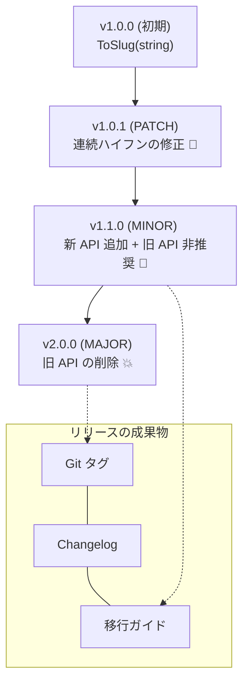

# 第16章：卒業制作（小さなライブラリを“3回リリース”してみる）🎓🚀

この章は「知ってる」じゃなくて「できる」になるための実戦編だよ〜🧠➡️💪
**“自分がライブラリ作者”になって、利用者に配る前提で**SemVer＋互換ポリシーを回します📦✨

SemVerは「まず公開API（Public API）を宣言してね」が大前提だったよね📣（ここがブレると全部ブレる！）([Semantic Versioning][1])
さらに「公開APIをDeprecatedにしたらMINOR上げる」がルールに入ってるのも重要ポイント💡([Semantic Versioning][1])

---

## 16.1 卒業制作のゴール🎯✨（この章で“できるようになること”）




できたら合格〜💮

* ✅ 公開APIを決めて、**v1.0.0**として出せる📦
* ✅ **PATCH / MINOR / MAJOR**を、変更内容に合わせて正しく切れる🔢
* ✅ **Changelog**を「利用者が助かる文章」で書ける📰
* ✅ **Deprecated → 削除（MAJOR）**の流れを体験できる🧡➡️💥
* ✅ “利用者コード視点”のテスト（ミニでOK）を用意できる🧪🛡️

---

## 16.2 今回作る題材：小さな文字変換ライブラリ「CuteSlug」🍌✨（例）

やることを小さくして、互換性の話に集中するよ〜😊
**用途：文字列をURL向けのslugにする**（ブログURLみたいなやつ）

### 公開API（最初の約束）📣

* `Slugger.ToSlug(string text)`
* `Slugger` クラスだけ公開（他はinternalでもOK）

> ポイント：**公開APIは小さく！** 小さいほど破壊変更が減って幸せ🍀

---

## 16.3 リポジトリ構成（おすすめ）📁✨

* `src/CuteSlug/`（ライブラリ本体）
* `tests/CuteSlug.Tests/`（利用者コードっぽいテスト）
* `CHANGELOG.md`（Keep a Changelog形式が楽📰）([Keep a Changelog][2])
* `MIGRATION.md`（v2.0.0用の移行ガイド📄）
* `COMPATIBILITY_POLICY.md`（第15章で作ったやつ📘）

Keep a Changelogは、`Added / Changed / Deprecated / Removed / Fixed / Security` みたいに分類できて、利用者が読みやすいよ🧁([Keep a Changelog][3])

---

## 16.4 リリース①：v1.0.0（“約束を決めて出す”）📦✨


### やること🛠️

1. `Slugger.ToSlug(string)` を実装
2. テストを最低2〜3本（“利用者っぽい呼び方”で）🧪
3. `CHANGELOG.md` に **1.0.0 / Added** を書く📰
4. パッケージ化して「出した体」にする📦
5. Gitタグ `v1.0.0` を打つ🏷️（リリースの目印）

Gitタグは「このコミットがこの版ね！」っていう目印。リリース管理と相性バツグンだよ🏷️✨([CircleCI][4])

### 実装例（最小）✍️

```csharp
namespace CuteSlug;

public static class Slugger
{
    // v1.0.0 の公開API（約束）
    public static string ToSlug(string text)
    {
        if (text is null) throw new ArgumentNullException(nameof(text));

        var trimmed = text.Trim();
        if (trimmed.Length == 0) return "";

        // 超単純：空白→-、小文字化（例）
        return string.Join("-", trimmed.Split(' ', StringSplitOptions.RemoveEmptyEntries))
            .ToLowerInvariant();
    }
}
```

### パッケージ化の“最低ライン”📦

`dotnet pack` は `-p:PackageVersion=1.0.0` みたいに指定できるよ🔧([Microsoft Learn][5])

```bat
dotnet test
dotnet pack -c Release -p:PackageVersion=1.0.0
```

---

## 16.5 リリース②：v1.0.1（PATCH：バグ修正🐛✨）

### シナリオ（よくあるやつ）😇

`ToSlug("A   B")` が `"a---b"` みたいに連続ハイフンになっちゃった！
→ 直す（利用者が期待するのは `"a-b"` だよね？）

### やること🛠️

* 実装を修正（連続空白を潰す）
* テスト追加（再発防止🧪）
* `CHANGELOG.md` に **1.0.1 / Fixed** を追記📰
* `dotnet pack -p:PackageVersion=1.0.1`
* タグ `v1.0.1`

---

## 16.6 リリース③：v1.1.0（MINOR：後方互換の追加➕✨）

ここが「SemVerが効いてる感」いちばん出るよ〜😊

### 追加する新機能案（安全寄り）🧁

* `ToSlug(string text, SlugOptions options)` を追加
* 既存 `ToSlug(string)` は残す（＝後方互換✅）

さらに今回は、**Deprecatedも体験**するよ🧡
SemVerでは「公開APIをDeprecatedにしたらMINOR上げる」ルールがあるから、ちょうど **1.1.0** が合う✨([Semantic Versioning][1])

### Obsolete（Deprecated）を付ける🧡⚠️

C#の `[Obsolete]` は「使わないでね」をコンパイラ警告（またはエラー）で伝えられるよ📣
`Message` や `IsError`（trueでエラー化）も持ってる🧩([Microsoft Learn][6])

```csharp
namespace CuteSlug;

public sealed record SlugOptions(bool Lowercase = true);

public static class Slugger
{
    [Obsolete("Use ToSlug(string, SlugOptions) instead. This API will be removed in v2.0.0.", false)]
    public static string ToSlug(string text)
        => ToSlug(text, new SlugOptions(Lowercase: true));

    public static string ToSlug(string text, SlugOptions options)
    {
        if (text is null) throw new ArgumentNullException(nameof(text));
        var trimmed = text.Trim();
        if (trimmed.Length == 0) return "";

        var parts = trimmed.Split(' ', StringSplitOptions.RemoveEmptyEntries);
        var joined = string.Join("-", parts);

        return options.Lowercase ? joined.ToLowerInvariant() : joined;
    }
}
```

### ここで必ず作るもの📄✨

* `CHANGELOG.md`：**1.1.0 / Added + Deprecated**（Keep a Changelogの分類が便利！）([Keep a Changelog][3])
* `MIGRATION.md`：v2で消えることを予告して、移行方法を書く🧭

---

## 16.7 リリース④：v2.0.0（MAJOR：破壊変更💥📄）

ついに「壊すなら正しく壊す」💥🌷

### 今回の破壊変更

* `ToSlug(string)` を削除（Deprecatedを経由して削除）🧡➡️💥
* 利用者は `ToSlug(string, SlugOptions)` に移行済みの想定

### やること🛠️

* `ToSlug(string)` を削除
* テストは **新APIだけ**で通る状態へ🧪
* `CHANGELOG.md`：**2.0.0 / Removed**（破壊変更は目立たせる！）
* `MIGRATION.md`：最短の移行手順を書く📄
* タグ `v2.0.0`

---

## 16.8 NuGetのバージョン表現：プレリリースも知っておくと強い🥷✨

NuGetは SemVer 2.0.0 の要素（例：`1.0.0-alpha.1` や `+metadata`）を扱うけど、古いクライアントだと対応が弱い話もあるよ〜って公式に書かれてる📦([Microsoft Learn][7])

そして `dotnet pack --version-suffix "ci-1234"` みたいにプレリリースを付けるのもできるよ🤖🔧([Microsoft Learn][5])

```bat
dotnet pack -c Release --version-suffix "alpha.1"
```

---

## 16.9 AIの使いどころ🤖💡（この章は“編集者AI”が最強）

### ① 利用者コードを生成させて互換性チェック👀

「古い呼び方をするコード」をAIに作らせて、壊れてないか確認！

**プロンプト例**💬

* 「CuteSlug v1.0.0 の利用者コード例を5つ作って。初心者が書きそうな感じで」
* 「この変更（説明…）で、その利用者コードが壊れるか判定して理由も」

### ② Changelogを“利用者向けの日本語”に整える📰

* 「この差分を、Keep a Changelog形式で `Fixed` として1〜3行で書いて」

Keep a Changelogの型に寄せると、分類も文章も迷いにくいよ🧁([Keep a Changelog][3])

### ③ MIGRATION（移行ガイド）を短く分かりやすく📄

* 「v1系からv2へ移行する手順を3ステップで。コード例付きで」

---

## 16.10 提出物セット（これが揃ったら“運用できてる”💮）📦📘📰

* ✅ `CuteSlug.1.0.0` / `1.0.1` / `1.1.0` / `2.0.0` の成果物（nupkgでも“体”でもOK）
* ✅ `CHANGELOG.md`（Keep a Changelog）([Keep a Changelog][2])
* ✅ `MIGRATION.md`（v2移行手順）
* ✅ `COMPATIBILITY_POLICY.md`（第15章）
* ✅ リリース前チェックリスト✅

---

## 16.11 リリース前チェックリスト✅（超大事！）

* ✅ 公開APIはどれ？（一覧で言える）
* ✅ 変更は PATCH / MINOR / MAJOR のどれ？理由は？
* ✅ Deprecated を入れたなら **MINOR上げた？** ([Semantic Versioning][1])
* ✅ Changelogに「影響」が書いてある？📰
* ✅ 移行が必要なら MIGRATION がある？📄
* ✅ テスト通ってる？🧪

---

## 16.12 ここまで来たら“卒業”🎓✨

この章をやり切ると、SemVerが「数字の暗記」じゃなくて、
**“利用者との約束を守る運用スキル”**になるよ🤝✨

次にやるなら、題材を「例外の互換性」「null許容」「オーバーロード追加の罠」みたいな地雷寄りに変えると、さらに実戦力が上がる🔥😈

---

必要なら、この卒業制作を**あなたの互換ポリシー（第15章の文面）に合わせて**、題材（ライブラリ内容）を「Web開発で本当に使う系」に寄せたバージョンも作るよ〜😊🧁

[1]: https://semver.org/?utm_source=chatgpt.com "Semantic Versioning 2.0.0 | Semantic Versioning"
[2]: https://keepachangelog.com/en/1.1.0/?utm_source=chatgpt.com "Keep a Changelog"
[3]: https://keepachangelog.com/ja/1.1.0/?utm_source=chatgpt.com "変更履歴を記録する - Keep a Changelog"
[4]: https://circleci.com/blog/git-tags-vs-branches/?utm_source=chatgpt.com "Git tags vs branches: Differences and when to use them"
[5]: https://learn.microsoft.com/en-us/dotnet/core/tools/dotnet-pack?utm_source=chatgpt.com "dotnet pack command - .NET CLI"
[6]: https://learn.microsoft.com/en-us/dotnet/api/system.obsoleteattribute?view=net-10.0&utm_source=chatgpt.com "ObsoleteAttribute Class (System)"
[7]: https://learn.microsoft.com/en-us/nuget/concepts/package-versioning?utm_source=chatgpt.com "NuGet Package Version Reference"
