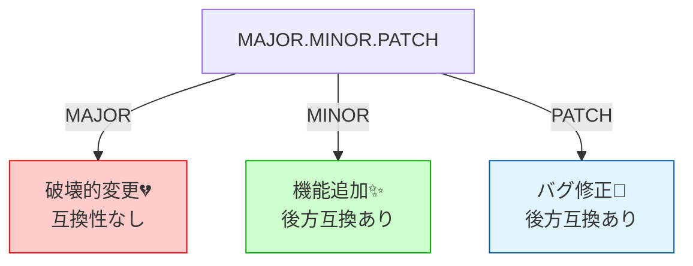
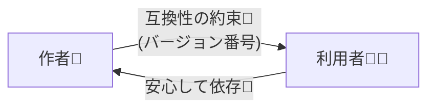

# 第01章：バージョンで何が変わるの？📦😵‍💫

（SemVer＋互換ポリシー：はじめの一歩🌱✨）

---

## 1) 今日できるようになること🎯✨

この章のゴールはこれだけでOKだよ〜😊💕

* バージョン番号が「作者の都合」じゃなくて、**利用者を安心させる“約束”**だとわかる🤝✨
* 「互換性」「契約」「約束」が、**なぜ設計の話**になるのかが腹落ちする🧠🧩
* SemVer（MAJOR/MINOR/PATCH）は、**“約束を共有するためのルール”**だと説明できる📘✨ ([Semantic Versioning][1])

---

## 2) まず最初にあるある💥「更新したら壊れた」

### ある日のあなた（利用者側）👩‍💻🍌

* いつも通り依存パッケージを更新
* テスト回したら…落ちる😱
* あるいは、動くけど結果が違う…もっと怖い😇🌀

ここで一番つらいのは、**「何が起きたのか予想できない」**ことなんだよね🥲
だからこそ、バージョン番号が役に立つように設計されてるの✨

---

## 3) バージョン番号って、結局なに？🔢✨

バージョン番号は、ただの飾りじゃなくて…

> **「この変更は安全だよ / 注意してね / 壊れるよ」**を
> 利用者に伝えるための“サイン”🏷️👀

SemVerでは、MAJOR.MINOR.PATCH の3つに意味を持たせて、**互換性（後方互換）**の有無を伝えるよ📘✨

* MAJOR：互換性を壊す変更（利用者が困る可能性大）💔
* MINOR：互換性を保った機能追加✨
* PATCH：互換性を保ったバグ修正🐛
  …というのが基本ルールだよ〜 ([Semantic Versioning][1])

---

## 4) 「互換性」ってなに？🤝🔍（超やさしく）

### 互換性（後方互換）がある✅

古い使い方のままでも、だいたい動く / コンパイル通る / 意味が同じ✨

### 互換性が壊れる❌（破壊的変更）

今までの使い方だと、動かない / コンパイル通らない / 意味が変わる😱

ここで大事なのは、**“作者にとって些細”でも、利用者には致命傷**ってこと💥
「1行変えれば直るじゃん」は、利用者が1000人いたら1000回の悲鳴になるよ〜😭📣

---

## 5) 「契約」「約束」って何のこと？📜✨

ここで言う“契約”は、法的な話じゃなくて、**開発上の約束**だよ😊

* 作者：「この範囲は変えない（or 変えるならバージョンで知らせる）」
* 利用者：「じゃあ安心してそれに依存するね」

この“約束の対象”が、次に出てくる超重要ワード👇

### ✅ 公開API（Public API）📣

利用者が「使っていい」と信じて依存する部分のこと。
たとえば…

* export されている関数・クラス・型
* 設定オプション
* イベント名
* CLIコマンド
* 返ってくるデータ形（レスポンス構造）
  みたいなやつ🧰✨

SemVerは「公開APIの互換性」を軸にして考えるのが基本だよ📘 ([Semantic Versioning][1])

---

## 6) ここで現実の小ネタ🧂（TypeScriptはちょい特殊）

TypeScript本体（コンパイラ）の世界では、一般的なSemVerの感覚とズレることがあるよ〜⚠️
「minorでも破壊が入りうる」前提で扱おう、という整理が紹介されてるよ📌 ([Semver TS][2])

※この教材では「あなたが作る/配布するTSライブラリ」を、SemVerの気持ちよさで運用できるようになるのがゴールだよ🧩✨（TypeScript本体の事情で“依存側が揺れる”話は、後半で事故らないために触れるよ〜🛡️）

---

## 7) ミニ演習📝✨（10〜15分）

### 演習：自分が使ってるライブラリを1つ選ぼう📦

例：zod / axios / dayjs / lodash など（好きなのでOK）💕

### 手順👣

1. そのライブラリの「利用者として頼ってるもの」を思い出す🤔
2. 「公開APIっぽいもの」を3つ書く📝（関数名・型名・オプション名など）
3. それぞれに、ひとこと理由を書く

   * 「これが消えたら困る」
   * 「ここが変わったらコード直す」
   * 「戻り値の形が変わると影響大」…みたいに👀

#### 書き方例（こんな雰囲気でOK）💡

* API①：〇〇関数（理由：呼び出し側が直撃）
* API②：〇〇型（理由：型エラーで一斉に止まる）
* API③：〇〇オプション（理由：挙動が変わると怖い）

---

## 8) AI活用🤖✨（そのままコピペ用）

### 目的：あなたの「公開APIっぽいもの」を言語化してもらう🗣️✨

#### プロンプト①：公開API候補を出してもらう🧠

「私は “（ライブラリ名）” を使っています。利用者が依存しやすい“公開API”候補を10個挙げて、なぜそれが公開APIと言えそうかも一言ずつ説明して。初心者向けにやさしい口調で。」

#### プロンプト②：あなたの3つをレビューしてもらう🔍

「次の3つを“公開APIっぽい”観点でレビューして。利用者が困る度合い（大/中/小）もつけて。

* （あなたのメモ①）
* （あなたのメモ②）
* （あなたのメモ③）」

#### プロンプト③：READMEに貼れる短い説明に整える📌

「次の文章をREADME向けに、短く・わかりやすく整えて。箇条書き中心で。
（あなたの説明文）」

---

## 9) まとめ🌸（この章で一番大事な1行）

**バージョン番号は、利用者に向けた“安心のサイン”で、公開APIの約束を伝えるためにある**📦🤝✨

SemVerは、その約束を「MAJOR/MINOR/PATCH」に落とし込む基本ルールだよ📘 ([Semantic Versioning][1])

---

## 10) 次章へのワクワク予告🎬✨

次は、いよいよ
**MAJOR/MINOR/PATCH が何を意味するのか**を、変更例で体感していくよ〜🔢🎯
「この変更、どれ上げる？」クイズがめっちゃ楽しいやつ😆💕

（演習で選んだライブラリ、次章でも使うと理解が爆速になるよ🚀✨）

[1]: https://semver.org/?utm_source=chatgpt.com "Semantic Versioning 2.0.0 | Semantic Versioning"
[2]: https://www.semver-ts.org/1-background.html?utm_source=chatgpt.com "TypeScript's Versioning Policy"
