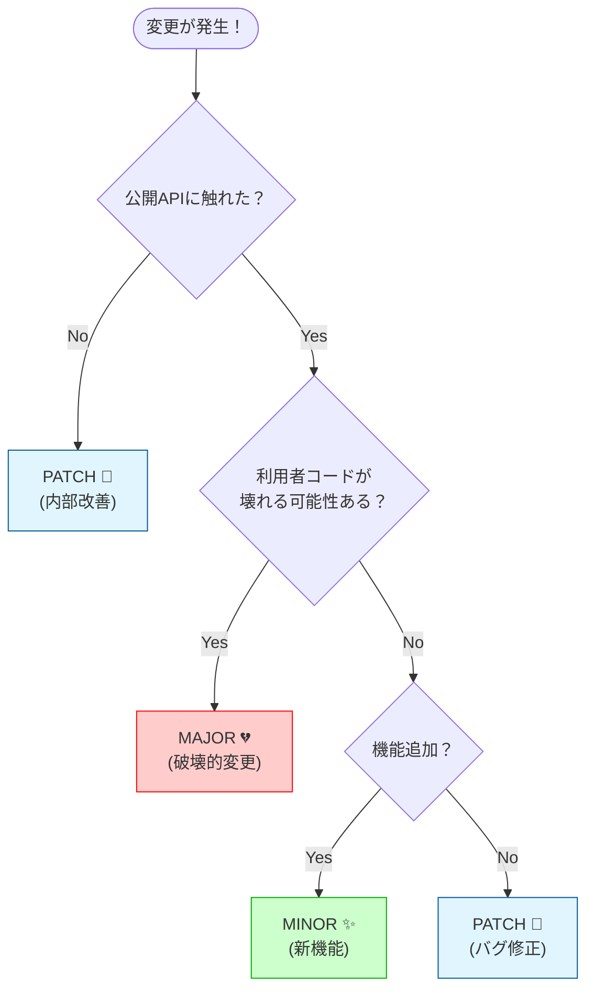

# 第02章：SemVerの超基本：MAJOR/MINOR/PATCH🔢✨

**できるようになる**：3つの番号の役割を、利用者目線で説明できるようになる💬👥

---

## 2.0 まずは結論！3つの番号は「利用者への信号」📶✨


SemVer（セマンティックバージョニング）は、バージョンを **`MAJOR.MINOR.PATCH`** の3つで表して、

* **MAJOR**：互換性が壊れる（= 利用者のコードが壊れうる）💔
* **MINOR**：互換性は保つまま機能追加✨
* **PATCH**：互換性は保つままバグ修正🐛

…っていう **“約束”** を伝える仕組みだよ〜！🤝📦 ([Semantic Versioning][1])

---

## 2.1 “互換”って誰に対して？👥（←ここがいちばん大事）

互換っていうのは、「あなたのライブラリ（またはアプリ）を使ってる人」の世界で起きること！🌍✨
たとえば「利用者」がこう書いてたとして…

```ts
import { add } from "my-lib";
add(1, 2);
```

アップデートしたら急に壊れたら…利用者は泣く😭💥
だからSemVerは **“利用者のコードが壊れる可能性”** を番号で伝える合図なんだよね📣💡 ([Semantic Versioning][1])

---

## 2.2 3つの番号を「一言」で覚える📌✨

覚え方はこれでOK！🥳

* **MAJOR** = 壊すかも（Breaking）💔
* **MINOR** = 足す（Feature）✨
* **PATCH** = 直す（Fix）🐛

SemVerの仕様でも、だいたいこの意味で増やすって書いてあるよ📘 ([Semantic Versioning][1])

---

## 2.3 “壊れる”って、具体的には何？💥🔍

初心者さん向けに、まずはこの3つでOK！✅

1. **コンパイルが通らない**（TSで型エラーになる）🧷
2. **実行時に落ちる**（例外が増える/undefinedになる）💣
3. **動くけど意味が変わる**（結果の意味が変わる）🌀

このうち **どれかが利用者に起きうるなら「壊れる」** と思ってOKだよ😇💡

---

## 2.4 迷ったときの“判断フロー”🧠🧭（超つよテンプレ）

次の順番で考えると、めっちゃ迷いが減るよ〜！🎯✨

1. **公開してるもの（exportしてるもの）に触れた？** 📤
2. **利用者コードが壊れる？**（型/挙動/名前/削除）💥
3. **壊れないなら：機能追加？バグ修正？** ✨🐛

そして結論👇

* 2が **YES** → **MAJOR** 💔 ([Semantic Versioning][1])
* 2が **NO** で機能追加 → **MINOR** ✨ ([Semantic Versioning][1])
* 2が **NO** でバグ修正 → **PATCH** 🐛 ([Semantic Versioning][1])



---

## 2.5 TypeScriptで“ありがち”な例で体感しよ〜🧩✨

### ベース：小さなライブラリを想像📦

```ts
// my-lib
export type User = { id: string; name: string };

export function greet(user: User): string {
  return `Hello, ${user.name}!`;
}
```

---

### ✅ PATCH（バグ修正）例🐛✨

**ケース：内部のミスを直しただけ**（利用者の書き方は変わらない）

```ts
export function greet(user: User): string {
  // 以前はnameが空でもそのまま出してたのを、空なら "there" にする
  const name = user.name.trim() || "there";
  return `Hello, ${name}!`;
}
```

* 利用者コードはそのまま動く👍
* 直した内容が「明らかな誤り」ならPATCHでOKになりやすい🐛

※ただし、**“今までの挙動を仕様として依存されてた”** なら注意⚠️（迷ったらMINORやMAJOR寄りで保守的にするのもアリだよ🥺）

---

### ✅ MINOR（互換を保った機能追加）例✨

#### 例1：新しい関数を追加（既存は壊さない）➕

```ts
export function greet(user: User): string {
  return `Hello, ${user.name}!`;
}

export function greetCasual(user: User): string {
  return `Hi, ${user.name}!`;
}
```

* 既存利用者は何も変更しなくてOK🙆‍♀️
* “使いたい人だけ”新機能を使える✨ → MINOR ([Semantic Versioning][1])

#### 例2：引数を“任意”で追加（互換を保つ）🎁

```ts
export function greet(user: User, emoji?: string): string {
  return `Hello, ${user.name}!${emoji ?? ""}`;
}
```

* 既存の呼び出し `greet(user)` が壊れない✅
* 新しい使い方が増えた✨ → MINOR

---

### ✅ MAJOR（破壊的変更）例💔

#### 例1：関数名を変える（利用者が即死）🪦

```ts
// greet を remove / rename
export function hello(user: User): string {
  return `Hello, ${user.name}!`;
}
```

* `import { greet } from "my-lib"` が壊れる💥
* → MAJOR ([Semantic Versioning][1])

#### 例2：optional → required（地雷）⚠️

```ts
export function greet(user: User, emoji: string): string {
  return `Hello, ${user.name}!${emoji}`;
}
```

* 以前 `greet(user)` だった人が壊れる😭
* → MAJOR

#### 例3：型を狭める（TSだと壊れやすい）🧷💥

```ts
export type User = { id: string; name: "Alice" | "Bob" }; // ←狭めた
```

* 以前 `"Carol"` を渡してた人がコンパイルエラー😇
* → MAJOR寄り（少なくとも“壊れうる”）

---

## 2.6 よくある勘違いTOP5😵‍💫➡️🙂

1. **「内部実装変えたからMAJOR」** → 公開APIに影響しないなら不要なこと多いよ🙆‍♀️
2. **「新機能追加＝MAJOR」** → 互換を保って足すならMINOR✨ ([Semantic Versioning][1])
3. **「バグ修正＝絶対PATCH」** → その修正が“仕様変更級”なら要注意⚠️
4. **「型を厳しくするのは良いことだからMINOR」** → 利用者が壊れるならMAJOR💔
5. **「SemVer守ってれば絶対安全」** → 守れてないパッケージもあるので、運用（固定/lockfile）も別で大事🛡️

---

## 2.7 ミニ演習：10問「どれ上げる？」クイズ🎯✨

直感で答えてOK！🌸（答えは下にあるよ👇）

1. export関数の中身だけ最適化（返り値は同じ）
2. export関数のバグを修正（仕様どおりの結果になる）
3. 新しいexport関数を追加
4. 既存関数に optional 引数を追加
5. 既存関数の引数名だけ変更（外から見える型は同じ）
6. export関数名を変更
7. export型のプロパティを optional → required
8. export型に新しい optional プロパティを追加
9. export enum のメンバーを削除
10. 今まで例外を投げなかったケースで例外を投げるようにした

### ✅ 解答＆ミニ解説🎀

1. PATCH（外から見えない改善なら）🐛
2. PATCH（仕様どおりに直す）🐛 ([Semantic Versioning][1])
3. MINOR（互換を保った追加）✨ ([Semantic Versioning][1])
4. MINOR（壊さず拡張）✨
5. PATCH〜MINOR（“外に出る型”が同じなら壊れにくいけど、公開APIの表現として影響するならMINORでも◎）
6. MAJOR（利用者コードが壊れる）💔 ([Semantic Versioning][1])
7. MAJOR（呼び出し側/型が壊れる）💔
8. MINOR（基本は壊れない追加）✨
9. MAJOR（利用者がその値を使ってたら壊れる）💔
10. MAJOR（実行時破壊の可能性UP）💣💔

---

## 2.8 実践：バージョン番号を上げる（コマンドで）⌨️✨

「よし、これはPATCHだね！」みたいに決めたら、番号を上げよう📦⬆️

```bash
npm version patch
npm version minor
npm version major
```

Git管理してるプロジェクトだと、`npm version` は **コミットとタグ作成も一緒にやる挙動** があるよ（設定でOFFも可）🏷️✨ ([npmドキュメント][2])

タグ作りたくないときの例👇

```bash
npm --no-git-tag-version version patch
```

（「えっタグ勝手に増えるのいや🥺」って時に便利！）

---

## 2.9 AI活用🤖：判断・解説・リリースノートを“秒速”で作る✨

### 使えるプロンプト例（コピペOK）📋💞

**① 変更がMAJOR/MINOR/PATCHどれか判定して！**

* 「次の変更内容をSemVerで分類して。利用者が壊れる可能性を具体例で説明して：

  * 変更：〇〇
  * 公開API：〇〇（exportしてるもの）」

**② 初心者向けに“やさしく”言い換えて！🫶**

* 「この変更がなぜMAJOR（またはMINOR/PATCH）なのか、女子大生向けのやさしい口調で3行で説明して🥺✨」

**③ リリースノート1行を作って！📝**

* 「次の変更を、利用者向けRelease Notesとして1〜2行で書いて。破壊的変更なら移行のヒントも添えて：変更：〇〇」

---

## 2.10 まとめ🎉（この章のゴール達成チェック✅）

* `MAJOR.MINOR.PATCH` を **利用者目線** で説明できる👥✨
* 「壊れるならMAJOR💔、壊さず足すならMINOR✨、壊さず直すならPATCH🐛」で判断できる ([Semantic Versioning][1])
* 迷ったときは **公開API→壊れる？→足す？直す？** の順で考えられる🧠🧭

次の第3章では、**0.x と 1.0.0 の意味**（ここがまた超大事！🚧➡️🏁）に進むよ〜💖

[1]: https://semver.org/?utm_source=chatgpt.com "Semantic Versioning 2.0.0 | Semantic Versioning"
[2]: https://docs.npmjs.com/cli/v7/commands/npm-version/?utm_source=chatgpt.com "npm-version"
