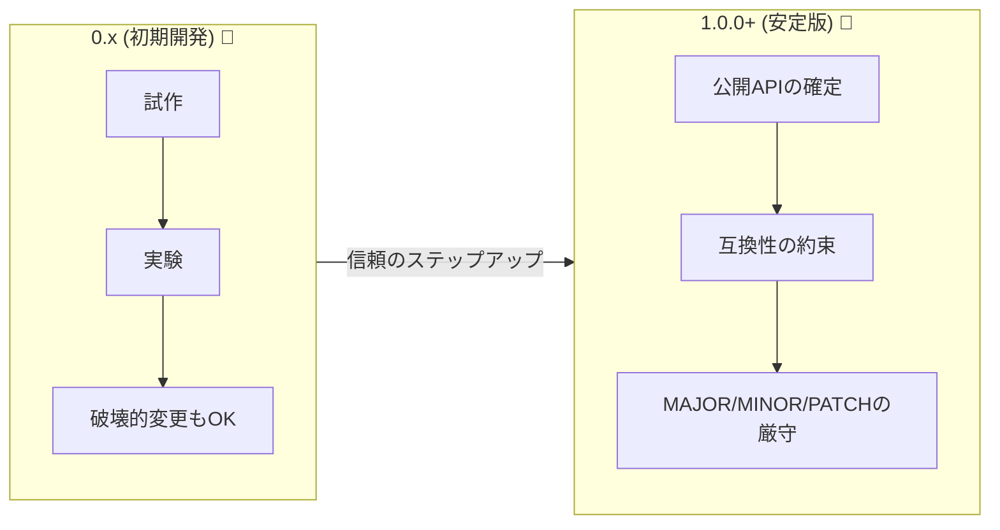
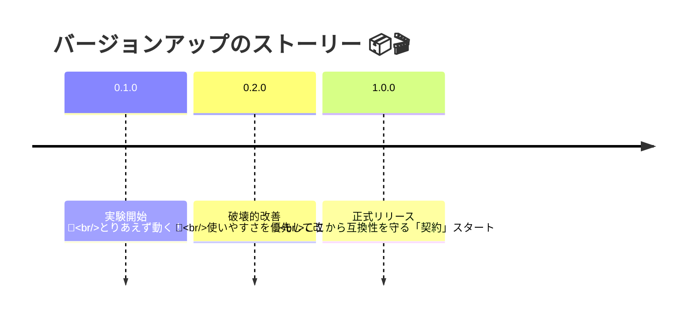

# 第03章：0.x と 1.0.0 の意味（ここ超大事）🚧➡️🏁

## この章でできるようになること🎯💕

* 「0.x のうちは“約束が弱い”」ってどういう意味か説明できるようになる😌✨
* 「1.0.0 は“契約スタート”」の感覚がつかめる🏁📜
* 自分の小さなTSプロジェクトを「まだ0.x？ それとも1.0行ける？」って判断できる🧠✅
* 利用者（未来の自分含む🥹）が困らないための“最低限の書き方”がわかる🛡️✨

---

## 3.1 まず結論：0.x は「まだ固まってない」期間になりやすい🚧🍌

SemVerの仕様では、**メジャーが0（0.y.z）**の間は「初期開発」で、**いつでも何でも変わり得る**、そして**公開APIは安定してると思わないでね**…という扱いです。([Semantic Versioning][1])

つまり利用者目線だと、0.x のライブラリはこう見える👀✨

* 「作者がまだ試行錯誤してるかも」🤔
* 「明日、関数名変わっても“仕様的には”あり得る」😇
* 「アップデート怖い（でも便利だから使いたい）」🥺

でもね…ここで大事な本音💡
👉 **仕様が“0.xは不安定”と言ってても、現実には0.xで長く運用されるライブラリもある**し、利用者は普通に頼っちゃうの。だからこそ、作者側が少しでも“約束のルール”を添えると超親切になるよ🥰✨

---

## 3.2 1.0.0 は「ここから公開APIを守るよ」宣言🏁📣


SemVerの仕様では **「1.0.0 が公開APIを定義する」** とされています。
そして **1.0.0以降は、その公開APIがどう変わるかで、バージョンの上げ方（MAJOR/MINOR/PATCH）が決まる**、という考え方です。([Semantic Versioning][1])

さらに、SemVerを名乗るなら **「公開APIを宣言しなきゃダメ」**（コードでもドキュメントでもOK）という思想が前提にあります。([Semantic Versioning][2])

イメージでいうと…👇💕

* **0.x**：試作・実験・成長期🧪🌱（まだ型もUIも迷っていい）
* **1.0.0**：契約スタート📜🤝（“守るべき面”が決まった）



---

## 3.3 “約束”って何？— TypeScriptだとここが刺さる🧷⚡


TSのライブラリで「約束」になりやすいのは、だいたいここ👇

* exportされてる関数名・引数・戻り値（型も含む）📤
* exportされてる型（type / interface）🧩
* 例外の投げ方やエラーの形（Errorメッセージに依存されることも😵）💥
* 戻り値の意味（同じ型でも意味が変わると地雷🌀）

0.xの間は、このへんが「まだ変わるかもね〜」になりがち。
1.0.0以降は、ここを中心に「互換性」を守るゲームが始まるよ🎮✨

---

## 3.4 じゃあ「いつ 1.0.0 にするの？」判断基準🧱✅


“完璧”を待つと一生1.0にならないので🤣、目安を作ろう💡

### ✅ 1.0.0 に近いサイン（Goサイン）🏁✨

* 主要な使い方（ユースケース）が2〜3個くらい固まった🎯
* 公開したい export が「これだ！」って決まった📣
* 命名・引数・戻り値の型が、しばらく変えなくて済みそう🧷
* READMEに「使い方」が最低限書ける📝
* 破壊的変更をするなら、**非推奨→移行→削除**の流れでやる気がある🔥

### 🚧 まだ 0.x が自然なサイン（Stopサイン）🛑😵

* 仕様が毎週変わる（自分でも迷ってる）🌀
* exportが増えたり減ったり、名前も定まらない📤💨
* 型設計がまだ“仮”で、後から大改造したい😇
* 「誰が使うの？」がまだ見えてない👻

---

## 3.5 0.xでも“最低限の約束”を作ると強い💪✨（おすすめ）


SemVer的には0.xは不安定扱いだけど、利用者の安心のために **自分ルール** を添えるのが人気だよ🙂✨

例えば、こんな方針👇

* **0.MINOR が変わるときは破壊的変更あり得る**（例：0.2 → 0.3）🚧
* **0.MINOR.PATCH の PATCH は基本バグ修正**🐛✨
* 公開APIは「このファイル（index.ts）からexportしてるものだけ」📦

> ※こういう“現実ルール”は、0.x運用でよく採られる発想としてnpm周辺でも言及があります（0.xは破壊が入りやすい前提で範囲指定が語られる、など）。([npmドキュメント][3])

### READMEに貼れるミニ例（そのまま使ってOK）📌✨

```md
## Versioning policy (pre-1.0)

- This project is in early development (0.x).
- Breaking changes may happen when MINOR changes (0.y -> 0.(y+1)).
- PATCH is for backward-compatible bug fixes.
- Public API is only what is exported from `src/index.ts`.
```

---

## 3.6 利用者側の注意：0.x は依存アップデートが“思った通り”にならないことがある🎢😇

0.xは「不安定になりやすい」前提があるので、依存関係のバージョン範囲指定でも扱いがちょっと特殊になりがち💥

たとえば **キャレット（^）** は 0系だと “左端の非ゼロ” を基準に動くので、例として👇みたいになります。([JSR][4])

* ^0.2.3 → 「0.3.0未満まで」
* ^0.0.3 → 「0.0.4未満まで」

このへんは第10章でガッツリ体感するから、ここでは合言葉だけ覚えてね👇💕
👉 **0.x依存は“更新の仕方”を意識しないと事故りやすい**🧨

---

## 3.7 例で体感しよう：0.x → 1.0.0 の“ストーリー”📦🎬


### 🧪 0.1.0（実験）

* export関数：parseUser(text)（戻り値がまだ仮）
* 「とりあえず動く！」が価値✨

### 🚧 0.2.0（破壊あり）

* parseUser → parseProfile に改名（利用者コード壊れる）💥
* 型も整理して戻り値変える🧷

### 🐛 0.2.1（バグ修正）

* 例外が出る条件を直す✨

### 🏁 1.0.0（契約宣言）

* exportを index.ts に集約して「公開面」を固定📣
* READMEに“これがPublic API”を書いた📜
* ここからは、公開APIを壊すならMAJORでやる、の世界へ🚀



---

## 3.8 ミニ演習（超大事💓）📝✨

### 演習A：自分の小プロジェクトを判定しよう🚧 or 🏁

1. いま作ってる（または作った）小プロジェクトを1つ選ぶ🎮
2. 「利用者が頼りそうなもの」を3つ書く📝

   * 例：export関数、設定オブジェクト、CLIコマンド…
3. 次の質問に答える👇

   * その3つ、来月も同じ形で残せそう？🤔
   * 名前・引数・戻り値の型、変えたくなりそう？😵
4. 結論：**0.x続行 or 1.0.0行けそう** を決めて、理由を1〜2行で書く💬✨

### 演習B：AI活用🤖💕（理由をREADME向けに整える）

AIにこう投げてね👇（コピペOK）

* 「次の文章を、READMEに貼れる短い文章にして。やさしい口調で。箇条書きで。
  文章：『（あなたの理由）』」
* 「このプロジェクトの公開API候補は（A/B/C）。1.0.0にする判断として弱い点を3つ挙げて」

---

## 3.9 ありがちQ&A（ここで詰まりやすい）💡😳

### Q1. 0.xなのに“互換”を気にするのって変？

A. ぜんぜん変じゃないよ〜！むしろ親切🥰
仕様的には0.xは不安定扱い。だからこそ、**自分ルールを書くだけで利用者が救われる**の✨([Semantic Versioning][1])

### Q2. 1.0.0にしたら、もう一生壊せないの？

A. 壊せるよ！ただし **壊すならMAJORで宣言して、移行の道を用意する**のが礼儀🤝✨
（この“礼儀”を第14章で超やさしくやるよ🪜💕）

---

## この章のまとめ🎀✨

* **0.x = まだ固まってない期間になりやすい（仕様的にもそう）**🚧([Semantic Versioning][1])
* **1.0.0 = 公開APIを定義して、ここから互換性の約束で運用する**🏁([Semantic Versioning][1])
* 0.xでも **ミニ互換ポリシー** を書くと、利用者の安心が爆上がり🛡️💕
* 依存側は 0.xの扱いに注意（範囲指定が直感とズレることがある）🎢([npmドキュメント][3])

---

次の第4章では、いよいよ「公開APIって何をどこまで？」を、TSのexportを使って線引きしていくよ〜📣🧱✨

[1]: https://semver.org/?utm_source=chatgpt.com "Semantic Versioning 2.0.0 | Semantic Versioning"
[2]: https://semver.org/spec/v1.0.0.html?utm_source=chatgpt.com "Semantic Versioning 1.0.0"
[3]: https://docs.npmjs.com/cli/v6/using-npm/semver?utm_source=chatgpt.com "semver | npm Docs"
[4]: https://jsr.io/%40std/semver?utm_source=chatgpt.com "@std/semver - JSR"
