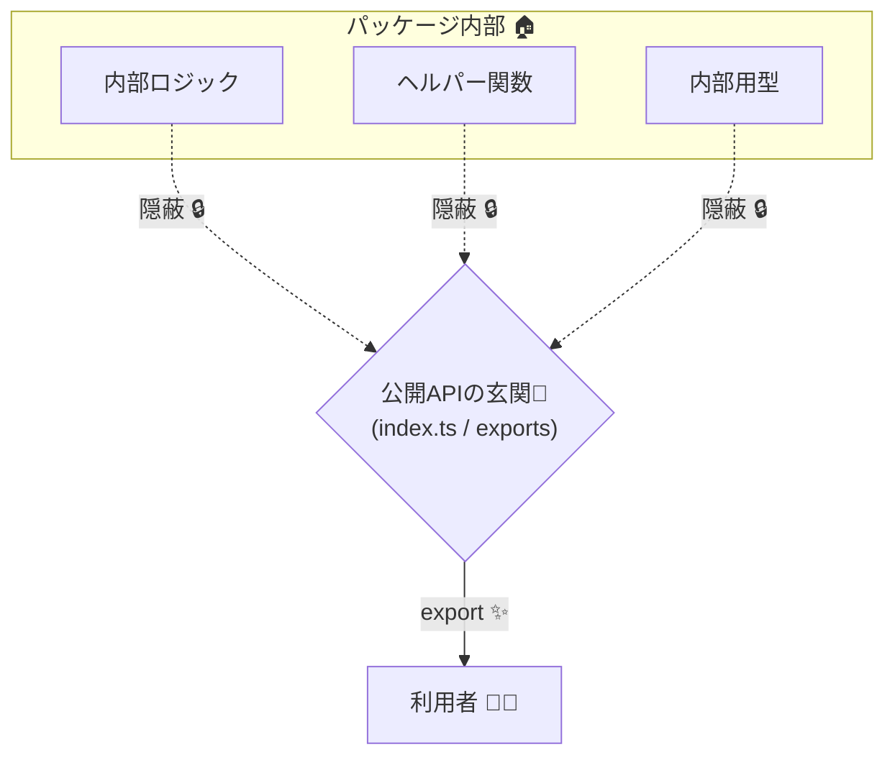

# 第04章：SemVerが効く範囲：まず「公開API」を決めよう📣🧱

## この章でできるようになること🎯✨

* 「約束するもの（公開API）」と「約束しないもの（内部）」をスパッと分けられる✂️
* “どこまで変えたら MAJOR/MINOR/PATCH なの？”の**判断の土台**が作れる🏗️
* 利用者に優しい「公開面（API surface）」を設計できる😊

---

## 4.1 そもそもSemVerは「公開APIが決まって」初めて機能する📦✨

SemVerのルールって、実は最初に「**うちは何を公開APIとして約束します**」を宣言しなきゃ始まらないんだよね📣
SemVerの仕様でも「SemVerを使うなら public API を宣言してね」って前提になってるよ。([Semantic Versioning][1])

だからこの章の結論はこれ👇
**「バージョン番号」より先に、まず「公開API」を決めよう🧱**



---

## 4.2 「公開API」って何？（TypeScriptだとここが公開になりやすいよ👀）

公開API＝「利用者が安心して頼っていい“約束の範囲”」🤝
TypeScriptだと、だいたい次の5つに分けると超わかりやすいよ〜😊✨

### A) importできる入口（エントリポイント）🚪

* `import { x } from "your-lib"` の **入口**
* `package.json` の `"exports"` で「どこを入口にするか」を定義できるよ🧭
  `"exports"` は入口を明示できて、**そこ以外を入口にさせない**方向にできる（＝公開面をはっきりさせられる）よ。([Node.js][2])

### B) exportされている値（関数・クラス・定数など）📤

* `export function foo()`
* `export class Bar`
* これらは「利用者が呼べる」＝公開になりやすい🧰

### C) exportされている型（型が約束！）🧷

* `export type` / `export interface` / `export enum` など
* TSは「型」も利用者が依存するから、ここを雑に変えると壊れやすい😵‍💫

### D) 挙動（ランタイムの約束）⚙️

* エラーを投げる/投げない
* 返す値の意味
* 副作用（ログ出る、ファイル触る、イベント発火する…）
  → **型が同じでも意味が変わると破壊**になりがち💥

### E) “コード以外”の入口（意外と忘れがち！）🧩

* CLIコマンド（`bin`）🖥️
* 設定ファイルの形式（JSONのキー、オプション名）🧾
* イベント名、フック名、環境変数名🌱
* プラグイン向けの拡張ポイント🔌

👉 ここまで含めて「公開API」って考えると事故が減るよ〜🛡️

---

## 4.3 「内部（非公開）」は自由に壊してOK…でも“漏れる”と事故る🙅‍♀️💥

内部＝「利用者が本来触らない前提の部分」🏠
たとえば👇

* `src/internal/*` の便利関数
* 実装都合の型（外に出すつもりないやつ）
* ファイル構成（フォルダ名・配置）📁

### でも現実には…“勝手に内部をimportされる”問題が起きる😇

利用者がこんなの書いちゃうやつ👇
`import x from "your-lib/dist/internal/x"`

これ、作者からすると「やめて〜〜😭」だけど、入口が開いてると起きるの…。

そこで効くのが `"exports"` だよ✨
Node.jsのドキュメントでも、`"exports"` は「定義した入口以外を使わせない」方向にできて、パッケージの公開インターフェースを明確にできる、って説明されてるよ。([Node.js][2])
（※逆に、既存パッケージに `"exports"` を導入すると、今まで使えてた“裏口”が塞がって破壊的変更になりうる、とも書かれてるよ⚠️）([Node.js][2])

---

## 4.4 公開APIを決める「3ステップ」🪜✨


### Step 1) 入口ファイルを1つ決める（公開面の玄関）🚪

おすすめはこの2択👇

* `src/index.ts`（王道👑）
* `src/public-api.ts`（“ここが公開だよ”が伝わる💡）

ここだけを利用者に見せる気持ちで、**再エクスポートの集合場所**にするよ🧺
（いわゆる Barrel ってやつだね〜）([TypeScript Deep Dive][3])

### Step 2) 公開するものを“リスト化”する📝

* 関数
* 型
* 例外（投げるなら種類）
* 設定
* イベント
* 入口（サブパスがあるならそれも）

「公開API一覧」があるだけで、SemVer判断がめちゃ楽になるよ🥹✨

### Step 3) “公開じゃない”を明文化する🚧

* `internal` って名前のフォルダに入れる
* `/** @internal */` を付ける
* READMEに一言入れる（短くでOK）📌

---

## 4.5 実践ミニ：🍌バナナライブラリで線引きしてみよっ

### ✅ 例：公開面は `src/index.ts` だけにする

```ts
// src/index.ts  ← ここが「公開API」🍌✨
export type BananaOptions = {
  sweetness?: number; // 0..10
};

export function peelBanana(opts: BananaOptions = {}): string {
  return peelCore(opts);
}

// “内部”は export しない（＝約束しない）
import { peelCore } from "./internal/peelCore";
```

```ts
// src/internal/peelCore.ts  ← 内部実装🏠
export function peelCore(opts: { sweetness?: number }): string {
  const s = opts.sweetness ?? 5;
  return `peeled🍌 sweetness=${s}`;
}
```

この状態だと、利用者は基本 `your-lib` からしか触れない想定になるよね😊

---

## 4.6 “型の公開”でよく漏れるポイント🧷💦（ここ超大事）

### 「内部の型」が公開APIに混ざると、内部が公開になっちゃう😱

たとえば公開関数の戻り値に、内部型が出てくると…
**戻り値を変えられなくなる＝内部が約束になっちゃう**の💥

✅ 対策の考え方👇

* 公開関数のシグネチャ（引数・戻り値）は **公開型だけ**で構成する
* 内部型は関数の中で閉じ込める
* どうしても必要なら「公開用DTO」を作る📦

---

## 4.7 “見えない公開”をコントロールする道具たち🧰✨

### ① `package.json` の `"exports"`：入口を絞って、公開面を固定する🔒

`"exports"` は「入口を定義して、それ以外の入口を防ぐ」方向にできるよ。([Node.js][2])
結果として「ここが公開APIだよ」がハッキリする😊

ざっくりイメージ（例）👇

* `.` だけ公開（メイン入口だけ）
* `./cli` も公開（CLI用入口）
* `./internal/*` は公開しない（裏口を塞ぐ）🚫

（Nodeのドキュメントにも、`"exports"` は公開インターフェースを明確化できるって説明があるよ。）([Node.js][2])

### ② `stripInternal`：`@internal` を付けた宣言を `.d.ts` から消す🧹

TypeScriptには `stripInternal` ってオプションがあって、JSDocの `@internal` が付いた宣言を `.d.ts` 出力から除外できるよ。([typescriptlang.org][4])

```ts
/** @internal */
export const secretSauce = 42;
```

さらにドキュメント生成（TypeDoc）でも `@internal` を除外できる仕組みがあるよ〜📚✨([typedoc.org][5])

### ③ `files`：配布物に含めるファイルを絞る📦

npmの `files` は「インストールされる中身（tarball）に何を入れるか」を指定できるよ。([npmドキュメント][6])
内部ソースを丸ごと配らない方針にすると、さらに事故が減る🛡️

---

## 4.8 ミニ演習（手を動かすやつ✍️✨）

### 演習A：公開/内部 仕分けクイズ🎯

次を「公開API」or「内部」で分類してね👇

1. `export function parse()`
2. `src/internal/cache.ts` の関数
3. `export type Options`
4. 設定ファイルのキー `timeoutMs`
5. 例外メッセージの文言（完全一致を前提にしていい？）
6. `your-lib/dist/utils.js` を直接importできる裏口

> 目安：利用者が頼っていい前提なら公開、頼ってほしくないなら内部🏷️

### 演習B：自作モジュールで「公開API一覧」を作る📝

* 公開入口（例：`index.ts`）から export してるものを列挙
* “約束しないもの”も3つ書く（例：`internal/` 以下、非公開のヘルパー、ファイル構成）

---

## 4.9 AI活用（ここが超ラクになる🤖✨）

### ✅ 公開APIの棚卸しプロンプト例🧺

* 「このリポジトリで、利用者が import できる export 一覧を作って。入口ごとに分けて。」
* 「公開関数の引数/戻り値に、内部型が混ざってないか点検して。」
* 「“破壊的変更になりそうな変更”を疑って、理由も添えて指摘して。」

### ✅ 互換ポリシー文のたたき台プロンプト例📜

* 「公開APIの定義を、短い文章で。初心者向けで、やさしく。」
* 「READMEに貼れる“公開/内部の線引き”のテンプレを作って。」

---

## 4.10 この章のまとめ🌸

* SemVerは「公開APIの約束」が決まって初めて回り出すよ📣([Semantic Versioning][1])
* TypeScriptは **値だけじゃなく“型”も公開API**になりやすい🧷
* `"exports"` で入口を絞ると、公開面を固定しやすい🔒([Node.js][2])
* `@internal` + `stripInternal` で “うっかり公開”を減らせる🧹([typescriptlang.org][4])

---

## 次章につながる一言📌

公開APIが決まったら、次は「壊れるって具体的に何が壊れるの？」を、**コンパイル／実行時／意味**に分けて見ていくよ〜💥🔍
（第5章で一気に“判断力”が上がるやつ！🔥）

[1]: https://semver.org/?utm_source=chatgpt.com "Semantic Versioning 2.0.0 | Semantic Versioning"
[2]: https://nodejs.org/api/packages.html "Modules: Packages | Node.js v25.4.0 Documentation"
[3]: https://typescript-jp.gitbook.io/deep-dive/main-1/barrel?utm_source=chatgpt.com "Barrel | TypeScript Deep Dive 日本語版 - GitBook"
[4]: https://www.typescriptlang.org/tsconfig/stripInternal.html?utm_source=chatgpt.com "stripInternal - TSConfig Option"
[5]: https://typedoc.org/documents/Options.Input.html?utm_source=chatgpt.com "entryPoints"
[6]: https://docs.npmjs.com/cli/v7/configuring-npm/package-json/?utm_source=chatgpt.com "package.json - npm handling"
