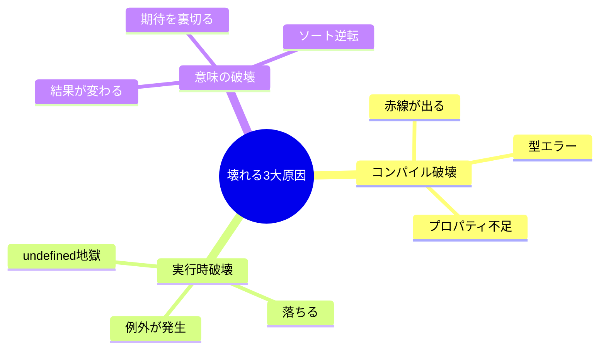

# 第05章：互換性の種類：壊れるって具体的に何が壊れるの？💥🔍

この章はね、「破壊的変更（breaking change）」って言われたときに、**“どこがどう壊れるの？”** をちゃんと説明できるようになる回だよ〜🧠✨
SemVerでは、**公開APIに後方互換性のない変更が入ったら MAJOR を上げる**のが基本ルールだよ📛（ここがブレない軸！） ([Semantic Versioning][1])

---

## 5.0 この章でできるようになること🎯✨

* 「壊れる」を **3種類** に分けて考えられる（超大事！）🧩
* 変更を見て「これは MAJOR？」って判断の根拠を持てる🧠
* “バグ修正なのに壊れる”みたいなややこしいケースで迷いにくくなる😵‍💫➡️😊

---

## 5.1 まず「壊れる」って何？🧨

利用者（あなたのライブラリを使う人）がアップデートしたときに…

* ✅ **今までのコードがそのまま動く** → 互換性あり
* ❌ **そのままだと困る**（コンパイルできない／落ちる／結果の意味が変わる）→ 互換性なし

SemVer的にはこの「互換性なし」が **公開API** に起きたら、基本 **MAJOR** だよ📌 ([Semantic Versioning][1])

---

## 5.2 「壊れる」は3カテゴリで考える🧁✨


壊れ方はだいたいこの3つに整理できるよ👇

### ① コンパイル破壊（型で止まる）🧷🚫

TypeScriptが **赤線** を引いてくるやつ！
「型が合いません」「プロパティがありません」みたいな。

### ② 実行時破壊（動くけど落ちる）💣😱

コンパイルは通るのに、実行すると **例外** とか **undefined地獄** とか。

### ③ 意味の破壊（動くけど“別物”になる）🌀🥲

一番こわい！
落ちないし型も通るのに、**結果の意味** が変わって利用者が事故るやつ。



---

## 5.3 ① コンパイル破壊（型で止まる）🧷⚠️


### 代表例：引数や戻り値の型を変えた🧊

```ts
// v1
export function parseAge(input: string): number;

// 利用者
parseAge("20");
```

```ts
// v2（変更）
export function parseAge(input: number): number; // ← string じゃなくなった
```

利用者側は `parseAge("20")` のままだから、**コンパイルエラー**になるよね😵‍💫
→ 公開APIなら、基本 **MAJOR** 💥

---

### 代表例：optional → required（地味にデカい）🧷😇

```ts
// v1
export type Options = { verbose?: boolean };
export function run(options?: Options): void;
```

```ts
// v2
export type Options = { verbose: boolean }; // required に！
export function run(options: Options): void; // 引数も必須に！
```

これ、利用者が `run()` って呼んでたら即死💀
→ 公開APIなら **MAJOR** 💥

---

### 代表例：unionを削る（これも壊れる）🧊✂️

```ts
// v1
export type Mode = "fast" | "safe";
```

```ts
// v2
export type Mode = "safe"; // "fast" が消えた
```

利用者が `"fast"` を使ってたらコンパイルで止まるよね🧷
→ **MAJOR** 💥

---

## 5.4 ② 実行時破壊（動くけど落ちる）💣🔥


ここは「型では止まらない」から、事故りやすいよ〜😇

### 代表例：エラーを投げるようになった💥

```ts
// v1
export function getUserName(id: string): string {
  return db.find(id)?.name ?? "unknown";
}
```

```ts
// v2（仕様変更）
export function getUserName(id: string): string {
  const user = db.find(id);
  if (!user) throw new Error("User not found"); // ← 例外！
  return user.name;
}
```

型は同じ `string` で通るのに、利用者側が例外処理してないと **実行時に落ちる**💣
→ これも公開APIの後方互換を壊してるなら **MAJOR** 💥 ([Semantic Versioning][1])

---

### 代表例：返す値の“形”が変わった（any/unknown経由でスルーされがち）🫠

```ts
// v1
export function getConfig(): any {
  return { timeout: 1000 };
}
```

```ts
// v2
export function getConfig(): any {
  return { timeoutMs: 1000 }; // キー名が変わった
}
```

型が `any` だとコンパイルは通っちゃうのに、利用者は `config.timeout` を読んでて **undefined** 😭
→ **実行時破壊** 💣（そして大抵 MAJOR）

---

## 5.5 ③ 意味の破壊（動くけど“期待が裏切られる”）🌀💔


これがいちばんイヤなやつ〜😭
**壊れたって気づきにくい**し、バグ報告も遅れて地獄になりがち🔥

### 代表例：ソート順が変わった📚↕️

```ts
// v1: createdAt 昇順（古い→新しい）
export function sortPosts(posts: Post[]): Post[] { ... }
```

```ts
// v2: createdAt 降順（新しい→古い）
export function sortPosts(posts: Post[]): Post[] { ... }
```

型も動作もOKに見えるけど、画面が逆順になって「UI壊れた？」ってなる😇
→ **意味の破壊**（公開APIの期待を壊すなら MAJOR寄り）

---

### 代表例：同じ入力でも“意味の違う結果”を返す🧠🔄

* 日付のタイムゾーン扱いが変わる🕰️
* 丸め（四捨五入→切り捨て）が変わる🔢
* デフォルト値が変わる🎛️
* “空文字はOK”→“空文字はエラー”みたいな境界ルールが変わる🚧

落ちないからこそ、利用者は最初「自分のバグかな？」って悩むの…つらい🥲

---

## 5.6 “バグ修正”でも MAJOR になることあるよ🐛➡️💥

「バグ修正＝PATCH」って思いがちだけど、SemVerは **“後方互換が壊れたか”** で見るんだよね👀
だから、たとえ「直しただけ」でも、利用者がその挙動に依存してたら **破壊的変更** になりうるよ。 ([Semantic Versioning][1])

---

## 5.7 迷ったときの判断フロー🧭✨


変更を見たら、この順でチェックすると迷いが減るよ✅

1. **公開APIに触れてる？**（exportされてる関数/型/挙動/CLIなど）📣
2. 利用者のコードが **コンパイルで止まる？** 🧷
3. コンパイル通っても **例外/undefined/副作用** で壊れる？ 💣
4. 最後に、**意味（期待）が変わってない？** 🌀

2〜4 が「YES」なら、だいたい **MAJOR検討**💥
（1がNOなら、基本は内側の変更なので SemVer的には気がラク😊）

---

## 5.8 ミニ演習：どの壊れ方？どのバージョン？🎯📝

次の変更、**(A)コンパイル破壊 (B)実行時破壊 (C)意味の破壊** どれ？
ついでに **SemVerなら何を上げる？** を考えてみよ〜✨

1. `export function foo(a: string)` の `a` を `number` にした
2. `export type Status = "ok" | "ng"` から `"ng"` を削除
3. 例外を投げなかった関数が、条件によって `throw` するようになった
4. 同じ入力でも戻り値の “単位” が変わった（秒→ミリ秒）
5. `export const DEFAULT_TIMEOUT = 1000` を `2000` に変えた
6. 返す配列の並び順を逆にした
7. `deprecated` を付けただけ（動作は変えてない）

---

### ✅ 解答の目安（ざっくり）🎓✨

* 1: A（コンパイル）→ 公開APIなら MAJOR
* 2: A（コンパイル）→ MAJOR
* 3: B（実行時）→ MAJOR
* 4: C（意味）→ MAJOR寄り（期待が壊れてる）
* 5: C（意味）→ 影響次第。期待に入ってるなら MAJOR、そうでなければ MINOR/PATCH検討
* 6: C（意味）→ MAJOR寄り
* 7: 互換性は壊してない（ただし後の章の「非推奨→次MAJORで削除」につながる🪜）

---

## 5.9 AI活用🤖✨（破壊ポイントを言語化させる）

AIって「壊れ方の分類」がめちゃ得意だよ〜！でも最後は人間が判断ね😉

### そのまま貼れるプロンプト例📋💬

* 「この差分（before/after）を見て、(A)コンパイル破壊 (B)実行時破壊 (C)意味の破壊 に分類して。利用者が困る具体例も3つ出して」
* 「公開APIとして破壊的変更かを判定して、SemVerなら MAJOR/MINOR/PATCH のどれか理由付きで」
* 「破壊的変更っぽいところを“利用者向けリリースノート”としてやさしく3行で書いて」

---

## 5.10 ちょい最新メモ（2026年時点）🗞️✨

* 公式のダウンロード案内では **最新 TypeScript は 5.9** になってるよ。 ([typescriptlang.org][2])
* それと別で、**TypeScript本体のバージョニングは厳密SemVerとは違う**という前提も知られてるよ（あなたのライブラリがSemVer運用するのとは別問題だよ〜！）。 ([Learning TypeScript][3])

---

次の章（第6章）では、この中でも特に事故りやすい **「型の変更」** を、地雷パターン別にガッツリやるよ🧷⚠️✨

[1]: https://semver.org/?utm_source=chatgpt.com "Semantic Versioning 2.0.0 | Semantic Versioning"
[2]: https://www.typescriptlang.org/download/?utm_source=chatgpt.com "How to set up TypeScript"
[3]: https://www.learningtypescript.com/articles/why-typescript-doesnt-follow-strict-semantic-versioning?utm_source=chatgpt.com "Why TypeScript Doesn't Follow Strict Semantic Versioning"
