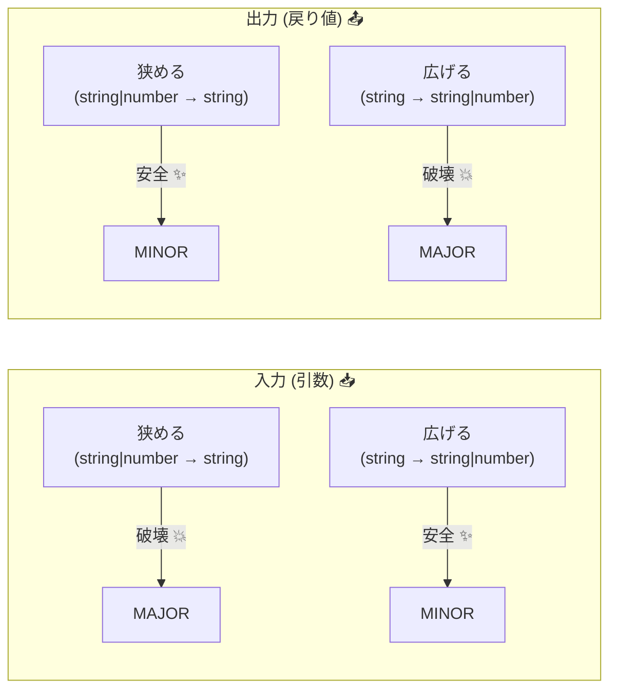

# 第06章：TypeScriptの地雷①：型の変更はどう壊れる？🧷⚠️

この章は「**型＝公開APIの一部**」だと思えるようになる回だよ〜！😊
TypeScriptでライブラリ（または社内モジュール）を出すとき、**型定義（`export` してる型・関数シグネチャ）を変える＝契約を変える**ってこと。
SemVer的にも「公開APIに後方互換のない変更が入ったら MAJOR」なので、型の変更はバージョン判断に直結するよ📦✨ ([Semantic Versioning][1])

---

## 6.0 この章でできるようになること🎯✨

* 「この型変更、利用者のコードが壊れる？」を**パターンで即判定**できる👀
* **MAJOR/MINOR/PATCH**の判断がブレにくくなる🧠
* 壊す必要があるときに、**安全な進化のさせ方（回避策）**を選べる🛟
* AIに「破壊点チェック」や「移行ガイド案」を作らせて時短できる🤖💨

---

## 6.1 まず大前提：型は“仕様書”📜💗

TypeScriptの利用者は、あなたのライブラリをこうやって使うよね👇

* `export function` の引数・戻り値
* `export type / interface` の形
* `export const` の型（リテラル含む）
* `enum` やリテラル union（`"a" | "b"`）
* コールバック（イベント/フック）の引数

これらは全部、利用者から見た「**触っていい面（API surface）**」で、**ちょっとの型変更が“コンパイル破壊”**につながるのが地雷ポイント💣

---

## 6.2 “壊れる”の3種類（第5章のおさらい）💥🔍

この章は主に①を扱うよ🧷

1. **コンパイル破壊**：型が合わずビルド/型チェックが落ちる🧷
2. **実行時破壊**：例外になる・動かない💣
3. **意味の破壊**：動くけど結果の意味が変わる🌀

---

## 6.3 最重要！「入出力の法則」🧠📌


同じ“型変更”でも、**入力（引数）**と**出力（戻り値）**で危険度が逆になりがちだよ〜！

### ✅ ざっくり結論（覚え方）🌟

* **入力（引数）**：狭くすると壊れやすい😵（受け付けるものを減らす）
* **出力（戻り値）**：広くすると壊れやすい😱（返り値の可能性が増える）



---

## 6.4 地雷カタログ：これが来たら警戒アラーム🚨🍌

以降、「Before→After」で書くね✍️
（コードは短いけど、現場だとこれが“事故”になります…！😇）

---

### 地雷① 引数型を狭める（narrowing）🧷⚠️ → だいたいMAJOR


```ts
// Before ✅
export function find(id: string | number) {}

// After ❌（numberを受け付けなくなった）
export function find(id: string) {}
```

利用者が `find(123)` してたら即死💥
→ **公開APIに後方互換なし＝MAJOR** が基本 ([Semantic Versioning][1])

**安全案🛟**

* 新しい関数名を追加：`findByStringId(id: string)` を足す（MINOR）
* どうしても統一したいなら、旧パスを非推奨にして段階移行（第14章につながる🪜）

---

### 地雷② optional → required（省略OK→必須）🙅‍♀️⚠️ → ほぼMAJOR

```ts
// Before ✅
export function connect(options?: { timeoutMs?: number }) {}

// After ❌（呼び出し側が options を必ず渡す必要が出た）
export function connect(options: { timeoutMs?: number }) {}
```

`connect()` がコンパイルエラーになる😵
**optional→required は壊れる**、超鉄板⚠️

---

### 地雷③ 戻り値が “undefined かも” になる（widening）😱 → ほぼMAJOR

```ts
// Before ✅
export function getUserName(): string { return "komi"; }

// After ❌（利用者に「undefined処理」を強制）
export function getUserName(): string | undefined { return undefined; }
```

利用者は今まで `toUpperCase()` とか直で呼べたのに、急にガードが必要になるよね🌀

**安全案🛟**

* 互換を守るなら：戻り値は `string` のままにして、失敗時は例外 or 別API
* 例：`tryGetUserName(): string | undefined` を追加（MINOR）✨

---

### 地雷④ union からメンバーを削る（`"a"|"b"` → `"a"`）🧊⚠️ → MAJOR寄り

```ts
// Before ✅
export type Status = "pending" | "done";

// After ❌（"pending" が消えた）
export type Status = "done";
```

利用者が `"pending"` を扱ってたら、当然壊れる💥
**リテラル削除・union削除は破壊**って覚えちゃってOK！

---

### 地雷⑤ enum の変更（名前変更/削除/値変更）🧨 → “型も実行時も”壊す

```ts
// Before ✅
export enum Mode { Fast = 0, Safe = 1 }

// After ❌（Fast削除）
export enum Mode { Safe = 1 }
```

* `Mode.Fast` を使ってたらコンパイル破壊🧷
* 数値や文字列値の変更は **実行時の意味**まで変えやすい🌀

---

### 地雷⑥ export してる型の形を変える（interface/type）🧱⚠️

#### (A) プロパティ optional → required（壊れる）

```ts
// Before ✅
export interface Options { cacheKey?: string }

// After ❌（cacheKey が必須に）
export interface Options { cacheKey: string }
```

オブジェクトリテラルで `{} as Options` みたいに作ってた利用者が死ぬ💥

#### (B) インデックスアクセスが厳しくなる設定も要注意🔒

最近の `tsc --init` は、生成される `tsconfig.json` が **より厳しめ**になっていて、例えば `noUncheckedIndexedAccess` や `exactOptionalPropertyTypes` が有効になりやすいよ🧷（結果として“型変更の影響”が出やすい！） ([Microsoft for Developers][2])
`exactOptionalPropertyTypes` 自体も挙動がはっきり定義されてるよ📘 ([typescriptlang.org][3])

---

### 地雷⑦ ジェネリクス制約を強くする（`T extends ...` を狭める）🧬⚠️

```ts
// Before ✅
export function wrap<T>(value: T): { value: T } { return { value }; }

// After ❌（T を string に限定）
export function wrap<T extends string>(value: T): { value: T } { return { value }; }
```

`wrap(123)` が死ぬので、これも **引数型を狭めるのと同じ**でMAJOR寄り😵

---

### 地雷⑧ コールバックの型（関数型）と “変性” 🌀⚠️

コールバックは「利用者が実装する側」になることが多くて、ここが難所〜！😇
TypeScriptは `strictFunctionTypes` で関数引数のチェックがより正しくなる（＝甘い代入を弾く）よ📌 ([typescriptlang.org][4])
そして型互換の基本ルール（引数リストの互換性）もここが土台になるよ📘 ([typescriptlang.org][5])

**ざっくり実感例**：
「イベントコールバックの引数型を変えたら、利用者のハンドラが代入できなくなった！」みたいな事故が起きる💥
→ コールバック引数の変更は **“利用者の実装を壊す”**ので、基本は慎重に（MAJOR寄り）

---

## 6.5 2026の“現実”：TSアップデートで新しい型エラーが出ることもある🧯

TypeScriptはバージョンアップで「より正しく」なる分、**今まで通ってたコードに新しいエラーが出る**ことがあるよ〜！
リリースノートにも「Notable Behavioral Changes（注目すべき挙動変更）」として、アップグレード時に認識すべき変更が書かれる方針だよ📘 ([typescriptlang.org][6])

なので、ライブラリ作者としては👇が超大事：

* **型を変えたか？**だけじゃなく
* **利用者のtsconfigが厳しめでも耐えるか？**も見る👀✨（特に公開ライブラリ）

---

## 6.6 “壊さず進化”の定番テク🛟✨（超使う！）

### ✅ テク1：追加で解決（MINOR）✨

* 新関数・新オプション・新型を **追加**して、旧APIは残す
* 例：`tryGetX()` を足す、`NewOptions` を足す

### ✅ テク2：オーバーロードで両対応（MINOR〜）🧩

```ts
// 旧シグネチャ
export function parse(input: string): number;
// 新シグネチャ（より広い入力など）
export function parse(input: string | Uint8Array): number;
// 実装
export function parse(input: string | Uint8Array) { /* ... */ return 0; }
```

### ✅ テク3：非推奨 → 移行 → 削除（MAJORで削除）🪜

第14章の「Deprecation」の流れに直結だよ〜！

---

## 6.7 ミニ演習：壊れる型変更を3つ作って“体感”しよ🧪🎯

### ① まず最小プロジェクトを作る📁

PowerShellでOK👇

```ps1
mkdir semver-ch6-demo
cd semver-ch6-demo
npm init -y
npm i -D typescript
npx tsc --init
```

（`tsc --init` が最近は“厳しめ設定”で生成されるのも注目ポイントだよ🧷） ([Microsoft for Developers][2])

### ② ファイルを用意✍️

`src/lib.ts`

```ts
export type Status = "pending" | "done";

export function find(id: string | number) {
  return { id, status: "pending" as Status };
}
```

`src/app.ts`

```ts
import { find } from "./lib";

const r = find(123);
console.log(r.status);
```

`tsconfig.json` の `rootDir`/`outDir` は面倒ならそのままでもOK（まずは型チェック体感が目的🎈）

### ③ 型チェック（ビルドしない）

```ps1
npx tsc --noEmit
```

### ④ 3つ壊してみよう💥（例）

1. `find(id: string)` にしてみる
2. `Status` から `"pending"` を削る
3. `status` を `Status | undefined` にしてみる

→ それぞれ「どの壊れ方？」「SemVerなら何上げる？」をメモ📝✨

---

## 6.8 AI活用テンプレ（コピペで使える）🤖💬

### 🔍 破壊的変更チェック

「次の差分はSemVer的に破壊的変更？利用者視点でどこが壊れる？入力/出力/型エイリアス/enum/コールバックで分類して」

### 🛟 互換を保つ代替案出し

「このAPI変更を“MAJORにしないで”実現する案を3つ。オーバーロード/新API追加/非推奨の3観点で」

### 🧾 リリースノート文

「この変更を利用者向けに、短く・やさしく・移行手順つきでリリースノートを書いて（例コードも）」

---

## 6.9 まとめ：この章のチートシート🧾✨

* **引数（入力）を狭める**：壊れやすい → MAJOR寄り🧷⚠️
* **戻り値（出力）を広げる**：壊れやすい → MAJOR寄り😱
* **optional→required**：だいたい即死 → MAJOR💥
* **union/リテラル/enum の削除・変更**：壊れる → MAJOR💣
* コールバックは「利用者が実装側」になりがち＝変更が刺さる🌀 ([typescriptlang.org][4])
* TSはアップグレードで新しい型エラーが出ることもあるので、リリースノートの挙動変更は意識する📘 ([typescriptlang.org][6])

---

次の第7章（exportの変更と公開面）に行くと、今日やった「型の破壊」がさらに“現実の事故”として繋がってくるよ〜！📤💥

[1]: https://semver.org/?utm_source=chatgpt.com "Semantic Versioning 2.0.0 | Semantic Versioning"
[2]: https://devblogs.microsoft.com/typescript/announcing-typescript-5-9/ "Announcing TypeScript 5.9 - TypeScript"
[3]: https://www.typescriptlang.org/tsconfig/?utm_source=chatgpt.com "TSConfig Reference - Docs on every TSConfig option"
[4]: https://www.typescriptlang.org/tsconfig/strictFunctionTypes.html?utm_source=chatgpt.com "strictFunctionTypes - TSConfig Option"
[5]: https://www.typescriptlang.org/docs/handbook/type-compatibility.html?utm_source=chatgpt.com "Documentation - Type Compatibility"
[6]: https://www.typescriptlang.org/docs/handbook/release-notes/typescript-5-7.html "TypeScript: Documentation - TypeScript 5.7"
