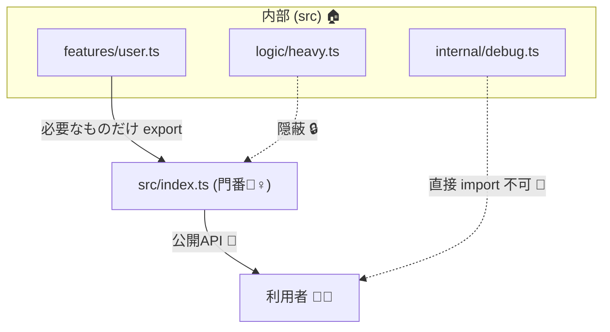

# 第07章：TypeScriptの地雷②：exportの変更と“見えてる面”📤👀

**できるようになること🎯**

* 「どこまでが“公開API（見えてる面）”か」を自分で線引きできる✍️
* exportの変更が **なぜほぼ破壊的変更（MAJOR）** になりやすいか説明できる💥
* `index.ts` を“門番”にして、事故りにくい公開面を設計できる🧩✨
* `package.json` の `exports` も「公開面の一部」って理解できる📦👀 ([Node.js][1])

---

## 7.1 「見えてる面（API surface）」ってなに？🌊👀


**API surface = 利用者（他人のコード）が触れる“入口”ぜんぶ** だよ〜📣✨
TypeScriptだと、特にこのへんが入口になりがち👇

* `export` されてる関数・クラス・定数・型（`type` / `interface`）🧰
* `index.ts`（バレル）から見えるもの（= だいたい公開API扱い）🚪
* npmパッケージとしての入口（`package.json` の `exports` / `main` など）📦
* （型配布してるなら）`.d.ts` に出てくる宣言たち🧷

ポイントはこれ👇
**「export した瞬間、それは“約束”になりやすい」🤝💖**
そして約束を変えると、利用者が泣く😭

---

## 7.2 export変更が“ほぼ破壊”になる3大理由💥💥💥

### 理由①：importが物理的に壊れる😇（名前・場所・形が変わる）

たとえば利用者がこう書いてたら…

```ts
import { parseUser } from "your-lib";
```

あなたが `parseUser` をリネームしたり削除したら…

* **コンパイル通らない**（= 即死）💀
* だから基本 **MAJOR** になりやすい💥

✅ **exportの削除・リネームは典型的な breaking change** だよ〜 ([Semver TS][2])

---

### 理由②：「型だけ export」と「値も export」は別物🧠🧷⚡


TypeScriptには **type-only export** があるよね👇
`export type` は **型としては使えるけど、実行時には消える**（出力JSに残らない）✨ ([TypeScript][3])

```ts
// ✅ 型だけ export（実行時には存在しない）
export type UserId = string;
```

で、ここが地雷💣
**もともと “値” として存在してた export を、型だけに変える** と利用者の実行時コードが壊れることがある😱
（例：`export class` を `export type` 的な扱いに寄せる、など）

✅ 「値の export を消す」のは breaking change になり得るよ〜 ([Semver TS][2])

---

### 理由③：`package.json` の `exports` は「公開面をロックする」🔒📦


`exports` を使うと、**“ここから先は入っちゃダメ🙅‍♀️”** を作れるの。
Node.jsの公式ドキュメントでも、`exports` は **エントリーポイントを環境ごとに切り替えられる**（`import`/`require`等）って説明されてるよ📌 ([Node.js][1])

つまり…

* `exports` に載ってないパスは、利用者から **見えない/使えない** 扱いになりやすい👀
* 後から `exports` を導入すると、**深いパス import（例：`your-lib/dist/foo`）** が急に死ぬことがある💥
* `exports` の変更は、入口の変更＝**公開面の変更**だよね？ → 破壊になりやすい😇

---

## 7.3 “門番”パターン：`index.ts` で公開面をコントロールしよ🧩🚪✨


### ✅ おすすめ方針：公開は「1か所からだけ」📣

フォルダ構成イメージ👇

```text
src/
  index.ts        ← 公開APIの門番👮‍♀️✨
  internal/
    heavyLogic.ts ← 内部（直接importさせない）
  features/
    user.ts
```



`src/index.ts` はこんな感じ👇

```ts
// ✅ 公開していいものだけ“明示的に”export
export { createUser } from "./features/user";
export type { User, UserId } from "./features/user";

// ❌ なんとなく export * は事故りやすい（公開面が勝手に増える😇）
```

**なぜ “明示的 export” がいいの？🤔**

* 公開面が増減した瞬間に気づける👀
* 「これは公開の約束です」って自分で自覚できる🤝
* 誤爆で内部型/内部関数を外に出しにくい🙅‍♀️

---

## 7.4 ありがち事故パターン集😵‍💫（全部“SemVer判断”つき）

### 事故①：export名変更（=だいたいMAJOR）💥


* `export { foo }` → `export { bar }` に変える
  → 利用者のimportが壊れる😭 → **MAJOR**

**優しいやり方🫶**

* `bar` を追加（MINOR）✨
* `foo` は残しつつ `@deprecated`（次章の非推奨につながる🪜）

---

### 事故②：default export ↔ named export の入れ替え（MAJOR）💣

```ts
// 変更前
export default function hello() {}

// 変更後
export function hello() {}
```

利用者が

```ts
import hello from "your-lib";
```

してたら崩壊😇 → **MAJOR**

---

### 事故③：exportされた型の“ちょい変更”が大事故🧷💥

「型は実行時に消えるし、軽く変えてOKでしょ？」って思いがちだけど…
利用者のコンパイルが落ちるなら、普通に破壊だよ〜😭

（型の地雷は前章でやった通り⚠️）

---

## 7.5 公開面を“漏らさない”テク：`@internal` + `stripInternal` 🕵️‍♀️🧹


「内部のつもりだったのに `.d.ts` に出ちゃった〜😭」って時に役立つのがこれ👇

* `/** @internal */` を付ける
* `tsconfig` で `stripInternal: true`
  → **`@internal` の宣言を `.d.ts` から落とせる** ([TypeScript][4])

（ただし公式にも “内部向けオプションだよ” 的な注意があるので、使うならチームでルール化が安心🫶） ([TypeScript][4])

---

## 7.6 SemVerに落とす：この章の判断チート表🎯✨

* **MAJOR**：exportの削除 / リネーム / default↔named入替 / `exports` の入口変更 📤💥
* **MINOR**：新しいexportを追加（既存を壊さない範囲）➕✨
* **PATCH**：内部実装だけ変更（公開面が完全に同じ）🧹🐛

迷ったらこの順でチェック✅

1. 公開面（export/exports）に触った？
2. 利用者のimportが壊れる？
3. 型チェックや挙動の意味が変わる？
   → YES が出たら **だいたいMAJOR寄り**😇

---

## ミニ演習🎓✨：`index.ts` 公開面を設計してみよう🧩

### お題：このモジュール、どれを公開する？👀

```ts
// src/features/user.ts
export type UserId = string;

export interface User {
  id: UserId;
  name: string;
}

export function createUser(name: string): User {
  return { id: crypto.randomUUID(), name };
}

// src/internal/debug.ts
export function dumpUser(u: User) {
  console.log(u);
}
```

**やること✍️**

1. `src/index.ts` を作って「公開するものだけ」exportしてね👮‍♀️✨
2. `dumpUser` は公開すべき？しないべき？理由も書いてね📝
3. 次の変更はSemVerでどれ？🎯

   * A: `createUser` を `makeUser` に改名
   * B: `User` に `age?: number` を追加
   * C: `dumpUser` を `index.ts` に追加で公開

---

## AI活用🤖✨（Copilot / Codexに投げる“そのままプロンプト”集）

### ① 公開面の棚卸し👀

```text
このTypeScriptライブラリの「公開API surface」を列挙して。
index.ts の export 一覧と、package.json の exports で公開されている入口も含めて。
破壊的変更になりうるポイントも指摘して。
```

### ② 変更のSemVer判定🎯

```text
次の変更はSemVerで MAJOR/MINOR/PATCH のどれ？理由も初心者向けに説明して。
（変更内容をここに貼る）
```

### ③ “優しい壊し方”提案🫶

```text
この破壊的変更を、非推奨→移行→削除の3段階で進めるプランを作って。
利用者向けの移行ガイド（短め）も書いて。
```

---

## まとめ🍌✨（この章のコアだけ！）

* **export = 約束**🤝 → 変えると壊れやすい💥
* **`index.ts` を門番にして、公開面を小さく保つ**👮‍♀️🚪
* **`package.json exports` も公開面の一部**📦👀 ([Node.js][1])
* **type-only export は実行時に消える**ので、値との入替は特に注意⚡ ([TypeScript][3])
* 内部を漏らしたくない時は `@internal` + `stripInternal` が使える🧹 ([TypeScript][4])

---

次の章（第8章）は、この公開面を前提に **「互換ポリシーを6行で書く📜✨」** ところに入っていくよ〜！続けて作る？😆💖

[1]: https://nodejs.org/api/packages.html?utm_source=chatgpt.com "Modules: Packages | Node.js v25.3.0 Documentation"
[2]: https://www.semver-ts.org/formal-spec/2-breaking-changes.html?utm_source=chatgpt.com "Breaking Changes - Semantic Versioning for TypeScript Types"
[3]: https://www.typescriptlang.org/docs/handbook/release-notes/typescript-3-8.html?utm_source=chatgpt.com "Documentation - TypeScript 3.8"
[4]: https://www.typescriptlang.org/tsconfig/stripInternal.html?utm_source=chatgpt.com "stripInternal - TSConfig Option"
