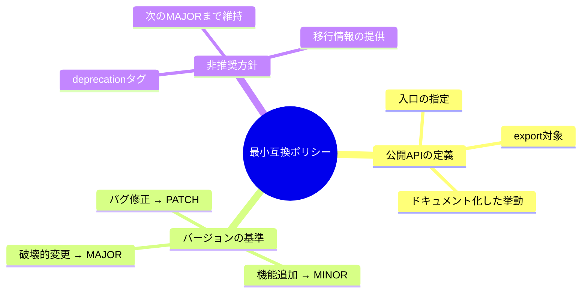

# 第08章：互換ポリシー①：最小の“約束文”を作る📜✨

（SemVer＋互換ポリシー／TypeScript向け）

---

## 8.0 今日のゴール🎯✨

この章が終わると、あなたのライブラリ（または社内モジュール）に **「最小の互換ポリシー」** を付けられます✅
しかも、**READMEに貼れる短さ**で😍

* 「どこからどこまでが公開API？」が言える📣
* 「どの変更で MAJOR / MINOR / PATCH を上げる？」が言える🔢
* 「非推奨（deprecate）ってどう扱う？」が書ける🧓➡️🆕

SemVer自体は「バージョン番号で意味を伝える」仕組みだよ、っていうのが大前提（公式仕様）です📘 ([Semantic Versioning][1])

---

## 8.1 そもそも互換ポリシーって何？🤝💡


超ざっくり言うと……

> **利用者に向けて「ここは守るよ！」って宣言する文章**🫶

SemVerは “番号のルール” だけど、現実の運用では
**「何を公開API扱いするか」** が曖昧だと事故るのね😇💥

だから互換ポリシーは、SemVerを “動くルール” にするための **土台** なんだよ〜🧱✨

---

## 8.2 最小セットはこれだけでOK✅（3点セット）


まずは3つだけ決めよう！🙆‍♀️✨

### ✅① 公開APIの定義（どれが約束の対象？）📣

例：

* `export` してる関数 / クラス / 型
* パッケージのエントリポイント（`index.ts` など）
* 設定オプション（config）
* CLIコマンド（もしあれば）
* 例外の種類（throwするエラー）や戻り値の意味（挙動）

### ✅② MAJOR/MINOR/PATCHの基準🔢

SemVerの基本方針は「破壊的変更→MAJOR、機能追加→MINOR、バグ修正→PATCH」って考え方だよね（公式仕様の意図）📘 ([Semantic Versioning][1])

ここではそれを **あなたの公開APIの定義に紐づけて**書くのがポイント💡

### ✅③ 非推奨（deprecation）の方針🧓➡️🆕


いきなり消さずに、段階を踏むよ〜って約束🪜✨
（詳しくは後の章でやるけど、第8章では “最小文” に入れちゃう！）



---

## 8.3 READMEに貼れる「6行テンプレ」📌✨


まずはコレで完成にしよう😍
（あなたのプロジェクト名に合わせて単語だけ置き換えればOK）

```md
## Compatibility Policy (SemVer)
- Public API: exports from `index.ts` (functions/types) and documented options.
- MAJOR: breaking changes to Public API (removed/renamed exports, type incompatibility, behavior changes).
- MINOR: backward-compatible additions to Public API (new exports/options).
- PATCH: backward-compatible bug fixes and internal changes.
- Deprecation: mark as deprecated first, keep until next MAJOR, provide migration notes.
```

**ポイント💡**

* “Public API” を1行で言い切る😤✨
* MAJOR/MINOR/PATCH は「公開APIに対してどうか」で書く🧠
* 非推奨は「段階」だけ書く（詳説は後の章へ）🪜

---

## 8.4 もうちょいだけ丁寧版（でも短い）🧁✨

「公開APIの範囲」をもう少し明確にしたい人向け🫶

```md
## Compatibility Policy (SemVer)
### Public API
- All exports from `index.ts` (runtime exports + exported types).
- Documented behavior, error types, and option meanings are part of the contract.

### Versioning
- MAJOR: any breaking change to Public API (compile-time, runtime, or semantic behavior).
- MINOR: backward-compatible additions.
- PATCH: backward-compatible fixes; no new required behavior.

### Deprecation
- Deprecated APIs remain available until the next MAJOR release, with migration guidance.
```

「エラー型や挙動も契約」って入れると、あとで揉めにくいよ〜😇🛡️

---

## 8.5 “公開API” の線引き、超ラクな決め方✂️✨


迷うポイントはだいたいここ👇

### A) “exportしてる型”は契約？🧷

**YES寄り**で考えるのが安全🙆‍♀️
利用者は型をガッツリ使うから、型のちょい変更でも壊れることあるよね💥

### B) 内部の関数やファイル構成は？🗂️

**NO**（基本は契約外）でOK👌
ただし、利用者が触れられる形で漏れてると事故る😇
→ “表に出す入口（index.ts）を薄くする” のが安定🧩

### C) ドキュメントに書いた挙動は？📄

**YES**（契約に含める）がおすすめ✨
「READMEにこう書いてあるのに違う」って一番しんどいから😭

---

## 8.6 例：ミニTSライブラリで書いてみる🍌✨


例として `banana-math` っていう小さいライブラリを想像するね🍌📦

```ts
// index.ts
export function add(a: number, b: number): number {
  return a + b;
}

export type AddOptions = { clamp?: boolean };
```

この場合の Public API はだいたい👇

* `add` 関数
* `AddOptions` 型
* `clamp` の意味（もしREADMEに書いたら）

ここに対して…

### ✅PATCH例🐛

* `add` の内部処理のバグ修正（同じ入力→同じ意味の出力）
* パフォーマンス改善（挙動が変わらない）

### ✅MINOR例✨

* `export function sub(...)` を追加
* `AddOptions` に `round?: boolean` を追加（既存が壊れない形で）

### ✅MAJOR例💥

* `add(a,b)` を `add(values: number[])` に変更（呼び方が変わる）
* `AddOptions` の `clamp?: boolean` を削除
* `add` が例外を投げる条件を変える（意味が変わる）

こういう “判断の軸” を README に一言で書くのが第8章の勝ち🏆✨

---

## 8.7 ミニ演習：互換ポリシーを「6行」で書こう📝💕


あなたのプロジェクト（または練習用の架空ライブラリ）を1つ選んで👇

### ✅手順

1. Public API を1行で言う（例：`index.ts` の export だけ、など）📣
2. MAJOR / MINOR / PATCH をそれぞれ1行ずつ🔢
3. 非推奨を1行で🧓➡️🆕

### ✅できたらセルフチェック✅

* 「Public API」が **範囲として曖昧すぎない？**（例：”全部”は危険😇）
* MAJORの条件に **“意味が変わる”** が含まれてる？🌀
* 非推奨の扱いが **段階的**になってる？🪜

---

## 8.8 AI活用🤖✨（そのまま貼ってOK）

### ① 互換ポリシーのドラフト生成🧾

```text
あなたはTSライブラリのメンテナーです。
次のPublic API候補から、READMEに貼れる「6行の互換ポリシー」を作ってください。
- エントリポイント: index.ts
- export: 関数/クラス/型
- 契約に含めたいもの: ドキュメント化した挙動、エラー型、オプションの意味
口調は短く、曖昧さを減らしてください。
```

### ② “これMAJOR？”のツッコミ役にする🔍

```text
次の変更は SemVer 的に MAJOR/MINOR/PATCH のどれが妥当？
理由を「利用者がどう壊れるか（コンパイル/実行時/意味）」で説明して。
変更:
（ここに変更内容）
前提: 公開APIは index.ts の exports とドキュメント化した挙動。
```

### ③ “公開APIの漏れ”検査👀

```text
このライブラリ構成で、利用者が依存してしまいそうな「事実上の公開API」を指摘して。
どう封じると良い？（export整理、ドキュメント注記、internal化など）
（ファイル構成や index.ts を貼る）
```

---

## 8.9 2026まわりの“最新っぽい空気”も一言だけ🌬️✨

TypeScriptはコンパイラの高速化（ネイティブ実装プレビュー等）も話題になっていて、開発体験がどんどん変わっていく流れがあるよ〜🚀（周辺動向） ([Microsoft Developer][2])
でも！互換ポリシーは **ツールが速くなっても普遍的に効く**から、今ここで固める価値が高いよ💎✨

---

## 8.10 この章のまとめ🎀✨

* 互換ポリシーは「SemVerを運用で回すための約束文」📜
* 最小は **公開API / バージョン基準 / 非推奨方針** の3点セット✅
* READMEに貼れる **6行テンプレ** でまず完成にするのが正解🙆‍♀️💕

次の第9章では、「互換性の外側」＝サポート範囲（環境）も約束に入れる話へ進むよ〜🌍🧭✨

[1]: https://semver.org/?utm_source=chatgpt.com "Semantic Versioning 2.0.0 | Semantic Versioning"
[2]: https://developer.microsoft.com/blog/typescript-7-native-preview-in-visual-studio-2026?utm_source=chatgpt.com "TypeScript 7 native preview in Visual Studio 2026"
