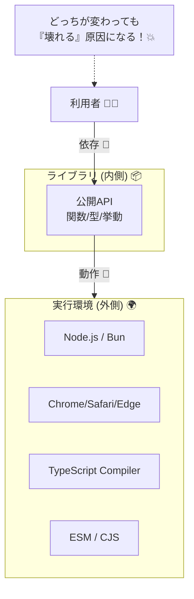

# 第09章：互換ポリシー②：サポート範囲（環境）も約束に入れる🌍🧭

第8章で「公開APIとSemVerのルール（6行）」は作れたよね📜✨
でもね…**APIが一切変わってなくても壊れる**ことがあるの🥺💥

それが👇
**“環境（Node / ブラウザ / TypeScript / モジュール方式…）”の変化**です🧩

---

## 9.1 互換性には「内側」と「外側」がある🧠✨


### ✅ 内側（APIの互換）

* 関数名・引数・戻り値・型・挙動…の約束🤝

### ✅ 外側（環境の互換）

* **どのNodeで動く？** 🟩
* **どのブラウザで動く？** 🌐
* **どのTypeScriptで型チェックできる？** 🔷
* **ESM/CJSどっち？** 📦

ここが揺れると、利用者はこうなる👇

* 「importできない😵」
* 「実行したらSyntaxError💥」
* 「型定義がエラーだらけ😭」



---

## 9.2 まず“サポート範囲”の部品を分解しよ🧱✨


サポート範囲って、だいたいこのセットで決めるとスッキリするよ☺️🧩

1. **実行環境**：Node？ブラウザ？両方？🟩🌐
2. **最低バージョン**：Node何以上？ブラウザどこまで？🔢
3. **モジュール形式**：ESMのみ？CJSも？📦
4. **TypeScript**：最低TSいくつ？（型の互換）🔷
5. **EOL方針**：古い環境をいつ切る？🕰️✂️

---

## 9.3 2026の“現実ライン”を押さえる🧭✨


### Nodeの状況（今の土台）🟩

Nodeは「偶数メジャーがLTS」って覚え方でOK🙆‍♀️
公式のリリース情報では、**v24がActive LTS**、**v22/v20がMaintenance LTS**、**v25はCurrent**になってるよ📌 ([Node.js][1])

さらに、NodeのリリースWGの説明では

* **6か月ごとにメジャーが出る**
* LTSは **Active 12か月 → Maintenance 18か月**（合計30か月目安）
  という流れになってるよ🗓️ ([GitHub][2])

### EOL（サポート終了）の“締切”も見よう🕰️

EOLの目安として、Node 20はセキュリティサポートが **2026/04/30** に終わる予定、Node 22は **2027/04/30**、Node 24は **2028/04/30**（セキュリティ側）とまとまってるよ📅 ([endoflife.date][3])

> ここが大事：**EOLが近い環境は“いつ切るか”を約束に書く**と、利用者が安心するよ🥰

### TypeScriptの状況🔷

TypeScriptは、公式ページで **「最新は currently 5.9」** って明記されてるよ📌 ([TypeScript][4])
（型定義を書く側としては、ここを基準に“最低ライン”を決めるのが現実的💡）

---

## 9.4 サポート範囲の決め方テンプレ（迷わないやつ）🧠🧭✨


### ステップ1：利用者を1〜2人に絞る👥

例👇

* 👩‍🎓「学校PCでNodeはLTSだけ入ってる」
* 👩‍💼「会社でNodeは1世代遅れが普通」

ここを決めるだけで、**“最低Node”が自然に決まる**よ✨

### ステップ2：まずは“安全寄りの最低ライン”にする🛡️

2026の無難例（Node系ライブラリ想定）👇

* **最低：Node 22以上**（LTSの範囲で比較的新しめ）
* できれば：Node 24でも動作確認✅

※ Node 20はEOLが近いので「いつ切るか」をセットで書くのが親切💞 ([endoflife.date][3])

### ステップ3：ESM/CJSを決める📦

* **ESMのみ**：今っぽい・スッキリ✨（ただし古い環境/設定は困ることも）
* **両対応**：利用者は嬉しいけど、配布が少し面倒🌀

---

## 9.5 READMEに書ける「最小サポート範囲」テンプレ📜✨

まずはこのくらい短くてOKだよ☺️💕

* ✅ Supported runtime: **Node >= 22**
* ✅ Type definitions: **TypeScript >= 5.7（例）**
* ✅ Module: **ESM**
* ✅ Policy: NodeがEOLになったら、次のMAJORで切ります✂️

**ポイント**：環境の変更は“利用者が詰む”から、ここも「約束」になる🤝✨

---

## 9.6 package.jsonに“機械にも伝える”🧾🤖

READMEだけだと読まれないことあるから、**package.jsonにも書く**と強い💪✨
npmのpackage.json仕様には、Nodeの条件を書く **`engines`** や、OS制限の **`os`** があるよ📌 ([npmドキュメント][5])

例👇（Nodeの最低ラインを固定）

```json
{
  "name": "your-lib",
  "version": "1.2.3",
  "type": "module",
  "engines": {
    "node": ">=22"
  }
}
```

もし「Windows以外は未検証で怖い…」みたいに**OSも絞る**なら（※やるならちゃんと責任持てる時だけ！）

```json
{
  "os": ["win32"]
}
```

---

## 9.7 ブラウザ対応があるなら Browserslist を使う🌐🧾✨


フロント系（ブラウザ向け）なら、**“どのブラウザまで対応？”** を決めないと事故るよ😵💥
Browserslistは、ターゲットを共有するための仕組みで、**設定がない場合のデフォルト**（例：`last 2 versions` / `not dead` など）も定義されてるよ📌 ([GitHub][6])

package.jsonに書く例👇

```json
{
  "browserslist": [
    "last 2 Chrome versions",
    "last 2 Edge versions",
    "Firefox ESR",
    "not dead"
  ]
}
```

これがあると、ビルドツール側（トランスパイル/ポリフィル方針）が揃って、
「あなたのPCでは動くのに利用者で動かない😭」が減るよ🛡️✨

---

## 9.8 “サポート終了（EOL）”の書き方（優しい約束）🕰️💞


おすすめの書き方は、**期限＋動き方**をセットにするやつ👇

* 「NodeのEOL後、**3か月以内**に次のMAJORでサポート終了します✂️」
* 「EOLの前に、非推奨（Deprecated）としてアナウンスします📣」

たとえば Node 20 はセキュリティサポートが **2026/04/30で終了予定**だから、

* 「v2.0.0からNode 22+」みたいに、**次のMAJORで切る宣言**が自然になるよ📅 ([endoflife.date][3])

---

## 9.9 ここ重要：環境を変えたら、SemVerはどう上げる？🔢⚖️


### ✅ 最低Nodeを上げた（例：>=20 → >=22）

➡️ **MAJOR** が基本💥
利用者の環境が古いと、実行すらできないからね😵

### ✅ 対応ブラウザを狭めた

➡️ **MAJOR** が基本💥
動いてた場所で動かなくなる＝破壊的変更

### ✅ 最低TypeScriptを上げた

➡️ 「型がコンパイルできなくなる利用者」がいるなら **MAJOR寄り**💥
（特に型定義が凝ってるほど、古いTSが死にやすい😭）

---

## 9.10 ミニ演習📝✨（今日のゴール🎯）

### 演習A：あなたのプロジェクトの“利用者”を2人作る👥

* どんな環境？（Node/ブラウザ/TS）
* 何が困る？（更新できない？会社縛り？）

### 演習B：サポート範囲を8行で書く📜

* Supported runtime
* Supported TS
* Module方式
* ブラウザ（必要なら）
* EOL方針

### 演習C：package.jsonに反映🧾

* `engines` を入れる
* ブラウザありなら `browserslist` も入れる

---

## 9.11 AI活用🤖✨（そのままコピペでOK）

### 🪄 利用者ペルソナ作り

「このライブラリの利用者を2タイプ想定して。会社PCで更新できない人と、最新環境の人。困りごとも書いて」

### 🪄 サポート範囲の文章化

「Node/TS/モジュール方式/ブラウザ対応/EOL方針を、README用に10行以内で丁寧に書いて」

### 🪄 破壊的変更チェック

「最低Nodeを上げるのはSemVer的に何？理由も1行で」

---

## まとめ🎀✨

第9章でやったことはこれ👇

* SemVerの“外側”＝環境も互換性の一部だよ🌍
* Node/TS/ブラウザ/モジュール方式を決めると事故が減る🛡️
* EOL（サポート終了）は、**“いつ切るか”まで書くと優しい**🕰️💞
* `engines` / `browserslist` で機械にも伝えると最強🤖✨ ([npmドキュメント][5])

次の章（第10章）は、ここで決めた範囲の上で「`^` `~` 固定」の事故り方を体感していくよ〜🎚️🧨✨

[1]: https://nodejs.org/en/about/previous-releases "Node.js — Node.js Releases"
[2]: https://github.com/nodejs/Release "GitHub - nodejs/Release: Node.js Release Working Group"
[3]: https://endoflife.date/nodejs "Node.js | endoflife.date"
[4]: https://www.typescriptlang.org/download/ "TypeScript: How to set up TypeScript"
[5]: https://docs.npmjs.com/cli/v7/configuring-npm/package-json/ "package.json | npm Docs"
[6]: https://github.com/browserslist/browserslist "GitHub - browserslist/browserslist:  Share target browsers between different front-end tools, like Autoprefixer, Stylelint and babel-preset-env"
