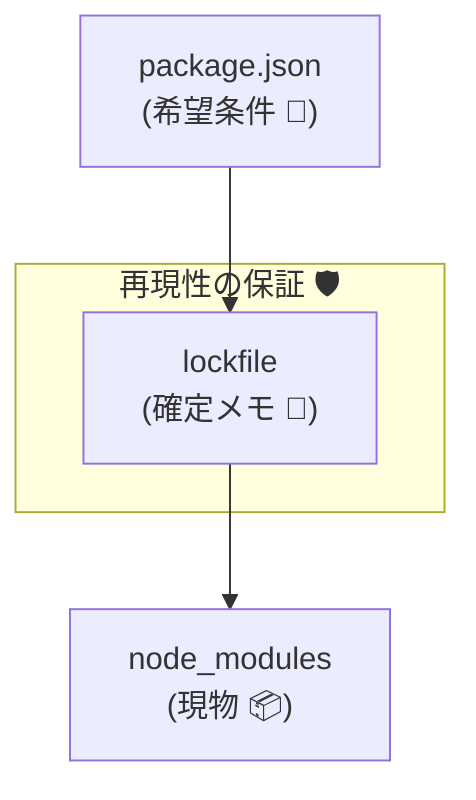

# 第11章：依存管理②：lockfileの意味（あなたを守る盾）🔒🛡️

この章が終わると…👇
**「lockfileって何？なんで必要？いつ更新する？」**がスパッと説明できて、**チームとCIで依存事故を激減**させられるようになります✨

---

### 1) まず結論：lockfileは「依存関係の確定メモ」📌


* `package.json`：**こういうバージョンが欲しいな〜**（希望条件）
* lockfile（`package-lock.json` / `pnpm-lock.yaml` / `yarn.lock`）：**実際に入れた“確定版”の一覧**（スナップショット）
* `node_modules`：**現物**（重いし環境で変わりがち）

npm公式でも、`package-lock.json` は **同じ依存ツリーを再現できるようにするためのファイル**で、**リポジトリにコミットする想定**だよ〜って書かれてます。([npmドキュメント][1])

> つまり lockfile は、未来の自分とチームとCIを守る「盾」🛡️✨



---

### 2) lockfileがないと起きる“あるある事故”💥


#### 事故A：昨日は動いたのに、今日は動かない 😭

`package.json` が `^` とか `~` で依存をゆるく指定してると、**インストールしたタイミング**で入るバージョンが変わり得ます。
→ 依存側がSemVerを守ってない、あるいは想定外の変更が入った、などで壊れる💣

#### 事故B：チームのAさんだけビルド通らない 🙃

同じリポジトリでも、**インストール結果が揃ってない**と、再現が地獄になります。

#### 事故C：CIだけ落ちる 😇

ローカルは通るのに、CIでだけ依存解決が変わって落ちるパターン。
→ lockfile + “CI用の厳格インストール”で防げます✅

---

### 3) 「CIでは“lockfileを絶対に書き換えない”」が超大事🔥


#### npmの場合：`npm ci` が最強🧼


`npm ci` はCI向けで、ざっくり言うと👇

* **lockfileが必須**
* `package.json` と lockfile がズレてたら **エラーで止まる**（勝手に直さない）
* `node_modules` があったら **消してから**入れ直す
* **package.json / lockfileに一切書き込まない（凍結）** ([npmドキュメント][2])

つまりCIでは基本これ👇

```powershell
npm ci
```

#### pnpmの場合：CIでは“ズレたら失敗”が基本挙動🧊

pnpm公式でも、**CI環境では lockfile が更新必要だとインストールが失敗する**って明記されています。([pnpm.io][3])
さらに `--frozen-lockfile` は **CIだとデフォルトでtrue**（lockfileを更新しない＆ズレたら失敗）です。([pnpm.io][3])

```powershell
pnpm install --frozen-lockfile
```

#### Yarn（Berry系）の場合：`--immutable` がCIでデフォルト🧱

Yarnは `--immutable` が **CIだとtrue扱い**で、lockfileを変更しようとすると失敗します。([yarnpkg.com][4])

```powershell
yarn install --immutable
```

---

### 4) lockfileは何を守ってくれるの？（3つの効能）✨


#### (1) 再現性：誰がやっても同じ依存が入る🎯

「チーム」「デプロイ」「CI」で**同じ依存が入る**ことを保証するのが第一目的。([npmドキュメント][1])

#### (2) 差分が見える：依存ツリーの変化がレビューできる👀


lockfileがあると、依存の増減や解決結果の変化が**Git差分で見える**ので、「あれ？なんか大量に増えたけど大丈夫？」が発見しやすいです。([npmドキュメント][1])

#### (3) 速くなる：インストールの無駄が減る⚡

npmは lockfile によって、メタデータ解決の繰り返しを減らして高速化できる、という趣旨も書いてあります。([npmドキュメント][1])

---

### 5) いつ lockfile を更新するの？（迷わないルール）🧭


ここ、いちばん大事です🛡️✨
**基本ルール：依存が変わったPRでは、lockfileも一緒に変わるのが正しい**です。

#### ✅ lockfile更新してOKなタイミング

* 依存を追加した（`npm i xxx`）
* 依存を削除した（`npm rm xxx`）
* 依存を上げた（`npm update` や `npm i xxx@latest`）
* セキュリティ対応で上げた（例：脆弱性対応）
* Node/npm/pnpm/yarn を上げて lockfileフォーマットが変わった（変更が大きく見えることある）([npmドキュメント][1])

#### ❌ lockfile更新しちゃダメなタイミング（特にCI）

* CIの中で `npm install` して lockfile が書き換わる
  → それは「再現性が壊れてるサイン」なので、CIは **`npm ci`** が鉄板です。([npmドキュメント][2])

---

## 6) ミニ演習：lockfileが“盾”になる瞬間を体感しよう🔒🧪

### ゴール🎯

「lockfileがズレると、CI相当のインストールが止まる」を体で覚える！

### 手順（npm版）🧰

1. 適当なフォルダでプロジェクト作成

```powershell
mkdir lockfile-shield
cd lockfile-shield
npm init -y
```

2. 依存を追加（例として `zod`）

```powershell
npm i zod
```

👉 ここで `package-lock.json` が作られるはず。
`package.json` は「希望」、`package-lock.json` は「確定」だよ〜って思い出してね🧠✨

3. **わざとズラす**（超重要）
   `package.json` を開いて、`zod` のバージョン指定だけ手で変えてみて（例：`^` の範囲を変える）✍️
   ※この時点では lockfile は更新しない！

4. CIっぽく `npm ci` を実行

```powershell
npm ci
```

✅ 期待する結果：**ズレてたらエラーで止まる**
それが「盾が発動した！」ってこと🛡️✨
npm公式も、`npm ci` は lockfile と `package.json` が一致しないと **エラーで止まる**って書いてます。([npmドキュメント][2])

5. 正しく直す（ズレを解消）
   ローカルでちゃんと `npm install` して lockfile を更新してから、もう一回 `npm ci`。

```powershell
npm install
npm ci
```

---

## 7) “依存更新の手順メモ”（そのまま使えるやつ）📝✅

### 依存を上げたいとき（基本）

```powershell
# 例：特定の依存だけ上げる
npm i some-lib@latest

# テスト・型チェック
npm test
npm run typecheck
```

### CI（GitHub Actions等）では

```powershell
npm ci
npm test
npm run typecheck
```

### 事故りにくいPRのコツ✨

* lockfileの差分がデカいときは「なぜ増えた？」を一回見る👀
* “ついで更新”を混ぜない（目的を1つにするとレビューが楽）🧼

---

## 8) AI活用🤖：lockfile運用が一気にラクになるプロンプト例✨

### ✅ チェックリスト化してもらう

「依存更新PRのチェックリストを作って。確認項目は“lockfile差分”“CIコマンド”“破壊的変更の疑い”“リリースノート確認”を入れて。短く！」

### ✅ lockfile差分の意味を説明させる

「この package-lock.json の差分を見て、“増えた理由の推測”と“危険な変化があるか”を初心者向けに説明して」

### ✅ “この更新はSemVer的に危ない？”を補助させる

「依存Aを x.y.z → a.b.c に上げる。破壊的変更リスクが高いパターンを列挙して、確認手順も出して」

（AIは“判断の補助”には最高だけど、最後の責任は人間が持つ感じでね😉🫶）

---

## まとめ：第11章の持ち帰り🎁✨

* lockfileは「依存ツリーの確定版」＝再現性の盾🔒🛡️([npmドキュメント][1])
* CIでは **lockfileを書き換えない運用**にする

  * npm：`npm ci`（ズレたら止まる＆書き換えない）([npmドキュメント][2])
  * pnpm：CIでズレたら失敗／`--frozen-lockfile` が基本([pnpm.io][3])
  * Yarn：CIで `--immutable` が基本([yarnpkg.com][4])
* lockfile更新のタイミングをルール化すると、依存事故が激減する✅

---

次の第12章（peerDependencies）に行く前に、もしよければ：
あなたの想定プロジェクトは **アプリ（Web/CLI）**寄り？それとも **ライブラリ（npm公開）**寄り？🙂
（どっちかで lockfile運用の“こだわりポイント”がちょい変わるので、そこだけ最適化して話せるよ〜🧁✨）

[1]: https://docs.npmjs.com/cli/v11/configuring-npm/package-lock-json/ "package-lock.json | npm Docs"
[2]: https://docs.npmjs.com/cli/v11/commands/npm-ci/ "npm-ci | npm Docs"
[3]: https://pnpm.io/cli/install "pnpm install | pnpm"
[4]: https://yarnpkg.com/cli/install "yarn install | Yarn"
