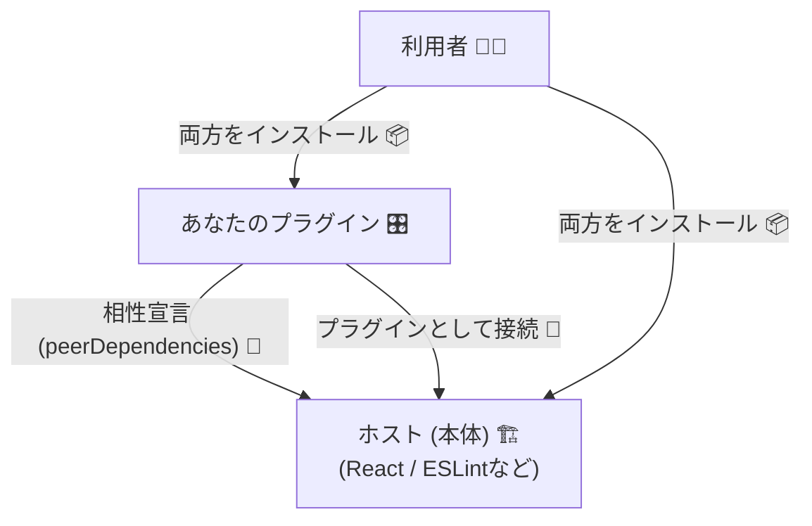

# 第12章：依存管理③：peerDependencies と “相性問題”🤝💥

## 12.1 今日できるようになること🎯✨

* `peerDependencies` が「プラグイン系の相性表」だって説明できる😊
* 「dependencies / devDependencies / peerDependencies」どれに書くべきか迷わなくなる🧭
* 相性事故（依存の衝突）を、ログから原因特定できるようになる🔍🛠️
* SemVer＋互換ポリシー的に「peer の範囲変更はどのバージョン上げ？」を判断できる🧠📦

---

## 12.2 まず“1分で”イメージをつかもう⏱️🍌


`peerDependencies` はひとことで言うと…

> **「うちのパッケージ（プラグイン）は、ホスト（本体）の◯◯のこの範囲と一緒に使えるよ！」**
> っていう **相性宣言** だよ🤝✨ ([npmドキュメント][1])



たとえば「Reactのプラグイン」「ESLintのプラグイン」「Viteのプラグイン」みたいに、**“本体があって初めて動く側”**は、だいたい `peerDependencies` が主役になるの🥹🎛️ ([npmドキュメント][1])

---

## 12.3 なぜ peerDependencies が必要なの？💡


### ✅ 理由1：ホストと同じ“土台”を共有したい🏗️

プラグインって「本体の上に乗る」から、土台がズレると壊れる😱
だから **“同じホスト（同じReact / 同じESLint）を使ってね”** って宣言するわけ✨ ([npmドキュメント][1])

### ✅ 理由2：依存が衝突すると、インストール時点で止めたい🚧

`peerDependencies` を書いておくと、パッケージマネージャが
「その組み合わせムリかも…」を検出しやすくなるよ🧯
npm は v7 以降、peer もインストール対象になって、衝突時にエラーになることがあるよ（＝早期に気づける）🛑 ([npmドキュメント][1])

---

## 12.4 使い分け早見（ここ超大事）🧠📌


### 🧩 ざっくりルール

* **dependencies**：あなたのパッケージが「必ず使う部品」。ユーザー側に入ってほしい部品📦
* **devDependencies**：開発・テスト・ビルド用。公開後の利用者には要らない部品🧪
* **peerDependencies**：ホスト側が持つべき土台。**“同じのを使ってね”** の宣言🤝 ([npmドキュメント][1])

### 🎛️ プラグインでよくある形（実戦テンプレ）

* `peerDependencies`：ホスト（例：react / eslint / vite / typescript）
* `devDependencies`：開発中に動かすために **同じホストをdevにも入れる**（テスト実行できるように）
  ※「配布はpeer、開発はdev」って分けるイメージだよ🫶

---

## 12.5 相性問題 “あるある事故”😇💥


### 💥 あるある1：ホストのメジャーが違う（React 18 ↔ 19 とか）


プラグインAは `react@^18` 前提、プラグインBは `react@^19` 前提…
同じプロジェクトに入れると **どっちかが不満** で衝突しがち🥲

### 💥 あるある2：peer を “細かく固定” しすぎて死ぬ🧊

`"react": "18.2.0"` みたいに **パッチ固定**すると、ちょっとした更新でも相性NGになりやすいよ😵‍💫
npm公式も「できるだけ広く」「パッチにロックしないでね」って言ってるよ📣 ([npmドキュメント][1])

### 💥 あるある3：optional な相手まで必須扱いにしてしまう

「入ってたら連携できるけど、なくても動く」相手ってあるよね？
そういう時は `peerDependenciesMeta` で **optional** を付けられるよ✨ ([npmドキュメント][1])

---

## 12.6 ミニ実験：架空プラグインで peerDependencies を書いてみる✍️🧪

ここでは「ホストが React、本体にぶら下がるプラグイン」を想定するよ🎛️
`my-plugin` は React を **自分では抱えず**、ホスト側の React と一緒に動く想定🤝

### ① プラグイン側の package.json（例）🧾

```json
{
  "name": "my-plugin",
  "version": "0.1.0",
  "main": "dist/index.js",
  "types": "dist/index.d.ts",
  "peerDependencies": {
    "react": "^18.0.0 || ^19.0.0"
  },
  "devDependencies": {
    "react": "^19.0.0",
    "typescript": "^5.0.0"
  }
}
```

ポイント✨

* `peerDependencies` に「ホスト側に必要な土台」を書く🤝
* `devDependencies` にも React を入れておくと、開発中にテストできる🧪
* 範囲は **広め**が基本（動作確認した範囲でね）📏 ([npmドキュメント][1])

---

## 12.7 optional peer（入ってたら嬉しい連携）🍯✨


「入ってたら豆乳ラテ対応できます☕️」みたいなノリで、optional にできるよ🥰
npm は `peerDependenciesMeta` で optional 指定ができる📌 ([npmドキュメント][1])

```json
{
  "peerDependencies": {
    "react": "^18.0.0 || ^19.0.0",
    "some-ui-kit": "^3.0.0"
  },
  "peerDependenciesMeta": {
    "some-ui-kit": { "optional": true }
  }
}
```

---

## 12.8 npm / pnpm の “挙動” も知っておくと強い🛡️

### npm：peer もインストール対象（v7〜）📦

npm は v7 以降、peer もデフォルトでインストールされるよ🧩
そのぶん、衝突するとインストールで止まることがある（＝早めに気づける）🛑 ([npmドキュメント][1])

### pnpm：設定で「自動」「厳格」をコントロールできる🎚️

pnpm（10.x）の設定には、peer 関連がまとまってるよ👇

* `autoInstallPeers`：足りない peer を自動で入れる（デフォルト true）
* `strictPeerDependencies`：不足/不整合があったらコマンドを失敗させる（デフォルト false） ([pnpm][2])

さらに、**衝突してると自動インストールしない**（警告）って挙動も明記されてるよ⚠️ ([pnpm][2])

---

## 12.9 SemVer＋互換ポリシー的に「peer 範囲変更」はどれ上げ？🧠🔢

### ✅ MAJOR になりやすいケース💥

* **対応していたホストのメジャーを切り捨てる**
  例：`^18 || ^19` → `^19` のみにする
  → React 18 の人が使えなくなる＝破壊的💔（MAJORが安全）

### ✅ MINOR になりやすいケース✨

* **対応範囲を広げる（しかも実際に動作確認した）**
  例：`^18` → `^18 || ^19`
  → 既存ユーザーは壊れない＋新しい環境でも使える＝機能追加っぽい🎁

### ✅ PATCH っぽいケース🐛

* **メタ情報の調整で“地雷を避ける”**
  例：特定バージョンで不具合が分かって、範囲を少し狭める
  （ただし、狭め方によっては影響が大きいので MINOR/MAJOR 判定もあり得るよ⚖️）

> コツ：**「いま使えてる人が、アップデートで使えなくなる？」**
> これが YES なら MAJOR 寄りだよ🧠💥

---

## 12.10 トラブルシュート：相性事故を最短で潰す🔧🚑


### ① まず“誰が何を要求してるか”を見える化👀


* `npm ls <package>`：ツリーを見て、複数入ってないか確認🌳
* `npm explain <package>`：なぜ入ったか説明してくれる（原因追跡に便利）🕵️‍♀️
  （pnpm なら `pnpm why <package>` も定番だよ🙆‍♀️）

### ② 衝突が出たら「要求範囲」をチェック📏

* プラグインAの peer が `react@^18`
* プラグインBの peer が `react@^19`
* どっちも必要なら、**両方が許す範囲のホスト**に寄せるのが基本🤝

### ③ “広めに書く”のが効く理由を思い出す📌

プラグインの peer は **パッチ固定しない**、**なるべく広く**が推奨だよ🧊
ホストが SemVer を守ってるなら、基本はメジャー違いが危険で、同一メジャー内は互換である前提で範囲を書けるよ💡 ([npmドキュメント][1])

---

## 12.11 ミニ演習🎓✨（手を動かす系）

### 演習A：架空プラグインの peerDependencies を設計してみよう🎛️

次の条件で `package.json` を書いてね📝

* ホスト：`eslint`
* あなた：`eslint-plugin-banana`（ルール追加プラグイン🍌）
* 対応は「eslint の 9 と 10（両方）」にしたい
* でも、`@typescript-eslint/parser` が入ってたら追加機能が使える（なくても動く）

✅ ゴール：

* `peerDependencies` と `peerDependenciesMeta(optional)` が書ける✨

### 演習B：バージョン上げ判定クイズ🎯

1. `peer eslint: ^9` → `^9 || ^10` に広げた（動作確認済み）
2. `peer eslint: ^9 || ^10` → `^10` のみにした
3. optional peer を必須 peer に変えた

それぞれ、MAJOR/MINOR/PATCHどれ？理由も1行で✍️

---

## 12.12 AI活用🤖💞（相性事故を“予防”する使い方）

### 🧠 使えるプロンプト例（コピペOK）

* 「このライブラリはプラグインです。peerDependencies に書くべきホスト候補を列挙して、理由も説明して」
* 「peerDependencies の範囲を広くしたい。互換の前提で危険な狭め方を指摘して」
* 「このエラー（ログ貼る）から、衝突している peer の組を特定して、直し方を3案出して」
* 「“互換ポリシー”のREADME短文に、peerDependencies の扱い（対応ホストの範囲）を入れたい。6行で書いて」

---

## 12.13 まとめ🍀✨

* `peerDependencies` は **ホストとの相性宣言**（プラグイン系の命綱）🤝 ([npmドキュメント][1])
* npm は v7〜 peer も扱いが強くなって、衝突に早く気づける🛑 ([npmドキュメント][1])
* pnpm は `autoInstallPeers` や `strictPeerDependencies` で運用の厳しさを調整できる🎚️ ([pnpm][2])
* peer 範囲の変更は、**誰が使えなくなるか**で SemVer 判定すると迷いが減る🧠🔢

---

次章（第13章）は「迷ったときの判断ルール」をテンプレ化して、さらに判断が速くなるところだよ〜🧭✨

[1]: https://docs.npmjs.com/cli/v9/configuring-npm/package-json/ "package.json | npm Docs"
[2]: https://pnpm.io/settings "Settings (pnpm-workspace.yaml) | pnpm"
