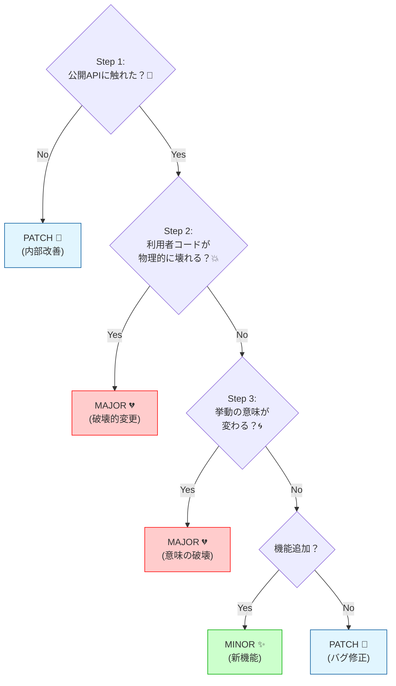

# 第13章：変更の分類が上手くなる：迷ったときの判断ルール🧠🧭

この章はね、**「うーん…これMINOR？それともMAJOR？」**って迷う時間をガッツリ減らす回だよ〜！😆💕

ちなみに本日時点だと、TypeScript は **5.9 系が最新安定**として案内されていて、今後 **TypeScript 6.0（橋渡し）→ 7.0（ネイティブ移行）**の流れが公式に語られてるよ（互換性の判断がますます大事になるやつ！）🧩🚀 ([npm][1])

---

## 13.0 この章でできるようになること🎯✨

* 変更を見た瞬間に、まず何を確認すべきかが分かる👀✅
* **MAJOR / MINOR / PATCH**の判断が“テンプレ手順”でできる🧠📌
* とくに迷いやすい **「型を厳しくしたい問題」**を、ケース分けで判断できる😵‍💫➡️😌
* 20問トレで、判断の筋トレできる🏋️‍♀️🎯

---

## 13.1 なんで私たちって迷うの？🤔💭

迷う理由は、だいたいこの3つに集約できるよ〜👇

1. **公開APIに触ってるかが曖昧**（“内部だけのつもり”が漏れてる）🫠
2. **壊れ方が1種類じゃない**（コンパイルは通るのに挙動が変わる…とか）😱
3. **「正しくしたい」気持ちが強い**（型を厳しくしたい／例外を投げたい／デフォルト変えたい）🔥

だからこの章では、迷ったら戻る「判断ルール」を固定しちゃうよ📌✨

---

## 13.2 迷ったときの“判断順”テンプレ（これが本体）📌🧭

迷ったら、**この順番を絶対に守る**だけでOK！😤✨

### ✅ 判断順テンプレ（3ステップ）

**Step 1：公開APIに触れてる？📣**

* `export` してる関数・型・定数・クラス・イベント・設定項目・CLI引数…
* READMEで「これ使ってね」って言ってるもの
  → ここに触ってたら、**互換性の判定コース**に入る！

**Step 2：利用者コードが壊れる？💥**
壊れる＝たとえば…

* コンパイル通らない（型エラー）🧷
* 実行時に落ちる（例外）💣
* これまで動いてた利用者の処理が成立しない😵

**Step 3：意味が変わる？🌀**

* 返す値の“意味”が変わる
* デフォルトが変わる
* 例外を投げる条件が増える
* 並び順・丸め・境界条件が変わる
  → “動くけど別物”は事故率高い💦

---

## 13.3 MAJOR / MINOR / PATCH の判断基準（超圧縮）🔢✨

SemVerの基本ルールはこれだよ👇

* **MAJOR**：公開APIに**後方互換性のない変更**が入ったとき💔
* **MINOR**：公開APIに**後方互換な機能追加**（＋非推奨の追加もここに入ることが多い）✨
* **PATCH**：後方互換な**バグ修正**🐛

この「MAJOR = public API の後方互換性が壊れたら」ってのが、SemVerのど真ん中🧠📌 ([Semantic Versioning][2])

---

## 13.4 迷いがちな変更パターン別・結論ルール集📚✨

ここからが「実戦の辞書」だよ〜！📖💕

### A) 公開APIに触ってない“つもり”の内部変更🔧

* **内部だけ変更**でも、利用者が観測できる挙動が変わったらアウト⚠️

  * 例：返す配列の順序が変わる
  * 例：タイムゾーン/丸め/文字列フォーマットが変わる
  * 例：例外が出る条件が増える
    ✅ **観測できるなら互換性に関係する** → Step2/3へ！

---

### B) デフォルト値の変更（地味に地雷）🎚️💥

* 利用者が引数省略してたら、**結果が変わる**よね？
  → だいたい **MAJOR**（少なくとも“意味が変わる”）🌀
* ただし「明確なバグ修正で、旧挙動が壊れてた」なら **PATCH** を検討🐛
  （でも利用者は困るので、リリースノートで丁寧に！）

---

### C) エラーメッセージだけ変えた🗯️

* 人間向けの文字列だけならたいてい **PATCH**
* でも利用者がその文字列をパースしてたら…？😇

  * その場合は“実質API”になってる
  * 互換ポリシーで「エラーメッセージは契約外」って書けてるかが大事📜
    → 迷ったら「観測されてるか？」で判断！

---

### D) 例外を投げる条件を増やした💣

* これまで成功してた入力で例外が出るようになった
  → ほぼ **MAJOR**（実行時破壊）💥
* ただし「これまでも内部的に壊れてた（未定義動作）を明確にした」なら議論余地あり
  → でも利用者は落ちるので、基本はMAJOR寄りで安全に🛡️

---

## 13.5 「型を厳しくしたい問題」🤔🧷⚠️（超よく迷うやつ！）

ここはケース分けで決めよ〜！🧠✨
結論から言うと…

> **利用者の型チェックが新しく落ちるなら、それは破壊的変更（MAJOR）になりやすい**💔

でも例外もあるから、分岐テンプレ👇

### ✅ 型厳格化の分岐テンプレ

**Q1：以前はコンパイル通ってた利用者コードが、今は落ちる？**

* YES → **基本 MAJOR**💥
* NO → 次へ

**Q2：落ちるのは「明らかに不正な使い方」だけ？**

* 例：実行時には100%落ちてたのに、型がガバくて通ってただけ

  * `string` 受け取るはずが `any` で通ってた、とか
* YES → **PATCH寄り**（“型のバグ修正”）🐛
* NO → **MAJOR寄り**

**Q3：その型は“公開APIの一部”として約束してた？**

* README/型定義で利用者が依存してるなら、よりMAJOR寄り📣

### ✨具体例で見るよ！

#### 例1：戻り値の union を減らした（`A | B` → `A`）

* 利用者が `B` をハンドリングしてたらコンパイル落ちる
  → **MAJOR**💔

#### 例2：optional を required にした（`x?: number` → `x: number`）

* 省略してた利用者が落ちる
  → **MAJOR**💥

#### 例3：実は実行時に必ず落ちるケースを型で弾くようにした

* 以前：通るけど実行時クラッシュ
* 今：コンパイルで落とす
  → **PATCH候補**🐛（ただし利用者影響はあるのでリリースノート必須！📝）

---

## 13.6 “最終ジャッジ”の安全柵（迷ったらここに戻る）🛡️✨

迷ったときの安全策はこの2つだけ覚えて！💕

1. **利用者コードが壊れる可能性があるなら MAJOR 寄りに倒す**
   → “MAJORをケチる”ほうが炎上しやすい🔥

2. **判断理由を1行で言えるようにする**

* 「公開APIの型が変わって利用者のコンパイルが落ちるから」🧷
* 「デフォルト挙動が変わって意味が変わるから」🌀
* 「後方互換な機能追加で既存コードは壊れないから」✨
  この1行が言えたら勝ち！🏆

---

## 13.7 ミニ演習：20問の分類トレーニング🎯💪✨

各問いを **MAJOR / MINOR / PATCH** で答えてね！
（迷ったら 13.2 のテンプレに戻るんだよ〜🧭💕）

### 問題（Q1〜Q20）📝

**Q1** export関数 `parse()` の引数型を `string` → `string | URL` にした
**Q2** export関数 `parse()` の戻り値型を `Result | null` → `Result` にした
**Q3** export型 `Options` に `timeoutMs?: number` を追加した
**Q4** `Options.mode` の union から `'legacy'` を削除した
**Q5** `Options.debug?: boolean` を `debug: boolean` にした
**Q6** export定数 `DEFAULT_LIMIT = 100` を `50` に変えた
**Q7** バグで `sort()` が逆順だったのを正順に直した（READMEは「昇順」って書いてた）
**Q8** 例外を投げる条件を増やした（無効入力で黙って丸めてた→例外）
**Q9** `export { internalHelper }` をやめて非公開にした
**Q10** `internal/`配下の実装を総入れ替え（外から見えるAPIは同じ、結果も同じ）

**Q11** `parse()` が返す配列の順序を変更した（ドキュメントに順序の約束なし）
**Q12** `parse()` が返すエラーメッセージ文言だけ変えた
**Q13** CLIの `--format json` の出力フィールド名を変更した
**Q14** 新しいexport関数 `parseAsync()` を追加した
**Q15** exportクラスのメソッド名を `toJSON()` → `toJson()` に変更した
**Q16** `deprecated` のJSDocコメントを付けた（代替APIも案内した）
**Q17** `package.json` の `exports` を整理して、今まで import できた深いパスを塞いだ
**Q18** TypeScriptの型だけ厳格化（実行時挙動は変わらないが、以前通ってたコードが落ちる）
**Q19** 型だけ厳格化（実行時は以前から必ず落ちてた使い方を、型で弾くようにした）
**Q20** パフォーマンス最適化だけ（返り値も順序も同じ）

---

### 解答＆解説（サクッと）✅✨

* **A1：MINOR**（後方互換な拡張）✨

* **A2：MAJOR**（null許容が消えて利用者が壊れる）💔

* **A3：MINOR**（optional追加はだいたい安全）✨

* **A4：MAJOR**（既存分岐が落ちる）💥

* **A5：MAJOR**（省略してた利用者が落ちる）💣

* **A6：MAJOR寄り**（デフォルト変更＝意味が変わりがち）🌀

* **A7：PATCH**（ドキュメント通りに直した“バグ修正”）🐛

* **A8：MAJOR**（成功してたケースが例外で落ちる）💥

* **A9：MAJOR**（公開APIの削除）🗑️

* **A10：PATCH**（外から見える契約が同じなら内部変更）🛠️

* **A11：要注意 → 多くはMAJOR寄り**（利用者が順序に依存してたら意味破壊）🌀

* **A12：PATCH**（文字列は原則契約外…にしておくのが安全）📝

* **A13：MAJOR**（CLI出力は実質API）📣💥

* **A14：MINOR**（新機能追加）✨

* **A15：MAJOR**（メソッド名変更＝破壊）💔

* **A16：MINOR**（非推奨の付与は互換を保ったまま“誘導”）🧓➡️🆕

* **A17：MAJOR**（深いimportで使ってた利用者が壊れる）💣

* **A18：MAJOR**（型変更で利用者がコンパイル落ち）🧷💥

* **A19：PATCH候補**（実行時で必ず死んでたのを型で防いだ）🐛🛡️

* **A20：PATCH**（挙動同一の最適化）⚡

---

## 13.8 AI活用🤖✨：判断を“秒速で言語化”するプロンプト集

### ① 変更を分類してもらう（判断の型を作る）🧠

* 「次の変更点を、公開API/破壊/意味変更の観点でチェックして、MAJOR/MINOR/PATCHを提案して。根拠を1行で。」

### ② “型厳格化”の扱いを判定してもらう🧷

* 「この型変更で、以前通ってた利用者コードが落ちる可能性を列挙して。落ちるならMAJOR寄りか、実行時でも落ちてたならPATCH寄りかを理由つきで。」

### ③ 20問クイズを自動採点してもらう🎯

* 「私の回答（M/m/p）を採点して、間違いだけ“なぜ”を一言で説明して。」

---

## 13.9 この章のまとめ🌸✨

* 迷ったら **判断順テンプレ（公開API→壊れる？→意味変わる？）** に戻る🧭
* **型を厳しくして利用者が落ちるならMAJOR** が基本💥
* “自信がない”ときこそ、理由を1行で言えるかチェック📝
* 20問を繰り返すと、判断がマジで早くなるよ〜🏃‍♀️💨✨

---

次は第14章で、**非推奨（Deprecation）を使って「やさしく壊す」**流れに入るよ🧓➡️🆕🔥

[1]: https://www.npmjs.com/package/typescript?utm_source=chatgpt.com "typescript"
[2]: https://semver.org/?utm_source=chatgpt.com "Semantic Versioning 2.0.0 | Semantic Versioning"
