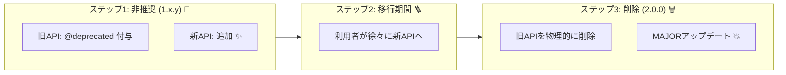

# 第14章：非推奨（Deprecation）で“やさしく壊す”🧓➡️🆕

## この章でできるようになること🎯

* 「いきなり削除💥」じゃなくて、**段階的に移行してもらう**流れを作れる🪜✨
* “非推奨にしたいAPI”を、**TypeScriptでちゃんと目立たせる**（VS Codeで気づける）👀🧷
* **移行ガイド（1ページ）**をサクッと書ける📄💡
* “次のMAJORで削除”を、SemVerの約束として運用できる📦🏷️ ([Semantic Versioning][1])

---

## 14.1 非推奨ってなに？どうして必要？🤔💭

「非推奨（Deprecated）」は一言でいうと…

> **“今はまだ使えるけど、将来やめる予定だよ”の予告**📣

これをやらずに突然消すとどうなるかというと…

* 利用者：「え、昨日まで動いてたのに😱」
* 作者（未来の自分）：「やばい…問い合わせ地獄…😭」
* そして炎上🔥（小さくても地味にツラい）

だから、**非推奨は“やさしさ”**なんだよね🤝💕

---

## 14.2 “やさしく壊す”3段階ルール🪜✨


この章のコアはこれ👇

### ✅ ステップ1：非推奨にする（Deprecated）🧓

* 旧APIは残す（まだ動く）
* でも **“使わないでね”が見える**状態にする（エディタ警告など）👀

### ✅ ステップ2：代替（Replacement）を用意する🆕

* “こっち使ってね”を明確にする
* できれば旧APIは **新APIへのラッパー**にして挙動を揃える🧩

### ✅ ステップ3：次のMAJORで削除（Removal）🗑️➡️2.0.0

* **互換性が壊れる変更**なので、SemVer的にはMAJORが基本だよ📦💔 ([Semantic Versioning][1])



---

## 14.3 非推奨にするときの最短チェックリスト✅📝

非推奨にする前に、これだけ確認すると事故が減るよ🛡️✨

* [ ] 代替APIはもう存在する？（存在しないなら先に作る🧱）
* [ ] 旧API→新APIへの移行は簡単？（置換で済む？引数変換いる？）🔁
* [ ] 「いつ消すか」の目安は決めた？（次のMAJORなど）🏷️
* [ ] README / docs / 変更履歴に書く準備できた？📄
* [ ] “警告がうるさすぎない”設計にできる？（毎回warnは地獄😵‍💫）

---

## 14.4 TypeScriptで“非推奨”を目立たせる🧷👀✨（いちばん大事）


TypeScriptは **JSDocの `@deprecated`** が使えるよ！
これを付けると、VS Codeなどで「非推奨だよ」が見えやすくなる🧠✨ ([TypeScript][2])

### 14.4.1 関数を非推奨にする（超定番）📦

```ts
/**
 * @deprecated Use `parseIsoDate()` instead.
 * 移行: parseDate(str) -> parseIsoDate(str)
 * 削除予定: v2.0.0
 */
export function parseDate(str: string): Date {
  return parseIsoDate(str);
}

export function parseIsoDate(str: string): Date {
  // 新実装
  return new Date(str);
}
```

ポイント💡

* `@deprecated` の後ろに **短い理由 + 代替 + 移行ヒント**を書くと親切🥰
* 旧APIは可能なら **新APIへ委譲**（挙動差で揉めるのを減らす）🧩

---

### 14.4.2 プロパティ / 型を非推奨にする🧷

```ts
export interface AccountInfo {
  name: string;

  /** @deprecated Use `gender` instead. */
  sex: "male" | "female";

  gender: "male" | "female" | "nonbinary" | "unknown";
}
```

こういう「フィールド名変えたい」系は非推奨が超効く👏
TypeScriptは `@deprecated` を型システムで扱えるようになってるよ🧠✨ ([TypeScript][2])

---

### 14.4.3 “exportの再構成”で非推奨を伝える📤

「入口APIを整理したい」ってよくあるよね🧹✨

```ts
// v1: legacy export
/** @deprecated Use `createClient()` from `client` module. */
export { createClientLegacy as createClient } from "./legacy";

// v1+: new export
export { createClient } from "./client";
```

ここでの狙い🎯

* 利用者が `createClient` を使ってても **VS Codeで気づける**
* 移行先も同じ名前で用意できるなら最高（でも無理なら移行ガイドで補う）📝

---

## 14.5 “代替API”の作り方：移行が楽になる設計🧩✨

非推奨が成功するかどうかは、実は **代替APIの作法**で決まること多い😳

### パターンA：旧APIを新APIのラッパーにする（おすすめ）🥇


* 旧APIは残しつつ、中身は新APIへ
* バグ修正も新APIに入れれば両方に効く🛠️✨

### パターンB：旧API互換の“変換関数”を用意する🔁

引数や返り値の形が変わるときに便利！

```ts
export type LegacyOptions = { timeoutMs?: number };
export type Options = { timeout: number };

export function toOptions(legacy: LegacyOptions = {}): Options {
  return { timeout: legacy.timeoutMs ?? 3000 };
}

/** @deprecated Use `request(url, toOptions(opts))` instead. */
export function requestLegacy(url: string, opts?: LegacyOptions) {
  return request(url, toOptions(opts));
}

export function request(url: string, opts: Options) {
  /* ... */
}
```

---

## 14.6 実行時にも“やさしく注意”する（Node系ライブラリ/CLI向け）⚠️🖥️

型だけの警告だと、JS利用者や実行時だけの道を通る人が見落とすことがあるよね👀💦
そのときは **実行時Warning**もアリ！

Nodeでは `process.emitWarning()` を使って “DeprecationWarning” を出せるよ📣 ([Node.js][3])

```ts
let warned = false;

export function legacyFeature() {
  if (!warned) {
    warned = true;
    process.emitWarning("legacyFeature() is deprecated. Use newFeature().", {
      type: "DeprecationWarning",
    });
  }
  return newFeature();
}

export function newFeature() {
  return "ok";
}
```

ポイント💡

* **毎回warningはやめよ**（ログが地獄😵‍💫）→「一回だけ」が優しい
* 利用者側は Node のオプションで挙動を制御できることがある（抑制・例外化・トレースなど）🧯 ([Node.js][3])

---

## 14.7 npmで「このバージョン非推奨です」って宣言する📦⚠️


ライブラリ作者側の必殺技✨
npmは **特定バージョン（またはパッケージ）に“非推奨メッセージ”を付けられて、インストール時に表示**されるよ📣 ([npmドキュメント][4])

例（イメージ）👇

```bash
npm deprecate your-lib@1.4.2 "Deprecated: use your-lib@^1.5.0 (new API) or migrate via docs."
```

これが刺さる場面🎯

* “やばいバージョン”を出しちゃった（取り下げに近い運用）😇
* 「この系列はもう保守しないよ」を明示したい🧓
* 代替パッケージへ誘導したい🚪

---

## 14.8 移行ガイド（最小テンプレ）📄✨（1ページでOK）

「長文ドキュメント書けません😭」でも大丈夫。
最小はこれで十分戦えるよ💪💕

### ✅ Migration Guide: v1 → v2（テンプレ）

* 1. 何が変わる？（要約3行）🧾
* 2. まず検索して置換するもの（機械的に直せる）🔎
* 3. 手動で判断が必要なもの（例：挙動差、例外、戻り値）🧠
* 4. 例（Before/After）🧪
* 5. よくあるエラーと対処（FAQ）🩹

#### Before/After（例）

```ts
// Before
import { parseDate } from "your-lib";
const d = parseDate("2026-01-21");

// After
import { parseIsoDate } from "your-lib";
const d = parseIsoDate("2026-01-21");
```

---

## 14.9 リリースノートの書き方：非推奨は“見える化”が命📝👀


非推奨って、**気づかれなかったら無かったこと**になりがち😇
だから、リリースノートはこの形が強い👇

* 🧓 Deprecated

  * `parseDate()` is deprecated. Use `parseIsoDate()` instead. Removal planned in v2.0.0.
* 🆕 Added

  * `parseIsoDate()` added with strict ISO parsing.
* 🛠️ Fixed

  * …

「削除予定のバージョン」を書くと、利用者が予定を立てやすいよ📅✨

---

## 14.10 自動化：deprecated使用をCIで止める🛡️🤖


「チームで気づかず旧API使い続ける問題」あるある😵‍💫
これ、ESLintで検出できるよ！

`@typescript-eslint/no-deprecated` は **`@deprecated` の使用を禁止**できて、型情報が必要（=ちょい重い）って明記されてるよ🧠⚖️ ([typescript-eslint.io][5])

例（雰囲気）👇

```js
// eslint.config.js など（構成はプロジェクトに合わせてね）
export default [
  {
    rules: {
      "@typescript-eslint/no-deprecated": "warn",
    },
  },
];
```

運用のコツ🍀

* 最初は `"warn"` で導入して、落ち着いたら `"error"` にするのが優しい🥰
* 「次のMAJORが近いタイミングで error 化」もアリ🏷️

---

## 14.11 ミニ演習📝✨：非推奨コメント＆移行ガイドを作ろう

あなたの小さめモジュールを想定してOKだよ😊

### お題🎯

`formatDate(date)` を非推奨にして、`formatIsoDate(date)` に移行させたい。

### やること🪄

1. `formatDate` に `@deprecated` を付ける🧷
2. `formatIsoDate` を新APIとして用意する🆕
3. “1ページ移行ガイド”を書く📄✨（テンプレを埋めるだけでOK）

---

## 14.12 AI活用🤖✨：そのまま投げて使えるプロンプト集

### ① 非推奨コメントを整えてもらう🧓➡️🆕

* 「この関数を非推奨にしたい。利用者が迷わない `@deprecated` コメントを英日で作って。削除予定は v2.0.0。代替は `Xxx`。」

### ② 移行ガイド（1ページ）を作る📄

* 「旧API→新APIの移行ガイドを“短く・親切に”。Before/After例とFAQも3つ作って。」

### ③ “破壊的変更じゃない移行”にできないか相談する🧩

* 「この変更、非推奨→移行でMAJORを遅らせたい。互換を保つラッパー/変換関数案を3つ出して。」

---

## よくある失敗集😵‍💫（ここだけ読んでも強くなる）

* ❌ 非推奨にしたのに代替がない（ただの嫌がらせになる）
* ❌ “いつ削除か”が書いてない（利用者が後回しにして爆発💥）
* ❌ warningを毎回出してログ地獄（嫌われる）
* ❌ 旧APIと新APIで挙動が微妙に違う（移行後に事故る）
* ❌ ドキュメントが無い（利用者は想像で直して壊す😇）

---

## この章のまとめ🎁✨

* 非推奨は **“段階的に壊す”ための設計**🪜
* TSでは `@deprecated` を付けて **エディタで気づける**ようにするのが強い🧷 ([TypeScript][2])
* 削除は互換破壊なので **基本はMAJOR**📦💔 ([Semantic Versioning][1])
* npmのdeprecateで **インストール時メッセージ**も出せる📣 ([npmドキュメント][4])
* ESLintで deprecated 使用を検出して **CIに混ぜる**とさらに安心🛡️ ([typescript-eslint.io][5])

---

次は「第15章：プレリリース（alpha/beta/rc）」で、**安全に実験する出し方**に進めるよ🧪🚧✨

[1]: https://semver.org/?utm_source=chatgpt.com "Semantic Versioning 2.0.0 | Semantic Versioning"
[2]: https://www.typescriptlang.org/play/4-0/new-js-features/jsdoc-deprecated.ts.html?utm_source=chatgpt.com "Playground Example - JSDoc Deprecated"
[3]: https://nodejs.org/api/process.html?utm_source=chatgpt.com "Process | Node.js v25.4.0 Documentation"
[4]: https://docs.npmjs.com/deprecating-and-undeprecating-packages-or-package-versions/?utm_source=chatgpt.com "Deprecating and undeprecating packages or ..."
[5]: https://typescript-eslint.io/rules/no-deprecated?utm_source=chatgpt.com "no-deprecated"
