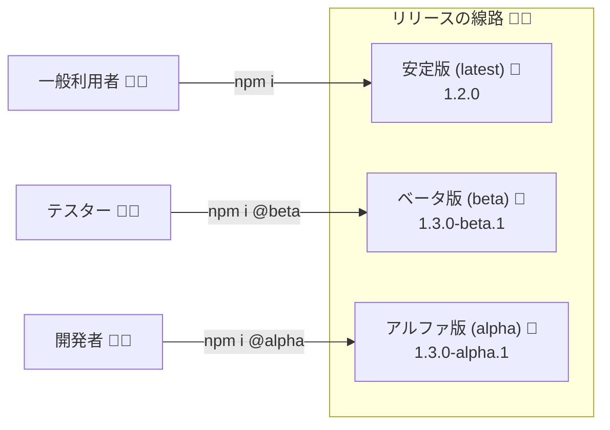

# 第15章：プレリリースと実験：alpha/beta/rcの使い分け🧪🚧

## この章でできるようになること 🎯

* `-alpha` / `-beta` / `-rc` の「使いどころ」が説明できるようになる 🙆‍♀️
* “試用”と“本番”をちゃんと分離して、利用者を巻き込まずに実験できる 🧯
* npmで **安定版は安定版のまま**、テスト版だけを配れる（dist-tag運用）🏷️✨ ([npmドキュメント][1])
* experimental API を「壊れてもOKなゾーン」に隔離して運用できる 🚩 ([TSDoc][2])

---

## 15.1 プレリリースってなに？（“別線路”のイメージ）🚃💨


SemVerでは、`1.2.0-alpha.1` みたいに **ハイフン（-）以降がプレリリース**です。プレリリースは **同じ数字の安定版（`1.2.0`）より優先度が低い**＝「まだ不安定かも」の合図になります。 ([Semantic Versioning][3])



つまり、ざっくり言うと…👇

* **安定版**：普通に使ってOK（みんなが乗る本番列車）🚄
* **プレリリース**：試したい人だけ乗ってね（実験列車）🚧🚃

---

## 15.2 alpha / beta / rc の “感覚” 🥚➡️🐣➡️🕊️

### alpha（アルファ）🥚

* 目的：**早めに形を見せる**／方向性のフィードバックをもらう
* 状態：仕様が揺れる、壊れてもOK（壊れる前提で試す）💥
* ルール例：**破壊的変更してもOK**（ただし「alphaだからね！」を明記）🧾

### beta（ベータ）🐣

* 目的：**利用者に触ってもらってバグ・使い勝手を取る**
* 状態：APIはだいぶ固めたい（でもまだ変わる可能性あり）🧠
* ルール例：破壊的変更は減らす（やるなら理由とガイド必須）🧭

### rc（release candidate）🕊️

* 目的：**ほぼ本番の候補**（“これで出す予定”）
* 状態：基本は **機能追加ストップ**、バグ修正中心 🧯
* ルール例：ここから大きく変えるなら「まだrcの意味ないよね？」って判断する⚖️

> ※SemVer自体は `alpha/beta/rc` を特別扱いしません（全部ただの“pre-release identifiers”）。でも運用としてこの3段階にすると、みんなが理解しやすいんだよね〜！ ([Semantic Versioning][3])

---

## 15.3 SemVerのルール（ここだけ“仕様”として押さえよう）📏✨

### 15.3.1 書き方の基本 ✍️

* 形式：`MAJOR.MINOR.PATCH-label.number`
* 例：`1.4.0-alpha.0` → `1.4.0-alpha.1` → `1.4.0-beta.0` → `1.4.0-rc.0` → `1.4.0`

プレリリースは **安定版より低い**（`1.4.0-rc.0 < 1.4.0`） ([Semantic Versioning][3])

### 15.3.2 並び順（優先度）🔢

SemVerは「数字→ラベル」の順で比較して並べます。ビルドメタデータ（`+xxxx`）は **並び順に影響しません**。 ([Semantic Versioning][3])

---

## 15.4 npmでの配り方：dist-tagで“安定版を守る”🏷️🛡️

npmには **dist-tag**（例：`latest`, `beta`, `next`）があって、
「このタグを付けたバージョンを入れてね」って誘導できます。 ([npmドキュメント][1])

* 何も考えず `npm publish` すると、基本 `latest` がその版を指すようになります
* だからプレリリースは `--tag beta` みたいにして **latest を汚さない**のが大事！ ([npmドキュメント][1])

---

## 15.5 利用者が入れるとき：プレリリースは“勝手に入らない”🙅‍♀️✅

npmのsemverレンジは、基本的に **プレリリースを自動では拾いにくい**設計です。
（うっかり全員にベータが入ると事故るからね…！） ([npmドキュメント][4])

使ってもらう時は、こんな感じで明示してもらうのが安全👇

```bash
npm i your-lib@beta
npm i your-lib@1.4.0-rc.0
```

---

## 15.6 “実験API（experimental）”をどう扱う？🚩🧪


プレリリースと相性がいいのが **experimental API**（実験中API）！

### 15.6.1 ルールを分けるのがコツ ✨

* **通常API（安定）**：SemVerの約束を守るゾーン 🤝
* **experimental API**：変わる前提のゾーン（互換性の約束を弱くする）🚧

TSDocの `@experimental` は「将来的に公開したいけど、今はまだ不安定」みたいな意味で使われます。 ([TSDoc][2])

### 15.6.2 “隔離”のやり方（おすすめ2つ）🧱

**A) import経路を分ける（いちばん分かりやすい）**

* 安定：`your-lib`
* 実験：`your-lib/experimental`

**B) namespaceを分ける（妥協案）**

* `export const experimental = { ... }`

---

## 15.7 失敗しない“境界線”の引き方（超重要）🧯✨

ここができると事故が激減するよ〜！

### ✅ 原則：安定版ラインと実験ラインを混ぜない

* `latest` は **安定版だけ**（本番列車🚄）
* `alpha/beta/rc` は **別タグで配る**（実験列車🚧🚃） ([npmドキュメント][1])

### ✅ rcに入ったら「機能追加しない」宣言に近い

rcで機能追加し始めると、利用者が「結局いつ固まるの？」って困る😵‍💫

---

## 15.8 “現実の例”でつかむ：TypeScript自身も beta/rc を配ってる 🧑‍💻✨

TypeScriptも npm でベータ版を配って、試したい人が入れられるようにしてます。 ([Microsoft for Developers][5])

```bash
npm i -D typescript@beta
```

こういう「本体がやってる運用」って、安心して真似しやすいよね☺️🫶

---

## 15.9 ミニ演習：実験機能を1つ作って“安全に公開”を設計しよう 📦🧪

### お題 🎒

あなたのライブラリ `cute-math` に、新機能 `fastSum` を追加したい！
でもまだ怪しいので **experimental** として試してもらいたい！

### Step 1：experimental を別入口に隔離する 🧱

```ts
// src/experimental.ts

/**
 * @experimental
 * まだ試験運用！挙動や型は変わる可能性があります。
 */
export function fastSum(values: number[]): number {
  // 例：とりあえず普通に合計（将来高速化したい）
  return values.reduce((a, b) => a + b, 0);
}
```

### Step 2：プレリリース番号を作る（npm version）🔢

`--preid` はプレリリース識別子（alpha/beta/rc）を付ける仕組みだよ〜 ([npmドキュメント][6])

```bash
npm version preminor --preid alpha
# 例：1.3.0-alpha.0 みたいになる
```

### Step 3：latest を汚さずに publish する 🏷️

```bash
npm publish --tag alpha
```

`npm publish` は放置すると `latest` が動いちゃうので、プレリリースは `--tag` が基本だよ！ ([npmドキュメント][1])

### Step 4：試したい人だけが入れる 👩‍🔬

```bash
npm i cute-math@alpha
```

### ✅ 最後にチェック（設計問題）📝

* 「安定版の利用者が `npm i cute-math` したら、alpha入っちゃう？」→ **入らないようにするのが正解**🙆‍♀️
* 「experimental を通常importで触れるようにしちゃってない？」→ **入口を分ける**のが安全🧱

---

## 15.10 AI活用（Copilot / Codex でラクする）🤖✨

### ① 注意書きを“短く誤解なく”作る 🧾

* 「experimental の意味」「壊れる可能性」「代替手段」を3行で！

**プロンプト例**
「次のAPIはexperimentalです。利用者が誤解しない注意書きを、README向けに3〜5行で、やさしい日本語で書いて」

### ② “公開面に混ざってないか”レビューしてもらう 🔍

**プロンプト例**
「この変更で、experimental API が通常の export に紛れ込んでないか確認して。危ない点があれば指摘して」

### ③ rcのリリースノートを整える 📝

**プロンプト例**
「この差分を rc 用リリースノートにして。『新機能追加なし・バグ修正中心』が伝わるように」

---

## 15.11 よくある事故あるある 😇💥（回避策つき）

* **事故①：betaをlatestでpublishしちゃった** → dist-tag運用を徹底（`--tag beta`）🏷️ ([npmドキュメント][1])
* **事故②：`^`指定で利用者に勝手にプレ版が入ると思ってた** → 基本はそうならない（明示インストールが前提）🧠 ([npmドキュメント][4])
* **事故③：rcで機能追加を続けて収束しない** → rcは“ほぼ確定”の合図にする🕊️

---

## 15.12 まとめ：第15章のいちばん大事な約束 🤝✨

* **プレリリースは「試したい人だけ」の線路に乗せる**（dist-tagが命）🏷️🛡️ ([npmドキュメント][1])
* **experimental は入口を分けて隔離する**（壊れてもOKなゾーンを作る）🚩 ([TSDoc][2])
* **rcは“ほぼ本番”**（ここからは安定に向けて整える）🕊️

---

次は「第16章：リリース運用（リリースノート＋自動化＋AI）」で、ここまでの仕組みを“毎回ラクに回す方法”に落としていこうね〜！🚀🤖✨

[1]: https://docs.npmjs.com/cli/v8/commands/npm-dist-tag/?utm_source=chatgpt.com "npm-dist-tag"
[2]: https://tsdoc.org/pages/tags/experimental/?utm_source=chatgpt.com "experimental"
[3]: https://semver.org/?utm_source=chatgpt.com "Semantic Versioning 2.0.0 | Semantic Versioning"
[4]: https://docs.npmjs.com/cli/v6/using-npm/semver?utm_source=chatgpt.com "semver | npm Docs"
[5]: https://devblogs.microsoft.com/typescript/announcing-typescript-5-1-beta/?utm_source=chatgpt.com "Announcing TypeScript 5.1 Beta"
[6]: https://docs.npmjs.com/cli/v7/commands/npm-version/?utm_source=chatgpt.com "npm-version"
