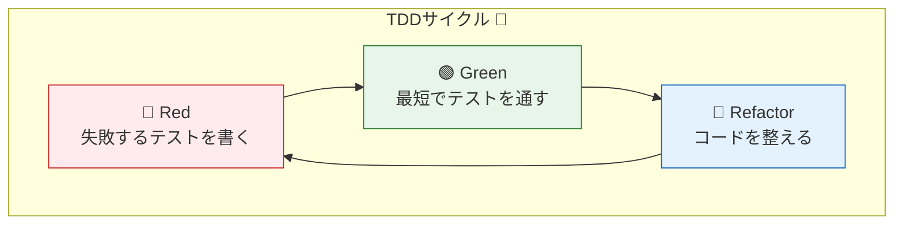

# 第01章：TDDって結局なに？（全体像を1枚にする）🙂

こんにちは〜😊🎀
この章は「TDDって“何をする習慣”なの？」を、迷子にならないように“地図”として頭に入れる回だよ〜🗺️💕

---

## 1) この章でできるようになること（ゴール）🎯✨

読み終わったら、これができればOK😊✅

* **TDDを“作業手順”として説明**できる（テスト＝仕様、設計＝あとから育つ）📝🌱
* **Red → Green → Refactor**の意味が、なんとなくじゃなく腹落ちする🚦💡
* 「テストが先」＝「テストが多い」じゃない、って区別できる🙅‍♀️🧠

---

## 2) いちばん大事な一言💎

TDDはね…

**「仕様を“実行できる文章（テスト）”にして、ちいさく回しながらコードと設計を育てるやり方」**だよ😊🧪🌱

ポイントはこれ👇

* テストは「あとで品質チェック」だけじゃなくて、**先に“仕様を決める紙”**でもある📘✨
* だからTDDは、**実装だけじゃなく“考え方”もセット**なのだ〜🧠🎀

---

## 3) TDDの3ステップ（これだけ覚えて♡）🚦✨

### ✅ Red（赤）：まず“失敗するテスト”を書く


* 「こうなってほしい！」っていう**仕様をテストで書く**📝
* 当然まだ実装がないから、**テストは落ちる（赤）**😵‍💫

### ✅ Green（緑）：最短で通す（作り込みしない！）

* とにかく**最小の実装でテストを通す**💨
* 「キレイさ」はこの段階では最優先じゃない（後でやる）🙆‍♀️

### ✅ Refactor（整理）：動くままキレイにする

* テストが守ってくれるから、安心して整理できる🧹✨
* 重複を消す、名前を直す、分ける、などなど🌸

> この3つを“ちいさく”何回も回すのがTDDだよ〜🔁😊



---

## 4) 「テスト＝仕様書」ってどういうこと？📘🧪

テストって、理想はこう👇

* **読めば仕様がわかる**
* **落ちたら何が壊れたかわかる**
* 実装のコピーじゃなく、**ふるまい（振る舞い）**を書いてる✨

たとえばテスト名だけで、仕様っぽいでしょ？😊

* `合計金額は商品の価格を足した値になる` 🧾
* `商品が0件なら合計は0になる` 🫧
* `nullが来たら例外にする` 🚫

---

## 5) 超ミニ実演：3分でTDDを眺める☕️🧾（C# × xUnit）

ここは「雰囲気を体に入れる」だけでOKだよ😊✨
題材はミニミニでいくね（**合計金額**）💰

### ✅ Step A：Red（失敗するテストを書く）🚦🔴

```csharp
using Xunit;

public class TotalPriceTests
{
    [Fact]
    public void Total_is_sum_of_prices()
    {
        // Arrange
        var calc = new TotalPriceCalculator();

        // Act
        var total = calc.Total(new[] { 120, 80 });

        // Assert
        Assert.Equal(200, total);
    }
}
```

この時点では `TotalPriceCalculator` が無い（または未実装）ので、当然落ちるよね😵‍💫🔴

---

### ✅ Step B：Green（最短で通す）🚦🟢

```csharp
public sealed class TotalPriceCalculator
{
    public int Total(IEnumerable<int> prices)
    {
        return prices.Sum();
    }
}
```

通った〜！やった〜😊🟢🎉
この段階では「まだイケてる設計か？」とか深追いしないでOK🙆‍♀️

---

### ✅ Step C：Refactor（整える）🚦🧹

たとえば、**読みやすさ**をちょい上げするとか😊

* `Total` → `CalculateTotal` に変える（意図が伝わる）📝
* `prices` が `null` のときどうする？を決める（仕様）🤔
* 重複が出たら小さく整理🧼✨

※ “整理したら必ずテストを回す”がセットだよ🔁✅

---

## 6) よくある勘違い（ここで潰しておく）🧯✨

### ❌「TDD＝テストをいっぱい書くこと」

👉 ちがうよ〜😊
**“順番（先にテスト）”と“回し方（小さく回す）”**が本体！

### ❌「TDD＝バグがゼロになる魔法」

👉 魔法じゃない😂
でも、**壊れたらすぐ気づく**し、直しやすくなる🛡️✨

### ❌「テストは実装の写しでOK」

👉 それはつらいやつ😵
テストは**仕様（ふるまい）**を書こうね📘🧪

---

## 7) AIの使いどころ（この章のおすすめ）🤖✨

AIは便利だけど、TDDでは役割を固定すると強いよ😊✅

### ✅ AIに頼むといいこと

* 仕様文から **テストケース（正常/異常/境界）**を列挙してもらう🧠
* テスト名の **候補を3つ**出してもらう📝
* 失敗ログを貼って **原因候補→確認手順**を出してもらう🔍

### ✅ この章の“定番プロンプト”（コピペ用）🧁

* 「この仕様のテストケースを、正常/異常/境界値で列挙して」
* 「このテスト名の候補を3つ出して。誤解が少ない順に」
* 「この失敗ログから、原因候補と確認手順を順番に教えて」

---

## 8) ミニ課題（今日の宿題）📚🎀

やることはこれだけ！15〜20分でOK😊✨

### 🧪課題：合計金額に“0件”の仕様を足す

1. **新しいテストを書く**（0件なら0）🔴
2. **最短で通す**🟢
3. **必要なら整理**🧹

テスト例👇

```csharp
[Fact]
public void Total_is_0_when_no_prices()
{
    var calc = new TotalPriceCalculator();

    var total = calc.Total(Array.Empty<int>());

    Assert.Equal(0, total);
}
```

---

## 9) 章末チェック（3問クイズ）🎓✨

1. TDDの「3ステップ」は？🚦
2. Greenのときにやりがちなダメ行動は？（ヒント：作り込み）🍰🙅‍♀️
3. テストが「実装の写し」になると、何が起きる？😵

---

## 10) おまけ：2026/01/18 時点の“最新”メモ🆕🗓️

（ここは教材の鮮度チェック用の小メモだよ😊）

* .NET 10 は **10.0.2（2026/01/13）**が配布されてるよ🧩✨ ([Microsoft][1])
* Visual Studio 2026 は **18.2.0（2026/01/13）**の更新が出てるよ🛠️✨ ([Microsoft Learn][2])
* C# 14 は .NET 10 SDK と Visual Studio 2026 で試せる想定だよ✍️✨ ([Microsoft Learn][3])
* xUnit v3 は **3.2.2** が安定版として案内されてるよ🧪✨ ([xunit.net][4])

  * Visual Studio / `dotnet test` で回すなら **xunit.runner.visualstudio（3.x系）**が定番だよ🧷 ([xunit.net][5])

---

次の第2章では、今日チラ見した **Red/Green/Refactor** を、もうちょい“手で回せる感覚”にしていくよ〜🚦💪✨

[1]: https://dotnet.microsoft.com/en-us/download/dotnet?utm_source=chatgpt.com "Browse all .NET versions to download | .NET"
[2]: https://learn.microsoft.com/en-us/visualstudio/releases/2026/release-notes?utm_source=chatgpt.com "Visual Studio 2026 Release Notes"
[3]: https://learn.microsoft.com/en-us/dotnet/csharp/whats-new/csharp-14?utm_source=chatgpt.com "What's new in C# 14"
[4]: https://xunit.net/releases/?utm_source=chatgpt.com "Release Notes"
[5]: https://xunit.net/docs/nuget-packages-v3?utm_source=chatgpt.com "What NuGet Packages Should I Use? [xUnit.net v3]"
