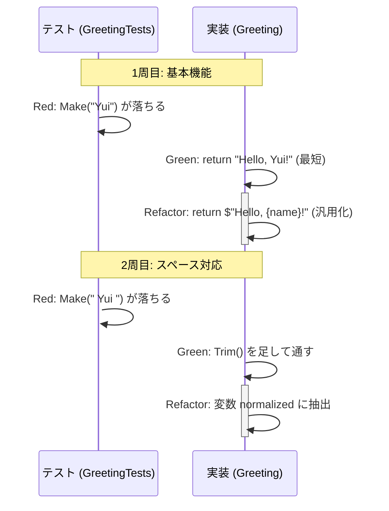

# 第02章：Red / Green / Refactor の意味を体で覚える🚦

## この章でできるようになること🎯

* **3ステップ（Red→Green→Refactor）を“最小単位”で回せる**ようになる💪✨
* 「今はどのステップ？」を**自分で言語化**できるようになる🗣️💡
* **Greenで作り込みしない**クセがつく（←これ超大事！）🙅‍♀️🍰

---

## 今日の“最新メモ”📝✨（2026/01/18時点）

* .NET 10 の最新は **10.0.2（2026/01/13リリース）** だよ🪟⚡️ ([Microsoft][1])
* xUnit v3 の安定版は **3.2.2**（xunit.v3）🧪 ([xUnit.net][2])
* C# は **C# 14** が最新で、.NET 10 とセットで使えるよ✨ ([Microsoft Learn][3])
* Visual Studio 2026 は .NET 10 / C# 14 対応が入ってるよ🧰✨ ([Microsoft Learn][4])

---

## Red / Green / Refactor を“ひとことで”言うと…🤏✨


* **Red**：失敗するテストを先に書く（仕様を先に固定する）🟥
* **Green**：最短で通す（キレイさは一旦あと！）🟩
* **Refactor**：動くまま整える（安全にキレイにする）🧹✨

ポイントはこれ👇
**「仕様を固定（Red）→最短で実現（Green）→読みやすく整える（Refactor）」** 🚦💖

---

## ハンズオン：1周まわして“体に入れる”🚦🏃‍♀️💨

### 今回つくるもの（超ミニ）🧸

`Greeting.Make(name)` が、こう返すやつ👇

* `name = "Yui"` → `"Hello, Yui!"`
* `name = "  Yui  "` → `"Hello, Yui!"`（前後スペースは無視したい）

> まずは **最小の仕様** でいくよ😊✨（欲張らない！）

---

## ① Red：失敗するテストをわざと作る🟥😈

テスト側（xUnit）にこう書くよ👇

```csharp
using Xunit;

public class GreetingTests
{
    [Fact]
    public void Make_Nameを渡すとHello付きで返す()
    {
        // Arrange
        var sut = new Greeting();

        // Act
        var actual = sut.Make("Yui");

        // Assert
        Assert.Equal("Hello, Yui!", actual);
    }
}
```

この時点では `Greeting` も `Make` も無いはずだから、たぶんこうなる👇

* **コンパイルエラー**（赤）🟥
  これは全然OK！😊（TDDはここから始まること多い）

### Redの“良い赤”って？🔍

* 「意図した理由で落ちてる」赤が良い赤👍✨
* たとえば「まだ未実装だから失敗」→ OK
* でも「テスト自体が間違ってて落ちてる」→ それはダメ🙅‍♀️💦

---

## ② Green：最短で通す🟩🏁（作り込み禁止！）

まず `Greeting` を作って、**最短で通す**よ👇
（ここ、わざと雑でOK！“最短で通す練習”だからね😌）

```csharp
public class Greeting
{
    public string Make(string name)
    {
        return "Hello, Yui!";
    }
}
```

✅ テスト実行して、**緑になる**のを確認！🟩🎉

### Greenのコツ🍰🙅‍♀️

* Greenは「正しい実装」を目指すターンじゃなくて
  **“テストが求める最小”で通すターン**だよ✨
* 「ついでに他も作っちゃお！」は次の章以降でOK😂

---

## ③ Refactor：通ったまま整える🧹✨（安全運転）

いまの実装、さすがにダメだよね😂
なので **テストが緑のまま**、普通の実装に整えるよ👇

```csharp
public class Greeting
{
    public string Make(string name)
    {
        return $"Hello, {name}!";
    }
}
```

✅ テストがまだ緑ならOK！🟩✨
これが「テストが守ってくれる」感覚だよ🛡️💖

---

## おかわり1周🍚✨：スペース対応をTDDで追加する（ここが楽しい！）

### ① Red：仕様を1個だけ足す🟥➕

スペース入りの仕様を追加して落とすよ👇

```csharp
using Xunit;

public class GreetingTests
{
    [Fact]
    public void Make_Nameを渡すとHello付きで返す()
    {
        var sut = new Greeting();
        var actual = sut.Make("Yui");
        Assert.Equal("Hello, Yui!", actual);
    }

    [Fact]
    public void Make_Nameの前後スペースは無視する()
    {
        var sut = new Greeting();
        var actual = sut.Make("  Yui  ");
        Assert.Equal("Hello, Yui!", actual);
    }
}
```

ここで **赤になる**はず！🟥😆
（`"Hello,   Yui   !"` みたいになっちゃう）

### ② Green：最短で通す🟩

最短で通すために `Trim()` を足すよ👇

```csharp
public class Greeting
{
    public string Make(string name)
    {
        return $"Hello, {name.Trim()}!";
    }
}
```

✅ 緑！🟩🎉

### ③ Refactor：読みやすくする🧹✨

ちょい整えて、意図が読みやすい形にするよ👇

```csharp
public class Greeting
{
    public string Make(string name)
    {
        var normalized = name.Trim();
        return $"Hello, {normalized}!";
    }
}
```

✅ まだ緑ならOK！🟩✨
これで **2周回した** ことになるよ🚦🚦💖



---

## AIの使いどころ（この章の型）🤖🧠✨

### 1) Redのログを貼って「原因候補を3つ」って聞く🔍

* 失敗ログをコピペ
* 「原因候補を3つ、確認手順つきで」って聞く
* でも **採用するのは自分の意図に合うやつだけ**✅

### 2) Greenで迷ったら「最小の修正だけ」提案させる✂️

例：

* 「このテストを通すための最小の修正案を2つ」
* 「副作用が少ない方はどっち？」

### 3) Refactorは「差分が小さい案」だけもらう🧹

* 「可読性を上げる最小リファクタ案を3つ」
* “大改造”は今は不要🙅‍♀️✨

---

## ありがち事故あるある😵‍💫（先に潰す！）

1. **Redを見ずに実装し始める**（TDDじゃなくなる）🟥❌
2. **Greenで作り込み**（最短で通す練習が崩れる）🍰❌
3. **Refactorをスキップ**（だんだんコードが臭くなる）👃💥
4. **一気に仕様を盛る**（粒が大きくなって苦しくなる）🧱😵
5. **テスト名が雑**（壊れたとき原因が分からない）📝💦

---

## 10分ミニ練習⏱️🧪（1人で回せたら勝ち！）

次の仕様で、同じように **Red→Green→Refactor** を1周してみてね😊✨

### お題：偶数判定🔢

* `IsEven(2)` → `true`
* `IsEven(3)` → `false`

やることはこれだけ👇

1. まず `true` のテスト1本（Red）🟥
2. 最短で通す（Green）🟩
3. 2本目のテストを追加して落とす（Red）🟥
4. 一般化して通す（Green）🟩
5. 読みやすく整える（Refactor）🧹✨

---

## この章の“合格ライン”✅🎓

* 「いま Red/Green/Refactor のどれ？」って聞かれたら、**即答できる**🗣️✨
* 1周につき **テスト1本（多くても2本）** で回せる🧪
* Greenで「ついで実装」をしないで我慢できる😂🍰🙅‍♀️

---

次は第3章の「小さく刻む（1ステップ10分以内）」に行くと、TDDが一気にラクになるよ⏱️💖
もし希望があれば、この章のハンズオンを「もう少し現実寄り（例：カフェ会計の超ミニ前哨戦☕️）」に差し替えた版も作れるよ😊✨

[1]: https://dotnet.microsoft.com/en-US/download/dotnet/10.0?utm_source=chatgpt.com "Download .NET 10.0 (Linux, macOS, and Windows) | .NET"
[2]: https://xunit.net/releases/?utm_source=chatgpt.com "Release Notes"
[3]: https://learn.microsoft.com/en-us/dotnet/csharp/whats-new/csharp-14?utm_source=chatgpt.com "What's new in C# 14"
[4]: https://learn.microsoft.com/en-us/visualstudio/releases/2026/release-notes?utm_source=chatgpt.com "Visual Studio 2026 Release Notes"
