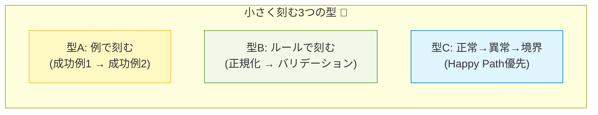

# 第03章：「小さく刻む」練習（1ステップ10分以内）⏱️

この章はね、**TDDを続けられる人**になるための“超重要スキル”を練習する回だよ〜😊💕
結論：**「1回で全部やろう」を捨てて、10分で終わるサイズに切る**！それだけで急に回り出すよ🚀✨

---

## 1. 今日のゴール🎯✨

できるようになったら勝ち🏆💖

* 仕様文を見て、**10分で回せるミニテスト**に分解できる🧩
* **1サイクル＝テスト1本**で進められる🧪
* 「大きすぎて詰む…😵‍💫」を自分で回避できる🚦

---

## 2. なんで“10分刻み”が最強なの？💡🫶


TDDが止まる原因って、だいたいこれ👇

* 仕様がでかい → テストもでかい → 失敗しても原因が分からない😇
* 実装がでかい → 途中で迷子 → 直すの怖い😱
* 結果：テスト回すの面倒になって終わる…💀

逆に、10分刻みだと👇

* 失敗したら「ここだけ壊れた」って分かる🔍✨
* 直すのも小さいから怖くない🛡️
* どんどん“積み上がる安心感”が出る💞

---

## 3. 10分サイクルのルール（これだけ守って🥺🙏）⏱️🚦

1サイクルの理想はこう👇

* ✅ **テストを1本だけ追加**（増やしすぎ禁止🙅‍♀️）
* 🔴 **Redを見る**（失敗を確認）
* 🟢 **最短でGreen**（キレイじゃなくていい）
* 🧼 **余裕があればRefactor**（なければ次でもOK）

そして超大事な合言葉💬✨
**「10分で終わらないなら、切り方が大きい」** ⛏️😌

---

## 4. “小さく刻む”ための3つの型🧩🍰✨

### 型A：例（Example）で刻む🍩

「具体例」を1個ずつ増やすやつ！

* まずは**いちばん簡単な例**（成功するやつ）
* 次に**もう1つ例**（ルールが見えてくる）
* 余裕が出たら**境界値/例外**へ

### 型B：ルールを段階で刻む🪜

仕様が複数の処理なら、順番に分ける！

* 正規化（Trimとか）
* バリデーション（空はダメとか）
* 本体処理（計算・変換）

### 型C：正常→異常→境界で刻む🚥

迷ったらこれが安定！

* 正常系（まず通す）
* 異常系（落とし方を決める）
* 境界（ギリギリを固める）



---

## 5. 実例で「3つの小テスト」に分解してみよ🎀🧪

題材：**推し活グッズ名を登録する**（かわいい題材でいくよ😊💕

### 仕様（この1文を刻む）📝

「グッズ名は前後の空白を削る。空になったら例外。50文字を超えたら例外。」

これ、いきなり全部テストしようとすると大きい😵‍💫
だからこう刻む👇✨

1. ✅ **前後の空白を削れる**
2. 🚫 **空（空白だけ含む）なら例外**
3. 📏 **51文字以上なら例外**

ポイント：**“まず動く道”を最初に作る**のがコツだよ😊🫶

---

## 6. ハンズオン：10分×3回で作るやつ⏱️🧪✨

ここからは「1サイクル＝1テスト」を想定して、最終形（キレイにした後）も見せるね💕

### 6-1) 最終的にできあがるテスト（xUnit）🧪

```csharp
using System;
using Xunit;

public class ProductNameTests
{
    [Fact]
    public void Create_TrimsWhitespace()
    {
        // Arrange
        var raw = "  うちわ  ";

        // Act
        var name = ProductName.Create(raw);

        // Assert
        Assert.Equal("うちわ", name.Value);
    }

    [Fact]
    public void Create_Throws_WhenEmptyAfterTrim()
    {
        Assert.Throws<ArgumentException>(() => ProductName.Create("   "));
    }

    [Fact]
    public void Create_Throws_WhenOver50Chars()
    {
        var raw = new string('a', 51);

        Assert.Throws<ArgumentException>(() => ProductName.Create(raw));
    }
}
```

### 6-2) 最終的にできあがる実装（最小＆読みやすく）🧩✨

```csharp
using System;

public sealed class ProductName
{
    public string Value { get; }

    private ProductName(string value) => Value = value;

    public static ProductName Create(string raw)
    {
        if (raw is null)
            throw new ArgumentException("Product name is required.", nameof(raw));

        var trimmed = raw.Trim();

        if (trimmed.Length == 0)
            throw new ArgumentException("Product name is required.", nameof(raw));

        if (trimmed.Length > 50)
            throw new ArgumentException("Product name must be 50 characters or less.", nameof(raw));

        return new ProductName(trimmed);
    }
}
```

---

## 7. 「10分で終わらない😭」って時の“刻み直し”メモ📝💕

タイマー鳴ったのに終わってない → **刻み直しチャンス**だよ✨

* テストに条件が2個以上ある → **1個だけにする**🧩
* 例外と正常が同じテストに混ざる → **分ける**🚦
* 実装が「設計しなきゃ…」って悩み始めた → **仮で通す**🩹（あとで整える）
* 「比較対象が多い」 → **まず1例だけ**🍩

---

## 8. AIの使いどころ（第3章向け）🤖💞

AIはめっちゃ便利だけど、この章では**“刻む”部分だけ**に使うのが勝ち✌️✨

おすすめプロンプト（コピペOK）👇💬

* 「この仕様を、**10分で回せるテスト**に3〜5個に分解して。まず最小から順番もつけて」
* 「この仕様の**最初の1テスト**は何がいい？“最小の成功例”で」
* 「今のテスト、**意図が1個**になってる？混ざってたら分けて提案して」

コツ：AIが10個出してきても、**採用するのは最小の3つだけ**でOKだよ😊🫶

---

## 9. ありがちな失敗あるある（先に潰す😇）💥

* ❌ いきなり境界値・例外から入って疲れる
  → ✅ まずは「いちばん普通に成功する例」から💞

* ❌ テスト1本にAssertいっぱい
  → ✅ “意図1個”に割る（Assert複数でも意図が1つならOK）🍰

* ❌ Greenで作り込みすぎ
  → ✅ “とにかく通す”→整えるは後🧼✨

---

## 10. 今日のミニ宿題🎒💖

次の仕様を **小テスト3本**に刻んでみてね😊🧪

仕様：
「数量は1以上。上限は99。無効なら例外。」

* ✅ 正常ケース（例：1）
* 🚫 異常ケース（例：0）
* 📏 境界ケース（例：99 / 100 のどっちか）

---

## 参考：本日時点の“最新版メモ”📌✨

（教材の前提として矛盾が出ないように、いちおう最新を当ててあるよ〜😊）

* .NET 10 の最新は **10.0.2（2026-01-13更新）**。([Microsoft][1])
* C# 14 は .NET 10 / Visual Studio 2026 で試せる内容として Microsoft Learn にまとまってるよ。([Microsoft Learn][2])
* xUnit v3 は安定版が継続リリースされていて、リリース一覧が公式にあるよ。([xUnit.net][3])

---

次の章（第4章）は、「TDDが得意な場所／苦手な場所」🎯✨
つまり、**“どこからTDDを始めるとラクか”**を選べるようになるよ〜😊💞

[1]: https://dotnet.microsoft.com/en-US/download/dotnet/10.0?utm_source=chatgpt.com "Download .NET 10.0 (Linux, macOS, and Windows) | .NET"
[2]: https://learn.microsoft.com/en-us/dotnet/csharp/whats-new/csharp-14?utm_source=chatgpt.com "What's new in C# 14"
[3]: https://xunit.net/releases/?utm_source=chatgpt.com "Release Notes"
