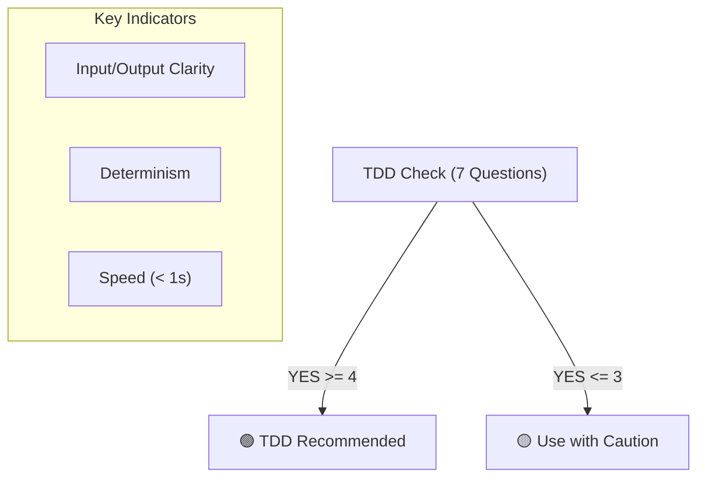

# 第04章：TDDが得意な領域／苦手な領域🎯

## この章のゴール🏁✨

読み終わったら、こんな判断ができるようになります😊

* 「この機能、TDD向き！🟢」or「ここは工夫がいる！🟡」or「ここは別のテストで守ろう！🔴」が言える
* “最初にTDDする場所”を、自分で選べる
* 苦手領域でも「ロジックだけ抜き出してTDDする」発想が持てる🧠✨

---

## 1) まず結論：TDDが強いのは「純粋ロジック」💪🍰


TDDが得意なのは、ざっくり言うとこういうやつ👇

### ✅ 得意ゾーン（TDD向き）🟢

**入力 → 計算/判断 → 出力** がハッキリしてて、毎回同じ結果になりやすいもの✨

* 計算（合計、割引、税、端数処理）🧾
* バリデーション（未入力、範囲、形式チェック）✅
* 変換/パース（文字列→値、JSON→モデルの一部）🔁
* ルール（「この条件ならOK/NG」）📏
* 状態遷移（ステータスがどう変わるか）🗺️

👉 **“テスト＝仕様の例”** が作りやすいから、TDDがすごく気持ちよく回ります😆🧪

---

## 2) TDDが苦手になりやすいのは「外部要因」🌪️🧨

### ⚠️ 工夫が必要ゾーン（やり方を変えればいける）🟡

* DBアクセス（SQL、ORM、トランザクション）🗄️
* HTTP/API（外部サービス、通信失敗、タイムアウト）🌐
* 時刻（DateTime.Now）、乱数（Random）⏰🎲
* ファイル、環境変数、OS依存、プロセス実行📁🪟
* 並列/非同期が複雑（タイミング問題）🧵

**理由**：テストが「遅い」「不安定」「準備が重い」になりやすいから😵‍💫

でもここ、諦めなくてOK！
コツは **“外部に触る部分を薄くして、中心ロジックをTDDする”** です✨

---

### 🙅‍♀️ 苦手ゾーン（TDD “だけ”で守ろうとするとしんどい）🔴

* UIの見た目（ピクセル一致、アニメーション、レイアウト）🎨
* 外部サービスの仕様そのもの（相手が変える）📡
* 既存レガシーで密結合が強すぎる（staticだらけ等）🧱

ここは **TDD以外のテスト**（統合テスト、E2E、スナップショット、手動確認など）も組み合わせる方が現実的です💡

---

## 3) 迷ったらこれ！「TDD適性チェック」7問✅🧠

次の質問に **YESが多いほどTDD向き**です😊

1. 入力と出力を、例で書ける？（例：100円×2→220円）🧾
2. 毎回同じ結果になる？（時刻/乱数/外部に左右されない）🎯
3. 1秒以内に終わる？（遅いと回さなくなる）🐢➡️⚡
4. DB/ネットワークなしで試せる？🌐🚫
5. テストの準備（Arrange）が重くない？🧳
6. 失敗したら原因がすぐ特定できそう？🔍
7. 仕様変更が入りそうで、守りたい価値が高い？🛡️

**YESが4つ以上**なら、まずTDD候補に入れてOKです🟢✨



---

## 4) 具体例で体感しよう😊🧪

### 例A：ど真ん中にTDD向き（計算ルール）🟢🧾

「合計金額を出す」みたいなやつは最高に相性いいです✨

```csharp
public static class PriceCalculator
{
    public static decimal Total(decimal unitPrice, int quantity, decimal taxRate)
    {
        if (unitPrice < 0) throw new ArgumentOutOfRangeException(nameof(unitPrice));
        if (quantity <= 0) throw new ArgumentOutOfRangeException(nameof(quantity));
        if (taxRate < 0) throw new ArgumentOutOfRangeException(nameof(taxRate));

        var subtotal = unitPrice * quantity;
        return subtotal + (subtotal * taxRate);
    }
}
```

```csharp
using Xunit;

public class PriceCalculatorTests
{
    [Fact]
    public void Total_100yen_x2_tax10percent_returns_220()
    {
        var result = PriceCalculator.Total(100m, 2, 0.10m);
        Assert.Equal(220m, result);
    }

    [Fact]
    public void Total_quantity_is_zero_throws()
    {
        Assert.Throws<ArgumentOutOfRangeException>(() =>
            PriceCalculator.Total(100m, 0, 0.10m));
    }
}
```

ポイント💡

* **例が仕様になる**（100×2で220）
* 速いし安定するし、壊れたらすぐ分かる🧪✨

---

### 例B：いきなり苦手になりがち（時刻が混ざる）🟡⏰

たとえば「締切を過ぎたらNG」みたいなやつ。
`DateTime.Now` を直に使うと、テストが不安定になりやすいです😵

**工夫の第一歩（超カンタン版）**：時刻を引数でもらう✨

```csharp
public static class DeadlineRule
{
    public static bool CanSubmit(DateTime now, DateTime deadline)
        => now <= deadline;
}
```

```csharp
using Xunit;

public class DeadlineRuleTests
{
    [Fact]
    public void CanSubmit_before_deadline_true()
    {
        var now = new DateTime(2026, 1, 18, 10, 0, 0);
        var deadline = new DateTime(2026, 1, 18, 12, 0, 0);

        Assert.True(DeadlineRule.CanSubmit(now, deadline));
    }
}
```

👉 “外部要因（現在時刻）を外から渡す”だけで、TDDしやすさが一気に上がります😊✨

---

### 例C：外部API（HTTP）が混ざるやつ🟡🌐

HTTPを直に叩くテストは、遅い＆不安定になりがちです😵‍💫
この章ではまず方針だけ覚えればOK👇

* **中心ロジック**（レスポンスを解釈してルール判定する等）をTDD🟢
* **通信部分**は薄くして、必要なら統合テストで守る🟡

「全部をユニットテストで！」にしない方が、続きます😊🧪

---

## 5) 今日のメイン演習：自分の過去コードを分類しよう📦🔍✨

### やること（15〜30分）⏱️

手元の過去プロジェクトから、適当に **3ファイル**選んでOK😊
それぞれを次の3つに分類してみてください👇

* 🟢 **TDDしやすい**：計算/ルール/変換/検証が中心
* 🟡 **工夫すればいける**：時刻、乱数、DB、HTTP、ファイルが混ざる
* 🔴 **別のテストが向く**：UI見た目、複雑な非同期、外部都合が強い

### 分類のコツ（見るべきポイント）👀

* `DateTime.Now` / `Random` / `HttpClient` / DB / ファイル I/O がある？
* `static` やグローバル状態に依存してない？
* 1メソッドが「何でも屋」になってない？（長い、分岐だらけ）

---

## 6) AIの使いどころ（この章バージョン）🤖✨

分類作業が一気にラクになります😊（ただし採用判断は自分ね✅）

### コピペ用プロンプト集📋✨

* 「このコードを **テストしやすさ**で 🟢🟡🔴 に分類して、理由も教えて」
* 「外部依存（DB/HTTP/時刻/乱数/ファイル）を列挙して」
* 「中心ロジックを抜き出すなら、**最小の分離案を3つ**出して」
* 「最初に書くべき **最小テスト（Red）** を1本だけ提案して」

---

## 7) よくある勘違い（ここ超大事）⚠️😇

* 「TDD＝全部テスト」ではないよ🙅‍♀️
  → **効くところから**が正解🎯
* 「テストを書いたら設計が勝手に良くなる」でもないよ😵
  → **テストが書きにくい＝設計改善サイン**を拾うのがコツ👃🚨
* 「外部I/Oも全部ユニットテストで！」は辛くなりがち🥲
  → **ロジックはユニット**、**つなぎ目は統合**、が気持ちいい✨

---

## 8) ミニ確認テスト（3問）📝💡

1. TDDが得意な領域を1つ挙げて、理由も言ってみて😊
2. `DateTime.Now` が混ざると何が起きやすい？⏰
3. HTTPやDBが絡むとき、まずTDDで守るべき“中心”は何？🌐🗄️

---

## 9) まとめ🎀✨

* TDDが得意：**純粋ロジック**（速い・安定・例で仕様を書ける）🟢
* 工夫が必要：**外部要因**（時刻/乱数/DB/HTTP/ファイル）🟡
* 苦手：**見た目UI**や**外部都合が強い**ところは別テスト併用🔴
* 迷ったら：**TDD適性チェック7問**で判断✅

---

## （最新ツール状況の小メモ）🆕🔧

* .NET 10 は **10.0.2（2026-01-13）** が公開されていて、SDK **10.0.102**／言語は **C# 14.0** 対応になっています。 ([Microsoft][1])
* Visual Studio 2026 は **18.2.0（2026-01-13）** の更新が案内されています。 ([Microsoft Learn][2])
* xUnit v3 は NuGet で **xunit.v3 3.2.2** が公開されています。 ([NuGet][3])

---

次は「第5章：テストは“仕様書”になる（読み物化のコツ）📘✨」に進むと、テストの書き方が一気に“気持ちよく”なりますよ〜😆🧪💖

[1]: https://dotnet.microsoft.com/en-US/download/dotnet/10.0 "Download .NET 10.0 (Linux, macOS, and Windows) | .NET"
[2]: https://learn.microsoft.com/en-us/visualstudio/releases/2026/release-notes "Visual Studio 2026 Release Notes | Microsoft Learn"
[3]: https://www.nuget.org/packages/xunit.v3 "
        NuGet Gallery
        \| xunit.v3 3.2.2
    "
