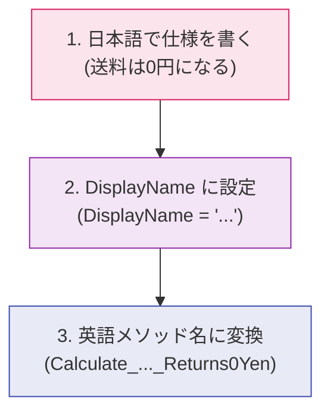

# 第05章：テストは“仕様書”になる（読み物化のコツ）📘

この章はね、**「テスト＝仕様書」**として“読める”ようにする練習だよ〜😊💡
（TDDって、テストが増えるほど強くなるけど、読めないテストが増えると逆にツラくなるの…😵‍💫）

※最新の前提だけサラッと：C# 14 は .NET 10 でサポート、.NET 10 は 2026/01/13 時点で 10.0.2 が最新、Visual Studio 2026 も 2026/01/13 に更新が出てるよ🆕✨ ([Microsoft Learn][1])
テストは xUnit v3（現行 3.2.2 が 2026/01/14 更新）で進めるよ🧪 ([NuGet][2])

---

## この章のゴール🎯✨

読み物として強いテストって、こういう状態👇だよ😊

* テスト一覧を眺めるだけで、**仕様の要点が分かる**📚✨
* テストが落ちたら、**何が壊れたか一瞬で分かる**🔍💥
* テストが“実装の写し”じゃなくて、**振る舞いの説明**になってる🧡

---

## まず結論：読めるテストは「見出し＋本文」📰📘


仕様書っぽいテストは、だいたいこの2層でできてるよ〜😊

1. **見出し（＝テスト名）**：何が起きるべきかを1行で
2. **本文（＝AAAの構造）**：準備→実行→確認が、段落で分かれてる

この2つが揃うと、テストがそのまま仕様書になるの✨📘

---

## コツ①：テスト名は「仕様の1行」にする📝✨

### ✅ 良いテスト名の型（おすすめ3種）🌟

**A. When〜Then型（読みやすい王道）**

* 「When（条件）Then（結果）」で、仕様がそのまま読める😊

**B. Given〜When〜Then型（より丁寧）**

* ちょい長いけど、迷子になりにくい🧭✨

**C. Should型（口語っぽい）**

* 「〜すべき」が好きならこれでもOK🙆‍♀️

---

## コツ②：本文は AAA で“段落”にする🧱📖


AAA は **Arrange / Act / Assert** だよ〜😊
ここで大事なのは、**段落として見える**こと！

* Arrange（準備）🧰
* Act（実行）▶️
* Assert（確認）✅

この3つが混ざると、読みにくさ爆増😵‍💫

---

## コツ③：テスト名は「メソッド名の暗記」じゃなく「振る舞い」👀✨

### ❌ ありがちダメ例（実装に寄りすぎ）😵

* 「Calculate_ReturnsTrue」みたいに、意味が薄い
* 「内部のクラス名」「privateメソッド名」が出てくる
* “どうやって”やってるかが書いてある（実装の写し）

### ✅ いい例（振る舞いが見える）😍

* 「3,000円未満なら送料は500円」
* 「空文字を渡したら例外（入力が無効）」
  みたいに、**仕様の日本語**に近い感じ✨

---

## 実例：同じテストでも、読みやすさでここまで変わる😳✨

### 😵 読めないテスト（仕様が見えない）


```csharp
using Xunit;

public class ShippingFeeTests
{
    [Fact]
    public void Test1()
    {
        var c = new ShippingFeeCalculator();
        var r = c.Calculate(2999);
        Assert.True(r == 500);
    }
}
```

「Test1」って何〜！？ってなるし、2999 と 500 の意味も読み取れないよね😭

---

### 😍 読めるテスト（仕様書っぽい）


ポイントはこれ👇

* **sut**（System Under Test）を使う
* 数字は「意味のある名前」にする
* AAA を段落で分ける
* テスト名で仕様が分かるようにする

```csharp
using Xunit;

public class ShippingFeeCalculatorTests
{
    [Fact(DisplayName = "注文金額が3,000円未満なら送料は500円")]
    public void Calculate_WhenSubtotalIsLessThan3000Yen_Returns500Yen()
    {
        // Arrange
        var sut = new ShippingFeeCalculator();
        const int subtotalYen = 2999;

        // Act
        var feeYen = sut.Calculate(subtotalYen);

        // Assert
        Assert.Equal(500, feeYen);
    }
}
```

「Fact の DisplayName」で、テスト一覧（Test Explorer）側も“日本語の仕様”として読めるよ📘✨
（FactAttribute に DisplayName があるのは xUnit v3 のAPIでも明記されてるよ） ([api.xunit.net][3])

---

## 仕様→テスト名の変換トレーニング（超おすすめ）🏋️‍♀️🧠✨


### ステップ1：まず日本語で仕様を書く✍️

例）

* 「注文金額が 3,000 円以上なら送料は 0 円」

### ステップ2：そのまま DisplayName にする📘

* 「注文金額が3,000円以上なら送料は0円」

### ステップ3：英語メソッド名に変換する🧩

おすすめはこう👇

* 「Calculate_WhenSubtotalIsAtLeast3000Yen_Returns0Yen」

“英語が苦手”でも大丈夫だよ😊
**日本語→英語**は慣れゲーだから、毎回ちょっとずつでOK🎮✨



---

## AIの使いどころ（この章はここが最強）🤖💖


AIは「テスト名の案出し」がめちゃ得意！🎯✨
ただし、**採用するのは自分**ね😉✅

### コピペで使えるプロンプト例🧠✨

* 「この仕様を読みやすいテスト名（英語）で3案ください。形式は When〜Then」
* 「この日本語仕様を DisplayName とメソッド名に分けて提案して」
* 「“実装の写し”になってるテスト名を、振る舞いベースに直して」

---

## “仕様書テスト”チェックリスト✅🧾✨（5個だけ）

テストを書いたら、これだけ見よ〜😊

1. テスト名だけ読んで仕様が分かる？📘
2. Arrange / Act / Assert が段落で分かれてる？🧱
3. 数字や文字列に「意味のある名前」が付いてる？🔤
4. そのテストは「どうやって」じゃなく「何が起きるべき」になってる？👀
5. 落ちたとき、原因がすぐ想像できる？💥🔍

3つ以上YESなら、かなり良い感じ！🎉✨

---

## ミニ演習（手を動かそう）🧪✋✨

次の仕様を、
① DisplayName（日本語）
② メソッド名（英語）
にしてみてね😊💕

1. 「注文金額が 0 円なら送料は 0 円」
2. 「注文金額が 2,999 円なら送料は 500 円」
3. 「注文金額が 3,000 円なら送料は 0 円」

### 模範解答例（1つだけチラ見せ👀✨）

* DisplayName：注文金額が0円なら送料は0円
* メソッド名：Calculate_WhenSubtotalIs0Yen_Returns0Yen

（残り2つも同じ型でいけるよ〜！🥳）

---

## 次章へのつながり🔗✨

この章で「テストが仕様書になる感覚」を掴むと、次の章以降で

* 失敗ログの読み方🔍
* もっと読みやすいテストの積み上げ🧱
  が一気にラクになるよ😊💕

---

必要なら、この第5章に合わせて👇も作るよ〜📘✨

* 演習の「解答＆解説」ぜんぶ付き🧪✅
* あなたの題材（実案件っぽいドメイン）に置き換えた版🎯🎀
* “読めないテスト”を“仕様書テスト”に直す添削テンプレ🧹✨

[1]: https://learn.microsoft.com/en-us/dotnet/csharp/whats-new/csharp-14?utm_source=chatgpt.com "What's new in C# 14"
[2]: https://www.nuget.org/packages/xunit.v3 "
        NuGet Gallery
        \| xunit.v3 3.2.2
    "
[3]: https://api.xunit.net/v3/1.1.0/v3.1.1.0-Xunit.FactAttribute.DisplayName.html?utm_source=chatgpt.com "Property DisplayName"
